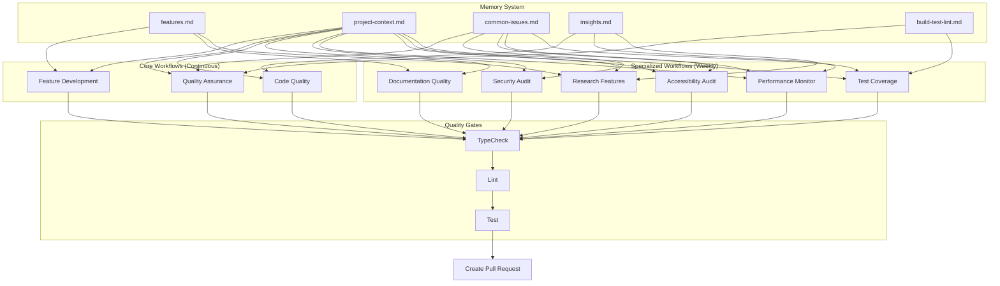

# OpenCode Workflow Architecture

## Workflow Schedule Visualization

```
                    OpenCode Workflows Weekly Schedule
                    ==================================

    CONTINUOUS (Every 6 hours)
    ┌────────────────────────────────────────────────────────────────┐
    │  Feature Development  │  Quality Assurance  │  Code Quality    │
    │   (New features)      │   (Bug fixes)       │  (Tech debt)     │
    └────────────────────────────────────────────────────────────────┘

    WEEKLY (Specialized Focus)
    ┌──────────┬──────────┬──────────┬──────────┬──────────┬──────────┐
    │  Monday  │ Tuesday  │Wednesday │ Thursday │  Friday  │ Saturday │
    ├──────────┼──────────┼──────────┼──────────┼──────────┼──────────┤
    │   Docs   │   A11y   │ Security │ Research │   Perf   │ Coverage │
    │  8:00 AM │ 12:00 PM │ 10:00 AM │  4:00 PM │  2:00 PM │  9:00 AM │
    └──────────┴──────────┴──────────┴──────────┴──────────┴──────────┘
```

## Workflow Dependency Graph



## Workflow Interaction Matrix

| Workflow | Reads Features | Reads Context | Reads Issues | Reads Insights | Updates Memory |
|----------|----------------|---------------|--------------|----------------|----------------|
| Feature Development | ✅ | ✅ | ✅ | ✅ | ✅ |
| Quality Assurance | ✅ | ✅ | ✅ | ✅ | ✅ |
| Code Quality | ✅ | ✅ | ✅ | ✅ | ✅ |
| Documentation | ✅ | ✅ | ✅ | ✅ | ✅ |
| Security | ✅ | ✅ | ✅ | ❌ | ✅ |
| Performance | ✅ | ✅ | ✅ | ✅ | ✅ |
| Accessibility | ✅ | ✅ | ✅ | ✅ | ✅ |
| Research | ✅ | ✅ | ✅ | ✅ | ✅ |
| Coverage | ✅ | ✅ | ✅ | ✅ | ✅ |

## Workflow Execution Flow

```
1. TRIGGER
   ├─ Schedule (cron)
   └─ Manual (workflow_dispatch)
          │
          ▼
2. SETUP
   ├─ Checkout repository
   ├─ Setup Node.js
   ├─ Install dependencies
   └─ Run analysis tools (optional)
          │
          ▼
3. MEMORY READ
   ├─ features.md → Check for duplicates
   ├─ project-context.md → Understand architecture
   ├─ common-issues.md → Learn from past
   └─ insights.md → Apply best practices
          │
          ▼
4. ANALYSIS & WORK
   ├─ Scan codebase
   ├─ Identify issues
   ├─ Prioritize fixes
   └─ Make changes
          │
          ▼
5. QUALITY GATES
   ├─ make typecheck → Must pass
   ├─ make lint → Must pass
   └─ make test → Must pass
          │
          ▼
6. MEMORY UPDATE
   ├─ Document new features
   ├─ Share solutions
   ├─ Update insights
   └─ Run compaction script
          │
          ▼
7. COMMIT & PR
   ├─ Commit changes
   ├─ Push to branch
   └─ Create pull request
```

## Coverage Map

```
┌─────────────────────────────────────────────────────────────────┐
│                        NodeTool Codebase                        │
├─────────────────────────────────────────────────────────────────┤
│                                                                 │
│  Documentation                 Code Quality                     │
│  ┌──────────────┐             ┌──────────────┐                │
│  │ AGENTS.md    │◄────────────┤ TypeScript   │                │
│  │ README.md    │             │ React        │                │
│  │ JSDoc        │             │ Patterns     │                │
│  └──────────────┘             └──────────────┘                │
│         ▲                              ▲                        │
│         │                              │                        │
│    Docs Quality                  Code Quality                  │
│      Workflow                      Workflow                     │
│                                                                 │
│  Security                      Performance                      │
│  ┌──────────────┐             ┌──────────────┐                │
│  │ Dependencies │             │ Re-renders   │                │
│  │ XSS          │             │ Bundle Size  │                │
│  │ Sanitization │             │ Memory       │                │
│  └──────────────┘             └──────────────┘                │
│         ▲                              ▲                        │
│         │                              │                        │
│    Security                       Performance                  │
│      Audit                           Monitor                    │
│                                                                 │
│  Accessibility                 Test Coverage                    │
│  ┌──────────────┐             ┌──────────────┐                │
│  │ ARIA Labels  │             │ Stores       │                │
│  │ Keyboard Nav │             │ Hooks        │                │
│  │ Contrast     │             │ Components   │                │
│  └──────────────┘             └──────────────┘                │
│         ▲                              ▲                        │
│         │                              │                        │
│  Accessibility                    Coverage                     │
│      Audit                         Improvement                 │
│                                                                 │
│  Innovation                    Core Development                │
│  ┌──────────────┐             ┌──────────────┐                │
│  │ Prototypes   │             │ Features     │                │
│  │ Experiments  │             │ Bug Fixes    │                │
│  │ Research     │             │ Improvements │                │
│  └──────────────┘             └──────────────┘                │
│         ▲                              ▲                        │
│         │                              │                        │
│    Research                     Feature Dev                    │
│     Features                    QA & Quality                   │
│                                                                 │
└─────────────────────────────────────────────────────────────────┘
```

## Data Flow Diagram

```
┌─────────────┐
│   GitHub    │
│   Event     │
│  (Trigger)  │
└──────┬──────┘
       │
       ▼
┌─────────────────────────────────────────┐
│         Workflow Starts                 │
│  - Clone repo                           │
│  - Install deps                         │
│  - Setup environment                    │
└──────┬──────────────────────────────────┘
       │
       ▼
┌─────────────────────────────────────────┐
│    Read Memory System                   │
│  ┌────────────────────────────────┐    │
│  │ features.md                     │    │
│  │ project-context.md              │    │
│  │ common-issues.md                │    │
│  │ insights.md                     │    │
│  │ build-test-lint.md              │    │
│  └────────────────────────────────┘    │
└──────┬──────────────────────────────────┘
       │
       ▼
┌─────────────────────────────────────────┐
│    Analyze Codebase                     │
│  - Scan files                           │
│  - Run tools (npm audit, coverage)      │
│  - Identify issues                      │
│  - Prioritize work                      │
└──────┬──────────────────────────────────┘
       │
       ▼
┌─────────────────────────────────────────┐
│    Make Changes                         │
│  - Fix issues                           │
│  - Add features                         │
│  - Improve code                         │
│  - Update docs                          │
└──────┬──────────────────────────────────┘
       │
       ▼
┌─────────────────────────────────────────┐
│    Run Quality Gates                    │
│  ┌────────────────────────────────┐    │
│  │ make typecheck → Pass/Fail      │    │
│  │ make lint → Pass/Fail           │    │
│  │ make test → Pass/Fail           │    │
│  └────────────────────────────────┘    │
└──────┬──────────────────────────────────┘
       │
       ▼
┌─────────────────────────────────────────┐
│    Update Memory System                 │
│  - Document new features                │
│  - Share solutions                      │
│  - Update context                       │
│  - Run compaction                       │
└──────┬──────────────────────────────────┘
       │
       ▼
┌─────────────────────────────────────────┐
│    Create Pull Request                  │
│  - Commit changes                       │
│  - Push to branch                       │
│  - Open PR with description             │
└──────┬──────────────────────────────────┘
       │
       ▼
┌─────────────┐
│   Human     │
│   Review    │
│    & Merge  │
└─────────────┘
```

## Workflow Priority Matrix

```
                    Impact on Users
                    ▲
                    │
                    │  Security      Features
                    │    Audit      Development
             High   │     [5]         [1]
                    │
                    │  Performance   Research
                    │    Monitor     Features
           Medium   │     [6]         [8]
                    │
                    │  Coverage      A11y
                    │  Improvement   Audit
              Low   │     [9]         [7]
                    │
                    │  Code          Docs
                    │  Quality       Quality
                    │     [3]         [4]
                    │
                    └────────────────────────────►
                    Low      Medium      High
                           Complexity

[1] Feature Development - High impact, medium complexity
[3] Code Quality - Medium impact, low complexity
[4] Docs Quality - Low impact, low complexity
[5] Security Audit - High impact, high complexity
[6] Performance - Medium impact, medium complexity
[7] A11y Audit - Low impact, medium complexity
[8] Research Features - Medium impact, high complexity
[9] Coverage Improvement - Low impact, low complexity
```

## Memory System Architecture

```
┌───────────────────────────────────────────────────────────────┐
│                    .github/opencode-memory/                   │
├───────────────────────────────────────────────────────────────┤
│                                                               │
│  ┌─────────────────────┐      ┌─────────────────────┐       │
│  │   features.md       │      │  project-context.md │       │
│  ├─────────────────────┤      ├─────────────────────┤       │
│  │ - Core features     │      │ - Architecture      │       │
│  │ - UI components     │      │ - Recent changes    │       │
│  │ - Workflows         │      │ - Decisions         │       │
│  │ - NOT implemented   │      │ - Philosophy        │       │
│  └─────────────────────┘      └─────────────────────┘       │
│           │                              │                    │
│           └──────────┬───────────────────┘                   │
│                      │                                        │
│                      ▼                                        │
│            ┌──────────────────┐                              │
│            │  All Workflows   │                              │
│            └──────────────────┘                              │
│                      │                                        │
│           ┌──────────┴───────────┐                          │
│           │                      │                           │
│           ▼                      ▼                           │
│  ┌─────────────────────┐  ┌─────────────────────┐          │
│  │  common-issues.md   │  │    insights.md      │          │
│  ├─────────────────────┤  ├─────────────────────┤          │
│  │ - Known problems    │  │ - Best practices    │          │
│  │ - Solutions         │  │ - Patterns          │          │
│  │ - Workarounds       │  │ - Learnings         │          │
│  └─────────────────────┘  └─────────────────────┘          │
│                                                               │
│  ┌─────────────────────────────────────────────────────┐   │
│  │           build-test-lint.md                        │   │
│  ├─────────────────────────────────────────────────────┤   │
│  │ - Quality requirements                              │   │
│  │ - Commands                                          │   │
│  │ - Standards                                         │   │
│  └─────────────────────────────────────────────────────┘   │
│                                                               │
│  ┌─────────────────────────────────────────────────────┐   │
│  │        scripts/compact-memory.py                    │   │
│  ├─────────────────────────────────────────────────────┤   │
│  │ - Remove duplicates                                 │   │
│  │ - Filter old entries                                │   │
│  │ - Clean formatting                                  │   │
│  └─────────────────────────────────────────────────────┘   │
│                                                               │
└───────────────────────────────────────────────────────────────┘
```

## Workflow Evolution Timeline

```
Past                    Present                    Future
│                          │                          │
│  [Manual Work]           │  [10 Workflows]         │  [More Automation]
│                          │                          │
│  ┌──────────┐           │  ┌──────────┐           │  ┌──────────┐
│  │ Humans   │           │  │ Humans   │           │  │ Humans   │
│  │ do all   │           │  │   +      │           │  │ review   │
│  │ quality  │           │  │ AI Agents│           │  │ & guide  │
│  │ checks   │           │  │ working  │           │  │ AI work  │
│  └──────────┘           │  │ together │           │  └──────────┘
│                          │  └──────────┘           │
│                          │                          │
│  4 workflows             │  10 workflows           │  15+ workflows
│  - Manual                │  - Manual               │  - API compat
│  - Features              │  - Features             │  - Dependency updates
│  - Testing               │  - Testing              │  - Changelog gen
│  - Quality               │  - Quality              │  - Visual regression
│                          │  - Documentation        │  - Load testing
│                          │  - Security             │  - Translation
│                          │  - Performance          │  - Mobile quality
│                          │  - Accessibility        │  - Complexity analysis
│                          │  - Research             │  - License compliance
│                          │  - Coverage             │
│                          │                          │
└──────────────────────────┴──────────────────────────┴──────────────►
                                Time
```

---

**Legend**:
- ✅ = Implemented
- ❌ = Not implemented
- 📅 = Scheduled
- 🔬 = Experimental
- 🔒 = Security-related
- ⚡ = Performance-related
- ♿ = Accessibility-related
- 📚 = Documentation-related
- 🧪 = Testing-related
- 🚀 = Feature-related
