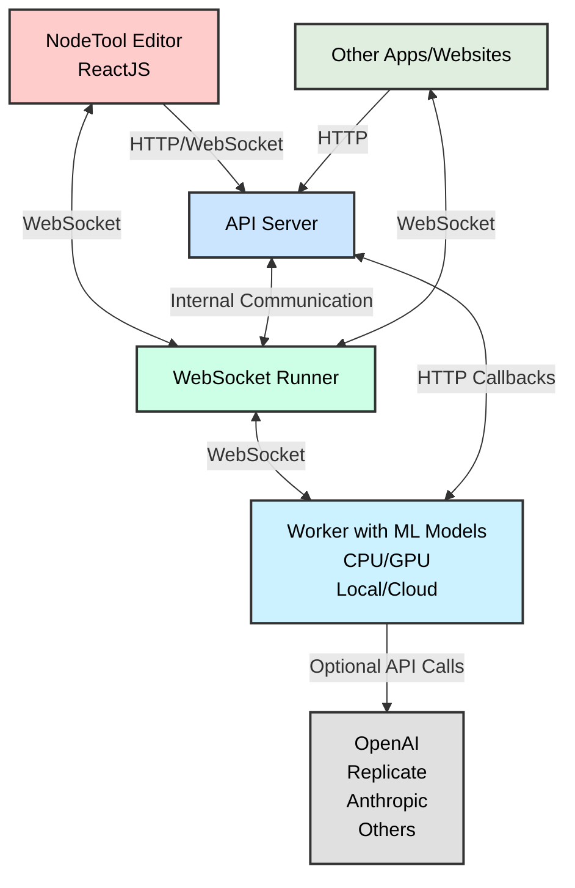

<h1 style="display: inline;">
  
  NodeTool - AI App Builder
</h1>


Welcome to NodeTool, an open-source platform designed to simplify the creation and deployment of AI applications without requiring coding expertise.

### What is NodeTool? 🚀

NodeTool is a visual development platform that empowers users to build and deploy AI applications through an intuitive, no-code interface. It supports a wide range of functionalities, from creating custom chatbots and mini-apps to automating complex workflows.

#### Key Highlights ✨

- **Comprehensive AI Model Support** - Run models locally via Ollama and Hugging Face, or leverage cloud APIs from OpenAI, Anthropic, Replicate, and Fal.ai
- **Built-in RAG Support** - Create powerful retrieval-augmented generation applications with integrated ChromaDB vector storage
- **System-Wide Access** - Launch workflows and apps from the system tray, use global shortcuts, and transform clipboard content instantly
- **Global Chat Overlay** - Access all your AI tools and workflows from a unified chat interface
- **Visual Workflow Editor** - Design AI applications visually, without writing code
- **Multimodal Capabilities** - Work with text, images, audio, and video in a unified platform


### Why NodeTool? 💡

NodeTool is designed to cater to a variety of users, including those interested in both local and cloud-based LLM deployment, AI automation, and advanced technical workflows.

#### Key Benefits 🎯

- **Flexible Model Deployment** - Choose between local models for privacy or powerful cloud APIs for state-of-the-art capabilities
- **No-Code AI Development** - Build sophisticated AI applications using a visual editor, making AI accessible to non-programmers
- **Automation Powerhouse** - Create workflows that automate repetitive tasks using multiple AI models and tools
- **Community Engagement** - As an open-source project, NodeTool welcomes contributions and feedback from users

## Use Cases 🎨

- 🤖 **Local LLM Deployment**

  - Build privacy-focused chatbots using locally hosted models
  - Create domain-specific assistants with your own data
  - Deploy multiple LLMs for different tasks via ollama
  - Build RAG applications with integrated ChromaDB support
  - Fine-tune responses for your organization's needs

- 🎨 **Automated Content Generation**

  - Design image generation workflows with Stable Diffusion
  - Create automated blog post and social media content pipelines
  - Build video editing and audio processing workflows
  - Automate thumbnail and banner creation for content

- 🎯 **Personal AI Assistant**

  - Design privacy-first scheduling and task management tools
  - Create note-taking systems with local LLM processing
  - Build custom reminder and notification workflows
  - Develop personal knowledge management systems

- 📊 **AI-Powered Data Processing**

  - Analyze and summarize large document collections
  - Extract insights from business reports and research papers
  - Create automated data visualization workflows
  - Build custom data extraction and processing pipelines

- 🔧 **Workflow Automation**

  - Design apps that streamline repetitive tasks with AI
  - Create automated testing and QA workflows
  - Build custom code review and documentation assistants
  - Develop automated data validation systems

- 🗣️ **Voice and Chat Interfaces**
  - Build voice-enabled applications with Siri integration
  - Create multi-modal chatbots with image and audio support
  - Design conversational interfaces for specific domains
  - Develop custom voice assistants using local models

## Features ✨

Key features for building AI applications:

- **Visual Workflow Editor**: Design your app's logic visually—no coding required
- **Global Chat Overlay**: Access all your AI tools and workflows from a single chat interface.
- **System Tray Integration**:
  - Quick-access menu for all workflows and apps
  - Configure and trigger global shortcuts
  - Transform clipboard content with AI
  - Access emails and notes applications
  - Process local files and documents
- **App Templates**: Start with pre-built templates for common use cases
- **Mini-App Builder**: Package workflows as standalone desktop applications
- **Chat Interface Builder**: Create custom chatbot interfaces
- **Comprehensive Model Support**:
  - Local models via Ollama and HuggingFace
  - Cloud APIs from OpenAI, Anthropic, Replicate, and Fal.ai
- **Vector Storage & RAG**:
  - Built-in ChromaDB integration for vector storage
  - Create sophisticated RAG applications
  - Index and query documents, PDFs, and other text sources
  - Combine with any supported LLM for enhanced responses
- **Asset Management**: Import and manage media assets within your apps
- **Multimodal Support**: Build apps that handle text, images, audio, and video
- **API Access**: Integrate your apps with other tools via API
- **Custom Extensions**: Add new capabilities with Python
- **Cross-Platform**: Deploy your apps on Mac, Windows, and Linux

### System Tray Integration 🔗

NodeTool lives in your system tray, providing instant access to all your AI tools and workflows:

- Quick-launch any workflow or app from the tray menu
- Configure and trigger global shortcuts
- Access the global chat overlay
- Transform clipboard content with AI
- Process files, emails, and notes
- Monitor workflow status and notifications

This system tray integration ensures your AI tools are always just a click or keystroke away, seamlessly integrating into your daily workflow.

### Global Chat Overlay 💬

A standout feature of NodeTool, accessible from the system tray, is the Global Chat Overlay, which serves as a unified entry point for all your AI tools and workflows. This chat interface allows you to:

- Run powerful tools such as image generation, audio generation, and more
- Access notes, documents, and other files
- Trigger any workflow you've created
- Engage in AI chats for natural language interactions

The global chat overlay provides a seamless and intuitive way to access your custom AI solutions, making it easier than ever to integrate AI into your daily workflow.

## Quickstart 🚀

Release 0.6 is available soon! Stay tuned.

## Node Overview 🧩

- **Anthropic** 🧠: Text-based AI tasks.
- **Comfy** 🎨: Support for ComfyUI nodes for image processing.
- **Chroma** 🌈: Vector database for embeddings.
- **ElevenLabs** 🎤: Text-to-speech services.
- **Fal** 🔊: AI for audio, image, text, and video.
- **Google** 🔍: Access to Gemini Models and Gmail.
- **HuggingFace** 🤗: AI for audio, image, text, and video.
- **NodeTool Core** ⚙️: Core data and media processing functions.
- **Ollama** 🦙: Run local language models.
- **OpenAI** 🌐: AI for audio, image, and text tasks.
- **Replicate** ☁️: AI for audio, image, text, and video in the cloud.

## Architecture 🏗️

NodeTool's architecture is designed to be flexible and extensible.



### Components Overview

1. **🖥️ Frontend**: The NodeTool Editor for managing workflows and assets, built with ReactJS and TypeScript.
2. **🌐 API Server**: Manages connections from the frontend and handles user sessions and workflow storage.
3. **🔌 WebSocket Runner**: Runs workflows in real-time and keeps track of their state.

## Implementing Custom Nodes 🛠️

Extend NodeTool's functionality by creating custom nodes that can integrate models from your preferred platforms:

```python
class MyAgent(BaseNode):
    prompt: Field(default="Build me a website for my business.")

    async def process(self, context: ProcessingContext) -> str:
        llm = MyLLM()
        return llm.generate(self.prompt)
```

## Using the Workflow API 🔌

NodeTool provides a powerful Workflow API that allows you to integrate and run your AI workflows programmatically.

You can use the API locally now, `api.nodetool.ai` access is limited to Alpha users.

### API Usage

#### Loading Workflows

```javascript
const response = await fetch("http://localhost:8000/api/workflows/");
const workflows = await response.json();
```

#### Running a Workflow

##### HTTP API

```bash
curl -X POST "http://localhost:8000/api/workflows/<workflow_id>/run" \
-H "Content-Type: application/json" \
-d '{
    "params": {
        "param_name": "param_value"
    }
}'
```

```javascript
const response = await fetch(
  "http://localhost:8000/api/workflows/<workflow_id>/run",
  {
    method: "POST",
    headers: {
      "Content-Type": "application/json",
    },
    body: JSON.stringify({
      params: params,
    }),
  }
);

const outputs = await response.json();
// outputs is an object with one property for each output node in the workflow
// the value is the output of the node, which can be a string, image, audio, etc.
```

#### Streaming API

The streaming API is useful for getting real-time updates on the status of the workflow.

See [run_workflow_streaming.js](examples/run_workflow_streaming.js) for an example.

These updates include:

- job_update: The overall status of the job (e.g. running, completed, failed, cancelled)
- node_update: The status of a specific node (e.g. running, completed, error)
- node_progress: The progress of a specific node (e.g. 20% complete)

The final result of the workflow is also streamed as a single job_update with the status "completed".

```javascript
const response = await fetch(
  "http://localhost:8000/api/workflows/<workflow_id>/run?stream=true",
  {
    method: "POST",
    headers: {
      "Content-Type": "application/json",
    },
    body: JSON.stringify({
      params: params,
    }),
  }
);

const reader = response.body.getReader();
const decoder = new TextDecoder();

while (true) {
  const { done, value } = await reader.read();
  if (done) break;

  const lines = decoder.decode(value).split("\n");
  for (const line of lines) {
    if (line.trim() === "") continue;

    const message = JSON.parse(line);
    switch (message.type) {
      case "job_update":
        console.log("Job status:", message.status);
        if (message.status === "completed") {
          console.log("Workflow completed:", message.result);
        }
        break;
      case "node_progress":
        console.log(
          "Node progress:",
          message.node_name,
          (message.progress / message.total) * 100
        );
        break;
      case "node_update":
        console.log(
          "Node update:",
          message.node_name,
          message.status,
          message.error
        );
        break;
    }
  }
}
```

##### WebSocket API

The WebSocket API is useful for getting real-time updates on the status of the workflow.
It is similar to the streaming API, but it uses a more efficient binary encoding.
It offers additional features like canceling jobs.

See [run_workflow_websocket.js](examples/run_workflow_websocket.js) for an example.

```javascript
const socket = new WebSocket("ws://localhost:8000/predict");

const request = {
  type: "run_job_request",
  workflow_id: "YOUR_WORKFLOW_ID",
  params: {
    /* workflow parameters */
  },
};

// Run a workflow
socket.send(
  msgpack.encode({
    command: "run_job",
    data: request,
  })
);

// Handle messages from the server
socket.onmessage = async (event) => {
  const data = msgpack.decode(new Uint8Array(await event.data.arrayBuffer()));
  if (data.type === "job_update" && data.status === "completed") {
    console.log("Workflow completed:", data.result);
  } else if (data.type === "node_update") {
    console.log("Node update:", data.node_name, data.status, data.error);
  } else if (data.type === "node_progress") {
    console.log("Progress:", (data.progress / data.total) * 100);
  }
  // Handle other message types as needed
};

// Cancel a running job
socket.send(msgpack.encode({ command: "cancel_job" }));

// Get the status of the job
socket.send(msgpack.encode({ command: "get_status" }));
```

### API Demo

- Download the [html file](<(api-demo.html)>)
- Open in a browser locally.
- Select the endpoint, local or api.nodetool.ai (for alpha users)
- Enter API token (from Nodetool settings dialog)
- Select workflow
- Run workflow
- The page will live stream the output from the local or remote API

## Development Setup 🛠️

### Requirements

- Conda, download and install from [miniconda.org](https://docs.conda.io/en/latest/miniconda.html)
- Node.js, download and install from [nodejs.org](https://nodejs.org/en)

### Conda Environment

```bash
conda create -n nodetool python=3.11
conda activate nodetool
conda install -c conda-forge ffmpeg cairo x264 x265 aom libopus libvorbis lame pandoc uv
```

### Install Python Dependencies

On macOS:

```bash
pip install -r requirements/requirements.txt
pip install -r requirements/requirements_ai.txt
pip install -r requirements/requirements_data_science.txt
```

On Windows and Linux with CUDA 12.1:

```bash
pip install -r requirements/requirements.txt
pip install -r requirements/requirements_ai.txt --extra-index-url https://download.pytorch.org/whl/cu121
pip install -r requirements/requirements_data_science.txt
```

On Windows and Linux without CUDA:

```bash
pip install -r requirements/requirements.txt
pip install -r requirements/requirements_ai.txt
pip install -r requirements/requirements_data_science.txt
```

### Run without Electron

Ensure you have the Conda environment activated.

On macOS and Linux:

```bash
./scripts/server --with-ui --reload
```

On windows:

```bash
.\scripts\server.bat --with-ui --reload
```

Now, open your browser and navigate to `http://localhost:3000` to access the NodeTool interface.

### Run with Electron

Ensure you have the Conda environment activated and the location is set in the settings file located at `~/.config/nodetool/settings.yaml` or `%APPDATA%/nodetool/settings.yaml` on Windows:

```yaml
CONDA_ENV: /path/to/conda/environment # e.g. /Users/matthias/miniconda3/envs/nodetool
```

Before running Electron, you need to build the frontends located in the `/web` and `/apps` directories:

```bash
cd web && npm install && npm run build && cd ..
cd apps && npm install && npm run build && cd ..
```

Once the build is complete, you can start the Electron app:

```bash
cd electron
npm install
npm start
```

The Electron app starts the frontend and backend automatically.

### Sync Dependencies

Dependencies are managed via poetry in `pyproject.toml` and must be synced to the `requirements` directory using:

```bash
python scripts/export_requirements.py
```

## Contributing 🤝

We welcome contributions from the community! To contribute to NodeTool:

1. Fork the repository.
2. Create a new branch (`git checkout -b feature/YourFeature`).
3. Commit your changes (`git commit -am 'Add some feature'`).
4. Push to the branch (`git push origin feature/YourFeature`).
5. Open a Pull Request.

Please adhere to our contribution guidelines.

## License 📄

NodeTool is licensed under the [AGPLv3 License](LICENSE.txt)

## Contact 📬

Got ideas, suggestions, or just want to say hi? We'd love to hear from you!

- **Email**: [hello@nodetool.ai](mailto:hello@nodetool.ai)
- **Discord**: [Nodetool Discord](https://discord.gg/26m5xBwe)
- **Forum**: [Nodetool Forum](https://forum.nodetool.ai)
- **GitHub**: [https://github.com/nodetool-ai/nodetool](https://github.com/nodetool-ai/nodetool)
- **Matthias Georgi**: matti@nodetool.ai
- **David Bührer**: david@nodetool.ai
