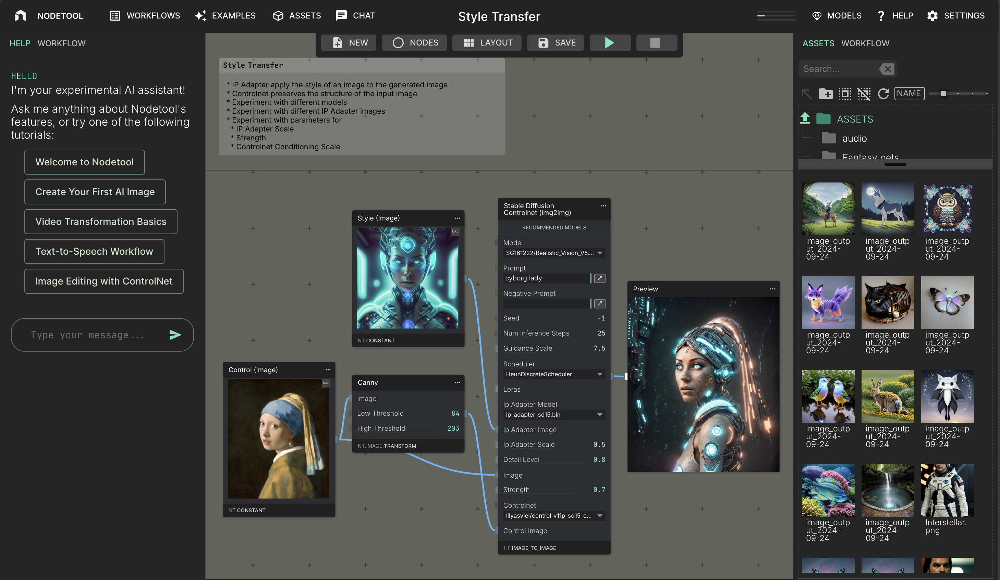

# nodetool api

## Overview
Nodetool is a no-code development environment for Artificial Intelligence, enabling the simple and intuitive creation of powerful AI workflows and their integration into existing applications. Utilizing a node-based user interface, users can construct complex, multimodal applications without any programming knowledge. Nodetool facilitates the seamless integration of state-of-the-art AI models, allowing the generation and editing of multimedia content such as images, texts, audio, and video within a single workflow. 



Nodetool opens up a creative and playful access to current technologies, supporting both beginners and experienced developers in the fields of content creation, data analysis, and automation. It enables a broad audience to benefit from the advantages of artificial intelligence by visualizing workflows and simplifying complex installation requirements, making AI application development accessible to novices and seasoned users alike.


## Key Features
* No-Code AI Development: Create AI workflows without deep programming knowledge.
* Model Agnostic: Easily integrate new nodes and state-of-the-art AI models from OpenAI, Anthropic, Replicate, HuggingFace, ComfyUI, Llama, Mistral, and more.
* Multimedia Content Handling: Generate and edit images, texts, audio, and video in one workflow.
* Open and Transparent: Aims to make the execution and training of AI models more transparent and accessible.
* Asset management: Manage and organize your assets (images, videos, audio files) within the application


## Installation


```bash
pip install nodetool
```

## Usage

To get started with Nodetool:

```bash
nodetool setup
```

## Execution

- **Nodetool Editor**: Install the Nodetool Editor for an intuitive, graphical interface to design and manage workflows.
- **Command Line Execution**: Alternatively, execute workflows directly from the command line for automation and scripting purposes.

## Implementing Nodes

New nodes can be added by subclassing BaseNode.

Node properties are defined using class fields with type annotations.

The node operation is defined in the process method, which takes a context
object, allowing I/O amongst other operations.

```python
class MyNode(BaseNode):
    a: str = ""
    b: str = ""

    async def process(self, context: ProcessingContext) -> str:
      return self.a + self.b
```

# Environment Variables

Configuration can be passes as environment variables, or from configuration
files. A dot env (`.env`) file will be read if present in the working dirctory.

## General Configuration

| Variable           | Description                                          | Default                       |
| ------------------ | ---------------------------------------------------- | ----------------------------- |
| `ASSET_BUCKET`     | S3 bucket for storing asset files                    | `"images"`                    |
| `TEMP_BUCKET`      | S3 bucket for storing temporary files                | `"temp"`                      |
| `COMFY_FOLDER`     | Location of ComfyUI folder (optional)                | `None`                        |
| `ENV`              | Environment mode (`"development"` or `"production"`) | `"development"`               |
| `LOG_LEVEL`        | Logging level                                        | `"INFO"`                      |
| `AWS_REGION`       | AWS region                                           | `"us-east-1"`                 |
| `NODETOOL_API_URL` | URL of the Nodetool API server                       | `"http://localhost:8000/api"` |

## Database Configuration

| Variable  | Description                      | Default                |
| --------- | -------------------------------- | ---------------------- |
| `DB_PATH` | Path to the SQLite database file | `"./data/nodetool.db"` |

## AWS Configuration

| Variable                   | Description                                   | Default                 |
| -------------------------- | --------------------------------------------- | ----------------------- |
| `AWS_ACCESS_KEY_ID`        | AWS access key ID                             | `None`                  |
| `AWS_SECRET_ACCESS_KEY`    | AWS secret access key                         | `None`                  |
| `DYNAMO_ENDPOINT_URL`      | DynamoDB endpoint URL (for local development) | `None`                  |
| `DYNAMO_REGION`            | DynamoDB region                               | `AWS_REGION`            |
| `DYNAMO_ACCESS_KEY_ID`     | DynamoDB access key ID                        | `AWS_ACCESS_KEY_ID`     |
| `DYNAMO_SECRET_ACCESS_KEY` | DynamoDB secret access key                    | `AWS_SECRET_ACCESS_KEY` |
| `S3_ENDPOINT_URL`          | S3 endpoint URL (for local development)       | `None`                  |
| `S3_ACCESS_KEY_ID`         | S3 access key ID                              | `AWS_ACCESS_KEY_ID`     |
| `S3_SECRET_ACCESS_KEY`     | S3 secret access key                          | `AWS_SECRET_ACCESS_KEY` |
| `S3_REGION`                | S3 region                                     | `AWS_REGION`            |

## API Keys and Tokens

| Variable              | Description                    |
| --------------------- | ------------------------------ |
| `OPENAI_API_KEY`      | OpenAI API key (optional)      |
| `HF_TOKEN`            | Hugging Face token (optional)  |
| `REPLICATE_API_TOKEN` | Replicate API token (optional) |
| `CHROMA_TOKEN`        | Chroma token                   |
| `NGROK_TOKEN`         | ngrok token                    |

## OAuth Configuration

| Variable               | Description                |
| ---------------------- | -------------------------- |
| `GOOGLE_CLIENT_ID`     | Google OAuth client ID     |
| `GOOGLE_CLIENT_SECRET` | Google OAuth client secret |

## Other Configuration

| Variable     | Description              |
| ------------ | ------------------------ |
| `WORKER_URL` | URL of the worker server |
| `CHROMA_URL` | URL of the Chroma server |

# Setup Files

The following files are used for storing settings and secrets:

- `settings.yaml`: Stores general settings
- `secrets.yaml`: Stores secret values (API keys, tokens, etc.)

The location of these files depends on the operating system:

- Linux/macOS: `~/.config/nodetool/`
- Windows: `%APPDATA%\nodetool\`

If the files don't exist, default values will be used.

# API Endpoints

| Endpoint                   | Method | Description                                                                                             | Query Key      | Query Value      | Body Key                 | Body Value                      |
| -------------------------- | ------ | ------------------------------------------------------------------------------------------------------- | -------------- | ---------------- | ------------------------ | ------------------------------- |
| `/api/assets/`             | GET    | Returns all assets for a given user or workflow.                                                        | `parent_id`    | string, nullable | -                        | -                               |
|                            |        |                                                                                                         | `content_type` | string, nullable | -                        | -                               |
|                            |        |                                                                                                         | `cursor`       | string, nullable | -                        | -                               |
|                            |        |                                                                                                         | `page_size`    | number, nullable | -                        | -                               |
| `/api/assets/`             | POST   | Create a new asset.                                                                                     | -              | -                | `workflow_id`            | string, nullable                |
|                            |        |                                                                                                         | -              | -                | `parent_id`              | string, nullable                |
|                            |        |                                                                                                         | -              | -                | `name`                   | string                          |
|                            |        |                                                                                                         | -              | -                | `content_type`           | string                          |
| `/api/assets/{id}`         | GET    | Returns the asset for the given id.                                                                     | -              | -                | -                        | -                               |
| `/api/assets/{id}`         | PUT    | Updates the asset for the given id.                                                                     | -              | -                | `name`                   | string, nullable                |
|                            |        |                                                                                                         | -              | -                | `parent_id`              | string                          |
|                            |        |                                                                                                         | -              | -                | `status`                 | string, nullable                |
|                            |        |                                                                                                         | -              | -                | `content_type`           | string, nullable                |
| `/api/assets/{id}`         | DELETE | Deletes the asset for the given id.                                                                     | -              | -                | -                        | -                               |
| `/api/jobs/{id}`           | GET    | Returns the status of a job.                                                                            | -              | -                | -                        | -                               |
| `/api/jobs/`               | GET    | Returns all assets for a given user or workflow.                                                        | `workflow_id`  | string, nullable | -                        | -                               |
|                            |        |                                                                                                         | `cursor`       | string, nullable | -                        | -                               |
|                            |        |                                                                                                         | `page_size`    | number, nullable | -                        | -                               |
| `/api/jobs/`               | POST   | Run                                                                                                     | -              | -                | `job_type`               | string, default: 'workflow'     |
|                            |        |                                                                                                         | -              | -                | `params`                 | unknown                         |
|                            |        |                                                                                                         | -              | -                | `workflow_id`            | string                          |
|                            |        |                                                                                                         | -              | -                | `user_id`                | string                          |
|                            |        |                                                                                                         | -              | -                | `auth_token`             | string                          |
|                            |        |                                                                                                         | -              | -                | `env`                    | Record<string, never>, nullable |
|                            |        |                                                                                                         | -              | -                | `graph`                  | Graph                           |
| `/api/auth/validate-token` | POST   | Checks if the given token is valid.                                                                     | -              | -                | `token`                  | string                          |
| `/api/auth/login`          | POST   | Logs a user in with one time passcode. Returns an auth token that can be used for future requests.      | -              | -                | `email`                  | string                          |
|                            |        |                                                                                                         | -              | -                | `passcode`               | string                          |
| `/api/auth/signup`         | POST   | Creates a new user for given email address. Returns an auth token that can be used for future requests. | -              | -                | `email`                  | string                          |
| `/api/auth/oauth/login`    | POST   | Oauth Login                                                                                             | -              | -                | `redirect_uri`           | string                          |
|                            |        |                                                                                                         | -              | -                | `provider`               | OAuthProvider                   |
| `/api/auth/oauth/callback` | POST   | Oauth Callback                                                                                          | -              | -                | `provider`               | OAuthProvider                   |
|                            |        |                                                                                                         | -              | -                | `state`                  | string                          |
|                            |        |                                                                                                         | -              | -                | `authorization_response` | string                          |
|                            |        |                                                                                                         | -              | -                | `redirect_uri`           | string                          |
| `/api/nodes/dummy`         | GET    | Returns a dummy node.                                                                                   | -              | -                | -                        | -                               |
| `/api/nodes/metadata`      | GET    | Returns a list of all node metadata.                                                                    | -              | -                | -                        | -                               |

| `/api

## Contribution

We welcome contributions from the community! To contribute to Nodetool, please adhere to our contribution guidelines. Your efforts help us improve and evolve this project.

## License

Nodetool is made available under the terms of the [GPL3 License](LICENSE.txt), promoting open-source collaboration and sharing.

## Contact

For inquiries, suggestions, or contributions, please reach out to the core team:

- Matthias Georgi
- David Buerer
- Severin Schwanck

**GitHub:** [https://github.com/Gen-Flow/nodetool](https://github.com/Gen-Flow/nodetool)
