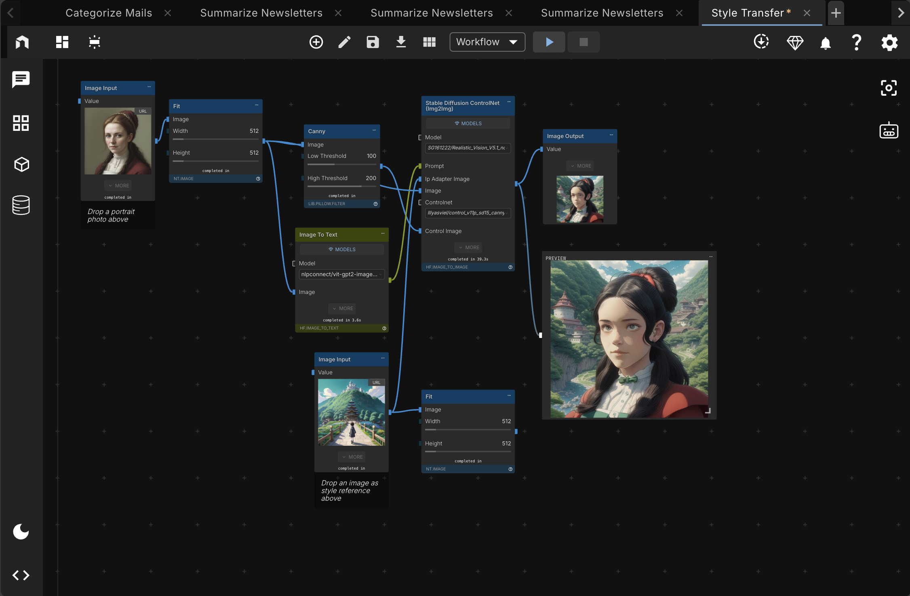

[](https://github.com/nodetool-ai/nodetool/actions/workflows/test.yml)


[](https://github.com/nodetool-ai/nodetool/stargazers) [](https://github.com/nodetool-ai/nodetool/releases) [](https://github.com/nodetool-ai/nodetool/releases/latest) [](https://nodetool.ai) [](https://discord.gg/WmQTWZRcYE) [](LICENSE.txt)

# The Local‑First Agent Workbench



> **🎯 Privacy by design** • **🔓 Own your stack** • **🚀 Production ready**

Nodetool lets you design agents that work with your data.
Use any model to analyze data, generate visuals, or automate workdlows.

## Table of Contents

- [Vision](#vision)
- [Mission](#mission)
- [How It Works](#how-it-works)
- [Principles](#principles)
- [What NodeTool Is](#what-nodetool-is-today)
- [What NodeTool Is Not](#what-nodetool-is-not-today)
- [Who It’s For](#who-its-for)
- [Roadmap](#roadmap)
- [Promise](#promise)
- [Quick Start](#quick-start)
- [Bring Your Own Providers](#bring-your-own-providers)
- [Install Node Packs in the App](#install-node-packs-in-the-app)
- [Community](#community)
- [🛠️ Development Setup](#development-setup)
- [Run Backend & Web UI](#4-run-nodetool-backend--web-ui)
- [Testing](#testing)
- [Troubleshooting](#troubleshooting)
- [Contributing](#contributing)
- [License](#license)
- [Get in Touch](#get-in-touch)

## How It Works

Get from idea to production in three simple steps:

1. **🏗️ Build** — Drag nodes to create your workflow—no coding required.
2. **⚡ Run** — Test locally. Your data stays on your machine by default.
3. **🚀 Deploy** — Ship with one command to RunPod or your own cloud.

## Principles

- **Local‑first.**
- **Open and portable.**
- **Powerful node system.** Small, composable units.
- **Transparency.** See every step while it runs.
- **Fast on your hardware.** Optimized for MPS or CUDA acceleration.

## What NodeTool Is (today)

- Visual graph editor + runnable runtime (desktop + headless)
- Execute via CLI, API, WebSocket
- Local models (Llama.cpp/HF) + optional cloud (OpenAI/Anthropic/Replicate)
- Deploy to laptop/server, Runpod, Google Cloud, AWS

## What NodeTool Is Not (today)

- Managed SaaS, SLAs, multi‑tenant
- Compliance‑grade policy/audit
- Autoscaling orchestrator
- One‑click content toy

## Who It’s For

Indie hackers, Game devs, AI enthusiasts, creative professionals, agencies, and studios who want to build and run their own pipelines.

## Roadmap

- Creative pipelines: templates for thumbnails, sprites, ad variants, research briefs.
- Timeline & Snapshots: run history, diffs, and easy rollback.
- Render Queue & A/B: batch runs and seeded comparisons.
- Packaging: one‑click bundles for sharing with collaborators/clients; community packs registry.

## Promise

Open core. Local‑first. Own the runtime, the workflows, and the outputs.

## Quick Start

| Platform    | Download                                  | Requirements                            |
| ----------- | ----------------------------------------- | --------------------------------------- |
| **Windows** | [Download Installer](https://nodetool.ai) | Nvidia GPU recommended, 20GB free space |
| **macOS**   | [Download Installer](https://nodetool.ai) | M1+ Apple Silicon                       |
| **Linux**   | [Download AppImage](https://nodetool.ai)  | Nvidia GPU recommended                  |

### First Steps

1. Download and install NodeTool
2. Launch the app
3. Download models
4. Start with a template or create from scratch
5. Drag, connect, run—see results instantly

## Bring Your Own Providers

**Connect to any AI provider. Your keys, your costs, your choice.**

✅ **Integrated Providers:** OpenAI • Anthropic • Hugging Face • Groq • Together • Replicate • Cohere • + 8 more

Set provider API keys in Settings → Providers.

## Supported Models

<details>
<summary>Text Generation</summary>

- **Ollama**
- **Huggingface** Llama.cpp and GGUF
- **HuggingFace Hub** Inference providers 
- **OpenAI** 
- **Gemini**
- **Anthropic**
- and many others

</details>

<details>
<summary>Text-to-Image</summary>

- **Flux Dev**, **Flux Schnell** (Huggingface, FAL, Replicate)
- **Flux V 1 Pro** (FAL, Replicate)
- **Flux Subject** (FAL)
- **Flux Lora**, **Flux Lora TTI**, **Flux Lora Inpainting** (FAL)
- **Flux 360** (Replicate)
- **Flux Black Light** (Replicate)
- **Flux Canny Dev/Pro** (Replicate)
- **Flux Cinestill** (Replicate)
- **Flux Depth Dev/Pro** (Replicate)
- **Flux Dev** (Replicate)
- **Flux Dev Lora** (Replicate)
- **Stable Diffusion XL** (Huggingface, Replicate, Fal)
- **Stable Diffusion XL Turbo** (Replicate, Fal)
- **Stable Diffusion Upscalersr** (HuggingFace)
- **AuraFlow v0.3**, **Bria V1/V1 Fast/V1 HD**, **Fast SDXL** (FAL)
- **Fast LCMDiffusion**, **Fast Lightning SDXL**, **Fast Turbo Diffusion** (FAL)
- **Hyper SDXL** (FAL)
- **Ideogram V 2**, **Ideogram V 2 Turbo** (FAL)
- **Illusion Diffusion** (FAL)
- **Kandinsky, Kandinsky 2.2** (Replicate)
- **Zeroscope V 2 XL** (Huggingface, Replicate)
- **Ad Inpaint** (Replicate)
- **Consistent Character** (Replicate)

</details>

<details>
<summary>Image Processing</summary>

- **black-forest-labs/FLUX.1-Kontext-dev** (nodetool-base)
- **google/vit-base-patch16-224** (image classification, nodetool-base)
- **openmmlab/upernet-convnext-small** (image segmentation, nodetool-base)
- **Diffusion Edge** (edge detection, FAL)
- **Bria Background Remove/Replace/Eraser/Expand/GenFill/ProductShot** (FAL)
- **Robust Video Matting** (video background removal, Replicate)
- **nlpconnect/vit-gpt2-image-captioning** (image captioning, HuggingFace)

</details>

<details>
<summary>Audio Generation</summary>

- **microsoft/speecht5_tts** (TTS, nodetool-base)
- **F5-TTS, E2-TTS** (TTS, FAL)
- **PlayAI Dialog TTS** (dialog TTS, FAL)
- **MMAudio V2** (music and audio generation, FAL)
- **ElevenLabs TTS models** (ElevenLabs)
- **Stable Audio** (text-to-audio, FAL & HuggingFace)
- **AudioLDM, AudioLDM2** (text-to-audio, HuggingFace)
- **DanceDiffusion** (music generation, HuggingFace)
- **MusicGen** (music generation, Replicate)
- **Music 01** (music generation with vocals, Replicate)
- **facebook/musicgen-small/medium/large/melody** (music generation, HuggingFace)
- **facebook/musicgen-stereo-small/large** (stereo music generation, HuggingFace)

</details>

<details>
<summary>Audio Processing</summary>

- **Audio To Waveform** (audio visualization, Replicate)

</details>

<details>
<summary>Video Generation</summary>

- **Hotshot-XL** (text-to-GIF, Replicate)
- **HunyuanVideo, LTX-Video** (text-to-video, Replicate)
- **Kling Text To Video V 2**, **Kling Video V 2** (FAL)
- **Pixverse Image To Video**, **Pixverse Text To Video**, **Pixverse Text To Video Fast** (FAL)
- **Wan Pro Image To Video**, **Wan Pro Text To Video** (FAL)
- **Wan V 2 1 13 BText To Video** (FAL)
- **Cog Video X** (FAL)
- **Haiper Image To Video** (FAL)
- **Wan 2 1 1 3 B** (text-to-video, Replicate)
- **Wan 2 1 I 2 V 480 p** (image-to-video, Replicate)
- **Video 01**, **Video 01 Live** (video generation, Replicate)
- **Ray** (video interpolation, Replicate)
- **Wan-AI/Wan2.2-I2V-A14B-Diffusers** (image-to-video, HuggingFace)
- **Wan-AI/Wan2.1-I2V-14B-480P-Diffusers** (image-to-video, HuggingFace)
- **Wan-AI/Wan2.1-I2V-14B-720P-Diffusers** (image-to-video, HuggingFace)
- **Wan-AI/Wan2.2-T2V-A14B-Diffusers** (text-to-video, HuggingFace)
- **Wan-AI/Wan2.1-T2V-14B-Diffusers** (text-to-video, HuggingFace)
- **Wan-AI/Wan2.2-TI2V-5B-Diffusers** (text+image-to-video, HuggingFace)

</details>

<details>
<summary>Text Processing</summary>

- **facebook/bart-large-cnn** (summarization, nodetool-base)
- **distilbert/distilbert-base-uncased-finetuned-sst-2-english** (text classification, nodetool-base)
- **google-t5/t5-base** (text processing, nodetool-base)
- **facebook/bart-large-mnli** (zero-shot classification, HuggingFace)
- **distilbert-base-uncased/cased-distilled-squad** (question answering, HuggingFace)

</details>

<details>
<summary>Speech Recognition</summary>

- **superb/hubert-base-superb-er** (audio classification, nodetool-base)
- **openai/whisper-large-v3** (speech recognition, nodetool-base)
- **openai/whisper-large-v3-turbo/large-v2/medium/small** (speech recognition, HuggingFace)

</details>

## Install Node Packs in the App

Install and manage packs directly from the desktop app.

- Open Package Manager: Launch the Electron desktop app, then open the Package Manager from the Tools menu.
- Browse and search packages: Use the top search box to filter by package name, description, or repo id.
- Search nodes across packs: Use the “Search nodes” field to find nodes by title, description, or type. You can install the required pack directly from node results.

## Community

**Open source on GitHub. Star and contribute.**

💬 **[Join Discord](https://discord.gg/WmQTWZRcYE)** — Share workflows and get help from the community

🌟 **[Star on GitHub](https://github.com/nodetool-ai/nodetool)** — Help others discover NodeTool

🚀 **Contribute** — Help shape the future of visual AI development

---

## 🛠️ Development Setup

Follow these steps to set up a local development environment for the entire NodeTool platform, including the UI, backend services, and the core library (`nodetool-core`). If you are primarily interested in contributing to the core library itself, please also refer to the [nodetool-core repository](https://github.com/nodetool-ai/nodetool-core) for its specific development setup using Poetry.

### Prerequisites

- **Python 3.11:** Required for the backend.
- **Conda:** Download and install from [miniconda.org](https://docs.conda.io/en/latest/miniconda.html).
- **Node.js (Latest LTS):** Required for the frontend. Download and install from [nodejs.org](https://nodejs.org/en).

### 1. Set Up Conda Environment

```bash
# Create and activate the Conda environment
conda create -n nodetool python=3.11 -y
conda activate nodetool

# Install essential system dependencies via Conda
conda install -c conda-forge ffmpeg cairo x264 x265 aom libopus libvorbis lame pandoc uv -y
```

### 2. Install Core Python Dependencies

These are the essential packages to run NodeTool.

Make sure to activate the conda environment.

```bash
# Install nodetool-core and nodetool-base
# On macOS / Linux / Windows:
uv pip install git+https://github.com/nodetool-ai/nodetool-core
uv pip install git+https://github.com/nodetool-ai/nodetool-base
```

If you're working in this monorepo and want live-editable installs:

```bash
# From the repository root
conda activate nodetool
uv pip install -e ./nodetool-core
uv pip install -e ./nodetool-base
```

### 3. Install Optional Node Packs (As Needed)

NodeTool's functionality is extended via packs. Install only the ones you need.

NOTE:

- Activate the conda environment first
- Use uv for faster installs.

> Prefer the in‑app Package Manager for a guided experience. See [Install Node Packs in the App](#install-node-packs-in-the-app). The commands below are for advanced/CI usage.

```bash
# List available packs (optional)
nodetool package list -a

# Example: Install packs for specific integrations
uv pip install git+https://github.com/nodetool-ai/nodetool-fal
uv pip install git+https://github.com/nodetool-ai/nodetool-replicate
uv pip install git+https://github.com/nodetool-ai/nodetool-elevenlabs
```

_Note:_ Some packs like `nodetool-huggingface` may require specific PyTorch versions or CUDA drivers.
Use `--index-url` to install:

### Windows & Linux (NVIDIA GPUs)

1. Check your CUDA version:

```
nvidia-smi
```

2. Install PyTorch with CUDA support first:

```
# For CUDA 11.8
uv pip install torch torchvision torchaudio --index-url https://download.pytorch.org/whl/cu118

# For CUDA 12.1-12.3 (most common)
uv pip install torch torchvision torchaudio --index-url https://download.pytorch.org/whl/cu121

# For CUDA 12.4+
uv pip install torch torchvision torchaudio --index-url https://download.pytorch.org/whl/cu124
```

3. Install GPU-dependent packs:

```
# Use --extra-index-url to access both PyPI and PyTorch packages
uv pip install --extra-index-url https://download.pytorch.org/whl/cu121 git+https://github.com/nodetool-ai/nodetool-huggingface
```

4. Verify GPU support:

```
python -c "import torch; print(f'CUDA available: {torch.cuda.is_available()}')"
```

#### Troubleshooting:

If you see "bitsandbytes compiled without GPU support", reinstall it:

```
uv pip uninstall bitsandbytes
uv pip install bitsandbytes
```

If PyTorch shows CPU-only version, make sure you used the correct url from step 2.

Use --extra-index-url (not --index-url) when installing from git repositories to avoid missing dependencies

### 4. Run NodeTool Backend & Web UI

Ensure the `nodetool` Conda environment is active.

**Option A: Run Backend with Web UI (for Development)**

This command starts the backend server:

```bash
# On macOS / Linux / Windows:
nodetool serve --reload
```

Run frontend in web folder:

```bash
cd web
npm install
npm start
```

Access the UI in your browser at `http://localhost:3000`.

**Option B: Run with Electron App**

This provides the full desktop application experience.

**Configure Conda Path:**
Ensure your `settings.yaml` file points to your Conda environment path:

- macOS/Linux: `~/.config/nodetool/settings.yaml`
- Windows: `%APPDATA%/nodetool/settings.yaml`

```yaml
CONDA_ENV: /path/to/your/conda/envs/nodetool # e.g., /Users/me/miniconda3/envs/nodetool
```

**Build Frontends:**
You only need to do this once or when frontend code changes.

```bash
# Build the main web UI
cd web
npm install
npm run build
cd ..

# Build the apps UI (if needed)
cd apps
npm install
npm run build
cd ..

# Build the Electron UI
cd electron
npm install
npm run build
cd ..
```

**Start Electron:**

```bash
cd electron
npm start  # launches the desktop app using the previously built UI
```

The Electron app will launch, automatically starting the backend and frontend.

## Testing

### Python (core, packs)

```bash
pytest -q
```

### Web UI

```bash
cd web
npm test
npm run lint
npm run typecheck
```

### Electron

```bash
cd electron
npm run lint
npm run typecheck
```

## Troubleshooting

- **Node/npm versions**: use Node.js LTS (≥18). If switching versions:
  ```bash
  rm -rf node_modules && npm install
  ```
- **Port in use (3000/8000)**: stop other processes or choose another port for the web UI.
- **CLI not found (`nodetool`)**: ensure the Conda env is active and packages are installed; restart your shell.
- **GPU/PyTorch issues**: follow the CUDA-specific steps above and prefer `--extra-index-url` for mixed sources.

## Contributing

We welcome community contributions!

1. **Fork** the repository
2. Create a **feature branch** (`git checkout -b feature/amazing-feature`)
3. **Commit** your changes (`git commit -m 'Add amazing feature'`)
4. **Push** to the branch (`git push origin feature/amazing-feature`)
5. Open a **Pull Request**

Please follow our contribution guidelines and code of conduct.

## License

**AGPL-3.0** — True ownership, zero compromise.

## Get in Touch

**Tell us what's missing and help shape NodeTool**

✉️ **Got ideas or just want to say hi?**  
[hello@nodetool.ai](mailto:hello@nodetool.ai)

👥 **Built by makers, for makers**  
Matthias Georgi: [matti@nodetool.ai](mailto:matti@nodetool.ai)  
David Bührer: [david@nodetool.ai](mailto:david@nodetool.ai)

📖 **Documentation:** [docs.nodetool.ai](https://docs.nodetool.ai)  
🐛 **Issues:** [GitHub Issues](https://github.com/nodetool-ai/nodetool/issues)

---

**NodeTool** — Build agents visually, deploy anywhere. Privacy first. ❤️
