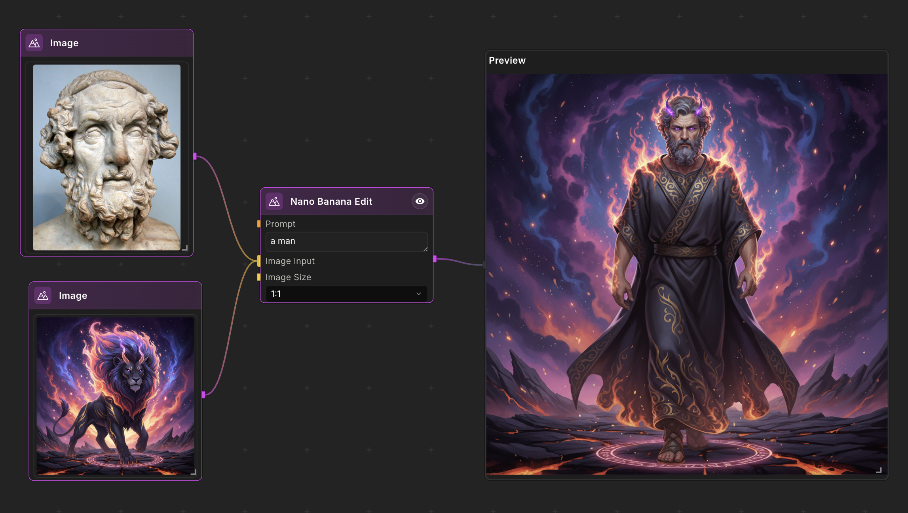

# NodeTool: Node-Based Visual Builder for AI Workflows and LLM Agents

[](https://github.com/nodetool-ai/nodetool/stargazers)
[](https://github.com/nodetool-ai/nodetool/releases)
[](https://github.com/nodetool-ai/nodetool/releases/latest)
[](https://nodetool.ai)
[](https://discord.gg/WmQTWZRcYE)
[](LICENSE.txt)

**Build AI workflows visually. Run them anywhere.**

NodeTool is an open-source visual programming tool for building AI workflows. Run locally on macOS, Windows, or Linux. Connect LLMs, create RAG systems, build AI agents, and process multimodal content through a drag-and-drop node interface.

**Alternative to ComfyUI for general AI and n8n for AI-specific automation.**



## Why NodeTool

- **Node-based visual interface**: Connect nodes by dragging lines between them for AI workflow orchestration
- **Run anywhere**: Your laptop, a server, or the cloud - local execution engine for macOS, Windows, and Linux
- **Local-first AI**: Run models entirely on your machine with support for local LLMs via Ollama, MLX, and GGML/GGUF formats
- **See it happen**: Real-time workflow execution with live output preview
- **Build AI agents**: Create LLM agents with tool use, web browsing, and RAG pipelines
- **Type-safe connections**: Ensure compatibility between node inputs and outputs

## What You Can Do

- **Multimodal AI**: Process text, images, video, and audio
- **Run locally**: Apple Silicon (M1+), NVIDIA GPUs, or CPU (works offline)
- **Access models**: 500,000+ models from HuggingFace
- **Cloud APIs**: OpenAI, Anthropic, Gemini, OpenRouter, Kie, Fal, MiniMax, Replicate
- **Build RAG systems**: Vector database integration for semantic search and retrieval-augmented generation
- **Deploy anywhere**: RunPod, Google Cloud Run, or your own infrastructure
- **Manage assets**: Organize and manage your media files
- **Extend with Python**: Python-based backend extensibility via custom nodes

## Common Uses

- **LLM Applications**: Build AI agents with tool use and web browsing capabilities
- **RAG Systems**: Create retrieval-augmented generation pipelines for document search and question answering
- **Generative AI**: Generate and edit images, videos, and audio
- **Document Processing**: Extract text, search documents, and build document analysis workflows
- **Data Transformation**: Transform data, create charts, generate reports
- **AI Agents**: Create agents that plan and execute complex tasks

## How NodeTool Compares

**vs ComfyUI**: While ComfyUI focuses on image generation workflows with Stable Diffusion, NodeTool extends the node-based concept to general AI workflows including LLM agents, text processing, RAG systems, audio, and video generation.

**vs n8n**: While n8n is a general workflow automation tool for business processes and API integrations, NodeTool is specialized for AI workloads with native support for model management, local LLMs, multimodal AI operations, and RAG pipelines.

## Cloud Models

Access the latest AI models through simple nodes:

**Video**: OpenAI Sora 2 Pro, Google Veo 3.1, xAI Grok Imagine, Alibaba Wan 2.6, MiniMax Hailuo 2.3, Kling 2.6

**Image & Audio**: Black Forest Labs FLUX.2, Google Nano Banana Pro

Use `TextToVideo`, `ImageToVideo`, or `TextToImage` nodes and select your provider and model.

> Some models need direct API keys. Others work through [kie.ai](https://kie.ai/), which combines multiple providers and often has better prices.

## Download

| Platform | Get It | Requirements |
| :--- | :--- | :--- |
| **Windows** | [Download](https://nodetool.ai) | NVIDIA GPU recommended, 20GB space |
| **macOS** | [Download](https://nodetool.ai) | M1+ Apple Silicon |
| **Linux** | [Download](https://nodetool.ai) | NVIDIA GPU recommended |

**Running AI locally needs:**

- **Apple Silicon**: 16GB+ RAM for text/audio, 24GB+ for images
- **Windows/Linux**: 4GB+ VRAM for text/audio, 8GB+ for images, 12GB+ for video
- **Cloud only**: No GPU needed—just use API services

______________________________________________________________________

## Documentation

- **[Getting Started](https://docs.nodetool.ai/getting-started)** - Build your first workflow
- **[Node Packs](https://docs.nodetool.ai/packs)** - Available operations and integrations
- **[Custom Nodes](https://docs.nodetool.ai/development/custom-nodes)** - Extend NodeTool
- **[Deployment](https://docs.nodetool.ai/deployment)** - Share your work
- **[API Reference](https://docs.nodetool.ai/api)** - Programmatic access

______________________________________________________________________

## Development Setup

For core library work, see [nodetool-core](https://github.com/nodetool-ai/nodetool-core).

**Prerequisites:** Python 3.11, Conda, Node.js LTS

**Quick start:**

```bash
# Setup
conda env update -f environment.yml --prune
conda activate nodetool

# Install
uv pip install git+https://github.com/nodetool-ai/nodetool-core git+https://github.com/nodetool-ai/nodetool-base

# Run
nodetool serve --reload &
cd web && npm install && npm start
```

### HuggingFace Pack (Linux/Windows GPU)

Requires CUDA driver ≥525.60.13 (Linux) or ≥527.41 (Windows):

```bash
uv pip install git+https://github.com/nodetool-ai/nodetool-huggingface --extra-index-url https://download.pytorch.org/whl/cu128
```

### MLX Pack (Apple Silicon)

```bash
uv pip install git+https://github.com/nodetool-ai/nodetool-mlx
```

### Electron App

Set your Conda path in `settings.yaml` and run `make electron`.

### Mobile App

Run Mini Apps on iOS and Android:

```bash
cd mobile && npm install && npm start
```

See [mobile/README.md](mobile/README.md) for setup.

______________________________________________________________________

## Testing

```bash
# Unit tests
cd electron && npm test && npm run lint
cd web && npm test && npm run lint

# End-to-end (needs backend)
cd web && npm run test:e2e
```

## Contributing

We welcome:
- Bug reports and feature requests
- Code contributions
- New node creation

Open an issue before starting major work.

## License

[AGPL-3.0 license](https://github.com/nodetool-ai/nodetool/blob/main/LICENSE).

## Get in Touch

- **General**: [hello@nodetool.ai](mailto:hello@nodetool.ai)
- **Team**: [matti@nodetool.ai](mailto:matti@nodetool.ai), [david@nodetool.ai](mailto:david@nodetool.ai)

[GitHub](https://github.com/nodetool-ai/nodetool) • [Discord](https://discord.gg/WmQTWZRcYE)

## Star History

[](https://www.star-history.com/#nodetool-ai/nodetool&type=date&legend=top-left)
