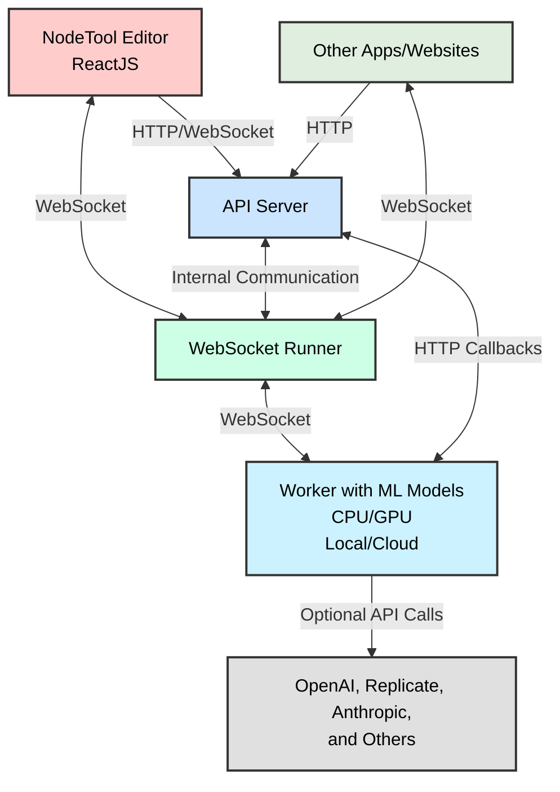

## NodeTool

NodeTool is a powerful no-code platform for building AI workflows and applications, **seamlessly integrating leading AI models and services like OpenAI, Hugging Face, Anthropic, Ollama, and ComfyUI**. It offers **two flexible ways of running models**:

1. **Local Execution**:

   - **Local LLMs via Ollama**: Run large language models directly on your machine.
   - **Local Models via Hugging Face Transformers and Diffusers**: Access hundreds of models locally.
   - **Local ComfyUI**: Leverage the ComfyUI ecosystem for advanced image processing workflows.

2. **Remote Execution**:
   - **Replicate, OpenAI, and Anthropic**: Outsource heavy GPU workloads to cloud services, allowing you to leverage powerful models without the need for expensive hardware.


By simplifying access to advanced AI technologies, NodeTool provides a creative space for both newcomers and experienced users to build powerful solutions for content creation, data analysis, automation, and more.

## Features ✨

- **No-Code Development**: Create complex AI workflows without programming knowledge.
- **Visual Editor**: Intuitive, node-based workflow design.
- **Seamless Integration with Leading AI Platforms**: Easily incorporate models from OpenAI, Hugging Face, Anthropic, Ollama, and ComfyUI into your workflows.
- **Dual Model Execution Modes**:
  - **Local Execution**: Run models locally using Ollama and Hugging Face, leveraging your own hardware.
  - **Remote Execution**: Outsource processing to cloud services like Replicate, OpenAI, and Anthropic.
- **Model Manager**: Browse and manage cached local models; download recommended models directly from the Hugging Face Hub.
- **Asset Browser**: Import and manage media assets in your workflows.
- **ComfyUI**: Import ComfyUI workflows and nodes into NodeTool.
- **Model-Agnostic Integration**: Utilize state-of-the-art AI models from various sources.
- **Multimodal Support**: Handle images, text, audio, video, and more in a single workflow.
- **API Integration**: Run AI tools from websites or mobile apps.
- **Customizable Nodes**: Extend functionality with Python.
- **Real-Time Execution**: WebSocket-based architecture for live processing.
- **Scalable Processing**: Distributed worker architecture for efficient scaling.
- **Workflow API**: Programmatically integrate workflows into existing applications.
- **Cross-Platform Compatibility**: Available on web and desktop (Electron).

## Use Cases 🎨

- **Combine AI Models**: Explore and creatively combine hundreds of ML models.
- **Stable Diffusion**: Generate custom image pipelines from the ground up.
- **Run Anywhere**: Create AI tools accessible from websites or mobile apps.
- **Music Generation**: Produce musical ideas and compositions based on text descriptions or themes.
- **Sound-to-Visual Art**: Transform audio into visual masterpieces.
- **Audio-to-Story Generator**: Create stories inspired by audio inputs.
- **Image Enhancement**: Improve image quality with AI-powered techniques.
- **Multilingual Content Creation**: Produce and translate content across languages.
- **Data Visualization**: Turn complex datasets into intuitive, visual representations.

## Quickstart 🚀

Download the latest release from our [Releases Page](https://github.com/nodetool-ai/nodetool/releases).

### Installation 📦

1. **Download**: Get the latest release from the [Releases Page](https://github.com/nodetool-ai/nodetool/releases).
2. **Extract**: Unzip the downloaded archive.
3. **Install**: Run the installer and follow the instructions.

## Node Overview 🧩

NodeTool offers a diverse range of nodes to support various AI tasks, integrating smoothly with platforms like OpenAI, Hugging Face, Anthropic, Ollama, and ComfyUI. Nodes are organized into categories:

### Node Categories

- **Anthropic** (`anthropic`): Text-based AI operations using Anthropic's models.
- **HuggingFace** (`huggingface`): Comprehensive AI capabilities including audio, image, text, video, and multimodal processing.
- **NodeTool Core** (`nodetool`): Core functionalities for data manipulation, I/O operations, and various media processing.
- **Ollama** (`ollama`): Run local large language models directly on your machine.
- **OpenAI** (`openai`): AI operations for audio, image, and text using OpenAI's models.
- **Replicate** (`replicate`): Versatile AI capabilities for audio, image, text, and video processing via cloud execution.
- **Stable Diffusion** (`stable_diffusion`): Specialized image generation and manipulation.
- **ComfyUI** (`comfyui`): Integration with ComfyUI for advanced image processing workflows.

Each category contains specific nodes tailored for different AI tasks, allowing users to create complex workflows by combining nodes across these categories.

```
nodes
├── anthropic
│   └── text
├── huggingface
│   ├── audio
│   ├── huggingface_pipeline
│   ├── image
│   ├── multimodal
│   ├── text
│   └── video
├── nodetool
│   ├── agents
│   ├── audio
│   ├── boolean
│   ├── constant
│   ├── dataframe
│   ├── dictionary
│   ├── group
│   ├── http
│   ├── image
│   ├── input
│   ├── list
│   ├── math
│   ├── output
│   ├── tensor
│   ├── text
│   ├── vector
│   └── video
├── ollama
│   └── text
├── openai
│   ├── audio
│   ├── image
│   └── text
├── replicate
│   ├── audio
│   ├── image
│   ├── text
│   └── video
├── stable_diffusion
│   └── image
└── comfyui
    └── image
```

## Model Manager 🗂️

NodeTool includes a **Model Manager** that simplifies the process of handling AI models:

- **Browse Cached Models**: View and manage models that are already downloaded to your local machine.
- **Download Recommended Models**: Easily access and download popular models from the Hugging Face Hub.
- **Efficient Storage**: Manage disk space by selectively caching models you frequently use.
- **Seamless Integration**: Downloaded models are immediately available within your workflows.

## Architecture 🏗️

NodeTool's architecture is designed for flexibility and scalability, enabling smooth integration with platforms like OpenAI, Hugging Face, Anthropic, Ollama, and ComfyUI.



### Components Overview

1. **🖥️ React Frontend**: The user interface is built with React, providing an intuitive way for users to create and manage workflows.
2. **🌐 API Server**: Handles HTTP and WebSocket connections from the frontend, managing user sessions, workflow storage, and coordination between components.
3. **🔌 WebSocket Runner**: Executes workflows in real-time, maintaining the state of running workflows, and managing communication between nodes.
4. **⚙️ Worker**: Performs the actual processing of individual nodes, allowing for parallel execution and scalability. It integrates seamlessly with:

   - **Local Models**: Run models locally using Ollama and Hugging Face Transformers and Diffusers.
   - **Remote Services**: Call external APIs like OpenAI, Replicate, Anthropic, and others for heavy GPU workloads.

### Data Flow 🔄

1. **User Interaction**: Create and modify workflows through the intuitive React frontend.
2. **Workflow Management**: Frontend sends workflow data to the API server for storage and execution.
3. **Execution Delegation**: API server hands off workflow execution to the WebSocket Runner.
4. **Node Coordination**: WebSocket Runner orchestrates node execution across Workers.
5. **Real-Time Feedback**: Results stream back to the frontend via WebSocket for instant updates.

## Implementing Custom Nodes 🛠️

Extend NodeTool's functionality by creating custom nodes that can integrate models from your preferred platforms:

```python
class MyAgent(BaseNode):
    prompt: Field(default="Build me a website for my business.")

    async def process(self, context: ProcessingContext) -> str:
        llm = MyLLM()
        return llm.generate(self.prompt)
```

## Using the Workflow API 🔌

NodeTool provides a powerful Workflow API that allows you to integrate and run your AI workflows programmatically.

### Getting Started

1. **Obtain an API Token**: Log in to your NodeTool account and generate an API token from your user settings.
2. **Connect to the API**:
   - API URL: `https://api.nodetool.ai/api`
   - WebSocket URL: `wss://api.nodetool.ai/predict`

### API Usage

#### Loading Workflows

```javascript
const response = await fetch("https://api.nodetool.ai/api/workflows", {
  headers: {
    Authorization: "Bearer YOUR_API_TOKEN",
  },
});
const workflows = await response.json();
```

#### Running a Workflow

```javascript
const socket = new WebSocket("wss://api.nodetool.ai/predict");

const request = {
  type: "run_job_request",
  api_url: "https://api.nodetool.ai/api",
  workflow_id: "YOUR_WORKFLOW_ID",
  job_type: "workflow",
  auth_token: "YOUR_API_TOKEN",
  params: {
    /* workflow parameters */
  },
};

socket.send(
  msgpack.encode({
    command: "run_job",
    data: request,
  })
);

socket.onmessage = async (event) => {
  const data = msgpack.decode(new Uint8Array(await event.data.arrayBuffer()));
  if (data.type === "job_update" && data.status === "completed") {
    console.log("Workflow completed:", data.result);
  } else if (data.type === "node_progress") {
    console.log("Progress:", (data.progress / data.total) * 100);
  }
  // Handle other message types as needed
};
```

### Example Implementation

You can reuse the existing `WorkflowRunner` class:

```javascript
class WorkflowRunner {
  constructor(apiUrl, workerUrl) {
    this.apiUrl = apiUrl;
    this.workerUrl = workerUrl;
    this.socket = null;
    this.state = "idle";
    this.token = "";
  }

  async connect() {
    return new Promise((resolve, reject) => {
      this.socket = new WebSocket(this.workerUrl);
      this.socket.onopen = () => {
        this.state = "connected";
        resolve();
      };
      this.socket.onerror = (error) => {
        this.state = "error";
        reject(error);
      };
      this.socket.onmessage = (event) => {
        const data = msgpack.decode(new Uint8Array(event.data));
        // Handle incoming messages
      };
    });
  }

  async run(workflowId, params = {}) {
    if (!this.socket || this.state !== "connected") {
      await this.connect();
    }

    this.state = "running";

    const request = {
      type: "run_job_request",
      api_url: this.apiUrl,
      workflow_id: workflowId,
      job_type: "workflow",
      auth_token: this.token,
      params: params,
    };

    this.socket.send(
      msgpack.encode({
        command: "run_job",
        data: request,
      })
    );

    return new Promise((resolve, reject) => {
      this.socket.onmessage = async (event) => {
        const data = msgpack.decode(
          new Uint8Array(await event.data.arrayBuffer())
        );
        if (data.type === "job_update" && data.status === "completed") {
          this.state = "idle";
          resolve(data.result);
        } else if (data.type === "job_update" && data.status === "failed") {
          this.state = "idle";
          reject(new Error(data.error));
        } else if (data.type === "error") {
          this.state = "idle";
          reject(new Error(data.error));
        }
        // Handle other updates as needed
      };
    });
  }
}
```

### Response Handling

- The API uses MessagePack for efficient data serialization.
- Responses include various types such as job updates, node progress, and results.
- Results may contain different data types (e.g., text, images) based on your workflow output.

By leveraging this API, you can seamlessly integrate NodeTool's powerful AI workflows into your own applications, enabling advanced AI capabilities with minimal code.

## Development Setup 🛠️

### Requirements

- Python 3.10+
- Node.js 20+

### Run Backend

```bash
python -m venv .venv
source .venv/bin/activate  # On Windows use: .venv\Scripts\activate
pip install -r requirements.txt
./scripts/server
```

### Run Frontend

```bash
cd web
npm install
npm start
```

Now, open your browser and navigate to `http://localhost:3000` to access the NodeTool interface.

### Run Electron App

If you want to run the Electron app:

```bash
cd electron
npm install
npm start
```

### Sync Dependencies

Dependencies are managed in `pyproject.toml` and must be synced to `requirements.txt` using:

```bash
poetry export -f requirements.txt --output requirements.txt --without-hashes
```

## Contributing 🤝

We welcome contributions from the community! To contribute to NodeTool:

1. Fork the repository.
2. Create a new branch (`git checkout -b feature/YourFeature`).
3. Commit your changes (`git commit -am 'Add some feature'`).
4. Push to the branch (`git push origin feature/YourFeature`).
5. Open a Pull Request.

Please adhere to our contribution guidelines.

## License 📄

NodeTool is licensed under the [GPLv3 License](LICENSE.txt), promoting open-source collaboration and sharing.

## Contact 📬

For inquiries, suggestions, or contributions, please reach out to the core team:

- **Matthias Georgi**
- **David Bürer**

**GitHub**: [https://github.com/nodetool-ai/nodetool](https://github.com/nodetool-ai/nodetool)
