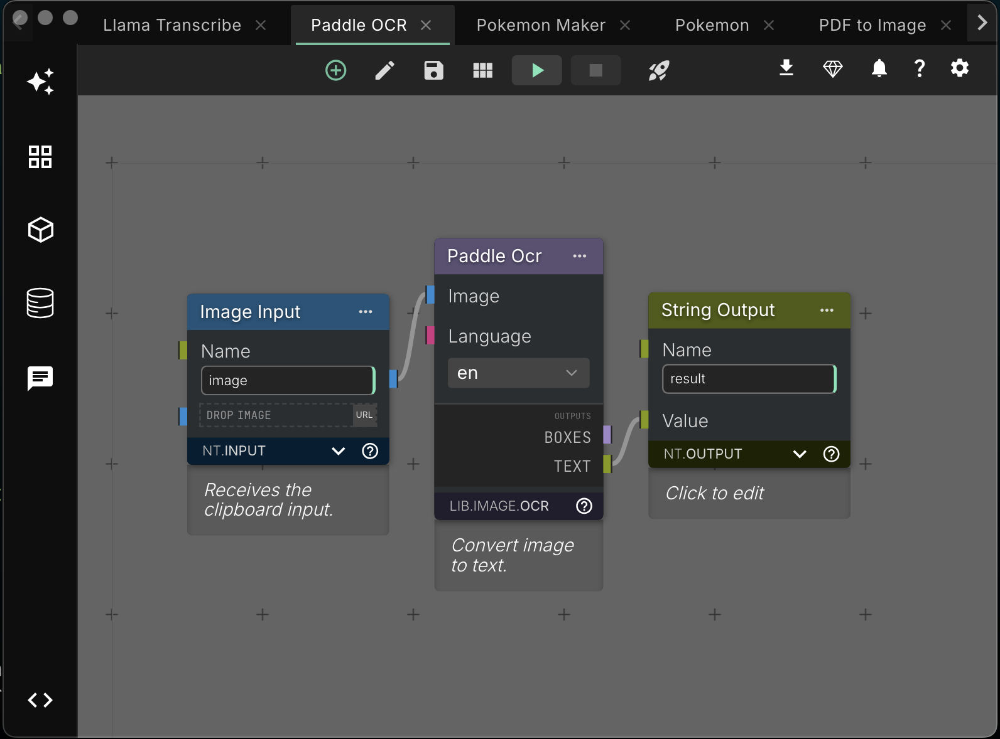

<h1 style="">
  NodeTool - AI Prototyping Platform
</h1>

Design and build AI agent systems.


NodeTool is an open-source, privacy-first, no-code platform for rapidly building and automating AI workflows.

## 🚀 Why NodeTool?

NodeTool empowers you to create sophisticated AI solutions with ease:

- **🔒 Privacy-First:** Run all AI models (LLMs, audio, video) locally. Process sensitive data securely with zero data transmission.
- **☁️ Hybrid Cloud Integration:** Scale with cloud GPUs or connect to OpenAI, Gemini, Anthropic, Replicate & Fal.AI. Create hybrid workflows, controlling exactly what data is shared.
- **🤖 Advanced Agent Design:** Build multi-agent systems visually. Implement strategic planning, reasoning, and integrate tools like web browsing and file operations.
- **🎨 Rapid AI Prototyping:** The fastest way to prototype AI workflows. Use the visual editor to drag-and-drop L1LMs, Diffusion Models, and more—no coding required.
- **💻 Comprehensive System Integration:** Control desktop apps, clipboard, and browser with AI. Trigger workflows via custom shortcuts and access local files or knowledge bases.

---



---

## ⚙️ Quickstart Installation

### 1️⃣ Get Running in Minutes

- **Windows / Mac / Linux:** [Download the installer here](https://nodetool.ai)
- Launch the installer and run NodeTool.

**Note:** Requires an Nvidia GPU or Apple Silicon (M1+) and at least 20GB of free disk space for model downloads.

### 2️⃣ Create Your First AI Workflow

- Open NodeTool.
- Choose a **prebuilt template** or start with a blank canvas.
- Drag and drop AI nodes and connect them visually.
- Click **Run** and watch your local AI workflow execute!

---

## ✨ Features

NodeTool offers a comprehensive suite for building, automating, and deploying AI workflows:

- **Visual Workflow Editor:** Design complex AI workflows intuitively with drag-and-drop simplicity. No coding required.
- **Local AI Models:** Run powerful open-source models from Hugging Face and Ollama directly on your hardware for complete privacy and offline capability.
- **Cloud AI Integration:** Seamlessly connect to major cloud AI providers like OpenAI, Gemini, Anthropic, Replicate, and Fal.ai.
- **Advanced Vector Storage & RAG:**
  - Built-in ChromaDB integration for efficient embedding storage and retrieval.
  - Easily create Retrieval-Augmented Generation (RAG) workflows.
  - Index and query PDFs, documents, and other text sources.
  - Combine vector search with any supported LLM for context-rich responses.
- **Multimodal Capabilities:** Process text, images, audio, and video within a single workflow.
- **System Tray Integration:** Access workflows quickly via the system tray. Assign global shortcuts, manage clipboard content with AI, and monitor task status.
- **Asset Management:** Import, organize, and manage images, audio, video, and other media assets within your workflows.
- **Ready-to-Use Templates:** Start quickly with pre-built workflow templates for common AI tasks.
- **Mini-App Builder:** Convert workflows into standalone desktop applications with a few clicks.
- **Chat Interface:** Build personalized chatbot interfaces tailored to your specific needs.
- **API Access:** Integrate NodeTool with external applications and services via APIs.
- **Custom Python Extensions:** Extend functionality with custom Python scripts and integrations.
- **Cross-Platform:** Build and run workflows on Mac, Windows, and Linux.

<!-- Removed the separate System Tray Integration section as it's now merged into the Features list -->

// ... existing code ...

## 🤖 NodeTool Agent System

Design sophisticated AI agents capable of handling complex, multi-step tasks using NodeTool's agent framework.

**Core Capabilities:**

- **Strategic Task Planning:** Automatically break down complex objectives into structured, executable plans.
- **Chain of Thought Reasoning:** Enable agents to perform step-by-step problem solving with explicit reasoning paths.
- **Tool Integration:** Equip agents with tools for web browsing, file operations, API calls, and more.
- **Streaming Results:** Get live updates as agents reason and execute tasks.

### Ready-to-Use Agent Examples

NodeTool includes several pre-built agent examples:

- **Wikipedia-Style Research Agent:** Generates structured documentation via web research.
- **ChromaDB Research Agent:** Processes and indexes documents for semantic querying.
- **Social Media Analysis Agents:** Tracks and analyzes content from Twitter/X, Instagram, and Reddit.
- **Professional Research Tools:** Analyzes the LinkedIn job market and performs advanced Google searches.
- **Utility Agents:** Processes emails and integrates web search capabilities.

Find full implementations and more examples in the [examples directory](https://github.com/nodetool-ai/nodetool-core/tree/main/examples).

## ✨ Cool Things You Can Do

Explore practical examples showcasing NodeTool's capabilities:

- **📧 Daily Email Digest:** Automatically scans your Gmail, summarizes emails using an LLM (extracting sender, topics, actions), and creates a concise daily digest. Stay updated without manually reading every email.
- **🐉 Pokemon Maker:** Generate unique Pokemon descriptions and images using AI. Input animal inspirations and get custom Pokemon with types, abilities, and personalities.
- **🔍 Simple RAG Document Q&A:** Ask questions about your documents. This workflow searches a ChromaDB vector collection, formats relevant results, and uses an LLM (like Deepseek-Coder-V2) to generate answers based _only_ on the retrieved content.
- **🎨 Image Style Transfer:** Transform images by applying the style of a reference image. Uses IP-Adapter for style and ControlNet for structure preservation, perfect for creative image variations.

---

## 💡 Join Our Community

Connect with other NodeTool users and the development team:

- 🌟 **Star us on GitHub:** [github.com/nodetool-ai/nodetool](https://github.com/nodetool-ai/nodetool)
- 💬 **Join the Discussion:** [Discord Community](https://discord.gg/26m5xBwe)
- 🚀 **Contribute:** Help shape the future of local-first AI. See [Contributing](#contributing-) below.

Let's build amazing AI workflows together! ✨

## 🚀 Quickstart (Release Info)

Release 0.6 is in pre-release.

## 🛠️ Development Setup

Follow these steps to set up a local development environment.

### Prerequisites

- **Python 3.11:** Required for the backend.
- **Conda:** Download and install from [miniconda.org](https://docs.conda.io/en/latest/miniconda.html).
- **Node.js (Latest LTS):** Required for the frontend. Download and install from [nodejs.org](https://nodejs.org/en).

### 1. Set Up Conda Environment

```bash
# Create and activate the Conda environment
conda create -n nodetool python=3.11 -y
conda activate nodetool

# Install essential system dependencies via Conda
conda install -c conda-forge ffmpeg cairo x264 x265 aom libopus libvorbis lame pandoc uv -y
```

### 2. Install Core Python Dependencies

These are the essential packages to run NodeTool.

```bash
# Install nodetool-core and nodetool-base
# On macOS / Linux / Windows:
pip install git+https://github.com/nodetool-ai/nodetool-core
pip install git+https://github.com/nodetool-ai/nodetool-base
```

### 3. Install Optional Node Packs (As Needed)

NodeTool's functionality is extended via packs. Install only the ones you need.

```bash
# List available packs (optional)
nodetool package list -a

# Example: Install packs for specific integrations
pip install git+https://github.com/nodetool-ai/nodetool-ollama          # For Ollama local models
pip install git+https://github.com/nodetool-ai/nodetool-openai          # For OpenAI API
pip install git+https://github.com/nodetool-ai/nodetool-huggingface --extra-index-url https://download.pytorch.org/whl/cu121 # For HuggingFace models (PyTorch/CUDA)
pip install git+https://github.com/nodetool-ai/nodetool-chroma          # For ChromaDB vector storage
# ... install other packs like anthropic, google, replicate, fal, comfy, elevenlabs, etc.
# pip install git+https://github.com/nodetool-ai/nodetool-anthropic
# pip install git+https://github.com/nodetool-ai/nodetool-google
# ... add other relevant packs here
```

_Note:_ Some packs like `nodetool-comfy` and `nodetool-huggingface` may require specific PyTorch versions or CUDA drivers. Use the `--extra-index-url` when necessary.

### 4. Run NodeTool Backend & Web UI

Ensure the `nodetool` Conda environment is active.

**Option A: Run Backend with Web UI (for Development)**

This starts the backend server and serves the web UI directly. Hot-reloading is enabled.

```bash
# On macOS and Linux:
./scripts/server

# On Windows:
.\scripts\server.bat
```

Access the UI in your browser at `http://localhost:3000`.

**Option B: Run with Electron App**

This provides the full desktop application experience.

**Configure Conda Path:**
Ensure your `settings.yaml` file points to your Conda environment path:

- macOS/Linux: `~/.config/nodetool/settings.yaml`
- Windows: `%APPDATA%/nodetool/settings.yaml`

```yaml
CONDA_ENV: /path/to/your/conda/envs/nodetool # e.g., /Users/me/miniconda3/envs/nodetool
```

**Build Frontends:**
You only need to do this once or when frontend code changes.

```bash
# Build the main web UI
cd web
npm install
npm run build
cd ..

# Build the apps UI (if needed)
cd apps
npm install
npm run build
cd ..
```

**Start Electron:**

```bash
cd electron
npm install
npm start
```

The Electron app will launch, automatically starting the backend and frontend.

## 🤝 Contributing

We welcome community contributions!

1.  **Fork** the repository on GitHub.
2.  Create a **new branch** for your feature (`git checkout -b feature/your-feature-name`).
3.  Make your changes and **commit** them (`git commit -am 'Add some amazing feature'`).
4.  **Push** your branch to your fork (`git push origin feature/your-feature-name`).
5.  Open a **Pull Request** against the `main` branch of the original repository.

Please follow our contribution guidelines and code of conduct.

## 📄 License

AGPL

## 📬 Get in Touch

We'd love to hear from you! Whether you have questions, suggestions, or feedback, feel free to reach out through any of the following channels:

- **Email:** [hello@nodetool.ai](mailto:hello@nodetool.ai)
- **Discord Community:** [Join us on Discord](https://discord.gg/26m5xBwe)
- **Community Forum:** [Visit the NodeTool Forum](https://forum.nodetool.ai) _(Please update link if available)_
- **GitHub Issues:** [Report issues or request features](https://github.com/nodetool-ai/nodetool/issues)
- **Project Leads:** Matthias Georgi ([matti@nodetool.ai](mailto:matti@nodetool.ai)), David Bührer ([david@nodetool.ai](mailto:david@nodetool.ai))

We're excited to collaborate and build amazing AI workflows together! 🚀✨

## 📦 NodeTool Packs Registry

Extend NodeTool's capabilities with specialized **Node Packs**. The [NodeTool Packs Registry](https://github.com/nodetool-ai/nodetool-registry) manages discovery, installation, and distribution.

### Using Packs (For Users)

Manage packs easily through the **NodeTool UI**:

- Browse available packs.
- Install, uninstall, and update packs (uses `pip` behind the scenes).
- View pack details and documentation.

Alternatively, install directly via `pip` (see [Development Setup](#3-install-optional-node-packs-as-needed)).

Refer to the [NodeTool Registry repository](https://github.com/nodetool-ai/nodetool-registry) for detailed guidelines on creating and publishing packs.
