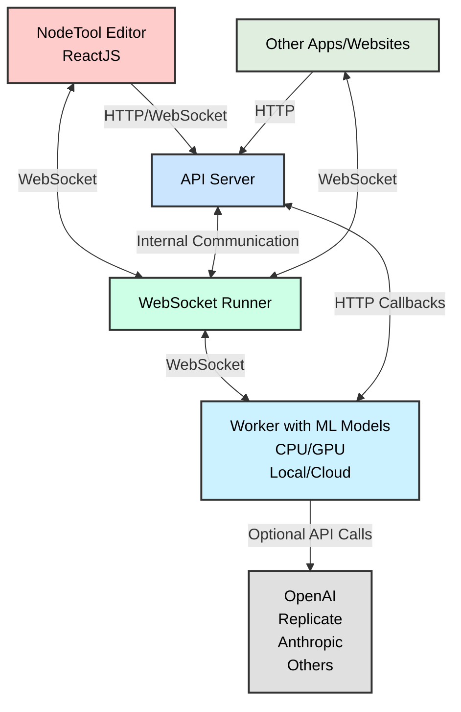

<h1 style="display: inline;">
  
  NodeTool - Build Smarter AI Apps on Your Desktop
</h1>

NodeTool is a no-code platform that enables you to create AI-powered tools and assistants tailored to your needs, directly on your local machine. Whether you're building personal productivity tools, learning assistants, or desktop utilities, NodeTool provides the foundation for creating powerful, privacy-focused AI applications.

With NodeTool, you can:

- **Build Privacy-First**: Keep your data local and secure with no need to send files to external servers
- **Create Custom Solutions**: Design AI tools that work exactly the way you need them to
- **Run Locally**: Utilize your own hardware to run open-source models via Ollama and access hundreds of models via Hugging Face
- **Integrate Seamlessly**: Connect AI workflows to your favorite local apps and desktop utilities


NodeTool simplifies access to advanced AI technologies, providing a creative space for both newcomers and experienced users to build powerful solutions for content creation, data analysis, automation, and more.

## Use Cases 🎨

- 🎨 **Personal Learning Assistant**: Create chatbots that read and explain your PDFs, e-books, or academic papers
- 📝 **Note Summarization**: Extract key insights from Obsidian or Apple Notes
- 🎤 **Voice Memo to Presentation**: Convert recorded ideas into documents
- 🔧 **Desktop Utilities**: Access NodeTool mini-apps from your system tray
- 🗣️ **Siri Integration**: Extend Siri's capabilities with custom AI workflows
- ⚡ **Automation**: Streamline repetitive tasks with AI-powered scripts

## Features ✨

- **Visual Editor | No-Code Development**: Create complex AI workflows visually—no coding needed! Dive into an intuitive, node-based design and let your creativity flow.
- **Seamless Integration with Leading AI Platforms**: Mix and match models from OpenAI, Hugging Face, Anthropic, Ollama, and ComfyUI for endless possibilities.
- **Native ComfyUI Support**: Run ComfyUI nodes directly within NodeTool—no separate installation required. Leverage the full power of ComfyUI's extensive node ecosystem.
- **Hugging Face Integration**: Access a vast library of models and run Hugging Face Transformers and Diffusers directly within NodeTool.
- **Ollama Integration**: Run local large language models for chat and embedding.
- **Model Manager**: Browse and manage your favorite models locally. Download models directly from the Hugging Face Hub and run them on your GPU.
- **Chat with Workflows**: Chat with workflows directly within NodeTool.
- **Asset Browser**: Easily import and manage media assets to use in your AI creations.
- **Multimodal Support**: Play with images, text, audio, video, and more — all in one place.
- **API Integration**: Connect your AI tools with websites or apps seamlessly.
- **Dual Model Execution Modes**:
  - **Local Execution**: Run models locally using Ollama and Hugging Face, leveraging your own hardware.
  - **Remote Execution**: Outsource processing to cloud services like Replicate, OpenAI, and Anthropic.
- **Customizable Nodes**: Extend functionality with Python.
- **Real-Time Execution**: WebSocket-based architecture for live processing.
- **Cross-Platform Compatibility**: Available as standalone app on Mac and Windows.

## Quickstart 🚀

Download the latest release from our [Releases Page](https://github.com/nodetool-ai/nodetool/releases).

## Where to Use NodeTool 🖥️

NodeTool is designed for your local environment:

- **Home Workstation**: Build AI tools for personal productivity or creative projects
- **Lab or Office**: Deploy customized solutions for research and internal utilities
- **On the Go**: Run lightweight workflows on laptops for portable AI assistance

## Node Overview 🧩

NodeTool offers a diverse range of nodes to support various AI tasks, integrating smoothly with platforms like OpenAI, Hugging Face, Anthropic, Ollama, and ComfyUI. Nodes are organized into categories:

### Node Categories

- **Anthropic** (`anthropic`): Text-based AI operations using Anthropic's models.
- **ComfyUI** (`comfyui`): Native support for ComfyUI nodes, enabling advanced image processing workflows directly within NodeTool.
- **Chroma** (`chroma`): Vector database for storing and querying embeddings.
- **HuggingFace** (`huggingface`): Comprehensive AI capabilities including audio, image, text, video, and multimodal processing.
- **NodeTool Core** (`nodetool`): Core functionalities for data manipulation, I/O operations, and various media processing.
- **Ollama** (`ollama`): Run local large language models directly on your machine.
- **OpenAI** (`openai`): AI operations for audio, image, and text using OpenAI's models.
- **Replicate** (`replicate`): Versatile AI capabilities for audio, image, text, and video processing via cloud execution.
- **Stable Diffusion** (`stable_diffusion`): Specialized image generation and manipulation.
- **Luma** (`luma`): Generate videos from text and images.

## Model Manager 🗂️

NodeTool's Model Manager simplifies handling AI models:

- **Browse Cached Models**: View and manage models already downloaded to your local machine.
- **Download Recommended Models**: Easily access and download popular models from the Hugging Face Hub.
- **Efficient Storage**: Manage disk space by selectively caching frequently used models.
- **Seamless Integration**: Downloaded models are immediately available within your workflows.

## Architecture 🏗️

NodeTool's architecture is designed to be flexible and extensible.



### Components Overview

1. **🖥️ Frontend**: NodeTool Editor for workflows, assets, models. Built with ReactJS, Reactflow, MUI v5, TypeScript.
2. **🌐 API Server**: Handles HTTP and WebSocket connections from the frontend, managing user sessions, workflow storage, and coordination between components.
3. **🔌 WebSocket Runner**: Executes workflows in real-time, maintaining the state of running workflows and managing communication between nodes.
4. **⚙️ Worker**: Performs the actual processing of individual nodes, allowing for parallel execution and scalability. It integrates seamlessly with:

   - **Local Models**: Run models locally using Ollama and Hugging Face Transformers and Diffusers.
   - **Remote Services**: Call external APIs like OpenAI, Replicate, Anthropic, and others for heavy GPU workloads.

### Data Flow 🔄

1. **User Interaction**: Create and modify workflows through the intuitive React frontend.
2. **Workflow Management**: Frontend sends workflow data to the API server for storage and execution.
3. **Execution Delegation**: API server hands off workflow execution to the WebSocket Runner.
4. **Node Coordination**: WebSocket Runner orchestrates node execution across Workers.
5. **Real-Time Feedback**: Results stream back to the frontend via WebSocket for instant updates.

## Implementing Custom Nodes 🛠️

Extend NodeTool's functionality by creating custom nodes that can integrate models from your preferred platforms:

```python
class MyAgent(BaseNode):
    prompt: Field(default="Build me a website for my business.")

    async def process(self, context: ProcessingContext) -> str:
        llm = MyLLM()
        return llm.generate(self.prompt)
```

## Using the Workflow API 🔌

NodeTool provides a powerful Workflow API that allows you to integrate and run your AI workflows programmatically.

You can use the API locally now, `api.nodetool.ai` access is limited to Alpha users.

### API Usage

#### Loading Workflows

```javascript
const response = await fetch("http://localhost:8000/api/workflows/");
const workflows = await response.json();
```

#### Running a Workflow

##### HTTP API

```bash
curl -X POST "http://localhost:8000/api/jobs/run" \
-H "Content-Type: application/json" \
-d '{
    "workflow_id": "your_workflow_id"
}'
```

```javascript
const response = await fetch("http://localhost:8000/api/jobs/run", {
  method: "POST",
  headers: {
    "Content-Type": "application/json",
  },
  body: JSON.stringify({
    workflow_id: workflowId,
    params: params,
  }),
});

const outputs = await response.json();
// outputs is an object with one property for each output node in the workflow
// the value is the output of the node, which can be a string, image, audio, etc.
```

#### Streaming API

The streaming API is useful for getting real-time updates on the status of the workflow.

See [run_workflow_streaming.js](examples/run_workflow_streaming.js) for an example.

These updates include:

- job_update: The overall status of the job (e.g. running, completed, failed, cancelled)
- node_update: The status of a specific node (e.g. running, completed, error)
- node_progress: The progress of a specific node (e.g. 20% complete)

The final result of the workflow is also streamed as a single job_update with the status "completed".

```javascript
const response = await fetch("http://localhost:8000/api/jobs/run?stream=true", {
  method: "POST",
  headers: {
    "Content-Type": "application/json",
    Authorization: "Bearer YOUR_API_TOKEN",
  },
  body: JSON.stringify({
    workflow_id: workflowId,
    params: params,
  }),
});

const reader = response.body.getReader();
const decoder = new TextDecoder();

while (true) {
  const { done, value } = await reader.read();
  if (done) break;

  const lines = decoder.decode(value).split("\n");
  for (const line of lines) {
    if (line.trim() === "") continue;

    const message = JSON.parse(line);
    switch (message.type) {
      case "job_update":
        console.log("Job status:", message.status);
        if (message.status === "completed") {
          console.log("Workflow completed:", message.result);
        }
        break;
      case "node_progress":
        console.log(
          "Node progress:",
          message.node_name,
          (message.progress / message.total) * 100
        );
        break;
      case "node_update":
        console.log(
          "Node update:",
          message.node_name,
          message.status,
          message.error
        );
        break;
    }
  }
}
```

##### WebSocket API

The WebSocket API is useful for getting real-time updates on the status of the workflow.
It is similar to the streaming API, but it uses a more efficient binary encoding.
It offers additional features like canceling jobs.

See [run_workflow_websocket.js](examples/run_workflow_websocket.js) for an example.

```javascript
const socket = new WebSocket("ws://localhost:8000/predict");

const request = {
  type: "run_job_request",
  workflow_id: "YOUR_WORKFLOW_ID",
  params: {
    /* workflow parameters */
  },
};

// Run a workflow
socket.send(
  msgpack.encode({
    command: "run_job",
    data: request,
  })
);

// Handle messages from the server
socket.onmessage = async (event) => {
  const data = msgpack.decode(new Uint8Array(await event.data.arrayBuffer()));
  if (data.type === "job_update" && data.status === "completed") {
    console.log("Workflow completed:", data.result);
  } else if (data.type === "node_update") {
    console.log("Node update:", data.node_name, data.status, data.error);
  } else if (data.type === "node_progress") {
    console.log("Progress:", (data.progress / data.total) * 100);
  }
  // Handle other message types as needed
};

// Cancel a running job
socket.send(msgpack.encode({ command: "cancel_job" }));

// Get the status of the job
socket.send(msgpack.encode({ command: "get_status" }));
```

### API Demo

- Check out this simple [html page](api-demo.html).
- Download the [html file](<(api-demo.html)>)
- Open in a browser locally.
- Select the endpoint, local or api.nodetool.ai (for alpha users)
- Enter API token (from Nodetool settings dialog)
- Select workflow
- Run workflow
- The page will live stream the output from the local or remote API

## Development Setup 🛠️

### Requirements

- Conda, download and install from [miniconda.org](https://docs.conda.io/en/latest/miniconda.html)
- Node.js, download and install from [nodejs.org](https://nodejs.org/en)

### Conda Environment

```bash
conda create -n nodetool python=3.11
conda activate nodetool
conda install -c conda-forge ffmpeg libopus cairo
```

### Install Python Dependencies

On macOS:

```bash
pip install -r requirements.txt
```

On Windows and Linux with CUDA 12.1:

```bash
pip install -r requirements.txt --extra-index-url https://download.pytorch.org/whl/cu121
```

On Windows and Linux without CUDA:

```bash
pip install -r requirements.txt
```

### Run without Electron

Ensure you have the Conda environment activated.

On macOS and Linux:

```bash
./scripts/server --with-ui --reload
```

On windows:

```bash
.\scripts\server.bat --with-ui --reload
```

Now, open your browser and navigate to `http://localhost:3000` to access the NodeTool interface.

### Run with Electron

Ensure you have the Conda environment activated.

Before running Electron, you need to build the frontend located in the `/web` directory:

```bash
cd web
npm install
npm run build
```

Once the build is complete, you can start the Electron app:

```bash
cd electron
npm install
npm start
```

The Electron app starts the frontend and backend.

### Sync Dependencies

Dependencies are managed via poetry in `pyproject.toml` and must be synced to `requirements.txt` using:

```bash
poetry export -f requirements.txt --output requirements.txt --without-hashes
```

## Contributing 🤝

We welcome contributions from the community! To contribute to NodeTool:

1. Fork the repository.
2. Create a new branch (`git checkout -b feature/YourFeature`).
3. Commit your changes (`git commit -am 'Add some feature'`).
4. Push to the branch (`git push origin feature/YourFeature`).
5. Open a Pull Request.

Please adhere to our contribution guidelines.

## License 📄

NodeTool is licensed under the [AGPLv3 License](LICENSE.txt)

## Contact 📬

Got ideas, suggestions, or just want to say hi? We'd love to hear from you!

- **Email**: [hello@nodetool.ai](mailto:hello@nodetool.ai)
- **Discord**: [Nodetool Discord](https://discord.gg/26m5xBwe)
- **Forum**: [Nodetool Forum](https://forum.nodetool.ai)
- **GitHub**: [https://github.com/nodetool-ai/nodetool](https://github.com/nodetool-ai/nodetool)
- **Matthias Georgi**: matti@nodetool.ai
- **David Bührer**: david@nodetool.ai
