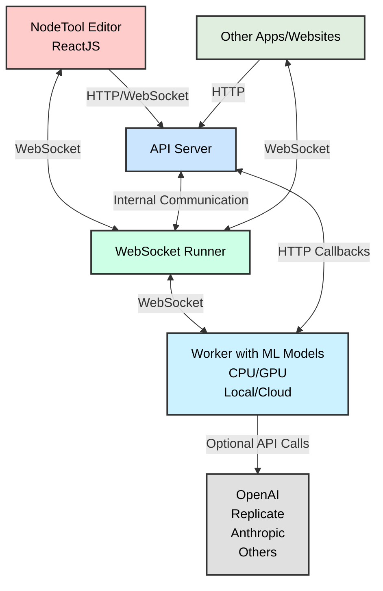

<h1 style="display: inline;">
  
  NodeTool - Your Personal Automation Platform
</h1>


NodeTool enables you to create custom AI workflows on your computer.

With NodeTool, you can:

- **Build Privacy-First**: Keep your data local and secure with no need to send files to external servers
- **Create Custom Solutions**: Design AI tools that work exactly the way you need them to
- **Run Locally**: Utilize your own hardware to run open-source models via Ollama and access thousands of models via Hugging Face
- **Integrate Seamlessly**: Connect AI workflows to your favorite apps and services
- **Generate & Edit Media**: Create and manipulate images, audio, and video using state-of-the-art AI models
- **Process Multiple Formats**: Work with text, images, audio, and video in a single unified interface


## Use Cases 🎨

- 🎨 **Personal Learning Assistant**: Create chatbots that read and explain your PDFs, e-books, or academic papers
- 📝 **Note Summarization**: Extract key insights from Obsidian or Apple Notes
- 🎤 **Voice Memo to Presentation**: Convert recorded ideas into documents
- 🔧️ **Image Generation & Editing**: Create and modify images with advanced AI models
- 🎵 **Audio Processing**: Generate and edit audio content with AI assistance
- 🎬 **Video Creation**: Produce and manipulate video content using AI tools
- 🔧 **Desktop Utilities**: Access NodeTool mini-apps from your system tray
- 🗣️ **Siri Integration**: Extend Siri's capabilities with custom AI workflows
- ⚡ **Automation**: Streamline repetitive tasks with AI-powered scripts

## Features ✨

Key features to automate your workflow:

- **Visual Editor**: Build AI workflows visually—no coding required.
- **Mini Apps**: Access NodeTool mini-apps from your system tray.
- **Chat Apps**: Build chatbots that explain your PDFs, generate images, and more.
- **Ollama Support**: Run local language models for chat.
- **HuggingFace**: Run Transformers and Diffusers models locally.
- **Model Manager**: Manage and download models from the Hugging Face Hub.
- **Integration with AI Platforms**: Use models from OpenAI, Hugging Face, Anthropic, Ollama, and ComfyUI.
- **ComfyUI Support**: Run ComfyUI nodes directly in NodeTool without extra installation.
- **Asset Management**: Import and manage media assets easily.
- **Multimodal Support**: Work with images, text, audio, and video together.
- **API**: Call NodeTool API from your own scripts.
- **Custom Nodes**: Enhance functionality with Python.
- **Cross-Platform**: Available on Mac, Windows, and Linux.

## Quickstart 🚀

Download the latest release from our [Releases Page](https://github.com/nodetool-ai/nodetool/releases).

## Where to Use NodeTool 🖥️

NodeTool is designed for your local environment:

- **Home Workstation**: Build AI tools for personal productivity or creative projects
- **Lab or Office**: Deploy customized solutions for research and internal utilities
- **On the Go**: Run lightweight workflows on laptops for portable AI assistance

## Node Overview 🧩

- **Anthropic** 🧠: Text-based AI tasks.
- **Comfy** 🎨: Support for ComfyUI nodes for image processing.
- **Chroma** 🌈: Vector database for embeddings.
- **ElevenLabs** 🎤: Text-to-speech services.
- **Fal** 🔊: AI for audio, image, text, and video.
- **Google** 🔍: Access to Gemini Models and Gmail.
- **HuggingFace** 🤗: AI for audio, image, text, and video.
- **NodeTool Core** ⚙️: Core data and media processing functions.
- **Ollama** 🦙: Run local language models.
- **OpenAI** 🌐: AI for audio, image, and text tasks.
- **Replicate** ☁️: AI for audio, image, text, and video in the cloud.

## Architecture 🏗️

NodeTool's architecture is designed to be flexible and extensible.



### Components Overview

1. **🖥️ Frontend**: The NodeTool Editor for managing workflows and assets, built with ReactJS and TypeScript.
2. **🌐 API Server**: Manages connections from the frontend and handles user sessions and workflow storage.
3. **🔌 WebSocket Runner**: Runs workflows in real-time and keeps track of their state.

## Implementing Custom Nodes 🛠️

Extend NodeTool's functionality by creating custom nodes that can integrate models from your preferred platforms:

```python
class MyAgent(BaseNode):
    prompt: Field(default="Build me a website for my business.")

    async def process(self, context: ProcessingContext) -> str:
        llm = MyLLM()
        return llm.generate(self.prompt)
```

## Using the Workflow API 🔌

NodeTool provides a powerful Workflow API that allows you to integrate and run your AI workflows programmatically.

You can use the API locally now, `api.nodetool.ai` access is limited to Alpha users.

### API Usage

#### Loading Workflows

```javascript
const response = await fetch("http://localhost:8000/api/workflows/");
const workflows = await response.json();
```

#### Running a Workflow

##### HTTP API

```bash
curl -X POST "http://localhost:8000/api/jobs/run" \
-H "Content-Type: application/json" \
-d '{
    "workflow_id": "your_workflow_id"
}'
```

```javascript
const response = await fetch("http://localhost:8000/api/jobs/run", {
  method: "POST",
  headers: {
    "Content-Type": "application/json",
  },
  body: JSON.stringify({
    workflow_id: workflowId,
    params: params,
  }),
});

const outputs = await response.json();
// outputs is an object with one property for each output node in the workflow
// the value is the output of the node, which can be a string, image, audio, etc.
```

#### Streaming API

The streaming API is useful for getting real-time updates on the status of the workflow.

See [run_workflow_streaming.js](examples/run_workflow_streaming.js) for an example.

These updates include:

- job_update: The overall status of the job (e.g. running, completed, failed, cancelled)
- node_update: The status of a specific node (e.g. running, completed, error)
- node_progress: The progress of a specific node (e.g. 20% complete)

The final result of the workflow is also streamed as a single job_update with the status "completed".

```javascript
const response = await fetch("http://localhost:8000/api/jobs/run?stream=true", {
  method: "POST",
  headers: {
    "Content-Type": "application/json",
    Authorization: "Bearer YOUR_API_TOKEN",
  },
  body: JSON.stringify({
    workflow_id: workflowId,
    params: params,
  }),
});

const reader = response.body.getReader();
const decoder = new TextDecoder();

while (true) {
  const { done, value } = await reader.read();
  if (done) break;

  const lines = decoder.decode(value).split("\n");
  for (const line of lines) {
    if (line.trim() === "") continue;

    const message = JSON.parse(line);
    switch (message.type) {
      case "job_update":
        console.log("Job status:", message.status);
        if (message.status === "completed") {
          console.log("Workflow completed:", message.result);
        }
        break;
      case "node_progress":
        console.log(
          "Node progress:",
          message.node_name,
          (message.progress / message.total) * 100
        );
        break;
      case "node_update":
        console.log(
          "Node update:",
          message.node_name,
          message.status,
          message.error
        );
        break;
    }
  }
}
```

##### WebSocket API

The WebSocket API is useful for getting real-time updates on the status of the workflow.
It is similar to the streaming API, but it uses a more efficient binary encoding.
It offers additional features like canceling jobs.

See [run_workflow_websocket.js](examples/run_workflow_websocket.js) for an example.

```javascript
const socket = new WebSocket("ws://localhost:8000/predict");

const request = {
  type: "run_job_request",
  workflow_id: "YOUR_WORKFLOW_ID",
  params: {
    /* workflow parameters */
  },
};

// Run a workflow
socket.send(
  msgpack.encode({
    command: "run_job",
    data: request,
  })
);

// Handle messages from the server
socket.onmessage = async (event) => {
  const data = msgpack.decode(new Uint8Array(await event.data.arrayBuffer()));
  if (data.type === "job_update" && data.status === "completed") {
    console.log("Workflow completed:", data.result);
  } else if (data.type === "node_update") {
    console.log("Node update:", data.node_name, data.status, data.error);
  } else if (data.type === "node_progress") {
    console.log("Progress:", (data.progress / data.total) * 100);
  }
  // Handle other message types as needed
};

// Cancel a running job
socket.send(msgpack.encode({ command: "cancel_job" }));

// Get the status of the job
socket.send(msgpack.encode({ command: "get_status" }));
```

### API Demo

- Check out this simple [html page](api-demo.html).
- Download the [html file](<(api-demo.html)>)
- Open in a browser locally.
- Select the endpoint, local or api.nodetool.ai (for alpha users)
- Enter API token (from Nodetool settings dialog)
- Select workflow
- Run workflow
- The page will live stream the output from the local or remote API

## Development Setup 🛠️

### Requirements

- Conda, download and install from [miniconda.org](https://docs.conda.io/en/latest/miniconda.html)
- Node.js, download and install from [nodejs.org](https://nodejs.org/en)

### Conda Environment

```bash
conda create -n nodetool python=3.11
conda activate nodetool
conda install -c conda-forge ffmpeg libopus cairo
```

### Install Python Dependencies

On macOS:

```bash
pip install -r requirements.txt
```

On Windows and Linux with CUDA 12.1:

```bash
pip install -r requirements.txt --extra-index-url https://download.pytorch.org/whl/cu121
```

On Windows and Linux without CUDA:

```bash
pip install -r requirements.txt
```

### Run without Electron

Ensure you have the Conda environment activated.

On macOS and Linux:

```bash
./scripts/server --with-ui --reload
```

On windows:

```bash
.\scripts\server.bat --with-ui --reload
```

Now, open your browser and navigate to `http://localhost:3000` to access the NodeTool interface.

### Run with Electron

Ensure you have the Conda environment activated.

Before running Electron, you need to build the frontend located in the `/web` directory:

```bash
cd web
npm install
npm run build
```

Once the build is complete, you can start the Electron app:

```bash
cd electron
npm install
npm start
```

The Electron app starts the frontend and backend.

### Sync Dependencies

Dependencies are managed via poetry in `pyproject.toml` and must be synced to `requirements.txt` using:

```bash
poetry export -f requirements.txt --output requirements.txt --without-hashes
```

## Contributing 🤝

We welcome contributions from the community! To contribute to NodeTool:

1. Fork the repository.
2. Create a new branch (`git checkout -b feature/YourFeature`).
3. Commit your changes (`git commit -am 'Add some feature'`).
4. Push to the branch (`git push origin feature/YourFeature`).
5. Open a Pull Request.

Please adhere to our contribution guidelines.

## License 📄

NodeTool is licensed under the [AGPLv3 License](LICENSE.txt)

## Contact 📬

Got ideas, suggestions, or just want to say hi? We'd love to hear from you!

- **Email**: [hello@nodetool.ai](mailto:hello@nodetool.ai)
- **Discord**: [Nodetool Discord](https://discord.gg/26m5xBwe)
- **Forum**: [Nodetool Forum](https://forum.nodetool.ai)
- **GitHub**: [https://github.com/nodetool-ai/nodetool](https://github.com/nodetool-ai/nodetool)
- **Matthias Georgi**: matti@nodetool.ai
- **David Bührer**: david@nodetool.ai
