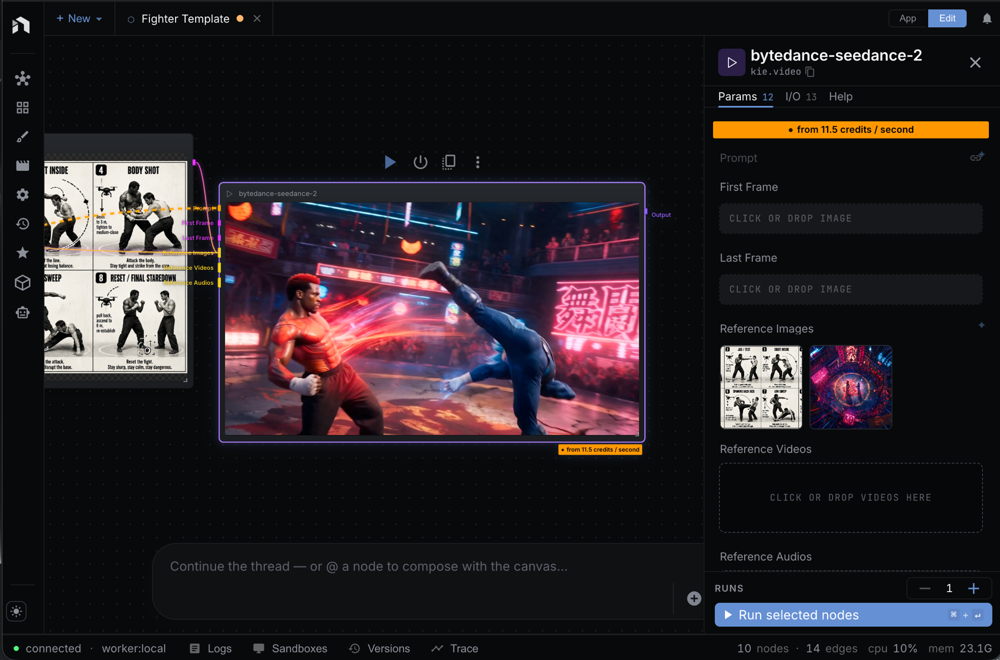

# NodeTool: Node-Based Visual Builder for AI Workflows and LLM Agents

[](https://github.com/nodetool-ai/nodetool/stargazers)
[](https://github.com/nodetool-ai/nodetool/releases)
[](https://github.com/nodetool-ai/nodetool/releases/latest)
[](https://discord.gg/WmQTWZRcYE)
[](LICENSE.txt)

[](https://nodetool.ai)
[](https://nodetool.ai)
[](https://nodetool.ai)

> Build AI Workflows. Run Them Locally.

NodeTool is a node-based visual programming tool for building AI workflows and applications. Connect models and tools with visual nodes to create LLM agents, RAG systems, and multimodal pipelines. Runs locally on macOS, Windows, and Linux — use local models or cloud APIs. Your data stays on your machine.



## Key Features

| | |
| :--- | :--- |
| **Visual workflow builder** | Drag-and-drop nodes with type-safe connections — no code required |
| **Local-first architecture** | Run models on your machine via Ollama, MLX (Apple Silicon), and GGUF/GGML |
| **Multi-provider support** | OpenAI, Anthropic, Ollama, Replicate, HuggingFace, and custom models |
| **AI agent framework** | Build autonomous agents with tool use, planning, and 100+ built-in tools |
| **RAG & vector databases** | Built-in document indexing and semantic search |
| **Multimodal processing** | Text, images, video, and audio in unified workflows |
| **Real-time streaming** | Async execution with live output previews at every node |
| **Deploy anywhere** | Docker, RunPod, Google Cloud Run, or self-hosted |
| **Extend with code** | Custom nodes in TypeScript or Python |
| **Cross-platform** | Desktop (Electron), web, CLI, and mobile (React Native) |

## What You Can Build

- **AI Agents & Automation** — multi-step agents that plan, execute, and adapt
- **Document Intelligence** — index documents, search with AI, and answer questions (RAG made simple)
- **Image & Video Creation** — generate and transform media with FLUX, NanoBanana, and custom models
- **Data Processing** — transform data, extract insights, and automate reports
- **Voice & Audio** — transcribe, analyze, and generate speech with Whisper and ElevenLabs
- **Smart Assistants** — AI assistants that understand documents, emails, and notes
- **Mini-Apps** — share workflows as interactive web applications

## Cloud Models

Access the latest generative AI models through simple nodes:

| Type | Models |
| :--- | :--- |
| **Video** | OpenAI Sora 2 Pro, Google Veo 3.1, xAI Grok Imagine, Alibaba Wan 2.6, MiniMax Hailuo 2.3, Kling 2.6 |
| **Image** | Black Forest Labs FLUX.2, Google Nano Banana Pro, DALL-E 3 |
| **Audio** | OpenAI Whisper, OpenAI TTS, ElevenLabs |
| **Text** | GPT-4, Claude, Gemini, Llama, Mistral (local or cloud) |

Use `TextToVideo`, `ImageToVideo`, or `TextToImage` nodes and select your provider and model.

> Some models need direct API keys. Others work through [kie.ai](https://kie.ai/), which combines multiple providers and often has better prices.

## How NodeTool Differs

| | NodeTool | ComfyUI | n8n | LangChain |
| :--- | :--- | :--- | :--- | :--- |
| **Focus** | General AI workflows + agents | Stable Diffusion image generation | Business automation | Code-first LLM framework |
| **Local LLMs** | Ollama, MLX, GGUF | Limited | No | Via integrations |
| **AI Agents** | Built-in with 100+ tools | No | Basic | Code-first |
| **RAG / Vector DB** | Native support | No | Via plugins | Via integrations |
| **Streaming** | Real-time async | Queue-based | Webhook-based | Callback-based |
| **Multimodal** | Text, image, video, audio | Image, video | Text-focused | Text-focused |
| **Code execution** | Sandboxed (Docker) | No | Limited | No |

**vs ComfyUI:** ComfyUI focuses on Stable Diffusion image generation. NodeTool covers the rest of the AI stack: LLMs, RAG, audio, and video.

**vs n8n:** n8n automates business processes and APIs. NodeTool is built for AI work, with model management and local LLMs included.

**vs LangChain:** LangChain is a Python framework for LLM apps. NodeTool is a visual, TypeScript-first platform with an async Node.js runtime and custom nodes in TypeScript or Python.

## Download

| Platform | Get It | Requirements |
| :--- | :--- | :--- |
| **Windows** | [Download](https://nodetool.ai) | NVIDIA GPU recommended, 4GB+ VRAM (local AI), 20GB space |
| **macOS** | [Download](https://nodetool.ai) | M1+ Apple Silicon, 16GB+ RAM (local AI) |
| **Linux** | [Download](https://nodetool.ai) | NVIDIA GPU recommended, 4GB+ VRAM (local AI) |

[Flatpak CI Builds](https://github.com/nodetool-ai/nodetool/actions/workflows/flatpak-ci.yml) are also available for Linux.

*Cloud-only usage requires no GPU — just use API services.*

______________________________________________________________________

## Documentation

- **[Getting Started](https://docs.nodetool.ai/getting-started)** — Build your first workflow
- **[Node Packs](https://docs.nodetool.ai/packs)** — Available operations and integrations
- **[Custom Nodes](https://docs.nodetool.ai/developer/custom-nodes-guide)** — Extend NodeTool
- **[Deployment](https://docs.nodetool.ai/deployment)** — Share your work
- **[API Reference](https://docs.nodetool.ai/api)** — Programmatic access

______________________________________________________________________

## CLI & Server (npm)

Use NodeTool headless — run the server, execute workflows, or chat with agents from the terminal:

```bash
# Install globally (Node.js 24+ required)
npm install -g @nodetool-ai/cli

# Start the API server (port 7777)
nodetool serve

# Interactive AI chat with agent mode
nodetool-chat --agent --provider anthropic --model claude-sonnet-4-6

# Run a TypeScript DSL workflow
nodetool workflows run my-workflow.ts

# One-off without global install
npx --package=@nodetool-ai/cli nodetool serve
npx --package=@nodetool-ai/cli nodetool-chat --agent
```

See the [CLI Reference](https://docs.nodetool.ai/cli) for all commands.

______________________________________________________________________

## Architecture

NodeTool is a monorepo with a TypeScript backend, React frontend, Electron desktop shell, and React Native mobile app.

```
nodetool/
├── packages/          # Backend monorepo (28 packages)
│   ├── kernel/        #   DAG orchestration & workflow runner
│   ├── node-sdk/      #   BaseNode class & node registry
│   ├── base-nodes/    #   100+ built-in node types
│   ├── agents/        #   Agent system with task planning & tools
│   ├── runtime/       #   Processing context & LLM providers
│   ├── websocket/     #   HTTP + WebSocket server (entry point)
│   ├── vectorstore/   #   SQLite-vec vector database
│   ├── code-runners/  #   Sandboxed code execution
│   └── ...            #   Protocol, config, auth, storage, deploy, etc.
├── web/               # React frontend (Vite + MUI + React Flow)
├── electron/          # Electron desktop app
├── mobile/            # React Native mobile app (Expo)
└── docs/              # Jekyll documentation site
```

For a detailed architecture overview, see [ARCHITECTURE.md](ARCHITECTURE.md).

______________________________________________________________________

## Development Setup

**Prerequisites:** Node.js 24.x, npm. Python 3.11 with conda for Python nodes (optional).

> **Node 24 is required.** Electron 39 embeds Node 24 — native modules must match. Use `nvm use` to activate the correct version (reads `.nvmrc`).

### Quick Start

```bash
nvm use                    # Activate Node 24 (reads .nvmrc)
npm install
npm run build:packages     # Build all TS packages in dependency order

# Run backend (port 7777) and frontend (port 3000)
# Uses tsx --watch for the backend, so startup skips a full websocket package rebuild.
npm run dev
```

### Python Nodes (optional)

Python nodes (HuggingFace, MLX, Apple integrations) run via the `PythonStdioBridge`, which spawns a Python worker process that communicates over stdin/stdout. The bridge connects lazily on the first workflow that uses Python nodes — no separate setup is needed for the TypeScript backend.

### Electron App

```bash
npm run electron
```

The Electron app auto-detects your active Conda environment. Settings are stored in:
- **Linux/macOS**: `~/.config/nodetool/settings.yaml`
- **Windows**: `%APPDATA%\nodetool\settings.yaml`

> **Native module ABI caveat.** Electron 39 bundles its own Node.js (Node 24, ABI 140). Native modules such as `better-sqlite3` must be compiled against Electron's ABI, *not* the system Node ABI. If you see a `NODE_MODULE_VERSION` mismatch error at Electron startup, use `npm run electron:dev` (which automatically rebuilds native modules via `electron-builder install-app-deps`) or run the rebuild step manually:
>
> ```bash
> # Rebuild native modules for Electron's embedded Node
> cd electron && npx electron-builder install-app-deps
> ```
>
> **Do not** use plain `npm rebuild` here — that compiles against your system Node ABI, which will not match Electron's embedded runtime and will produce the same mismatch error.

### Mobile App

```bash
cd mobile && npm install && npm start
```

See [mobile/README.md](mobile/README.md) for full setup.

### Make Commands

| Command | Description |
| :--- | :--- |
| `npm install` | Install all dependencies |
| `npm run build` | Build all packages + web |
| `npm run dev` | Start backend (`tsx --watch`) + web dev server |
| `npm run electron` | Build and start Electron app |
| `npm run check` | Run typecheck + lint + test |
| `npm run test` | Run all tests |

______________________________________________________________________

## Testing

```bash
# Unit tests
cd electron && npm test && npm run lint
cd web && npm test && npm run lint

# Web E2E (needs backend on port 7777)
cd web && npx playwright install chromium && npm run test:e2e

# Electron E2E (requires xvfb on Linux headless)
cd electron && npm run vite:build && npx tsc
cd electron && npx playwright install chromium && npm run test:e2e
```

For detailed testing documentation, see [web/TESTING.md](web/TESTING.md).

______________________________________________________________________

## Contributing

We welcome bug reports, feature requests, code contributions, and new node creation.

Please open an issue before starting major work so we can coordinate.

## License

[AGPL-3.0](https://github.com/nodetool-ai/nodetool/blob/main/LICENSE)

## Get in Touch

- **General**: [hello@nodetool.ai](mailto:hello@nodetool.ai)
- **Team**: [matti@nodetool.ai](mailto:matti@nodetool.ai), [david@nodetool.ai](mailto:david@nodetool.ai)

[GitHub](https://github.com/nodetool-ai/nodetool) | [Discord](https://discord.gg/WmQTWZRcYE) | [Website](https://nodetool.ai)

## Star History

[](https://www.star-history.com/#nodetool-ai/nodetool&type=date&legend=top-left)
