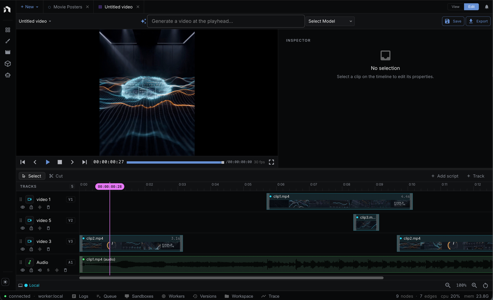

# NodeTool

**The open creative AI workspace.**

*Every model. Your keys. Your canvas.*

[](https://github.com/nodetool-ai/nodetool/stargazers)
[](https://github.com/nodetool-ai/nodetool/releases)
[](https://github.com/nodetool-ai/nodetool/releases/latest)
[](https://discord.gg/WmQTWZRcYE)
[](LICENSE.txt)

[](https://nodetool.ai)
[](https://nodetool.ai)
[](https://nodetool.ai)

NodeTool is the open-source creative AI workspace — every major model from every major provider, called with your own keys, wired into one node-based canvas you run on your machine.

Bring your own keys to FAL, KIE, Atlas, OpenAI, Anthropic, Gemini, Replicate, ElevenLabs, HuggingFace. Pay providers directly at provider prices. Switch the moment a better model ships. Wire it all into one canvas with the editing tools you rely on — masks, inpaint, outpaint, relight, upscale, layers, compositing.


## Two ways to run it

Same code, same workflows, same nodes. Pick whichever fits how you want to work — workflows are portable between both, and there is no separate "pro" or closed-source version.

- **NodeTool Studio** — desktop app for macOS, Windows, and Linux. Runs Ollama, MLX, and GGUF models on your machine. Works offline.
- **NodeTool Cloud** — open in any browser. No install, no GPU. BYOK to every provider.

Both are AGPL-3.0, both built from this repository.

|   | **NodeTool Studio** (desktop) | **NodeTool Cloud** (hosted) |
| :--- | :--- | :--- |
| **Where it runs** | Your machine | Managed servers, in any browser |
| **Install** | Desktop app + ~20GB for local models | None — sign in and start |
| **Local models** (Ollama, MLX, GGUF) | ✅ Yes — runs on your hardware | ❌ Not available — cloud APIs only |
| **BYOK cloud providers** | ✅ All providers (keys stored on disk) | ✅ All providers (keys encrypted at rest) |
| **Works offline** | ✅ Yes, fully offline with local models | ❌ Needs an internet connection |
| **Where your data lives** | On your disk only | Managed storage (encrypted) |
| **GPU required** | Recommended for local models | None |
| **Updates** | You install new releases | Always on the latest version |
| **Cost** | Free; pay only the providers you call | Subscription + your own API spend (BYOK) |
| **Source code** | AGPL-3.0 (this repo) | AGPL-3.0 (this repo) — self-host any time |

**Pick Studio if** you want to run open-weight models for free, work offline, keep data on your disk, or have a capable GPU / Apple Silicon machine.

**Pick Cloud if** you want zero setup, work across multiple devices, or don't want to manage local model files and GPU drivers.

## Why NodeTool

The best model for the job changes every month. NodeTool keeps up.

> Seedance is the best video model right now. It's available on FAL, Replicate, and KIE at different price points. NodeTool lets you pick the cheapest. When Veo 4 ships, you swap one node and you're on it the same day.

That's what vendor neutrality buys you:

- **Every model.** OpenAI, Anthropic, Gemini, FAL, KIE, Replicate, ElevenLabs, HuggingFace. Local with Ollama, MLX, and GGUF.
- **Your keys.** Pay providers directly at provider prices. No credit markup, no proprietary tokens.
- **Your canvas.** Workflows, files, and keys belong to you. Run on your machine or in the browser — your choice.
- **Open source.** AGPL-3.0. Self-host any time. No acquisition risk.

## What's in the box

| | |
| :--- | :--- |
| **Node-based canvas** | Drag-and-drop nodes with type-safe connections |
| **Image, video, audio, text** | Unified workflows across every modality |
| **Editing tools as nodes** | Mask, inpaint, outpaint, relight, upscale, layers, compositing |
| **Video editor** | Multi-track timeline — sequence, composite, and AI-generate clips, then export to MP4 |
| **Runs on your machine** | Ollama, MLX (Apple Silicon), and GGUF for local inference |
| **BYOK everywhere** | OpenAI, Anthropic, Gemini, FAL, KIE, Replicate, ElevenLabs, HuggingFace |
| **Document search** | Built-in vector store for indexing and querying your files |
| **Real-time previews** | Live output at every node as the workflow runs |
| **Custom nodes** | Extend in TypeScript or Python |
| **Deploy & scale** | Self-host with Docker; rent GPU workers (RunPod, Vast) |
| **Cross-platform** | Desktop, web, CLI, and mobile |

## What people build with it

The workspace is a canvas, not a wizard. A few of the patterns we see most often:

- **Image generation and editing** — FLUX.2, Nano Banana Pro, GPT-Image 3, plus mask, inpaint, outpaint, relight, and upscale as first-class nodes.
- **Video** — Seedance, Sora 2 Pro, Veo 3.1, Wan 2.6, Hailuo 2.3, Kling 2.6. Text-to-video, image-to-video, and video-to-video pipelines, cut together on a multi-track timeline.
- **Voice and audio** — Whisper for transcription, ElevenLabs and OpenAI TTS for speech, audio analysis and editing as nodes.
- **Document search** — point a workflow at a folder, embed it, query it. RAG without writing the plumbing.
- **Multi-step agents** — agents are a capability inside the workspace, not a separate product. Wire one into a graph when a step needs to plan, decide, or call tools.
- **Mini-apps** — share a workflow as an interactive web app others can run.

## Video editor

A generation-aware, multi-track timeline lives right next to the canvas. Drop in your own footage or bind a workflow to a clip — a text-to-image, image-to-video, or text-to-speech pipeline — and generate it in place. Change a parameter and the clip regenerates; tweak the bound workflow and the clip flags itself stale. Composite a live preview across video, audio, and overlay tracks, then export the whole sequence to MP4.



See the [Video Editor guide](https://docs.nodetool.ai/video-editor) for the full tour.

## Models

Pick a provider per node. Switch by changing one field.

| Type | Models |
| :--- | :--- |
| **Video** | Seedance, OpenAI Sora 2 Pro, Google Veo 3.1, xAI Grok Imagine, Alibaba Wan 2.6, MiniMax Hailuo 2.3, Kling 2.6 |
| **Image** | Flux, Black Forest Labs FLUX.2, Google Nano Banana Pro, GPT-Image 3 |
| **Audio** | OpenAI Whisper, OpenAI TTS, ElevenLabs |
| **Text** | GPT-4, Claude, Gemini, Llama, Mistral — local on your machine, or BYOK to the cloud |

Use `TextToVideo`, `ImageToVideo`, or `TextToImage` nodes and select your provider and model. Some models route through [kie.ai](https://kie.ai/), which combines providers and is often the cheapest path.

## How NodeTool compares

| | NodeTool | ComfyUI | Weavy | n8n |
| :--- | :--- | :--- | :--- | :--- |
| **Built for** | Creatives working with AI | Stable Diffusion power users | Creative teams (now part of Figma) | Business workflows |
| **Modalities** | Image, video, audio, text | Image, video | Image, video | Text |
| **Models** | Every major provider, BYOK | Stable Diffusion | Curated marketplace | API integrations |
| **Source & pricing** | AGPL-3.0, provider prices | Open source, free | Closed, credits | Fair-code, subscription |

**vs ComfyUI.** ComfyUI exposes every parameter for engineers who want them. NodeTool keeps the node-based power, gives it an interface that doesn't fight you, and covers the rest of the stack — video, audio, text, document search.

**vs Weavy.** Weavy was the closed-source canvas for creative AI. After the Figma acquisition, the roadmap belongs to someone else. NodeTool is the open alternative — same node-based canvas, your keys, your files, no acquisition risk.

**vs n8n.** n8n is for business workflows and API plumbing. NodeTool is built for creative work — models, masks, layers, video, audio, RAG.

## Get NodeTool

### NodeTool Studio (desktop)

| Platform | Get It | Requirements |
| :--- | :--- | :--- |
| **Windows** | [Download](https://nodetool.ai/studio) | NVIDIA GPU recommended, 4GB+ VRAM (local models), 20GB space |
| **macOS** | [Download](https://nodetool.ai/studio) | M1+ Apple Silicon, 16GB+ RAM (local models) |
| **Linux** | [Download](https://nodetool.ai/studio) | NVIDIA GPU recommended, 4GB+ VRAM (local models) |

[Flatpak CI Builds](https://github.com/nodetool-ai/nodetool/actions/workflows/flatpak-ci.yml) are available for Linux.

### NodeTool Cloud (browser)

Open [nodetool.ai/cloud](https://nodetool.ai/cloud) and sign in. Bring your own keys for every provider.

______________________________________________________________________

## Documentation

- **[Getting Started](https://docs.nodetool.ai/getting-started)** — Build your first workflow
- **[Video Editor](https://docs.nodetool.ai/video-editor)** — Sequence and AI-generate clips on a timeline
- **[Node Packs](https://docs.nodetool.ai/packs)** — Available nodes and integrations
- **[Custom Nodes](https://docs.nodetool.ai/developer/custom-nodes-guide)** — Extend NodeTool
- **[Deployment](https://docs.nodetool.ai/deployment)** — Share your work
- **[API Reference](https://docs.nodetool.ai/api)** — Programmatic access

______________________________________________________________________

## CLI & Server (npm)

Run the server, execute workflows, or chat from the terminal:

```bash
# Install globally (Node.js 22.x required)
npm install -g @nodetool-ai/cli

# Start the API server (port 7777)
nodetool serve

# Interactive chat with agent mode
nodetool-chat --agent --provider anthropic --model claude-sonnet-4-6

# Run a TypeScript DSL workflow
nodetool workflows run my-workflow.ts

# One-off without global install
npx --package=@nodetool-ai/cli nodetool serve
npx --package=@nodetool-ai/cli nodetool-chat --agent
```

See the [CLI Reference](https://docs.nodetool.ai/cli) for all commands.

______________________________________________________________________

## Architecture

NodeTool is a monorepo with a TypeScript backend, React frontend, Electron desktop shell, and React Native mobile app.

```
nodetool/
├── packages/          # Backend monorepo (55 packages)
│   ├── kernel/        #   Workflow graph & runner
│   ├── node-sdk/      #   BaseNode class & node registry
│   ├── base-nodes/    #   100+ built-in node types
│   ├── agents/        #   Agent system with task planning & tools
│   ├── runtime/       #   Processing context & model providers
│   ├── websocket/     #   HTTP + WebSocket server (entry point)
│   ├── vectorstore/   #   SQLite-vec vector database
│   ├── code-runners/  #   Sandboxed code execution
│   └── ...            #   Protocol, config, auth, storage, deploy, etc.
├── web/               # React frontend (Vite + MUI + React Flow)
├── electron/          # Electron desktop app
├── mobile/            # React Native mobile app (Expo)
└── docs/              # Jekyll documentation site
```

For a detailed architecture overview, see [ARCHITECTURE.md](ARCHITECTURE.md).

______________________________________________________________________

## Development Setup

**Prerequisites:** Node.js 22.22.1, npm. Python 3.11 with conda for Python nodes (optional).

> **Node 22.22.1 is required.** Matches Electron 39's embedded Node so dev and the packaged app run on the same Node version. Use `nvm use` to activate (reads `.nvmrc`).

### Quick Start

```bash
nvm use                    # Activate Node 22.22.1 (reads .nvmrc)
npm install
npm run build:packages     # Build all TS packages in dependency order

# Run backend (port 7777) and frontend (port 3000)
# Uses tsx --watch for the backend, so startup skips a full websocket package rebuild.
npm run dev
```

### Python Nodes (optional)

Python nodes (HuggingFace, MLX, Apple integrations) run via the `PythonStdioBridge`, which spawns a Python worker process that communicates over stdin/stdout. The bridge connects lazily on the first workflow that uses Python nodes — no separate setup is needed for the TypeScript backend.

### Electron App

```bash
npm run electron
```

The Electron app auto-detects your active Conda environment. Settings are stored in:
- **Linux/macOS**: `~/.config/nodetool/settings.yaml`
- **Windows**: `%APPDATA%\nodetool\settings.yaml`

> **Native module ABI caveat.** Electron 39 bundles its own Node.js (22.22.1) but uses a distinct `NODE_MODULE_VERSION` (140), so native modules like `better-sqlite3` must be compiled against Electron's headers — *not* system Node, even when the major matches. This is handled automatically by `@electron/rebuild`, wired into `electron/`'s `postinstall`. If you ever see a `NODE_MODULE_VERSION` mismatch, force a rebuild:
>
> ```bash
> npm --prefix electron run postinstall
> ```
>
> **Do not** use plain `npm rebuild` — it compiles against system Node's ABI, which will not match Electron's runtime.

### Mobile App

```bash
cd mobile && npm install && npm start
```

See [mobile/README.md](mobile/README.md) for full setup.

### Make Commands

| Command | Description |
| :--- | :--- |
| `npm install` | Install all dependencies |
| `npm run build` | Build all packages + web |
| `npm run dev` | Start backend (`tsx --watch`) + web dev server |
| `npm run electron` | Build and start Electron app |
| `npm run check` | Run typecheck + lint + test |
| `npm run test` | Run all tests |

______________________________________________________________________

## Testing

```bash
# Unit tests
cd electron && npm test && npm run lint
cd web && npm test && npm run lint

# Web E2E (needs backend on port 7777)
cd web && npx playwright install chromium && npm run test:e2e

# Electron E2E (requires xvfb on Linux headless)
cd electron && npm run vite:build && npx tsc
cd electron && npx playwright install chromium && npm run test:e2e
```

For detailed testing documentation, see [web/TESTING.md](web/TESTING.md).

______________________________________________________________________

## Contributing

We welcome bug reports, feature requests, code contributions, and new nodes.

Please open an issue before starting major work so we can coordinate.

### Acknowledgements

- [@mphermes](https://github.com/mphermes) — Atlas Cloud integration

## License

[AGPL-3.0](https://github.com/nodetool-ai/nodetool/blob/main/LICENSE)

## Get in Touch

- **General**: [hello@nodetool.ai](mailto:hello@nodetool.ai)
- **Team**: [matti@nodetool.ai](mailto:matti@nodetool.ai), [david@nodetool.ai](mailto:david@nodetool.ai)

[GitHub](https://github.com/nodetool-ai/nodetool) | [Discord](https://discord.gg/WmQTWZRcYE) | [Website](https://nodetool.ai)

## Star History

[](https://www.star-history.com/#nodetool-ai/nodetool&type=date&legend=top-left)
