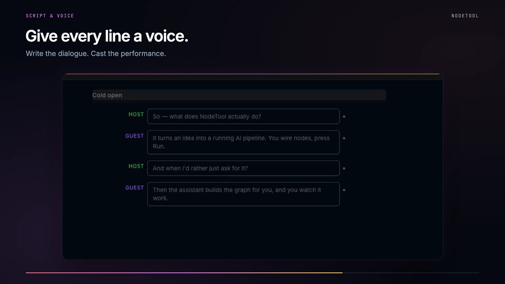
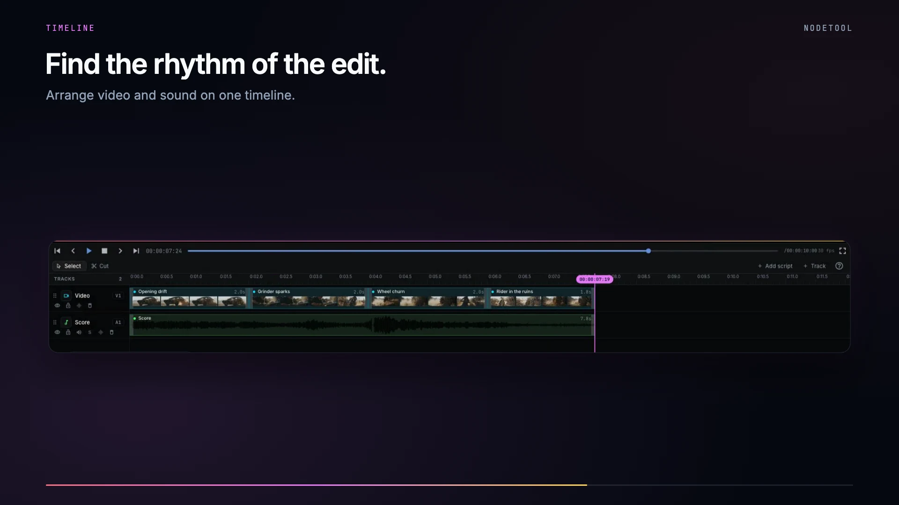
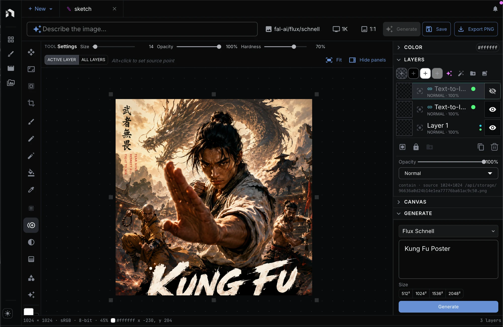
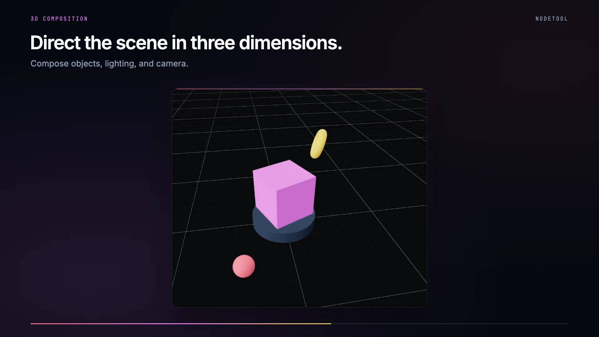
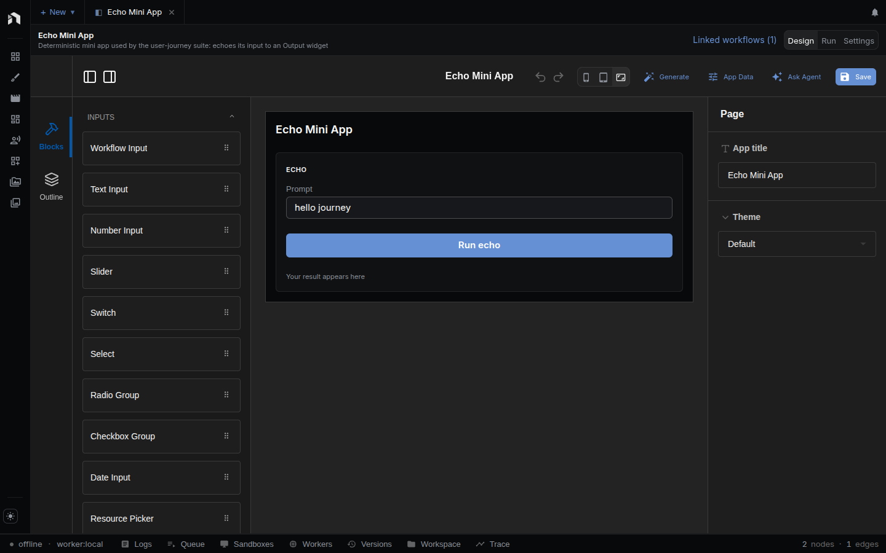

# NodeTool

[](https://github.com/nodetool-ai/nodetool/stargazers)
[](https://github.com/nodetool-ai/nodetool/releases)
[](https://github.com/nodetool-ai/nodetool/releases/latest)
[](https://discord.gg/WmQTWZRcYE)
[](LICENSE.txt)
[](https://www.atlascloud.ai/?ref=PW9AD2)


**You are the director. The agent is your crew.**

NodeTool is an open-source AI film studio. Describe your idea. The agent writes the script, storyboards every scene, generates the footage, and cuts the timeline. What comes back is a project, not a render: re-roll one shot, re-voice one line, re-cut the ending.

Runway, LTX Studio, Figma Weave and the rest will generate your trailer too. On their model list, priced in their credits, saved in a project only their app opens. When they raise the price or drop the model, the film goes with it. NodeTool hands the project back, on your keys.

* **01 / Pitch.** Tell the agent your concept, style, and tone. It drafts the script, casts the voices, and sets the visual direction. Prefer to wire it yourself? It is the same canvas.
* **02 / Automate.** The agent storyboards scenes, generates the footage, syncs the audio, and cuts it together on a multi-track timeline, running on your own accounts at provider list prices.
* **03 / Direct.** Jump in at any moment. Swap a voice take, re-roll a clip, or trim frames. The agent builds the foundation. You make the final cut.

## Get NodeTool

| Platform | Get it | Requirements |
| :--- | :--- | :--- |
| **macOS** | [Download Studio](https://nodetool.ai/studio) | macOS 13+, Apple Silicon or Intel, 8GB+ RAM |
| **Windows** | [Download Studio](https://nodetool.ai/studio) | Windows 10+, 8GB+ RAM, 20GB space |
| **Linux** | [Download Studio](https://nodetool.ai/studio) | Ubuntu 22+, 8GB+ RAM |

**Studio** is the full product, and it is free. It keeps your project files, your model library, and your keys on disk, and it runs offline. Language and image models run on your own machine through MLX, Ollama, and llama.cpp. Every major provider runs on your own keys.

**[Cloud](https://nodetool.ai/cloud)** is the same studio in a browser, in alpha, with nothing to install.

[Flatpak CI builds](https://github.com/nodetool-ai/nodetool/actions/workflows/flatpak-ci.yml) are available for Linux. Developers can skip the installer and [run from source](#development-setup).

## Four jobs a team runs every week

Each recipe is a real run against live models: what you end up holding, who it is for, the models the shipped chain calls, and every workflow in it as one `.nodetool` bundle you open in the studio. Each runs on your keys, at provider list prices.

| Recipe | What you end up holding | Who it is for | Models the shipped chain calls |
| :--- | :--- | :--- | :--- |
| **[Viral Video Ad Engine](https://nodetool.ai/recipes/viral-video-ad-engine)** | A vertical product ad, plus the hook lines and thumbnails to test it against. | Performance and social teams shipping several ad variants a week. | GPT-5 mini, FLUX.1 Schnell, Kling 2.6 |
| **[Multilingual Video Dubber](https://nodetool.ai/recipes/multilingual-video-dubber)** | One presenter clip, spoken in a second language, with a lip-synced cut, subtitles, and a back-translation to check it. | Anyone re-releasing a recorded talk, demo, or ad into another market. | GPT-4o mini Transcribe, GPT-5 mini, OpenAI TTS, Inworld TTS, Sync Lipsync |
| **[E-commerce SKU Visual Factory](https://nodetool.ai/recipes/ecommerce-sku-visual-factory)** | One packshot per SKU becomes the whole channel set: cutout, studio scene, seasonal relight, turntable clip, print master, and the listing copy. | Catalogue and marketplace teams with more SKUs than shoot days. | Bria background removal, Nano Banana, image relighting, LTX 2.3, Clarity upscaler, GPT-5 mini |
| **[Storyboard to Trailer](https://nodetool.ai/recipes/storyboard-to-trailer)** | A logline becomes a beat sheet, a numbered shot list, a cut teaser, and a score under it. | Directors, agencies, and anyone pitching a film that does not exist yet. | GPT-5 mini, Gemini 3.1 Pro, GPT Image 2, Veo 3.1, Stable Audio 2.5 |

The bundles are at [nodetool.ai/recipes](https://nodetool.ai/recipes), with a contact sheet from each run. The [showcase](https://nodetool.ai/showcase) and the [template gallery](https://nodetool.ai/templates) hold the single workflows the recipes chain.

## One canvas, pitch through final cut

Five surfaces share one studio, so a piece never leaves it to be finished. An agent drives every one of them through the same actions you have.

### Storyboard


Board the film shot by shot. Generate cheap stills first to lock the look, then pay to animate only the shots you approved.

Pitch a concept and a visual style, pick a shot count, and press **Direct**: the Director node returns a typed screenplay, one structured shot per card with action, camera, motion, and duration, plus the logline, style bible, narration, and music direction.

* **Cheap stages first.** A still costs cents, a clip costs dollars. Generate stills until one looks right, pick it, and only then generate the clip.
* **Revise one shot, not the reel.** "Make it darker, add rain" runs video-to-video on the existing clip and swaps the result in place. Fixing shot 3 never re-rolls shots 1 to 5.
* **Entities keep the cast steady.** Characters, locations, styles, and props are named objects whose canonical descriptor is pasted verbatim into every prompt that names them.
* **Assemble the cut.** One click lays the rendered shots onto a timeline with narration and music tracks. Every clip stays linked to its shot, so a later revision replaces the clip in the saved cut.

Agents drive the same board through the `ui_storyboard_*` tools, or headlessly with `render_storyboard_stills`, `render_storyboard_clips`, and `assemble_storyboard_timeline`.

[Creative agent guide →](https://docs.nodetool.ai/creative-agent)

### Script and voice



Draft the dialogue, cast a voice per character, and audition alternate line readings. Change the words and the take flags itself stale, so you see exactly what still needs voicing.

* **Cast a voice per character.** Each speaker carries a provider, model, and voice. Every line inherits it unless you override the line.
* **Takes, not overwrites.** Voicing a line saves a take with its own word timings. Audition several, keep the one you want.
* **Send it to a timeline.** The current takes assemble into a sequence end to end, word timings riding along as captions.

An agent does the same without the editor open: `voice_script_lines` voices every draft or stale line with its cast voice, and `assemble_script_timeline` cuts the result into a saved sequence that `validate_timeline` then checks.

### Timeline



Arrange, trim, and layer generated video and audio across multiple tracks, down to the frame and the stem. The agent edits the same document when you ask it to tighten the opening.

Drop in your own footage or bind a workflow to a clip (text-to-image, image-to-video, or text-to-speech) and generate it in place. Change a parameter and the clip regenerates. Tweak the bound workflow and the clip flags itself stale. Export the sequence to MP4.

[Video editor guide →](https://docs.nodetool.ai/video-editor)

### Sketch



Sketch, paint with brushes, and blend hand-drawn elements with AI-generated layers. Bind a layer to a prompt and regenerate that layer alone.

Build a composition in layers with blend modes and masks, then bind a layer to a model or one of your own workflows and generate where you are painting. Change a prompt or an upstream input and the layer flags itself stale. The node hands the rest of the workflow a flattened image, a mask, and per-layer outputs, so it pairs with the editing nodes (mask, inpaint, outpaint, compositing) for sketch-then-generate pipelines.

[Sketch editor guide →](https://docs.nodetool.ai/sketch-editor)

### 3D



Place primitives and lights in a glTF scene by hand or by tool call. The same operations run headlessly, so a scene is reproducible. Capture a view as a depth or composition reference for an image or video model.

Agents get `create_model3d`, `get_model3d`, `edit_model3d`, `validate_model3d`, and `render_model3d` with no editor open.

## Your keys, your project file, your models

* **Bring your own keys.** Connect directly to OpenAI, Anthropic, Gemini, FAL, KIE, Replicate, and the specialized video models. Your keys stay on your disk in Studio, encrypted in Cloud.
* **No markups.** If an image costs $0.03 at the provider, you pay $0.03 to the provider. NodeTool takes no cut.
* **Open source, end to end.** AGPL-3.0. Read it, fork it, host it.
* **A project file that opens anywhere.** The board, the script with its takes, and the multi-track cut are ordinary files on your disk. Export a `.nodetool` bundle and open it on another machine, or in a fork.

When a better model ships, add it the day it ships. No roster has to catch up first.

## How NodeTool compares

The comparison is against the closed AI studios (Runway, LTX Studio, Figma Weave), because that is what a production team is choosing between.

| | NodeTool | Closed AI studios |
| :--- | :--- | :--- |
| **Models** | Every major provider, switched in one click | The list they picked |
| **When a better model ships** | Add it the day it ships | Wait for them to add it |
| **What you pay** | Provider list prices, on your own keys | Their credits |
| **What you keep** | The board, the takes, and the multi-track cut as an editable project | An exported video. The project stays in their app. |
| **Source** | Open, AGPL-3.0 | Closed |
| **Where it runs** | Desktop app and browser, self-host any time | Their servers only |

Choosing against a node tool instead? See [ComfyUI](https://nodetool.ai/alternatives/comfyui) and [Figma Weave](https://nodetool.ai/alternatives/figma-weave).

## The agent

Most tools bolt a chat panel onto an editor. NodeTool built the editors around the agent. The entire studio is the toolbelt. Every surface hands the agent the same actions you have: wire a graph, paint a layer, cut a clip, revise a shot, or voice a line.

* **Build workflows.** Describe the pipeline. The agent picks the nodes, wires the edges, and validates the graph. What it leaves behind is a workflow you own and control.
* **Build apps.** Ask for a custom UI. The agent plans the workflow, places widgets, and replays interactions. A separate judge model grades the result. No passing verdict, no app.
* **Repair on the fly.** Put an agent on the failure path. It decides whether to retry, repair, skip, or stop, strictly within the cost budget you set.
* **Bring your own agent.** The toolbelt is exposed over MCP. Point Claude Desktop, Claude Code, or Codex at the local server to drive the studio.

```bash
nodetool mcp install                  # wire NodeTool into Claude Code / Codex / OpenCode
npm run build:mcpb                    # → dist/nodetool.mcpb for Claude Desktop
```

Under the hood: a planner turns an objective into a DAG of steps, executors walk it in parallel, and every LLM call emits an OpenTelemetry span with tokens and cost. See the [agent guide](https://docs.nodetool.ai/agents/) and [docs/AGENTS.md](docs/AGENTS.md).

## What is underneath

The film surfaces sit on a node canvas, and everything on it is reachable without the film.

| | |
| :--- | :--- |
| **Node canvas** | Drag-and-drop nodes with type-safe connections. Live output at every step. |
| **Mini apps** | Give a workflow a screen: inputs, a Run button, a place for the result. Hand it to a teammate who never sees the canvas. |
| **Editing tools as nodes** | Mask, inpaint, outpaint, relight, upscale, layer, and composite. |
| **Every modality** | Image, video, audio, and text in one workflow. |
| **Every major provider** | OpenAI, Anthropic, Gemini, FAL, KIE, Replicate, ElevenLabs, HuggingFace, plus one node for every model on Replicate, fal.ai, and KIE. |
| **Open weights** | Ollama, MLX (Apple Silicon), and GGUF on your own hardware. |
| **Document search** | Index and query your files with the built-in vector store. |
| **JS scripts** | Versioned JavaScript documents with ports, tests, and a sandbox. |
| **MCP server** | Point Claude Desktop, Claude Code, Codex, or any MCP agent at the toolbelt. |
| **Custom nodes** | Extend in TypeScript or Python. |
| **Deploy and scale** | Self-host with Docker. Rent GPU workers on RunPod or Vast. |
| **Cross-platform** | macOS, Windows, and Linux. |

### Node canvas


Chain steps and wire the graph. Connector handles are color-coded and type-safe, and live output renders at every node as the workflow runs. Double-click to search and add a node, or drag a connection into empty space to see compatible next steps. The editor refuses a mismatch, so an image cannot land in a text field. Tweak properties on a node, group them, or bypass one to test a variation.

[Getting started guide →](https://docs.nodetool.ai/getting-started)

### Mini apps and app builder



A workflow is a graph. A mini app is the interface on top of it. Drag fields, buttons, and result displays onto a screen, wire each one to an input or output, declare which operations a click starts, and publish a version that pins the workflows behind it. Results stream into the widgets as the run happens, and the graph stays underneath, editable. An operation can run a [JS script](docs/js-script-document-design.md) instead of a workflow, for the ten lines of glue that do not deserve a graph.

Agents build them end to end. `nodetool app build` runs six stages (spec, plan, author, check, run, judge) and hands back a bundle only when the app's interactions do what the prompt asked. The judge is a second model, configured apart from the builder, because a model grading its own work is the weakest reviewer available:

```bash
nodetool app build "an app that drafts a note from a prompt" -p anthropic -m claude-sonnet-5
nodetool app debug <application_id>    # headless: validate bindings, replay interactions
```

Export an app as one `.json` bundle, the document plus the full graph of every workflow it binds, and import it anywhere.

[App builder guide →](https://docs.nodetool.ai/app-builder) ·
[Mini apps guide →](https://docs.nodetool.ai/mini-apps)

### JS scripts

Ten lines of JavaScript instead of a node graph. Reshape an API response, merge two lists, format a date. A JS script is a named, versioned document for exactly that: a body with declared input and output ports, the secrets it may read, a timeout, and saved test cases. It opens in its own tab with a code editor and an assistant panel beside it.

* **Runs in the sandbox.** A QuickJS guest that starts with nothing. `fetch` and the workspace are capabilities the host grants, under a per-run cap and an SSRF guard. Every installed sandbox pack (date-fns, papaparse, cheerio, exceljs, pdf-lib, and thirty more) resolves by import.
* **Reusable.** Call it from a mini app as an operation, link it as a Code node's body, invoke it from an agent, or compose it from another script.
* **Tested like code.** Save cases with inputs and expected outputs. `nodetool jsscript test` grades them and exits non-zero on a failure. Version history is per script, with restore.

```bash
nodetool jsscript validate my-script.json
nodetool jsscript run my-script.json --inputs '{"numbers":[1,2,3]}'
nodetool jsscript test <id>
```

Agents get the same surface through `list_js_scripts`, `save_js_script`, `run_js_script`, and `test_js_script`. See [docs/js-script-document-design.md](docs/js-script-document-design.md) and the [JavaScript sandbox](docs/javascript-sandbox.md).

## Documentation

- **[Getting Started](https://docs.nodetool.ai/getting-started)** — Build your first workflow
- **[Agents](https://docs.nodetool.ai/agents/)** — Let an agent build, run, and repair your workflows
- **[Mini Apps](https://docs.nodetool.ai/mini-apps)** — Wrap a workflow in an interface
- **[App Builder](https://docs.nodetool.ai/app-builder)** — Place widgets, wire them to a workflow, publish
- **[Creative Agent](https://docs.nodetool.ai/creative-agent)** — Storyboard a film, gate the spend, assemble the cut
- **[JavaScript Sandbox](https://docs.nodetool.ai/javascript-sandbox)** — What JS scripts and Code nodes can reach
- **[Video Editor](https://docs.nodetool.ai/video-editor)** — Sequence and generate clips on a timeline
- **[Sketch Editor](https://docs.nodetool.ai/sketch-editor)** — Draw, mask, and generate on a layered canvas
- **[Node Packs](https://docs.nodetool.ai/packs)** — Available nodes and integrations
- **[Custom Nodes](https://docs.nodetool.ai/developer/custom-nodes-guide)** — Extend NodeTool
- **[Provider Guides](https://docs.nodetool.ai/developer/providers/)** — Add new models & nodes for any provider
- **[Deployment](https://docs.nodetool.ai/deployment)** — Share your work
- **[API Reference](https://docs.nodetool.ai/api)** — Programmatic access

______________________________________________________________________

# For developers

## CLI & Server (npm)

Run the server, execute workflows, drive agents, or chat from the terminal.

```bash
# Install globally (Node.js 22.x required)
npm install -g @nodetool-ai/cli

# Start the API server (port 7777)
nodetool serve

# Interactive chat — every session runs the agent loop
nodetool-chat --provider anthropic --model claude-sonnet-5

# Run a TypeScript DSL workflow
nodetool workflows run my-workflow.ts

# Put an agent on the failure path
nodetool workflows run <id> --supervise --supervisor-cost-cap 0.25

# Have an agent build and verify a mini app
nodetool app build "summarize a PDF into bullet points" -p anthropic -m claude-sonnet-5

# Run a JS script's saved test cases
nodetool jsscript test my-script.json

# Expose the toolbelt to Claude Code, Codex, or OpenCode over MCP
nodetool mcp install

# One-off without global install
npx --package=@nodetool-ai/cli nodetool serve
npx --package=@nodetool-ai/cli nodetool-chat
```

Every surface runs headlessly, so an agent checks its own work:
`nodetool validate` (static graph check), `nodetool debug` (run a workflow and
read a verdict), `nodetool app debug` (replay an app's interactions),
`nodetool node run` (one node in isolation), and `nodetool eval` (score the
planning and tool-calling loops against any provider).

See the [CLI Reference](https://docs.nodetool.ai/cli) for all commands.

______________________________________________________________________

## Architecture

NodeTool is a monorepo: TypeScript backend, React frontend, Electron desktop shell, React Native mobile app.

```
nodetool/
├── packages/          # Backend monorepo (TypeScript)
│   ├── kernel/        #   Workflow graph & runner
│   ├── node-sdk/      #   BaseNode class & node registry
│   ├── base-nodes/    #   Built-in node types
│   ├── agents/        #   Planning agents, the editor toolbelt, app build harness
│   ├── runtime/       #   Processing context & model providers
│   ├── websocket/     #   HTTP + WebSocket server (entry point)
│   ├── vectorstore/   #   SQLite-vec vector database
│   └── ...            #   Protocol, config, auth, storage, deploy, etc.
├── web/               # React frontend (Vite + MUI + React Flow)
├── electron/          # Electron desktop app
├── mobile/            # React Native mobile app (Expo)
└── docs/              # Jekyll documentation site
```

See [ARCHITECTURE.md](ARCHITECTURE.md) for the detailed breakdown.

______________________________________________________________________

## Development Setup

**Prerequisites:** Node.js 22.22.1, npm. Python 3.11 with conda for Python nodes (optional).

> **Node 22.22.1 is required.** Matches Electron 39's embedded Node so dev and the packaged app run on the same Node version. Use `nvm use` to activate (reads `.nvmrc`).

### Quick Start

```bash
./start.sh          # API server on http://localhost:7777
./start.sh full     # API + web UI on http://localhost:3000
```

That's the whole setup. On first run `start.sh` checks your Node version, copies
`.env.example` to `.env`, installs dependencies, rebuilds the native SQLite
module, and builds the backend packages, then starts the server. Every run
after skips straight to starting it. Other modes:

```bash
./start.sh web      # web UI only
./start.sh check    # typecheck + lint + test
./start.sh doctor   # report what's set up and what isn't
PORT=8080 ./start.sh
```

<details>
<summary>Doing it by hand</summary>

```bash
nvm use                    # Activate Node 22.22.1 (reads .nvmrc)
npm install
npm run build:packages     # Build all TS packages in dependency order

# Run backend (port 7777) and frontend (port 3000)
# Uses tsx --watch for the backend, so startup skips a full websocket package rebuild.
npm run dev
```

`npm run build:packages` is not optional on a fresh checkout: `base-nodes` and
the other decorator packages resolve from `dist/`, so until it has run once the
server starts with no node types registered.

</details>

### Working with Claude Code

The repo ships a starter kit in [`.claude/`](.claude/README.md): a SessionStart
hook that installs dependencies in web sessions, slash commands (`/serve`,
`/verify`, `/onboard`), and NodeTool skills covering workflow building,
custom nodes, the API, deployment, and troubleshooting.

### Python Nodes (optional)

Python nodes (HuggingFace, MLX, Apple integrations) run via the `PythonStdioBridge`, which spawns a Python worker process that communicates over stdin/stdout. The bridge connects lazily on the first workflow that uses Python nodes. No separate setup for the TypeScript backend.

### Electron App

```bash
npm run electron
```

The Electron app auto-detects your active Conda environment. Settings are stored in:
- **Linux/macOS**: `~/.config/nodetool/settings.yaml`
- **Windows**: `%APPDATA%\nodetool\settings.yaml`

> **Native module rebuild.** The backend always runs on vanilla Node (system Node in dev, the bundled Node 22.x in prod — same ABI), so the one source-built native module, `better-sqlite3`, is compiled against **Node** headers. This runs automatically from the root `postinstall` (`electron/scripts/rebuild-native.mjs`) after `npm install`/`npm ci` finishes, so a clean checkout builds in a single command. If you see a `NODE_MODULE_VERSION` mismatch, force a rebuild:
>
> ```bash
> npm run rebuild:native
> ```

### Mobile App

```bash
cd mobile && npm install && npm start
```

See [mobile/README.md](mobile/README.md) for full setup.

### Common Commands

| Command | Description |
| :--- | :--- |
| `npm install` | Install all dependencies |
| `npm run build` | Build all packages + web |
| `npm run dev` | Start backend (`tsx --watch`) + web dev server |
| `npm run electron` | Build and start Electron app |
| `npm run check` | Workspace/lockfile/boundary checks, build:packages, typecheck, lint, test:packages, test |
| `npm run test` | Run the web, electron, and mobile tests |
| `npm run test:packages` | Run the backend package tests |

______________________________________________________________________

## Testing

```bash
# Unit tests
cd electron && npm test && npm run lint
cd web && npm test && npm run lint

# Web E2E (needs backend on port 7777)
cd web && npx playwright install chromium && npm run test:e2e
```

Electron has no Playwright suite. `cd electron && npm test` runs its Jest tests.

For detailed testing documentation, see [web/TESTING.md](web/TESTING.md).

______________________________________________________________________

## Contributing

We welcome bug reports, feature requests, code contributions, and new nodes.

Open an issue before starting major work so we can coordinate.

### Acknowledgements

- [@mphermes](https://github.com/mphermes) — Atlas Cloud integration

## License

[AGPL-3.0](https://github.com/nodetool-ai/nodetool/blob/main/LICENSE.txt)

## Get in Touch

- **General**: [hello@nodetool.ai](mailto:hello@nodetool.ai)
- **Team**: [matti@nodetool.ai](mailto:matti@nodetool.ai), [david@nodetool.ai](mailto:david@nodetool.ai)

[GitHub](https://github.com/nodetool-ai/nodetool) | [Discord](https://discord.gg/WmQTWZRcYE) | [Website](https://nodetool.ai)

## Star History

[](https://www.star-history.com/#nodetool-ai/nodetool&type=date&legend=top-left)
