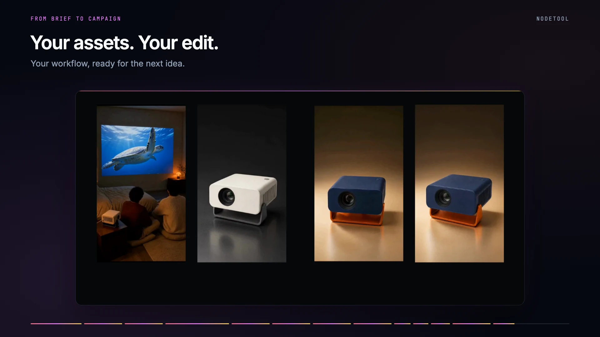
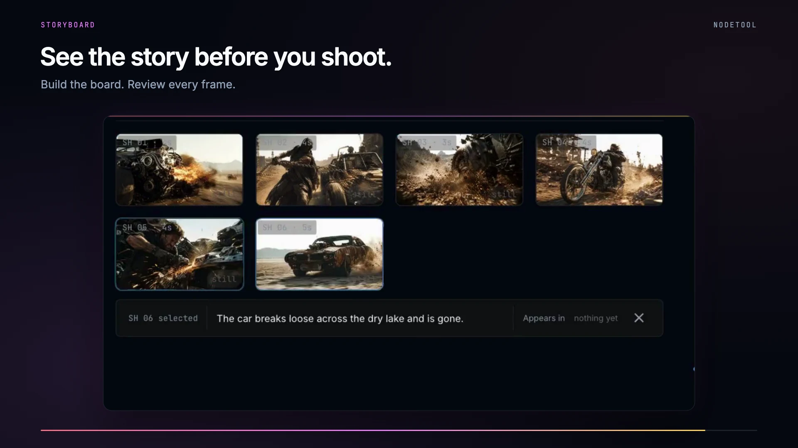
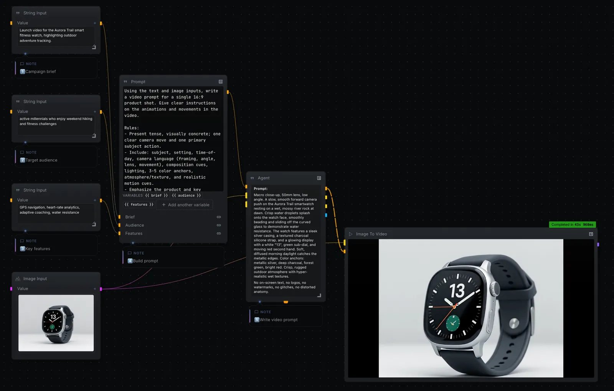

# NodeTool

[](https://github.com/nodetool-ai/nodetool/stargazers)
[](https://github.com/nodetool-ai/nodetool/releases)
[](https://github.com/nodetool-ai/nodetool/releases/latest)
[](https://discord.gg/WmQTWZRcYE)
[](LICENSE.txt)
[](https://www.atlascloud.ai/?ref=PW9AD2)

**Open-source creative AI workspace**

Create and edit images, video, audio, and text with agents that work alongside you.
Let them build and revise workflows, then inspect and edit the results yourself. Your
project keeps the brief, assets, and edits together.

**[Download NodeTool Studio](https://github.com/nodetool-ai/nodetool/releases/latest)** ·
**[Quick start](#first-run-in-studio)** ·
**[Documentation](https://docs.nodetool.ai/)** · **[MCP setup](#mcp)** ·
**[Contribute](#contributing)**



## Why NodeTool

- Inspect intermediate results, swap a model, and rerun the changed part of a
  workflow. Agents can wire the graph, run it, and repair failures within the
  limits you set.
- Keep the graph, inputs, assets, and edits together in your project. Export
  `.nodetool` bundles to reopen in another NodeTool installation.
- Run repeatable workflows from the studio, CLI, or an external agent through
  [MCP](#mcp).

Studio is free and runs on macOS, Windows, and Linux. Cloud model requests go
to the provider you connect, billed to your account at provider rates. Local
models run through supported engines such as Ollama, MLX, and llama.cpp, with
hardware requirements that depend on the model. Offline work requires local
models and assets. [NodeTool Cloud](https://nodetool.ai/cloud) is in alpha and uses
hosted storage and cloud providers rather than your machine's local models.

## First run in Studio

1. Download the [latest release](https://github.com/nodetool-ai/nodetool/releases/latest)
   for your operating system and install it. See the
   [installation guide](docs/installation.md) for requirements and per-OS steps.
2. Open Studio and press **+** on the workspace tab bar, then choose
   **New storyboard…**.
3. Choose the **Lighthouse Keeper** opening, listed as **already rendered**.
   Open its shot cards to inspect the existing images and clips.
4. Press **Preview**, then play the board to watch its shots in sequence.
   Exploring this example does not require a provider key or new generation.

Connect providers through **Settings → Models & Providers** when you are ready
to generate new media. Cloud generation uses paid provider calls and needs no
GPU.

## From brief to editable film

Write a brief and ask the agent for a storyboard. Approve the stills before
spending on video generation, then assemble the clips on a timeline. Trim and
reorder the cut, add narration, and export an MP4. Revise an individual shot
without regenerating the rest of the film.



The [film quick start](docs/getting-started.md) walks through each step,
including model setup and export.

## Recipes

These recipes link to downloadable workflows and describe their outputs and
limitations. Whether the result is an editable timeline or an exported video
depends on the workflow you choose.

| Example | Output | Link |
| --- | --- | --- |
| Viral video ad | Vertical product ad, hooks, and thumbnails | [Open recipe](https://nodetool.ai/recipes/viral-video-ad-engine) |
| Multilingual dub | Lip-synced presenter clip with subtitles | [Open recipe](https://nodetool.ai/recipes/multilingual-video-dubber) |
| SKU visual set | Packshot cutout, scenes, relight, and listing copy | [Open recipe](https://nodetool.ai/recipes/ecommerce-sku-visual-factory) |
| Storyboard to trailer | Beat sheet, shot list, teaser, and score | [Open recipe](https://nodetool.ai/recipes/storyboard-to-trailer) |

The [recipe gallery](https://nodetool.ai/recipes) has the model chain and
contact sheet for each run.

## Agents and workflows

Beyond the film workflow, the studio supports:

- image generation and editing, audio and speech, video, and text
- storyboards, scripts, and multi-track timelines
- JavaScript scripts and mini apps on top of a workflow
- custom TypeScript and Python nodes
- local inference or provider APIs, where the relevant model is available

Read the [Creative Agent guide](https://docs.nodetool.ai/creative-agent),
[Video Editor guide](https://docs.nodetool.ai/video-editor), and
[Sketch Editor guide](https://docs.nodetool.ai/sketch-editor).



## MCP

The installed CLI registers NodeTool's local toolbelt with Claude Code, Codex,
or OpenCode:

```bash
npm install -g @nodetool-ai/cli
nodetool mcp install
```

For Claude Desktop, build the source MCP bundle after installing dependencies
and building packages:

```bash
npm run build:mcpb
# writes dist/nodetool.mcpb
```

The MCP server can drive workflows and creative editing surfaces. See the
[MCP production guide](docs/mcp-production.md) and
[agent architecture](docs/AGENTS.md).

## First run from source

This deterministic example uses the repository's
[`hello_input_output_cli.json`](examples/workflows/hello_input_output_cli.json)
template. It does not call a model, so it needs no API key:

```bash
git clone https://github.com/nodetool-ai/nodetool.git
cd nodetool
nvm use                         # Requires nvm and Node.js 22.22.1
npm install
npm run build:packages
npm run workflow -- ./examples/workflows/hello_input_output_cli.json \
  --input text='hello from NodeTool'
```

The input node named `text` connects to a `Reroute` output node. The command's
JSON summary includes `hello from NodeTool` in its outputs. Change the `text`
input and run it again to see the new value. See
[`examples/workflows/README.md`](examples/workflows/README.md) for more
examples and expected behavior.

To run an agent or a model-backed workflow, configure a provider first. For
example, obtain an OpenAI key, export it in the shell, and use the checked-in
OpenAI example:

```bash
export OPENAI_API_KEY='your-key'
npm run workflow -- ./examples/workflows/agent_openai_basic_cli.json \
  --input prompt='Write one sentence about workflow testing.'
```

This makes a paid provider request. The example selects GPT-4o. Access and
billing depend on your provider account. See
[Models and Providers](docs/models-and-providers.md) and
[Provider Guides](https://docs.nodetool.ai/developer/providers/) for other
providers and local setup. Do not add a key to a committed file.

## CLI

Install the CLI as shown in [MCP](#mcp), using Node.js 22.22.1. The
[CLI package guide](packages/cli/README.md) covers running workflows with the
installed command.

To serve the API, run `nodetool serve` in a separate terminal. Commands that
support remote execution accept `--api-url` or `NODETOOL_API_URL`.
For interactive agent chat, connect a provider first as described in the
[CLI package guide](packages/cli/README.md), then run `nodetool-chat`.

See the [CLI reference](https://docs.nodetool.ai/cli) and
[CLI package guide](packages/cli/README.md). A one-off install is available with
`npx --package=@nodetool-ai/cli nodetool --help`.

## Development setup

After the [source quick start](#first-run-from-source), start the API and web
UI from the prepared checkout:

```bash
npm run dev
```

For an automatic install, build, and launch from a fresh checkout, use
`./start.sh full`. To start only the API, use `./start.sh`; to inspect the
environment without changing it, use `./start.sh doctor`.
These commands do not launch the Electron desktop app.

In a separate terminal, launch the desktop shell with `npm run electron` from
the prepared checkout. Node.js 22.22.1 is pinned in
[`.nvmrc`](.nvmrc). Python 3.11 and conda are optional, for Python nodes. For
locked-down environments or missing WebGPU, see [development environment](docs/dev-environment.md).

## Testing

After a code change, run these four repository-root checks from the commands in
[`AGENTS.md`](AGENTS.md):

```bash
npm run test:affected
npm run typecheck
npm run lint
npm run dev:nodetool -- harness gate --base origin/main
```

The web testing guide is at [`web/TESTING.md`](web/TESTING.md). The complete
repository gate is `npm run check`.

## Project layout

| Path | Purpose |
| --- | --- |
| [`packages/`](packages/) | TypeScript runtime, workflow kernel, agents, providers, and nodes |
| [`web/`](web/) | React web UI |
| [`electron/`](electron/) | Desktop Studio shell |
| [`mobile/`](mobile/) | React Native app |
| [`docs/`](docs/) | Documentation and development guides |
| [`examples/workflows/`](examples/workflows/) | Runnable workflow examples |

## Contributing

Read [`AGENTS.md`](AGENTS.md) and the
[development standards](docs/DEVELOPMENT_STANDARDS.md), then open an issue for
larger changes. Pull requests for bug fixes, nodes, providers, workflows, and
documentation are welcome. Run the narrowest relevant checks before opening a
PR and include the command results.

## License and community

NodeTool is licensed under [AGPL-3.0](LICENSE.txt).

[GitHub](https://github.com/nodetool-ai/nodetool) ·
[Discord](https://discord.gg/WmQTWZRcYE) · [Website](https://nodetool.ai)
