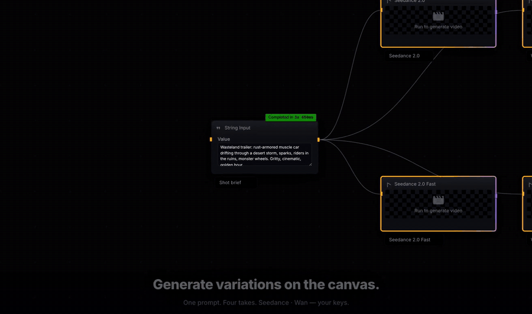

# NodeTool

**The open-source, agent-first creative workspace.**

*Every model. Your keys. Your canvas.*

[](https://github.com/nodetool-ai/nodetool/stargazers)
[](https://github.com/nodetool-ai/nodetool/releases)
[](https://github.com/nodetool-ai/nodetool/releases/latest)
[](https://discord.gg/WmQTWZRcYE)
[](LICENSE.txt)

[](https://nodetool.ai/studio)
[](https://nodetool.ai/studio)
[](https://nodetool.ai/studio)
[](https://www.atlascloud.ai/?ref=PW9AD2)

NodeTool is an open-source creative AI suite that runs on your machine. A
node-based canvas, a multi-track video timeline, and a layered sketch editor
share one workspace, and every major AI model, cloud or local, wires into all
three.

It is agent-first: every action you can take in the UI is also an agent tool,
so an agent can wire a graph, paint a layer, cut a clip, or place a widget on
the same surfaces you use, then run the result and repair what fails.



## Get NodeTool

| Platform | Get it | Requirements |
| :--- | :--- | :--- |
| **macOS** | [Download Studio](https://nodetool.ai/studio) | macOS 13+, Apple Silicon or Intel, 8GB+ RAM |
| **Windows** | [Download Studio](https://nodetool.ai/studio) | Windows 10+, 8GB+ RAM, 20GB space |
| **Linux** | [Download Studio](https://nodetool.ai/studio) | Ubuntu 22+, 8GB+ RAM |

**Studio** is the free desktop app. Workflows, keys, and files stay local; it
runs offline against Ollama, MLX, or GGUF models, and connects to cloud
providers when you give it a key.

No GPU is needed to start: with a provider key the models run on their servers.
A GPU only matters once you want inference on your own machine.

[Flatpak CI builds](https://github.com/nodetool-ai/nodetool/actions/workflows/flatpak-ci.yml)
are available for Linux. Developers can skip the installer and
[run from source](#development-setup).

## What you can build

* **[Movie trailer](https://nodetool.ai/use-cases/movie-trailer)** — one logline
  becomes a storyboard, key art per shot, animated clips, and a cut trailer.
* **[Product video](https://nodetool.ai/use-cases/product-video)** — a campaign
  brief and one product photo become a 16:9 spot, directed by an agent and
  rendered by a text-to-video model.
* **[Poster concepts](https://nodetool.ai/use-cases/movie-poster)** — a title,
  genre, and audience become a creative strategy and a batch of poster
  concepts, tagline and billing block included.

More in the [showcase](https://nodetool.ai/showcase) and the
[template gallery](https://nodetool.ai/templates).

## Why NodeTool

Closed platforms lock you in. NodeTool is built for independence.

* **Independent pricing.** Your own API keys, provider prices, no markup — or
  local models for free.
* **Independent data.** Workflows, keys, and files stay on your machine.
* **Independent software.** Open source, AGPL-3.0.

If a provider raises prices or deprecates a model, swap the node. The rest of
the workflow doesn't change.

## Agents

Most tools bolt a chat panel onto an editor. NodeTool went the other way: **the
whole app is the toolbelt.** Every editor hands an agent the same actions you
have — add a node and wire it, paint a layer, cut a clip, revise a shot, voice a
line, place a widget — across the canvas, sketch pad, storyboard, timeline,
script editor, 3D scene, and app builder.

* **Agents build workflows.** Describe the pipeline; the agent picks the nodes,
  wires the edges, selects the models, and validates the graph before anything
  runs. What it leaves behind is a workflow you can inspect, edit, and rerun.
* **Agents build apps, and test them.** Ask for a mini app and the agent plans
  the workflows, places the widgets, replays every interaction, and has a second
  model judge whether the result does what you asked. No passing verdict, no app.
* **An agent on the failure path.** Supervised runs decide what to do when a
  step fails mid-run — retry, repair, skip, or stop — inside a decision and cost
  budget you set, with every intervention logged.
* **It asks instead of guessing.** When a job needs something only you can
  decide, the agent stops and asks. Every plan, tool call, prompt, and dollar of
  model spend is on the record.
* **Bring your own agent.** The toolbelt is exposed over MCP, so Claude Desktop,
  Claude Code, Codex, or any MCP-aware agent gets the same tools the built-in
  chat uses.

```bash
nodetool mcp install                  # wire NodeTool into Claude Code / Codex / OpenCode
npm run build:mcpb                    # → dist/nodetool.mcpb for Claude Desktop
```

Under the hood: a planner turns an objective into a DAG of steps, executors walk
it in parallel, and every LLM call emits an OpenTelemetry span with tokens and
cost. See the [agent guide](https://docs.nodetool.ai/agents/) and
[docs/AGENTS.md](docs/AGENTS.md).

## What's in the box

**Create**

| | |
| :--- | :--- |
| **Node canvas** | Drag-and-drop nodes, type-safe connections, live output at every node |
| **Video editor** | Multi-track timeline — sequence, composite, and AI-generate clips, then export MP4 |
| **Sketch editor** | Layered paint canvas — draw, mask, and generate onto layers, feed the result downstream |
| **Storyboard** | Brief → screenplay → stills you pick from → clips → an assembled cut |
| **Script editor** | Write a script, cast a voice per speaker, audition takes, send them to a timeline |
| **Mini apps** | Wire widgets to workflow inputs and outputs and publish a version |
| **Editing tools as nodes** | Mask, inpaint, outpaint, relight, upscale, layers, compositing |

**Run and extend**

| | |
| :--- | :--- |
| **Every modality** | Image, video, audio, and text in one workflow |
| **BYOK everywhere** | OpenAI, Anthropic, Gemini, FAL, KIE, Replicate, ElevenLabs, HuggingFace |
| **Local inference** | Ollama, MLX (Apple Silicon), and GGUF |
| **Document search** | Built-in vector store for indexing and querying your files |
| **JS scripts** | Versioned JavaScript documents with ports, tests, and a sandbox |
| **MCP server** | Point Claude Desktop, Claude Code, Codex, or any MCP agent at the toolbelt |
| **Custom nodes** | Extend in TypeScript or Python |
| **Deploy & scale** | Self-host with Docker; rent GPU workers (RunPod, Vast) |
| **Cross-platform** | macOS, Windows, and Linux |

## The editors

These surfaces share one workspace, and an agent can drive every one of them.
Full tours live at [docs.nodetool.ai](https://docs.nodetool.ai).

<details>
<summary><b>Node editor</b> — build a pipeline by chaining steps</summary>


Double-click to search and add a node, or drag a connection into empty space to
see compatible next steps. Connector handles are color-coded and the editor
refuses a mismatch, so an image can't land in a text field. Every node renders
its output live as the workflow runs; tweak properties on the node, group them,
or bypass one to test a variation. Pan, zoom, minimap, and search by name for
large graphs.

[Getting started guide →](https://docs.nodetool.ai/getting-started)

</details>

<details>
<summary><b>Mini apps & app builder</b> — put an interface in front of a workflow</summary>

A workflow is a graph; a mini app is the interface on top of it. Drag fields,
buttons, and result displays onto a screen, wire each one to an input or output,
declare which operations a click starts, and publish a version that pins the
workflows behind it. Results stream into the widgets as the run happens, and the
graph stays underneath, editable. An operation can run a
[JS script](docs/js-script-document-design.md) instead of a workflow, for the ten lines of glue that
don't deserve a graph.

Agents build them end to end. `nodetool app build` runs six stages — spec, plan,
author, check, run, judge — and hands back a bundle only when the app's
interactions do what the prompt asked. The judge is a second model, configured
apart from the builder, because a model grading its own work is the weakest
reviewer available:

```bash
nodetool app build "an app that drafts a note from a prompt" -p anthropic -m claude-sonnet-5
nodetool app debug <application_id>    # headless: validate bindings, replay interactions
```

Export an app as one `.json` bundle — the document plus the full graph of every
workflow it binds — and import it anywhere.

[App builder guide →](https://docs.nodetool.ai/app-builder) ·
[Mini apps guide →](https://docs.nodetool.ai/mini-apps)

</details>

<details>
<summary><b>Storyboard</b> — plan a film shot by shot before you pay for video</summary>

Write a brief and a visual style, pick a shot count, and press **Direct**: the
Director node returns a typed screenplay — logline, style bible, narration,
music direction, and one structured shot per card with action, camera, motion,
and duration.

* **Cheap stages first.** A still costs cents, a clip costs dollars. Generate
  stills until one looks right, pick it, and only then render the clip.
* **Revise one shot, not the reel.** "Make it darker, add rain" runs
  video-to-video on the existing clip and swaps the result in place. Fixing shot
  3 never re-rolls shots 1–5.
* **Entities keep the cast steady.** Characters, locations, styles, and props
  are named objects whose canonical descriptor is pasted verbatim into every
  prompt that names them.
* **Assemble the cut.** One click lays the rendered shots onto a timeline with
  narration and music tracks. Every clip stays linked to its shot, so a later
  revision replaces the clip in the saved cut.

Agents drive the same board through the `ui_storyboard_*` tools, or headlessly
with `render_storyboard_stills`, `render_storyboard_clips`, and
`assemble_storyboard_timeline` — no browser involved.

[Creative agent guide →](https://docs.nodetool.ai/creative-agent)

</details>

<details>
<summary><b>Script editor</b> — narration as a document, audio derived from it</summary>

A script lives on its own, line by line and section by section, and the text is
the source of truth.

* **Cast a voice per speaker.** Each speaker carries a provider, model, and
  voice; every line inherits it unless you override the line.
* **Takes, not overwrites.** Voicing a line saves a take with its own word
  timings. Audition several, keep the one you want.
* **Staleness is visible.** Change a line's text or its voice and the line flags
  itself against the take that no longer matches — re-voice just that line.
* **Send it to a timeline.** The current takes assemble into a sequence end to
  end, word timings riding along as captions.

An agent does the same without the editor open: `voice_script_lines` voices
every draft or stale line with its cast voice, and `assemble_script_timeline`
cuts the result into a saved sequence that `validate_timeline` then checks.

</details>

<details>
<summary><b>Video editor</b> — a generation-aware multi-track timeline</summary>


Drop in your own footage or bind a workflow to a clip — text-to-image,
image-to-video, or text-to-speech — and generate it in place. Change a parameter
and the clip regenerates; tweak the bound workflow and the clip flags itself
stale. Composite a live preview across video, audio, and overlay tracks, then
export the sequence to MP4.

[Video editor guide →](https://docs.nodetool.ai/video-editor)

</details>

<details>
<summary><b>Sketch editor</b> — paint and generate on the same layers</summary>

Draw and paint with real brushes, build a composition in layers with blend modes
and masks, then bind a layer to a model or one of your own workflows and
generate image content where you're painting. Change a prompt or an upstream
input and the layer flags itself stale; regenerate in place and keep working on
top. The node hands the rest of the workflow a flattened image, a mask, and
per-layer outputs — no export/import round-trip. It pairs with the editing nodes
(mask, inpaint, outpaint, compositing) for sketch-then-generate pipelines.

[Sketch editor guide →](https://docs.nodetool.ai/sketch-editor)

</details>

<details>
<summary><b>JS scripts</b> — ten lines of JavaScript instead of a graph</summary>

Reshape an API response, merge two lists, format a date. A JS script is a named,
versioned document for exactly that — a body with declared input and output
ports, the secrets it may read, a timeout, and saved test cases. It opens in its
own tab with a code editor and an assistant panel beside it.

* **Runs in the sandbox.** A QuickJS guest that starts with nothing: `fetch` and
  the workspace are capabilities the host grants, under a per-run cap and an
  SSRF guard. Every installed sandbox pack — date-fns, papaparse, cheerio,
  exceljs, pdf-lib, and thirty more — resolves by import.
* **Reusable.** Call it from a mini app as an operation, link it as a Code
  node's body, invoke it from an agent, or compose it from another script.
* **Tested like code.** Save cases with inputs and expected outputs;
  `nodetool jsscript test` grades them and exits non-zero on a failure. Version
  history is per script, with restore.

```bash
nodetool jsscript validate my-script.json
nodetool jsscript run my-script.json --inputs '{"numbers":[1,2,3]}'
nodetool jsscript test <id>
```

Agents get the same surface through `list_js_scripts`, `save_js_script`,
`run_js_script`, and `test_js_script`. See
[docs/js-script-document-design.md](docs/js-script-document-design.md) and the
[JavaScript sandbox](docs/javascript-sandbox.md).

</details>

## How NodeTool compares

| | NodeTool | ComfyUI | Weavy | n8n |
| :--- | :--- | :--- | :--- | :--- |
| **Built for** | Creatives working with AI | Stable Diffusion power users | Creative teams (now part of Figma) | Business workflows |
| **Modalities** | Image, video, audio, text | Image, video | Image, video | Text |
| **Agents** | Every editor is a toolbelt; agents build, run, and repair | Community extensions | Assistant features | AI nodes in a workflow |
| **Models** | Every major provider, BYOK | Stable Diffusion | Curated marketplace | API integrations |
| **Source & pricing** | AGPL-3.0, provider prices | Open source, free | Closed, credits | Fair-code, subscription |

**vs ComfyUI.** ComfyUI exposes every parameter for engineers who want them.
NodeTool keeps the node graph, gives it an interface that doesn't fight you, and
covers the rest of the stack — video, audio, text, document search.

**vs Weavy.** Weavy was the closed-source canvas for creative AI. After the
Figma acquisition, the roadmap belongs to someone else. NodeTool is the open
alternative — same node-based canvas, your keys, your files, no acquisition
risk.

**vs n8n.** n8n is for business workflows and API plumbing. NodeTool is built
for creative work — models, masks, layers, video, audio, RAG.

## Documentation

- **[Getting Started](https://docs.nodetool.ai/getting-started)** — Build your first workflow
- **[Agents](https://docs.nodetool.ai/agents/)** — Let an agent build, run, and repair your workflows
- **[Mini Apps](https://docs.nodetool.ai/mini-apps)** — Wrap a workflow in an interface
- **[App Builder](https://docs.nodetool.ai/app-builder)** — Place widgets, wire them to a workflow, publish
- **[Creative Agent](https://docs.nodetool.ai/creative-agent)** — Storyboard a film, gate the spend, assemble the cut
- **[JavaScript Sandbox](https://docs.nodetool.ai/javascript-sandbox)** — What JS scripts and Code nodes can reach
- **[Video Editor](https://docs.nodetool.ai/video-editor)** — Sequence and AI-generate clips on a timeline
- **[Sketch Editor](https://docs.nodetool.ai/sketch-editor)** — Draw, mask, and AI-generate on a layered canvas
- **[Node Packs](https://docs.nodetool.ai/packs)** — Available nodes and integrations
- **[Custom Nodes](https://docs.nodetool.ai/developer/custom-nodes-guide)** — Extend NodeTool
- **[Provider Guides](https://docs.nodetool.ai/developer/providers/)** — Add new models & nodes for any provider
- **[Deployment](https://docs.nodetool.ai/deployment)** — Share your work
- **[API Reference](https://docs.nodetool.ai/api)** — Programmatic access

______________________________________________________________________

# For developers

## CLI & Server (npm)

Run the server, execute workflows, drive agents, or chat from the terminal:

```bash
# Install globally (Node.js 22.x required)
npm install -g @nodetool-ai/cli

# Start the API server (port 7777)
nodetool serve

# Interactive chat — every session runs the agent loop
nodetool-chat --provider anthropic --model claude-sonnet-5

# Run a TypeScript DSL workflow
nodetool workflows run my-workflow.ts

# Put an agent on the failure path
nodetool workflows run <id> --supervise --supervisor-cost-cap 0.25

# Have an agent build and verify a mini app
nodetool app build "summarize a PDF into bullet points" -p anthropic -m claude-sonnet-5

# Run a JS script's saved test cases
nodetool jsscript test my-script.json

# Expose the toolbelt to Claude Code, Codex, or OpenCode over MCP
nodetool mcp install

# One-off without global install
npx --package=@nodetool-ai/cli nodetool serve
npx --package=@nodetool-ai/cli nodetool-chat
```

Every surface is drivable headlessly, so an agent can check its own work:
`nodetool validate` (static graph check), `nodetool debug` (run a workflow and
read a verdict), `nodetool app debug` (replay an app's interactions),
`nodetool node run` (one node in isolation), and `nodetool eval` (score the
planning and tool-calling loops against any provider).

See the [CLI Reference](https://docs.nodetool.ai/cli) for all commands.

______________________________________________________________________

## Architecture

NodeTool is a monorepo with a TypeScript backend, React frontend, Electron desktop shell, and React Native mobile app.

```
nodetool/
├── packages/          # Backend monorepo (56 packages)
│   ├── kernel/        #   Workflow graph & runner
│   ├── node-sdk/      #   BaseNode class & node registry
│   ├── base-nodes/    #   100+ built-in node types
│   ├── agents/        #   Planning agents, the editor toolbelt, app build harness
│   ├── runtime/       #   Processing context & model providers
│   ├── websocket/     #   HTTP + WebSocket server (entry point)
│   ├── vectorstore/   #   SQLite-vec vector database
│   └── ...            #   Protocol, config, auth, storage, deploy, etc.
├── web/               # React frontend (Vite + MUI + React Flow)
├── electron/          # Electron desktop app
├── mobile/            # React Native mobile app (Expo)
└── docs/              # Jekyll documentation site
```

For a detailed architecture overview, see [ARCHITECTURE.md](ARCHITECTURE.md).

______________________________________________________________________

## Development Setup

**Prerequisites:** Node.js 22.22.1, npm. Python 3.11 with conda for Python nodes (optional).

> **Node 22.22.1 is required.** Matches Electron 39's embedded Node so dev and the packaged app run on the same Node version. Use `nvm use` to activate (reads `.nvmrc`).

### Quick Start

```bash
./start.sh          # API server on http://localhost:7777
./start.sh full     # API + web UI on http://localhost:3000
```

That's the whole setup. On first run `start.sh` checks your Node version, copies
`.env.example` to `.env`, installs dependencies, rebuilds the native SQLite
module, and builds the backend packages — then starts the server. Every run
after skips straight to starting it. Other modes:

```bash
./start.sh web      # web UI only
./start.sh check    # typecheck + lint + test
./start.sh doctor   # report what's set up and what isn't
PORT=8080 ./start.sh
```

<details>
<summary>Doing it by hand</summary>

```bash
nvm use                    # Activate Node 22.22.1 (reads .nvmrc)
npm install
npm run build:packages     # Build all TS packages in dependency order

# Run backend (port 7777) and frontend (port 3000)
# Uses tsx --watch for the backend, so startup skips a full websocket package rebuild.
npm run dev
```

`npm run build:packages` is not optional on a fresh checkout: `base-nodes` and
the other decorator packages resolve from `dist/`, so until it has run once the
server starts with no node types registered.

</details>

### Working with Claude Code

The repo ships a starter kit in [`.claude/`](.claude/README.md): a SessionStart
hook that installs dependencies in web sessions, slash commands (`/serve`,
`/verify`, `/onboard`), and 9 NodeTool skills covering workflow building,
custom nodes, the API, deployment, and troubleshooting.

### Python Nodes (optional)

Python nodes (HuggingFace, MLX, Apple integrations) run via the `PythonStdioBridge`, which spawns a Python worker process that communicates over stdin/stdout. The bridge connects lazily on the first workflow that uses Python nodes — no separate setup is needed for the TypeScript backend.

### Electron App

```bash
npm run electron
```

The Electron app auto-detects your active Conda environment. Settings are stored in:
- **Linux/macOS**: `~/.config/nodetool/settings.yaml`
- **Windows**: `%APPDATA%\nodetool\settings.yaml`

> **Native module rebuild.** The backend always runs on vanilla Node (system Node in dev, the bundled Node 22.x in prod — same ABI), so the one source-built native module, `better-sqlite3`, is compiled against **Node** headers. This runs automatically from the root `postinstall` (`electron/scripts/rebuild-native.mjs`) after `npm install`/`npm ci` finishes, so a clean checkout builds in a single command. If you ever see a `NODE_MODULE_VERSION` mismatch, force a rebuild:
>
> ```bash
> npm run rebuild:native
> ```

### Mobile App

```bash
cd mobile && npm install && npm start
```

See [mobile/README.md](mobile/README.md) for full setup.

### Common Commands

| Command | Description |
| :--- | :--- |
| `npm install` | Install all dependencies |
| `npm run build` | Build all packages + web |
| `npm run dev` | Start backend (`tsx --watch`) + web dev server |
| `npm run electron` | Build and start Electron app |
| `npm run check` | Workspace/lockfile/boundary checks, build:packages, typecheck, lint, test:packages, test |
| `npm run test` | Run the web, electron, and mobile tests |
| `npm run test:packages` | Run the backend package tests |

______________________________________________________________________

## Testing

```bash
# Unit tests
cd electron && npm test && npm run lint
cd web && npm test && npm run lint

# Web E2E (needs backend on port 7777)
cd web && npx playwright install chromium && npm run test:e2e
```

Electron has no Playwright suite; `cd electron && npm test` runs its Jest tests.

For detailed testing documentation, see [web/TESTING.md](web/TESTING.md).

______________________________________________________________________

## Contributing

We welcome bug reports, feature requests, code contributions, and new nodes.

Please open an issue before starting major work so we can coordinate.

### Acknowledgements

- [@mphermes](https://github.com/mphermes) — Atlas Cloud integration

## License

[AGPL-3.0](https://github.com/nodetool-ai/nodetool/blob/main/LICENSE.txt)

## Get in Touch

- **General**: [hello@nodetool.ai](mailto:hello@nodetool.ai)
- **Team**: [matti@nodetool.ai](mailto:matti@nodetool.ai), [david@nodetool.ai](mailto:david@nodetool.ai)

[GitHub](https://github.com/nodetool-ai/nodetool) | [Discord](https://discord.gg/WmQTWZRcYE) | [Website](https://nodetool.ai)

## Star History

[](https://www.star-history.com/#nodetool-ai/nodetool&type=date&legend=top-left)
