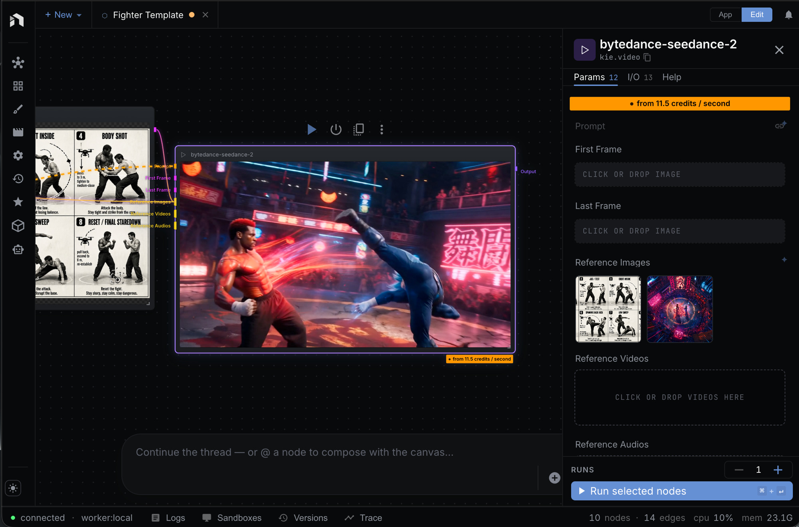
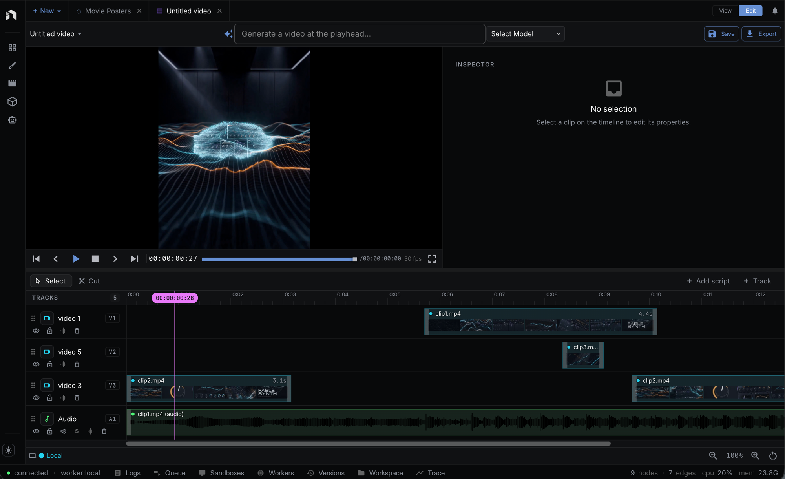

# NodeTool

**The open-source, agent-first creative workspace.**

*Every model. Your keys. Your canvas.*

[](https://github.com/nodetool-ai/nodetool/stargazers)
[](https://github.com/nodetool-ai/nodetool/releases)
[](https://github.com/nodetool-ai/nodetool/releases/latest)
[](https://discord.gg/WmQTWZRcYE)
[](LICENSE.txt)

[](https://nodetool.ai)
[](https://nodetool.ai)
[](https://nodetool.ai)
[](https://www.atlascloud.ai/?ref=PW9AD2)

NodeTool is an open-source creative AI suite that runs on your machine. A node-based canvas, a multi-track video timeline, and a layered sketch editor share one workspace, and every major AI model, cloud or local, wires into all three.

It is agent-first: every action you can take in the UI is also an agent tool, so an agent can wire a graph, paint a layer, cut a clip, or place a widget on the same surfaces you use, then run the result and repair what fails.

* **The Whole App Is the Toolbelt:** Agents drive the canvas, sketch pad, storyboard, timeline, script editor, 3D scene, and app builder.
* **Pay Provider Prices:** Bring your own API keys and pay providers at cost. No markup.
* **Zero Lock-In:** Swap any model — cloud or local — without touching the rest of the workflow.
* **Three Ways to Work:** Node graphs, a video timeline, and layered painting, all on one canvas.



## Contents

- [Why NodeTool](#why-nodetool)
- [What's in the box](#whats-in-the-box)
- [Agents](#agents)
- [Mini apps](#mini-apps)
- [Node editor](#node-editor)
- [Video editor](#video-editor)
- [Sketch editor](#sketch-editor)
- [How NodeTool compares](#how-nodetool-compares)
- [Get NodeTool](#get-nodetool)
- [Documentation](#documentation)
- [CLI & Server (npm)](#cli--server-npm)
- [Architecture](#architecture)
- [Development Setup](#development-setup)
- [Testing](#testing)
- [Contributing](#contributing)
- [License](#license)

## Why NodeTool

Closed platforms lock you in. NodeTool is built for independence.

**Own your AI.**

*   **Independent Pricing:** Pay providers directly at cost with your own API keys, or run local models for free.
*   **Independent Data:** Workflows, keys, and files stay on your machine.
*   **Independent Software:** Open-source (AGPL-3.0).

> **Infrastructure Freedom:** If a provider raises prices or deprecates a model, swap the node. The rest of the workflow doesn't change.

## What's in the box

| | |
| :--- | :--- |
| **Agents in every editor** | Anything you can click, an agent can do — canvas, sketch, storyboard, timeline, script, 3D, and apps |
| **Agents that build** | Describe a pipeline; the agent authors the graph, picks models, and validates before it runs |
| **Mini apps** | Turn a workflow into a focused interface — built and tested by an agent, or by hand |
| **Supervised runs** | An agent on the failure path: retry, repair, skip, or stop, on a budget you set |
| **MCP server** | Point Claude Desktop, Claude Code, Codex, or any MCP agent at the same toolbelt |
| **Node-based canvas** | Drag-and-drop nodes with type-safe connections |
| **Image, video, audio, text** | Unified workflows across every modality |
| **Editing tools as nodes** | Mask, inpaint, outpaint, relight, upscale, layers, compositing |
| **Video editor** | Multi-track timeline — sequence, composite, and AI-generate clips, then export to MP4 |
| **Sketch editor** | Layered paint canvas — draw, mask, and generate AI imagery onto layers, then feed the result downstream |
| **Runs on your machine** | Ollama, MLX (Apple Silicon), and GGUF for local inference |
| **BYOK everywhere** | OpenAI, Anthropic, Gemini, FAL, KIE, Replicate, ElevenLabs, HuggingFace |
| **Document search** | Built-in vector store for indexing and querying your files |
| **Real-time previews** | Live output at every node as the workflow runs |
| **Custom nodes** | Extend in TypeScript or Python |
| **Deploy & scale** | Self-host with Docker; rent GPU workers (RunPod, Vast) |
| **Cross-platform** | macOS, Windows, and Linux |

## Agents

Most tools bolt a chat panel onto an editor. NodeTool went the other way: the app itself is built as tools an agent can operate, so agents do the work on the same surfaces you use.

*   **The whole app is the toolbelt.** Every editor hands the agent the same actions you have: add a node and wire it, paint on a layer and set its blend mode, cut and retime a clip, revise a shot, voice a script line, place a widget in an app. If you can click it, an agent can drive it — the node canvas, the layered sketch pad, the storyboard, the video timeline, the script editor, the 3D scene, and the app builder.
*   **Agents build workflows.** Describe the pipeline and the agent authors the graph — picks the nodes, wires the edges, selects the models — and validates it before anything runs. What it leaves behind is a workflow you can inspect, edit, and rerun.
*   **Agents build apps, and test them.** Ask for a mini app and the agent plans the workflows, places the widgets, wires them together, then replays every interaction and has a second model judge whether the result does what you asked. No passing verdict, no app.
*   **An agent on the failure path.** Supervised runs (`--supervise`) put an agent on call: when a step fails mid-run it decides — retry, repair the output, skip the item, or stop — inside a decision and cost budget you set, with every intervention logged.
*   **It asks instead of guessing.** When a job is missing something only you can decide — a name, a look, permission to delete — the agent stops and asks. Every plan, tool call, prompt, and dollar of model spend is on the record.
*   **Bring your own agent.** The toolbelt is exposed over MCP. Point Claude Desktop, Claude Code, Codex, or any MCP-aware agent at NodeTool and it gets the same tools the built-in chat uses.

```bash
nodetool mcp install                  # wire NodeTool into Claude Code / Codex / OpenCode
npm run build:mcpb                    # → dist/nodetool.mcpb for Claude Desktop
```

Under the hood: a planner turns an objective into a DAG of steps, executors walk it in parallel, and every LLM call emits an OpenTelemetry span with tokens and cost. See the [agent guide](https://docs.nodetool.ai/agents/) and [docs/AGENTS.md](docs/AGENTS.md).

## Mini apps

A workflow is a graph; a mini app is the interface you put in front of it. Bind widgets to inputs and outputs, declare the operations a click can run, and hand someone a focused tool instead of a canvas — the graph stays underneath, editable.

Agents build them end to end. `nodetool app build` runs six stages — spec, plan, author, check, run, judge — and only hands back a bundle when the app's interactions actually do what the prompt asked:

```bash
nodetool app build "an app that drafts a note from a prompt" -p anthropic -m claude-sonnet-5
nodetool app debug <application_id>    # headless: validate bindings, replay interactions
```

See the [mini apps guide](https://docs.nodetool.ai/mini-apps) for widgets, operations, and variables.

## Node editor

The node canvas lets you build visual workflows by chaining steps together—like loading an image, calling a model, and applying a mask.

*   **Fast creation:** Double-click to search and add nodes, or drag a connection into empty space to see compatible next steps.
*   **Type-safe routing:** Connector handles are color-coded. The editor prevents mistakes like wiring an image into a text field.
*   **Live previews:** Every node renders its output (images, video, text) in real time as the workflow executes.
*   **In-context editing:** Tweak properties directly on the node, group them to stay organized, or bypass a node to test a variation.
*   **Easy navigation:** Pan, zoom, use the minimap, or search by name to jump straight to any node in a large graph.

## Video editor

A generation-aware, multi-track timeline lives right next to the canvas. Drop in your own footage or bind a workflow to a clip — a text-to-image, image-to-video, or text-to-speech pipeline — and generate it in place. Change a parameter and the clip regenerates; tweak the bound workflow and the clip flags itself stale. Composite a live preview across video, audio, and overlay tracks, then export the whole sequence to MP4.



See the [Video Editor guide](https://docs.nodetool.ai/video-editor) for the full tour.

## Sketch editor

A layered paint canvas built into the node graph. Draw and paint with real brushes, build up a composition in layers with blend modes and masks, then bind a layer to a model or one of your own workflows and generate image content right where you're painting. Change a prompt or an upstream input and the layer flags itself stale; regenerate in place and keep working on top. When you're done, the node hands the rest of your workflow a flattened image, a mask, and per-layer outputs — no export/import round-trip. It pairs naturally with the editing nodes (mask, inpaint, outpaint, compositing) for sketch-then-generate pipelines.

See the [Sketch Editor guide](https://docs.nodetool.ai/sketch-editor) for tools, layers, AI generation, and keyboard shortcuts.

## How NodeTool compares

| | NodeTool | ComfyUI | Weavy | n8n |
| :--- | :--- | :--- | :--- | :--- |
| **Built for** | Creatives working with AI | Stable Diffusion power users | Creative teams (now part of Figma) | Business workflows |
| **Modalities** | Image, video, audio, text | Image, video | Image, video | Text |
| **Agents** | Every editor is a toolbelt; agents build, run, and repair | Community extensions | Assistant features | AI nodes in a workflow |
| **Models** | Every major provider, BYOK | Stable Diffusion | Curated marketplace | API integrations |
| **Source & pricing** | AGPL-3.0, provider prices | Open source, free | Closed, credits | Fair-code, subscription |

**vs ComfyUI.** ComfyUI exposes every parameter for engineers who want them. NodeTool keeps the node graph, gives it an interface that doesn't fight you, and covers the rest of the stack — video, audio, text, document search.

**vs Weavy.** Weavy was the closed-source canvas for creative AI. After the Figma acquisition, the roadmap belongs to someone else. NodeTool is the open alternative — same node-based canvas, your keys, your files, no acquisition risk.

**vs n8n.** n8n is for business workflows and API plumbing. NodeTool is built for creative work — models, masks, layers, video, audio, RAG.

## Get NodeTool

Download the desktop app, install, and start building — runs fully on your machine.

| Platform | Get It | Requirements |
| :--- | :--- | :--- |
| **Windows** | [Download](https://nodetool.ai/studio) | Windows 10+, 8GB+ RAM, 20GB space |
| **macOS** | [Download](https://nodetool.ai/studio) | macOS 13+, Apple Silicon or Intel, 8GB+ RAM |
| **Linux** | [Download](https://nodetool.ai/studio) | Ubuntu 22+, 8GB+ RAM |

Connect a provider with your own API key and the models run on their servers —
no GPU involved. A GPU only matters if you later want models to run on your own
machine.

[Flatpak CI Builds](https://github.com/nodetool-ai/nodetool/actions/workflows/flatpak-ci.yml) are available for Linux.

______________________________________________________________________

## Documentation

- **[Getting Started](https://docs.nodetool.ai/getting-started)** — Build your first workflow
- **[Agents](https://docs.nodetool.ai/agents/)** — Let an agent build, run, and repair your workflows
- **[Mini Apps](https://docs.nodetool.ai/mini-apps)** — Wrap a workflow in an interface
- **[Video Editor](https://docs.nodetool.ai/video-editor)** — Sequence and AI-generate clips on a timeline
- **[Sketch Editor](https://docs.nodetool.ai/sketch-editor)** — Draw, mask, and AI-generate on a layered canvas
- **[Node Packs](https://docs.nodetool.ai/packs)** — Available nodes and integrations
- **[Custom Nodes](https://docs.nodetool.ai/developer/custom-nodes-guide)** — Extend NodeTool
- **[Provider Guides](https://docs.nodetool.ai/developer/providers/)** — Add new models & nodes for any provider
- **[Deployment](https://docs.nodetool.ai/deployment)** — Share your work
- **[API Reference](https://docs.nodetool.ai/api)** — Programmatic access

______________________________________________________________________

## CLI & Server (npm)

Run the server, execute workflows, drive agents, or chat from the terminal:

```bash
# Install globally (Node.js 22.x required)
npm install -g @nodetool-ai/cli

# Start the API server (port 7777)
nodetool serve

# Interactive chat — every session runs the agent loop
nodetool-chat --provider anthropic --model claude-sonnet-5

# Run a TypeScript DSL workflow
nodetool workflows run my-workflow.ts

# Put an agent on the failure path
nodetool workflows run <id> --supervise --supervisor-cost-cap 0.25

# Have an agent build and verify a mini app
nodetool app build "summarize a PDF into bullet points" -p anthropic -m claude-sonnet-5

# Expose the toolbelt to Claude Code, Codex, or OpenCode over MCP
nodetool mcp install

# One-off without global install
npx --package=@nodetool-ai/cli nodetool serve
npx --package=@nodetool-ai/cli nodetool-chat
```

Every surface is drivable headlessly, so an agent can check its own work:
`nodetool validate` (static graph check), `nodetool debug` (run a workflow and
read a verdict), `nodetool app debug` (replay an app's interactions),
`nodetool node run` (one node in isolation), and `nodetool eval` (score the
planning and tool-calling loops against any provider).

See the [CLI Reference](https://docs.nodetool.ai/cli) for all commands.

______________________________________________________________________

## Architecture

NodeTool is a monorepo with a TypeScript backend, React frontend, Electron desktop shell, and React Native mobile app.

```
nodetool/
├── packages/          # Backend monorepo (55 packages)
│   ├── kernel/        #   Workflow graph & runner
│   ├── node-sdk/      #   BaseNode class & node registry
│   ├── base-nodes/    #   100+ built-in node types
│   ├── agents/        #   Planning agents, the editor toolbelt, app build harness
│   ├── runtime/       #   Processing context & model providers
│   ├── websocket/     #   HTTP + WebSocket server (entry point)
│   ├── vectorstore/   #   SQLite-vec vector database
│   └── ...            #   Protocol, config, auth, storage, deploy, etc.
├── web/               # React frontend (Vite + MUI + React Flow)
├── electron/          # Electron desktop app
├── mobile/            # React Native mobile app (Expo)
└── docs/              # Jekyll documentation site
```

For a detailed architecture overview, see [ARCHITECTURE.md](ARCHITECTURE.md).

______________________________________________________________________

## Development Setup

**Prerequisites:** Node.js 22.22.1, npm. Python 3.11 with conda for Python nodes (optional).

> **Node 22.22.1 is required.** Matches Electron 39's embedded Node so dev and the packaged app run on the same Node version. Use `nvm use` to activate (reads `.nvmrc`).

### Quick Start

```bash
./start.sh          # API server on http://localhost:7777
./start.sh full     # API + web UI on http://localhost:3000
```

That's the whole setup. On first run `start.sh` checks your Node version, copies
`.env.example` to `.env`, installs dependencies, rebuilds the native SQLite
module, and builds the backend packages — then starts the server. Every run
after skips straight to starting it. Other modes:

```bash
./start.sh web      # web UI only
./start.sh check    # typecheck + lint + test
./start.sh doctor   # report what's set up and what isn't
PORT=8080 ./start.sh
```

<details>
<summary>Doing it by hand</summary>

```bash
nvm use                    # Activate Node 22.22.1 (reads .nvmrc)
npm install
npm run build:packages     # Build all TS packages in dependency order

# Run backend (port 7777) and frontend (port 3000)
# Uses tsx --watch for the backend, so startup skips a full websocket package rebuild.
npm run dev
```

`npm run build:packages` is not optional on a fresh checkout: `base-nodes` and
the other decorator packages resolve from `dist/`, so until it has run once the
server starts with no node types registered.

</details>

### Working with Claude Code

The repo ships a starter kit in [`.claude/`](.claude/README.md): a SessionStart
hook that installs dependencies in web sessions, slash commands (`/serve`,
`/verify`, `/onboard`), and 9 NodeTool skills covering workflow building,
custom nodes, the API, deployment, and troubleshooting.

### Python Nodes (optional)

Python nodes (HuggingFace, MLX, Apple integrations) run via the `PythonStdioBridge`, which spawns a Python worker process that communicates over stdin/stdout. The bridge connects lazily on the first workflow that uses Python nodes — no separate setup is needed for the TypeScript backend.

### Electron App

```bash
npm run electron
```

The Electron app auto-detects your active Conda environment. Settings are stored in:
- **Linux/macOS**: `~/.config/nodetool/settings.yaml`
- **Windows**: `%APPDATA%\nodetool\settings.yaml`

> **Native module rebuild.** The backend always runs on vanilla Node (system Node in dev, the bundled Node 22.x in prod — same ABI), so the one source-built native module, `better-sqlite3`, is compiled against **Node** headers. This runs automatically from the root `postinstall` (`electron/scripts/rebuild-native.mjs`) after `npm install`/`npm ci` finishes, so a clean checkout builds in a single command. If you ever see a `NODE_MODULE_VERSION` mismatch, force a rebuild:
>
> ```bash
> npm run rebuild:native
> ```

### Mobile App

```bash
cd mobile && npm install && npm start
```

See [mobile/README.md](mobile/README.md) for full setup.

### Common Commands

| Command | Description |
| :--- | :--- |
| `npm install` | Install all dependencies |
| `npm run build` | Build all packages + web |
| `npm run dev` | Start backend (`tsx --watch`) + web dev server |
| `npm run electron` | Build and start Electron app |
| `npm run check` | Workspace/lockfile/boundary checks, build:packages, typecheck, lint, test:packages, test |
| `npm run test` | Run the web, electron, and mobile tests |
| `npm run test:packages` | Run the backend package tests |

______________________________________________________________________

## Testing

```bash
# Unit tests
cd electron && npm test && npm run lint
cd web && npm test && npm run lint

# Web E2E (needs backend on port 7777)
cd web && npx playwright install chromium && npm run test:e2e
```

Electron has no Playwright suite; `cd electron && npm test` runs its Jest tests.

For detailed testing documentation, see [web/TESTING.md](web/TESTING.md).

______________________________________________________________________

## Contributing

We welcome bug reports, feature requests, code contributions, and new nodes.

Please open an issue before starting major work so we can coordinate.

### Acknowledgements

- [@mphermes](https://github.com/mphermes) — Atlas Cloud integration

## License

[AGPL-3.0](https://github.com/nodetool-ai/nodetool/blob/main/LICENSE.txt)

## Get in Touch

- **General**: [hello@nodetool.ai](mailto:hello@nodetool.ai)
- **Team**: [matti@nodetool.ai](mailto:matti@nodetool.ai), [david@nodetool.ai](mailto:david@nodetool.ai)

[GitHub](https://github.com/nodetool-ai/nodetool) | [Discord](https://discord.gg/WmQTWZRcYE) | [Website](https://nodetool.ai)

## Star History

[](https://www.star-history.com/#nodetool-ai/nodetool&type=date&legend=top-left)
