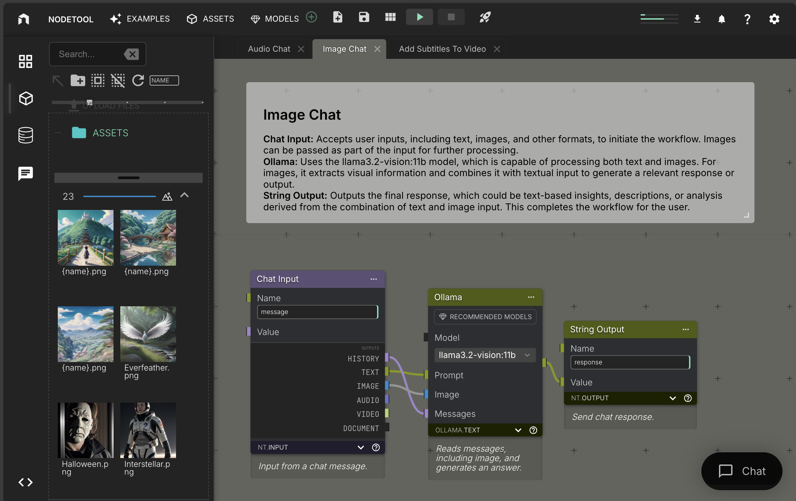

# nodetool

## Overview

NodeTool is a powerful no-code development environment for Artificial Intelligence, enabling intuitive creation of complex AI workflows and seamless integration into existing applications. With its node-based user interface, users can construct sophisticated, multimodal applications without deep programming knowledge..



NodeTool opens up creative and playful access to cutting-edge AI technologies, supporting both beginners and experienced developers in content creation, data analysis, and automation. By visualizing workflows and simplifying complex installation requirements, NodeTool makes AI application development accessible to a broad audience..

# 🌟 Key Features
* __No-Code AI Development:__ Create AI workflows without deep programming knowledge.
* __Model Agnostic:__ Easily integrate state-of-the-art AI models from various sources.
* __Multimedia Content Handling:__ Generate and edit images, texts, audio, video, and more within a single workflow.

# 🎨 Exciting Use Cases
1. __AI Muse__: Generate unique artwork inspirations by combining different styles, eras, and subjects.
2. __Sound-to-Visual Art__: Transform audio into visual masterpieces.
3. __Interactive Installation__: Create dynamic artworks that respond to viewer input.
4. __Conceptual Art Generator__: Visualize abstract ideas and philosophical concepts.
5. __Digital Sketchbook Enhancer__: Elevate rough sketches with AI-generated details and animations.
6. __Art History Reimagined__: Reinterpret famous artworks across different periods and styles.
7. __Multimedia Performance Tools__: Design real-time visual generators for live performances.
8. __Sustainable Art Planner__: Conceptualize eco-friendly installations with material suggestions and impact visualization.


## 🚀 Quickstart

📥 Download the latest Release from our [Release Page](https://github.com/nodetool-ai/nodetool/releases)

## 📦 Installation

1. Extract the downloaded archive.
2. Run the installer.
3. Follow the instructions to complete the installation.

# Node Overview

## Node Categories

NodeTool offers a diverse range of node categories to support various AI tasks:

1. **Anthropic**: Text-based AI operations using Anthropic's models.
2. **HuggingFace**: Comprehensive AI capabilities including audio, image, text, video, and multimodal processing.
3. **NodeTool**: Core functionalities for data manipulation, I/O operations, and various media processing.
4. **Ollama**: Text-based AI operations using Ollama models.
5. **OpenAI**: AI operations for audio, image, and text using OpenAI's models.
6. **Replicate**: Versatile AI capabilities for audio, image, text, and video processing.
7. **Stable Diffusion**: Specialized image generation and manipulation.

Each category contains specific nodes tailored for different AI tasks, allowing users to create complex workflows by combining nodes across these categories.


```
nodes
├── anthropic
│   └── text
├── huggingface
│   ├── audio
│   ├── huggingface_pipeline
│   ├── image
│   ├── multimodal
│   ├── text
│   └── video
├── nodetool
│   ├── agents
│   ├── audio
│   ├── boolean
│   ├── constant
│   ├── dataframe
│   ├── dictionary
│   ├── group
│   ├── http
│   ├── image
│   ├── input
│   ├── list
│   ├── math
│   ├── output
│   ├── tensor
│   ├── text
│   ├── vector
│   └── video
├── ollama
│   └── text
├── openai
│   ├── audio
│   ├── image
│   └── text
├── replicate
│   ├── audio
│   ├── image
│   ├── text
│   └── video
└── stable_diffusion
    └── image
```

# Architecture

# Architecture Overview

NodeTool's architecture is designed for flexibility. Here's a breakdown of the main components:

1. **React Frontend**: The user interface built with React, providing an intuitive way for users to create and manage workflows.

2. **API Server**: Handles HTTP and WebSocket connections from the frontend, managing user sessions, workflow storage, and coordination between components.

3. **WebSocket Runner**: Responsible for executing workflows in real-time, maintaining the state of running workflows, and managing the communication between nodes.

4. **Worker**: Performs the actual processing of individual nodes, allowing for parallel execution and scalability.

## Key Features:

- **Real-time Communication**: WebSocket connections enable live updates and interactive workflow execution.
- **Scalable Processing**: The Worker architecture allows for distributed processing of node tasks.
- **Flexible Node System**: Easy integration of new node types and AI services.
- **HTTP Callbacks**: Support for asynchronous operations and integration with external services.

## Data Flow:

1. User interacts with the React Frontend to create or modify workflows.
2. Frontend communicates with the API Server to save workflows and initiate execution.
3. API Server delegates workflow execution to the WebSocket Runner.
4. WebSocket Runner coordinates the execution of individual nodes through Workers.
5. Results are sent back to the Frontend in real-time via WebSocket connections.
6. HTTP Callbacks allow for asynchronous updates and integration with external services.

This architecture enables NodeTool to handle complex AI workflows efficiently, providing a seamless experience for users while maintaining the flexibility to incorporate various AI services and custom nodes.


```
                  +-------------------+
                  |                   |
                  |  React Frontend   |
                  |                   |
                  +--------+----------+
                           |
                           | HTTP/WebSocket
                           |
                  +--------v----------+
                  |                   |
         +------->|    API Server     |<------+
         |        |                   |       |
         |        +--------+----------+       |
         |                 |                  |
         |                 | Internal         |
         |                 | Communication    |
         |    +------------v------------+     |
         |    |                         |     |
         |    |   WebSocket Runner      |     |
         |    |                         |     |
         |    +------------+-----------+      |
         |                 |                  |
         |                 | WebSocket        |
         |                 |                  |
         |    +------------v------------+     |
         |    |                         |     |
         |    |        Worker           |     |
         |    |                         |     |
         +----+-------------------------+     |
              |                               |
              +-------------------------------+
                     HTTP Callbacks
```


## Implementing Custom Nodes

Extend NodeTool's functionality by creating custom nodes:

```python
class MyAgent(BaseNode):
    prompt: Field(default="Build me a website for my business.")
    
    async def process(self, context: ProcessingContext) -> str:
        llm = MyLLM()
        return llm.generate(self.prompt)
```

# Development

## Requirements

- Python 3.10+
- NodeJS 20+

## Run backend

```bash
python -m venv .venv
source .venv/bin/activate
pip install -r requirements.txt
./scripts/server
```

## Run frontend

```bash
cd web
npm install
npm start
```

Now, open your browser and navigate to `http://localhost:3000` to access the NodeTool interface.

## Run Electron App

If you want to run the Electron App, you need to install the dependencies and start the frontend and backend.

```bash
cd electron
npm start
```

## Sync dependencies
Dependencies are managed in `pyproject.toml` and must be synced to `requirements.txt` using:

```
poetry export -f requirements.txt --output requirements.test.txt --without-hashes
```

## Contribution

We welcome contributions from the community! To contribute to Nodetool, please adhere to our contribution guidelines. Your efforts help us improve and evolve this project.

# License

Nodetool is made available under the terms of the [GPL3 License](LICENSE.txt), promoting open-source collaboration and sharing.

# Contact

For inquiries, suggestions, or contributions, please reach out to the core team:

- Matthias Georgi
- David Bürer

**GitHub:** [https://github.com/nodetool-ai/nodetool](https://github.com/nodetool-ai/nodetool)
