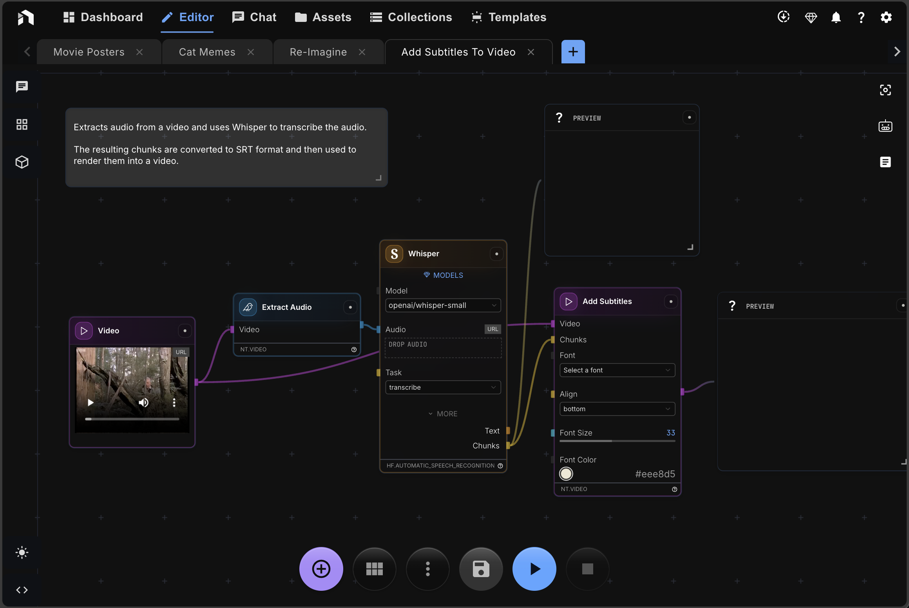

[](https://github.com/nodetool-ai/nodetool/actions/workflows/test.yml)


# Build Agents Visually • Deploy Anywhere

Design agents without writing code.  
Run on your laptop or your own cloud.

**For makers, researchers, and teams shipping AI workflows fast.**



> **🎯 Privacy by design** • **🔓 Own your stack** • **🚀 Production ready**

## Table of Contents

- [How It Works](#how-it-works)
- [Built Different](#built-different)
- [Quick Start](#quick-start)
- [Bring Your Own Providers](#bring-your-own-providers)
- [Agent Tools](#agent-tools)
- [Install Node Packs in the App](#install-node-packs-in-the-app)
- [Community](#community)
- [🛠️ Development Setup](#development-setup)
- [Run Backend & Web UI](#4-run-nodetool-backend--web-ui)
- [Testing](#testing)
- [Troubleshooting](#troubleshooting)
- [Contributing](#contributing)
- [License](#license)
- [Get in Touch](#get-in-touch)

## How It Works

Get from idea to production in three simple steps:

1. **🏗️ Build** — Drag nodes to create your workflow—no coding required.
2. **⚡ Run** — Test locally. Your data stays on your machine by default.
3. **🚀 Deploy** — Ship with one command to RunPod or your own cloud.

## Built Different

**Privacy by design** — Your data never leaves your machine unless you explicitly use cloud nodes. Full control over your AI pipeline.

**Own your stack** — Open source (AGPL). Fork, customize, and deploy however you want. No vendor lock-in.

**Production ready** — Start local, scale globally. One-command deployment to enterprise infrastructure.

## Quick Start

| Platform    | Download                                  | Requirements                            |
| ----------- | ----------------------------------------- | --------------------------------------- |
| **Windows** | [Download Installer](https://nodetool.ai) | Nvidia GPU recommended, 20GB free space |
| **macOS**   | [Download Installer](https://nodetool.ai) | M1+ Apple Silicon                       |
| **Linux**   | [Download AppImage](https://nodetool.ai)  | Nvidia GPU recommended                  |

### First Steps

1. Download and install NodeTool
2. Launch the app
3. Download models
4. Start with a template or create from scratch
5. Drag, connect, run—see results instantly

## Bring Your Own Providers

**Connect to any AI provider. Your keys, your costs, your choice.**

✅ **Integrated Providers:** OpenAI • Anthropic • Hugging Face • Groq • Together • Replicate • Cohere • + 8 more

**Flexible Architecture:**

- Mix providers in one workflow
- Switch models without code changes
- Your keys, your costs—no markup
- OpenAI-compatible API for easy integration

### Provider Keys

Set provider API keys in Settings → Providers, or export environment variables:

```bash
# Optional .env or shell exports
OPENAI_API_KEY=...
ANTHROPIC_API_KEY=...
HUGGINGFACE_HUB_TOKEN=...
REPLICATE_API_TOKEN=...
```

## Agent Tools

**Extensible tools for AI agents to interact with the world:**

🌐 **Web & Search** — Browser automation, web scraping, Google Search, SERP API, screenshot capture, HTTP requests

📄 **Content Processing** — PDF extraction, text to speech, image generation, email management, markdown conversion

📊 **Data & Analytics** — Vector search, math calculations, statistics, geometry, unit conversion, ChromaDB indexing

**Tool Categories:** Browser Tools • Search & SERP • Google APIs • OpenAI Tools • PDF Processing • Email Management • Math & Statistics • Vector Search • File System • Workflow Management • Asset Tools • HTTP Client • Code Tools

## Install Node Packs in the App

Install and manage packs directly from the desktop app without using the CLI.

- Open Package Manager: Launch the Electron desktop app, then open the Package Manager from the Tools menu.
- Browse and search packages: Use the top search box to filter by package name, description, or repo id.
- Install or uninstall: Click Install to add a pack, Uninstall to remove it. An overlay shows progress; after a successful install, the backend restarts automatically to apply changes.
- View installed status: Installed packs show a ✓ badge and an Uninstall button.
- Search nodes across packs: Use the “Search nodes” field to find nodes by title, description, or type. You can install the required pack directly from node results.
- Deep-link to node search: Append `?nodeSearch=your+query` to the Package Manager URL to prefill the node search.

If you plan to use GPU‑accelerated nodes (for example, Hugging Face models), complete the CUDA/PyTorch steps in the Windows & Linux (NVIDIA GPUs) section first.

## Community

**Open source on GitHub. Star and contribute.**

💬 **[Join Discord](https://discord.gg/WmQTWZRcYE)** — Share workflows and get help from the community

🌟 **[Star on GitHub](https://github.com/nodetool-ai/nodetool)** — Help others discover NodeTool

🚀 **Contribute** — Help shape the future of visual AI development

---

## 🛠️ Development Setup

Follow these steps to set up a local development environment for the entire NodeTool platform, including the UI, backend services, and the core library (`nodetool-core`). If you are primarily interested in contributing to the core library itself, please also refer to the [nodetool-core repository](https://github.com/nodetool-ai/nodetool-core) for its specific development setup using Poetry.

### Prerequisites

- **Python 3.11:** Required for the backend.
- **Conda:** Download and install from [miniconda.org](https://docs.conda.io/en/latest/miniconda.html).
- **Node.js (Latest LTS):** Required for the frontend. Download and install from [nodejs.org](https://nodejs.org/en).

### 1. Set Up Conda Environment

```bash
# Create and activate the Conda environment
conda create -n nodetool python=3.11 -y
conda activate nodetool

# Install essential system dependencies via Conda
conda install -c conda-forge ffmpeg cairo x264 x265 aom libopus libvorbis lame pandoc uv -y
```

### 2. Install Core Python Dependencies

These are the essential packages to run NodeTool.

Make sure to activate the conda environment.

```bash
# Install nodetool-core and nodetool-base
# On macOS / Linux / Windows:
uv pip install git+https://github.com/nodetool-ai/nodetool-core
uv pip install git+https://github.com/nodetool-ai/nodetool-base
```

If you're working in this monorepo and want live-editable installs:

```bash
# From the repository root
conda activate nodetool
uv pip install -e ./nodetool-core
uv pip install -e ./nodetool-base
```

### 3. Install Optional Node Packs (As Needed)

NodeTool's functionality is extended via packs. Install only the ones you need.

NOTE:

- Activate the conda environment first
- Use uv for faster installs.

> Prefer the in‑app Package Manager for a guided experience. See [Install Node Packs in the App](#install-node-packs-in-the-app). The commands below are for advanced/CI usage.

```bash
# List available packs (optional)
nodetool package list -a

# Example: Install packs for specific integrations
uv pip install git+https://github.com/nodetool-ai/nodetool-fal
uv pip install git+https://github.com/nodetool-ai/nodetool-replicate
uv pip install git+https://github.com/nodetool-ai/nodetool-elevenlabs
```

_Note:_ Some packs like `nodetool-huggingface` may require specific PyTorch versions or CUDA drivers.
Use `--index-url` to install:

### Windows & Linux (NVIDIA GPUs)

1. Check your CUDA version:

```
nvidia-smi
```

2. Install PyTorch with CUDA support first:

```
# For CUDA 11.8
uv pip install torch torchvision torchaudio --index-url https://download.pytorch.org/whl/cu118

# For CUDA 12.1-12.3 (most common)
uv pip install torch torchvision torchaudio --index-url https://download.pytorch.org/whl/cu121

# For CUDA 12.4+
uv pip install torch torchvision torchaudio --index-url https://download.pytorch.org/whl/cu124
```

3. Install GPU-dependent packs:

```
# Use --extra-index-url to access both PyPI and PyTorch packages
uv pip install --extra-index-url https://download.pytorch.org/whl/cu121 git+https://github.com/nodetool-ai/nodetool-huggingface
```

4. Verify GPU support:

```
python -c "import torch; print(f'CUDA available: {torch.cuda.is_available()}')"
```

#### Troubleshooting:

If you see "bitsandbytes compiled without GPU support", reinstall it:

```
uv pip uninstall bitsandbytes
uv pip install bitsandbytes
```

If PyTorch shows CPU-only version, make sure you used the correct url from step 2.

Use --extra-index-url (not --index-url) when installing from git repositories to avoid missing dependencies

### 4. Run NodeTool Backend & Web UI

Ensure the `nodetool` Conda environment is active.

**Option A: Run Backend with Web UI (for Development)**

This command starts the backend server:

```bash
# On macOS / Linux / Windows:
nodetool serve --reload
```

Run frontend in web folder:

```bash
cd web
npm install
npm start
```

Access the UI in your browser at `http://localhost:3000`.

**Option B: Run with Electron App**

This provides the full desktop application experience.

**Configure Conda Path:**
Ensure your `settings.yaml` file points to your Conda environment path:

- macOS/Linux: `~/.config/nodetool/settings.yaml`
- Windows: `%APPDATA%/nodetool/settings.yaml`

```yaml
CONDA_ENV: /path/to/your/conda/envs/nodetool # e.g., /Users/me/miniconda3/envs/nodetool
```

**Build Frontends:**
You only need to do this once or when frontend code changes.

```bash
# Build the main web UI
cd web
npm install
npm run build
cd ..

# Build the apps UI (if needed)
cd apps
npm install
npm run build
cd ..

# Build the Electron UI
cd electron
npm install
npm run build
cd ..
```

**Start Electron:**

```bash
cd electron
npm start  # launches the desktop app using the previously built UI
```

The Electron app will launch, automatically starting the backend and frontend.

## Testing

### Python (core, packs)

```bash
pytest -q
```

### Web UI

```bash
cd web
npm test
npm run lint
npm run typecheck
```

### Electron

```bash
cd electron
npm run lint
npm run typecheck
```

## Troubleshooting

- **Node/npm versions**: use Node.js LTS (≥18). If switching versions:
  ```bash
  rm -rf node_modules && npm install
  ```
- **Port in use (3000/8000)**: stop other processes or choose another port for the web UI.
- **CLI not found (`nodetool`)**: ensure the Conda env is active and packages are installed; restart your shell.
- **GPU/PyTorch issues**: follow the CUDA-specific steps above and prefer `--extra-index-url` for mixed sources.

## Contributing

We welcome community contributions!

1. **Fork** the repository
2. Create a **feature branch** (`git checkout -b feature/amazing-feature`)
3. **Commit** your changes (`git commit -m 'Add amazing feature'`)
4. **Push** to the branch (`git push origin feature/amazing-feature`)
5. Open a **Pull Request**

Please follow our contribution guidelines and code of conduct.

## License

**AGPL-3.0** — True ownership, zero compromise.

## Get in Touch

**Tell us what's missing and help shape NodeTool**

✉️ **Got ideas or just want to say hi?**  
[hello@nodetool.ai](mailto:hello@nodetool.ai)

👥 **Built by makers, for makers**  
Matthias Georgi: [matti@nodetool.ai](mailto:matti@nodetool.ai)  
David Bührer: [david@nodetool.ai](mailto:david@nodetool.ai)

📖 **Documentation:** [docs.nodetool.ai](https://docs.nodetool.ai)  
🐛 **Issues:** [GitHub Issues](https://github.com/nodetool-ai/nodetool/issues)

---

**NodeTool** — Build agents visually, deploy anywhere. Privacy first. ❤️
