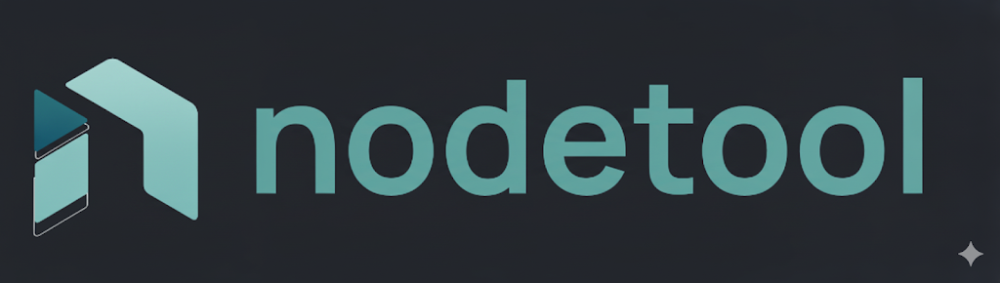

[](https://github.com/nodetool-ai/nodetool/actions/workflows/test.yml)


[](https://github.com/nodetool-ai/nodetool/stargazers)
[](https://github.com/nodetool-ai/nodetool/releases)
[](https://github.com/nodetool-ai/nodetool/releases/latest)
[](https://nodetool.ai)
[](https://discord.gg/WmQTWZRcYE)
[](LICENSE.txt)

# The Local‑First Agent Workbench


> **🎯 Privacy by design** • **🔓 Own your stack** • **🚀 Production ready**

Nodetool lets you design agents that work with your data. Use any model to analyze data, generate visuals, or automate
workdlows.

## Table of Contents

- [Vision](#vision)
- [Mission](#mission)
- [How It Works](#how-it-works)
- [Principles](#principles)
- [What NodeTool Is](#what-nodetool-is-today)
- [What NodeTool Is Not](#what-nodetool-is-not-today)
- [Who It’s For](#who-its-for)
- [Roadmap](#roadmap)
- [Promise](#promise)
- [Quick Start](#quick-start)
- [Bring Your Own Providers](#bring-your-own-providers)
- [Install Node Packs in the App](#install-node-packs-in-the-app)
- [Community](#community)
- [🛠️ Development Setup](#development-setup)
- [Run Backend & Web UI](#4-run-nodetool-backend--web-ui)
- [Testing](#testing)
- [Troubleshooting](#troubleshooting)
- [Contributing](#contributing)
- [License](#license)
- [Get in Touch](#get-in-touch)

## How It Works

Get from idea to production in three simple steps:

1. **🏗️ Build** — Drag nodes to create your workflow—no coding required.
1. **⚡ Run** — Test locally. Your data stays on your machine by default.
1. **🚀 Deploy** — Ship with one command to RunPod or your own cloud.

## Principles

- **Local‑first.**
- **Open and portable.**
- **Powerful node system.** Small, composable units.
- **Transparency.** See every step while it runs.
- **Fast on your hardware.** Optimized for MPS or CUDA acceleration.

## What NodeTool Is (today)

- Visual graph editor + runnable runtime (desktop + headless)
- Execute via CLI, API, WebSocket
- Local models (Llama.cpp, MLX, vLLM, HuggingFace) + optional cloud (OpenAI/Anthropic/Replicate/FAL)
- Apple Silicon optimized with MLX for FLUX, TTS, and more
- Deploy to laptop/server, RunPod, Google Cloud, AWS

## What NodeTool Is Not (today)

- Managed SaaS, SLAs, multi‑tenant
- Compliance‑grade policy/audit
- Autoscaling orchestrator
- One‑click content toy

## Who It’s For

Indie hackers, Game devs, AI enthusiasts, creative professionals, agencies, and studios who want to build and run their
own pipelines.

## Roadmap

- Creative pipelines: templates for thumbnails, sprites, ad variants, research briefs.
- Timeline & Snapshots: run history, diffs, and easy rollback.
- Render Queue & A/B: batch runs and seeded comparisons.
- Packaging: one‑click bundles for sharing with collaborators/clients; community packs registry.

## Quick Start

| Platform    | Download                                  | Requirements                            |
| ----------- | ----------------------------------------- | --------------------------------------- |
| **Windows** | [Download Installer](https://nodetool.ai) | Nvidia GPU recommended, 20GB free space |
| **macOS**   | [Download Installer](https://nodetool.ai) | M1+ Apple Silicon                       |
| **Linux**   | [Download AppImage](https://nodetool.ai)  | Nvidia GPU recommended                  |

### Hardware Requirements

**For Local Model Inference:**

| Scenario          | Hardware              | Recommendation                                                     |
| ----------------- | --------------------- | ------------------------------------------------------------------ |
| **Apple Silicon** | M1/M2/M3 Mac with MLX | 16GB+ for LLM/TTS, 24GB+ recommended for FLUX models               |
| **Windows/Linux** | NVIDIA GPU with CUDA  | 4GB+ VRAM for LLM/TTS, 8GB+ VRAM for Flux, 12GB+ for QwenImage/Wan |
| **Cloud Only**    | No GPU required       | Use cloud providers (OpenAI, Anthropic, Replicate, FAL)            |

- **MLX (Apple)**: Optimized for Apple Silicon with 4/6/8-bit quantization
- **CUDA (Windows/Linux)**: Supports FLUX, QwenImage, Wan video models, LlamaCpp/Ollama, and HuggingFace models
- **Cloud Mode**: Full functionality without local GPU via API providers

### First Steps

1. Download and install NodeTool
1. Launch the app
1. Download models
1. Start with a template or create from scratch
1. Drag, connect, run—see results instantly

## Bring Your Own Providers

**Connect to any AI provider. Your keys, your costs, your choice.**

✅ **Integrated Providers:** OpenAI • Anthropic • Hugging Face • Groq • Together • Replicate • Cohere • Llama.cpp • MLX
(Apple Silicon) • vLLM • + 8 more

Set provider API keys in Settings → Providers.

## Supported Models

<details>
<summary>Text Generation</summary>

- **Ollama**
- **Huggingface** Llama.cpp and GGUF
- **HuggingFace Hub** Inference providers
- **OpenAI**
- **Gemini**
- **Anthropic**
- and many others

</details>

<details>
<summary>Text-to-Image</summary>

**FLUX Models:**

- **Flux Dev**, **Flux Schnell** (HuggingFace, FAL, Replicate, MLX)
- **Flux V 1 Pro** (FAL, Replicate)
- **Flux Fill Dev** (inpainting, HuggingFace, MLX)
- **Flux Depth Dev** (depth-guided, HuggingFace, MLX)
- **Flux Canny Dev** (edge-guided, HuggingFace, MLX)
- **Flux Kontext Dev** (reference fusion, HuggingFace, MLX)
- **Flux Redux Dev** (reference guidance, HuggingFace, MLX)
- **Flux Krea Dev** (enhanced photorealism, MLX)
- **Flux Lite 8B** (lightweight variant, MLX)
- **Chroma** (advanced color control, HuggingFace)
- **Flux Subject** (FAL)
- **Flux Lora**, **Flux Lora TTI**, **Flux Lora Inpainting** (FAL)
- **Flux 360** (Replicate)
- **Flux Black Light** (Replicate)
- **Flux Canny Dev/Pro** (Replicate)
- **Flux Cinestill** (Replicate)
- **Flux Dev Lora** (Replicate)

**Other Models:**

- **Stable Diffusion XL** (HuggingFace, Replicate, FAL)
- **Stable Diffusion XL Turbo** (Replicate, FAL)
- **Stable Diffusion Upscaler** (HuggingFace)
- **AuraFlow v0.3**, **Bria V1/V1 Fast/V1 HD**, **Fast SDXL** (FAL)
- **Fast LCMDiffusion**, **Fast Lightning SDXL**, **Fast Turbo Diffusion** (FAL)
- **Hyper SDXL** (FAL)
- **Ideogram V 2**, **Ideogram V 2 Turbo** (FAL)
- **Illusion Diffusion** (FAL)
- **Kandinsky, Kandinsky 2.2** (Replicate)
- **Zeroscope V 2 XL** (HuggingFace, Replicate)
- **Ad Inpaint** (Replicate)
- **Consistent Character** (Replicate)

**MLX (Apple Silicon):**

- **MFlux** - Local FLUX inference with 4/6/8-bit quantization
- **MFlux ControlNet** - Edge-guided generation with Canny models
- **MFlux ImageToImage** - Image transformation with FLUX
- **MFlux Inpaint** - Masked region editing
- **MFlux Outpaint** - Canvas extension
- **MFlux Depth** - Depth-guided generation
- **MFlux Kontext** - Reference image fusion
- **MFlux Redux** - Multi-reference blending

**Gemini (Google):**

- **Gemini 2.0 Flash Preview**, **Gemini 2.5 Flash** - Image generation with multimodal models
- **Imagen 3.0** (001, 002) - High-quality text-to-image
- **Imagen 4.0 Preview**, **Imagen 4.0 Ultra Preview** - Latest generation models

**OpenAI:**

- **GPT Image 1** - Unified image generation model
- **DALL-E 3**, **DALL-E 2** - Legacy image generation models

</details>

<details>
<summary>Image Processing</summary>

**Classification & Segmentation:**

- **google/vit-base-patch16-224** (image classification, HuggingFace Hub)
- **openmmlab/upernet-convnext-small** (image segmentation, HuggingFace Hub)
- **facebook/sam2-hiera-large** (SAM2 segmentation, HuggingFace)
- **nvidia/segformer-b3-finetuned-ade-512-512** (scene segmentation, HuggingFace)
- **mattmdjaga/segformer_b2_clothes** (clothing segmentation, HuggingFace)

**Image Editing:**

- **Diffusion Edge** (edge detection, FAL)
- **Bria Background Remove/Replace/Eraser/Expand/GenFill/ProductShot** (FAL)
- **Robust Video Matting** (video background removal, Replicate)

**Captioning & Understanding:**

- **nlpconnect/vit-gpt2-image-captioning** (image captioning, HuggingFace)

</details>

<details>
<summary>Audio Generation</summary>

**Text-to-Speech:**

- **microsoft/speecht5_tts** (TTS, HuggingFace Hub)
- **Kokoro TTS** (multilingual TTS with 50+ voices, MLX)
- **F5-TTS, E2-TTS** (TTS, FAL)
- **PlayAI Dialog TTS** (dialog TTS, FAL)
- **ElevenLabs TTS models** (ElevenLabs)

**Music & Audio:**

- **Stable Audio** (text-to-audio, FAL & HuggingFace)
- **AudioLDM** (text-to-audio, HuggingFace)
- **AudioLDM2** (enhanced text-to-audio, HuggingFace)
- **MusicLDM** (music generation, HuggingFace)
- **DanceDiffusion** (music generation, HuggingFace)
- **MusicGen** (music generation, Replicate)
- **Music 01** (music generation with vocals, Replicate)
- **MMAudio V2** (music and audio generation, FAL)
- **facebook/musicgen-small/medium/large/melody** (music generation, HuggingFace)
- **facebook/musicgen-stereo-small/large** (stereo music generation, HuggingFace)

</details>

<details>
<summary>Audio Processing</summary>

- **Audio To Waveform** (audio visualization, Replicate)

</details>

<details>
<summary>Video Generation</summary>

**HuggingFace Inference Providers:**

- **Hotshot-XL** (text-to-GIF, Replicate)
- **HunyuanVideo, LTX-Video** (text-to-video, Replicate)
- **Kling Text To Video V 2**, **Kling Video V 2** (FAL)
- **Pixverse Image To Video**, **Pixverse Text To Video**, **Pixverse Text To Video Fast** (FAL)
- **Wan Pro Image To Video**, **Wan Pro Text To Video** (FAL)
- **Wan V 2 1 13 BText To Video** (FAL)
- **Cog Video X** (FAL)
- **Haiper Image To Video** (FAL)
- **Wan 2 1 1 3 B** (text-to-video, Replicate)
- **Wan 2 1 I 2 V 480 p** (image-to-video, Replicate)
- **Video 01**, **Video 01 Live** (video generation, Replicate)
- **Ray** (video interpolation, Replicate)
- **Wan-AI/Wan2.2-I2V-A14B-Diffusers** (image-to-video, HuggingFace)
- **Wan-AI/Wan2.1-I2V-14B-480P-Diffusers** (image-to-video, HuggingFace)
- **Wan-AI/Wan2.1-I2V-14B-720P-Diffusers** (image-to-video, HuggingFace)
- **Wan-AI/Wan2.2-T2V-A14B-Diffusers** (text-to-video, HuggingFace)
- **Wan-AI/Wan2.1-T2V-14B-Diffusers** (text-to-video, HuggingFace)
- **Wan-AI/Wan2.2-TI2V-5B-Diffusers** (text+image-to-video, HuggingFace)

**Gemini (Google):**

- **Veo 3.0**, **Veo 3.0 Fast** - Latest generation video models
- **Veo 2.0** - Text-to-video and image-to-video generation

**OpenAI:**

- **Sora 2**, **Sora 2 Pro** - Advanced text-to-video and image-to-video (1280x720, 720x1280)

</details>

<details>
<summary>Text Processing</summary>

**Summarization & Classification:**

- **facebook/bart-large-cnn** (summarization, HuggingFace Hub)
- **distilbert/distilbert-base-uncased-finetuned-sst-2-english** (text classification, HuggingFace Hub)
- **facebook/bart-large-mnli** (zero-shot classification, HuggingFace)

**Question Answering:**

- **distilbert-base-cased-distilled-squad** (extractive QA, HuggingFace)
- **distilbert-base-uncased-distilled-squad** (extractive QA, HuggingFace)
- **bert-large-uncased-whole-word-masking-finetuned-squad** (advanced QA, HuggingFace)
- **deepset/roberta-base-squad2** (QA with no-answer detection, HuggingFace)

**Table QA:**

- **google/tapas-base-finetuned-wtq** (table question answering, HuggingFace)
- **google/tapas-large-finetuned-wtq** (large table QA, HuggingFace)
- **microsoft/tapex-large-finetuned-tabfact** (table fact verification, HuggingFace)

**Translation:**

- **google-t5/t5-base** (translation & text processing, HuggingFace Hub)

</details>

<details>
<summary>Speech Recognition</summary>

**Audio Classification:**

- **superb/hubert-base-superb-er** (audio classification, HuggingFace Hub)

**Speech-to-Text:**

- **openai/whisper-large-v3** (speech recognition, HuggingFace Hub)
- **openai/whisper-large-v3-turbo** (fast ASR, HuggingFace)
- **openai/whisper-large-v2** (ASR, HuggingFace)
- **openai/whisper-medium** (ASR, HuggingFace)
- **openai/whisper-small** (lightweight ASR, HuggingFace)

**Gemini:**

- **Gemini 1.5 Flash**, **Gemini 1.5 Pro** - Native audio understanding
- **Gemini 2.0 Flash Exp** - Experimental audio processing

**OpenAI:**

- **Whisper-1** - General-purpose speech recognition

</details>

<details>
<summary>Provider Multimodal Capabilities</summary>

NodeTool supports multiple AI providers with comprehensive image, video, text-to-speech, and speech recognition
capabilities:

| Provider        | Text-to-Image | Image-to-Image       | Text-to-Video | Image-to-Video | TTS                   | ASR        |
| --------------- | ------------- | -------------------- | ------------- | -------------- | --------------------- | ---------- |
| **Gemini**      | ✓ 6 models    | ✓ Gemini models only | ✓ 3 models    | ✓ 2 models     | ✓ 2 models, 30 voices | ✓ 3 models |
| **HuggingFace** | ✓ dynamic     | ✓ dynamic            | ✓ dynamic     | -              | ✓ dynamic             | -          |
| **OpenAI**      | ✓ 3 models    | ✓ 3 models           | ✓ 2 models    | ✓ 2 models     | ✓ 2 models, 6 voices  | ✓ 1 model  |

**Key Features:**

- **Gemini** offers the most comprehensive suite with Imagen for images and Veo for video
- **HuggingFace** provides access to 17+ inference providers with dynamically available models
- **OpenAI** features DALL-E for images and Sora for high-quality video generation
- **MLX** enables local, Apple Silicon-optimized inference for FLUX models and Kokoro TTS

</details>

## Install Node Packs in the App

Install and manage packs directly from the desktop app.

- Open Package Manager: Launch the Electron desktop app, then open the Package Manager from the Tools menu.
- Browse and search packages: Use the top search box to filter by package name, description, or repo id.
- Search nodes across packs: Use the “Search nodes” field to find nodes by title, description, or type. You can install
  the required pack directly from node results.

## Community

**Open source on GitHub. Star and contribute.**

💬 **[Join Discord](https://discord.gg/WmQTWZRcYE)** — Share workflows and get help from the community

🌟 **[Star on GitHub](https://github.com/nodetool-ai/nodetool)** — Help others discover NodeTool

🚀 **Contribute** — Help shape the future of visual AI development

______________________________________________________________________

## 🛠️ Development Setup

Follow these steps to set up a local development environment for the entire NodeTool platform, including the UI, backend
services, and the core library (`nodetool-core`). If you are primarily interested in contributing to the core library
itself, please also refer to the [nodetool-core repository](https://github.com/nodetool-ai/nodetool-core) for its
specific development setup using Poetry.

### Prerequisites

- **Python 3.11:** Required for the backend.
- **Conda:** Download and install from [miniconda.org](https://docs.conda.io/en/latest/miniconda.html).
- **Node.js (Latest LTS):** Required for the frontend. Download and install from [nodejs.org](https://nodejs.org/en).

### 1. Set Up Conda Environment

```bash
# Create or update the Conda environment from environment.yml
conda env update -f environment.yml --prune
conda activate nodetool
```

### 2. Install Core Python Dependencies

These are the essential packages to run NodeTool.

Make sure to activate the conda environment.

```bash
# Install nodetool-core and nodetool-base
uv pip install git+https://github.com/nodetool-ai/nodetool-core
uv pip install git+https://github.com/nodetool-ai/nodetool-base
```

If you're developing on these repos, you need to check them out and install as editable.

```bash
git clone git+https://github.com/nodetool-ai/nodetool-core
cd nodetool-core
uv pip install -e .
```

```bash
git clone git+https://github.com/nodetool-ai/nodetool-base
cd nodetool-base
uv pip install -e .
```

### 3. Install Optional Node Packs (As Needed)

NodeTool's functionality is extended via packs. Install only the ones you need.

NOTE:

- Activate the conda environment first
- Use uv for faster installs.

> Prefer the in‑app Package Manager for a guided experience. See
> [Install Node Packs in the App](#install-node-packs-in-the-app). The commands below are for advanced/CI usage.

```bash
# List available packs (optional)
nodetool package list -a

# Example: Install packs for specific integrations
uv pip install git+https://github.com/nodetool-ai/nodetool-fal
uv pip install git+https://github.com/nodetool-ai/nodetool-replicate
uv pip install git+https://github.com/nodetool-ai/nodetool-elevenlabs

# Apple Silicon users: Install MLX pack for local FLUX inference
uv pip install git+https://github.com/nodetool-ai/nodetool-mlx
```

_Note:_ Some packs like `nodetool-huggingface` may require specific PyTorch versions or CUDA drivers. Use `--index-url`
to install:

### Windows & Linux (NVIDIA GPUs)

1. Check your CUDA version:

```
nvidia-smi
```

2. Install PyTorch with CUDA support first:

```
uv pip install torch torchvision torchaudio --index-url https://download.pytorch.org/whl/cu126

3. Install GPU-dependent packs:

```
# Use --extra-index-url to access both PyPI and PyTorch packages
uv pip install --extra-index-url https://download.pytorch.org/whl/cu126 git+https://github.com/nodetool-ai/nodetool-huggingface
```

4. Verify GPU support:

```
python -c "import torch; print(f'CUDA available: {torch.cuda.is_available()}')"
```


### 4. Run NodeTool Backend & Web UI

Ensure the `nodetool` Conda environment is active.

**Option A: Run Backend with Web UI (for Development)**

This command starts the backend server:

```bash
# On macOS / Linux / Windows:
nodetool serve --reload
```

Run frontend in web folder:

```bash
cd web
npm install
npm start
```

Access the UI in your browser at `http://localhost:3000`.

**Option B: Run with Electron App**

This provides the full desktop application experience.

**Configure Conda Path:** Ensure your `settings.yaml` file points to your Conda environment path:

- macOS/Linux: `~/.config/nodetool/settings.yaml`
- Windows: `%APPDATA%/nodetool/settings.yaml`

```yaml
CONDA_ENV: /path/to/your/conda/envs/nodetool # e.g., /Users/me/miniconda3/envs/nodetool
```

**Build Frontends:** You only need to do this once or when frontend code changes.

```bash
# Build the main web UI
cd web
npm install
npm run build
cd ..

# Build the apps UI (if needed)
cd apps
npm install
npm run build
cd ..

# Build the Electron UI
cd electron
npm install
npm run build
cd ..
```

**Start Electron:**

```bash
cd electron
npm start  # launches the desktop app using the previously built UI
```

The Electron app will launch, automatically starting the backend and frontend.

## Testing

### Python (core, packs)

```bash
pytest -q
```

### Web UI

```bash
cd web
npm test
npm run lint
npm run typecheck
```

### Electron

```bash
cd electron
npm run lint
npm run typecheck
```

## Code Quality & Pre-Commit Hooks

This repository uses pre-commit hooks to automatically check and format code before commits.

### Setup Pre-Commit Hooks

```bash
# Install pre-commit (Python tool)
conda activate nodetool
pip install pre-commit

# Install the git hooks
pre-commit install
```

### What Gets Checked

**Python files:**

- Ruff linting and formatting
- Trailing whitespace and file endings
- YAML/JSON validation
- Large file detection

**TypeScript/JavaScript files (web/, electron/, apps/):**

- ESLint validation
- TypeScript type checking

### Running Hooks Manually

```bash
# Run all hooks on all files
pre-commit run --all-files

# Run hooks on staged files only
pre-commit run

# Run specific hook
pre-commit run ruff --all-files
```

### Automatic Hook Execution

Hooks run automatically when you commit. If any hook fails or makes changes:

1. Review the changes
1. Stage any auto-fixed files: `git add .`
1. Commit again

### Skipping Hooks (Not Recommended)

Only when absolutely necessary:

```bash
git commit --no-verify -m "Your message"
```

## Troubleshooting

- **Node/npm versions**: use Node.js LTS (≥18). If switching versions:
  ```bash
  rm -rf node_modules && npm install
  ```
- **Port in use (3000/8000)**: stop other processes or choose another port for the web UI.
- **CLI not found (`nodetool`)**: ensure the Conda env is active and packages are installed; restart your shell.
- **GPU/PyTorch issues**: follow the CUDA-specific steps above and prefer `--extra-index-url` for mixed sources.

## Contributing

We welcome community contributions!

1. **Fork** the repository
1. Create a **feature branch** (`git checkout -b feature/amazing-feature`)
1. **Commit** your changes (`git commit -m 'Add amazing feature'`)
1. **Push** to the branch (`git push origin feature/amazing-feature`)
1. Open a **Pull Request**

Please follow our contribution guidelines and code of conduct.

## License

**AGPL-3.0** — True ownership, zero compromise.

## Get in Touch

**Tell us what's missing and help shape NodeTool**

✉️ **Got ideas or just want to say hi?**\
[hello@nodetool.ai](mailto:hello@nodetool.ai)

👥 **Built by makers, for makers**\
Matthias Georgi: [matti@nodetool.ai](mailto:matti@nodetool.ai)\
David Bührer: [david@nodetool.ai](mailto:david@nodetool.ai)

📖 **Documentation:** [docs.nodetool.ai](https://docs.nodetool.ai)\
🐛 **Issues:** [GitHub Issues](https://github.com/nodetool-ai/nodetool/issues)

______________________________________________________________________

**NodeTool** — Build agents visually, deploy anywhere. Privacy first. ❤️
