# NodeTool — Privacy‑First Open‑Source AI Studio
### Your Machine. Your Models. Your Control.

Effortlessly build **multimodal** AI workflows—text, vision, audio & video.  

Run locally, on‑prem, self‑host on GPU clouds, or connect to OpenAI®, Anthropic, HuggingFace, Gemini and other providers. 

**Build once, run anywhere.**


[](https://github.com/nodetool-ai/nodetool/actions/workflows/test.yml)


---

## Core Principles

| Local‑First | Multi‑Cloud | Provider‑Agnostic | True Ownership |
| :-- | :-- | :-- | :-- |
| Run on your own hardware for privacy and instant iteration. | Deploy on‑prem or burst to GPU clouds with one click. | Swap between Ollama, Hugging Face, OpenAI, Anthropic & 10+ providers. | 100% AGPL codebase — no vendor lock‑in, no telemetry. |

---

## Who It's For

| Indie Hackers & Researchers | Engineering Teams | Regulated Enterprises |
| --- | --- | --- |
| "Turn your laptop into a personal AI lab—no API keys, no credit cards, total privacy." | "Deploy internal AI services today, scale smoothly as demand grows." | "Secure by default—move to cloud only after compliance clearance." |

---

## Why NodeTool

* **Comprehensive Multimodal** — mix text, image, audio & video in a single canvas.  
* **Drag‑and‑Drop Workflows** — snap nodes together visually, no boilerplate.  
* **Agent Orchestration** — chain reasoning, planning & tools across tasks.  
* **Built‑In RAG & Vector Store** — ChromaDB ready out of the box.  
* **Templates & Packs** — start fast; extend with Python when you need.  
* **One Workflow, Any Provider** — local CUDA/MPS, RunPod, AWS, GCP, Azure, Hugging Face, OpenAI, Anthropic and more.

---

## Quick Start (Desktop Studio)

| OS | Download | Requirements |
| --- | --- | --- |
| Windows | [Installer](https://nodetool.ai) | Nvidia GPU, 20 GB free |
| macOS (Apple Silicon) | [Installer](https://nodetool.ai) | M1+ |
| Linux | [AppImage](https://nodetool.ai) | Nvidia GPU |

1. Install & launch NodeTool.  
2. Open a **template** or blank canvas.  
3. Drag nodes → connect → **Run**. Local inference executes instantly; burst to cloud when you need muscle.

---

## From Workflow to Production

```mermaid
graph LR
  A[Local Canvas] --> B(Ollama / CUDA / MPS)
  A --> C(Cloud GPU<br>RunPod • AWS • GCP • Azure)
  A --> D(OpenAI / Anthropic / Replicate)
  B --> E{One‑Click Deploy}
  C --> E
  D --> E
  E --> F(API / Web Service)
```



---

## 🤖 NodeTool Agent System

Design sophisticated AI agents capable of handling complex, multi-step tasks using NodeTool's agent framework.

**Core Capabilities:**

- **Strategic Task Planning:** Automatically break down complex objectives into structured, executable plans.
- **Chain of Thought Reasoning:** Enable agents to perform step-by-step problem solving with explicit reasoning paths.
- **Tool Integration:** Equip agents with tools for web browsing, file operations, API calls, and more.
- **Streaming Results:** Get live updates as agents reason and execute tasks.

### Ready-to-Use Agent Examples

NodeTool includes several pre-built agent examples:

- **Wikipedia-Style Research Agent:** Generates structured documentation via web research.
- **ChromaDB Research Agent:** Processes and indexes documents for semantic querying.
- **Social Media Analysis Agents:** Tracks and analyzes content from Twitter/X, Instagram, and Reddit.
- **Professional Research Tools:** Analyzes the LinkedIn job market and performs advanced Google searches.
- **Utility Agents:** Processes emails and integrates web search capabilities.

Find full implementations and more examples in the [examples directory](https://github.com/nodetool-ai/nodetool-core/tree/main/examples) of the `nodetool-core` repository.

## 🎯 Build Anything

From simple automations to complex multi-agent systems:

### **🧠 Build Smart Assistants**
Create AI that knows your documents, emails, and notes. Keep everything private on your machine.

### **⚡ Automate Boring Tasks**
Turn repetitive work into smart workflows. Let AI handle the routine while you focus on creating.

### **🎨 Generate Creative Content**
From text to images to music — create anything with AI. Combine models for unique results.

### **📸 Enhance Images & Video**
Upscale, enhance, and transform visual content. Professional results with consumer hardware.

### **🎵 Process Voice & Audio**
Transcribe, analyze, and generate speech. Build voice-first applications that actually work.

### **📊 Analyze Data Visually**
Turn spreadsheets into insights. Create charts, find patterns, and make decisions faster.

### **🔗 Connect Multiple Models**
Chain LLMs with diffusion models. Create workflows that no single AI can handle alone.

### **🚀 Deploy Anywhere**
From desktop shortcuts to web APIs. Your workflows run where your users are. *(Coming soon)*

### **🛠️ Extend with Code**
Add custom Python nodes when you need them. The visual canvas grows with your expertise.

### **🔍 Monitor & Debug**
See exactly what your AI is thinking. Debug workflows with clear visual feedback.

### **🤝 Share & Collaborate**
Export workflows as code or templates. Build on what others have created. *(Coming soon)*

## 💡 Join Our Community

Connect with other NodeTool users and the development team:

- 🌟 **Star us on GitHub:** [github.com/nodetool-ai/nodetool](https://github.com/nodetool-ai/nodetool)
- 💬 **Join the Discussion:** [Discord Community](https://discord.gg/26m5xBwe)
- 🚀 **Contribute:** Help shape the future of local-first AI. See [Contributing](#contributing-) below.

Let's build amazing AI workflows together! ✨

## 🚀 Quickstart (Release Info)

Release 0.6 is in pre-release.

## 🛠️ Development Setup

Follow these steps to set up a local development environment for the entire NodeTool platform, including the UI, backend services, and the core library (`nodetool-core`). If you are primarily interested in contributing to the core library itself, please also refer to the [nodetool-core repository](https://github.com/nodetool-ai/nodetool-core) for its specific development setup using Poetry.

### Prerequisites

- **Python 3.11:** Required for the backend.
- **Conda:** Download and install from [miniconda.org](https://docs.conda.io/en/latest/miniconda.html).
- **Node.js (Latest LTS):** Required for the frontend. Download and install from [nodejs.org](https://nodejs.org/en).

### 1. Set Up Conda Environment

```bash
# Create and activate the Conda environment
conda create -n nodetool python=3.11 -y
conda activate nodetool

# Install essential system dependencies via Conda
conda install -c conda-forge ffmpeg cairo x264 x265 aom libopus libvorbis lame pandoc uv -y
```

### 2. Install Core Python Dependencies

These are the essential packages to run NodeTool.

Make sure to activate the conda environment.

```bash
# Install nodetool-core and nodetool-base
# On macOS / Linux / Windows:
uv pip install git+https://github.com/nodetool-ai/nodetool-core
uv pip install git+https://github.com/nodetool-ai/nodetool-base
```

### 3. Install Optional Node Packs (As Needed)

NodeTool's functionality is extended via packs. Install only the ones you need.

NOTE:
- Activate the conda environment first
- Use uv for faster installs.

```bash
# List available packs (optional)
nodetool package list -a

# Example: Install packs for specific integrations
uv pip install git+https://github.com/nodetool-ai/nodetool-huggingface
uv pip install git+https://github.com/nodetool-ai/nodetool-fal
uv pip install git+https://github.com/nodetool-ai/nodetool-replicate
uv pip install git+https://github.com/nodetool-ai/nodetool-elevenlabs
```

_Note:_ Some packs like `nodetool-huggingface` may require specific PyTorch versions or CUDA drivers. Use the `-index-url` when necessary:

* https://download.pytorch.org/whl/cu118
* https://download.pytorch.org/whl/cu128

### 4. Run NodeTool Backend & Web UI

Ensure the `nodetool` Conda environment is active.

**Option A: Run Backend with Web UI (for Development)**

This command starts the backend server:

```bash
# On macOS / Linux / Windows:
nodetool serve --reload
```

Run frontend in web folder:
```bash
npm start
```


Access the UI in your browser at `http://localhost:3000`.

**Option B: Run with Electron App**

This provides the full desktop application experience.

**Configure Conda Path:**
Ensure your `settings.yaml` file points to your Conda environment path:

- macOS/Linux: `~/.config/nodetool/settings.yaml`
- Windows: `%APPDATA%/nodetool/settings.yaml`

```yaml
CONDA_ENV: /path/to/your/conda/envs/nodetool # e.g., /Users/me/miniconda3/envs/nodetool
```

**Build Frontends:**
You only need to do this once or when frontend code changes.

```bash
# Build the main web UI
cd web
npm install
npm run build
cd ..

# Build the apps UI (if needed)
cd apps
npm install
npm run build
cd ..

# Build the Electron UI
cd electron
npm install
npm run build
cd ..
```

**Start Electron:**

```bash
cd electron
npm start  # launches the desktop app using the previously built UI
```

The Electron app will launch, automatically starting the backend and frontend.

## 🤝 Contributing

We welcome community contributions!

1.  **Fork** the repository on GitHub.
2.  Create a **new branch** for your feature (`git checkout -b feature/your-feature-name`).
3.  Make your changes and **commit** them (`git commit -am 'Add some amazing feature'`).
4.  **Push** your branch to your fork (`git push origin feature/your-feature-name`).
5.  Open a **Pull Request** against the `main` branch of the original repository.

Please follow our contribution guidelines and code of conduct.

## 📄 License

AGPL‑3.0 — True Ownership, Zero Compromise.

## 📬 Get in Touch

We'd love to hear from you! Whether you have questions, suggestions, or feedback, feel free to reach out through any of the following channels:

- **NodeTool Platform Repository:** [github.com/nodetool-ai/nodetool](https://github.com/nodetool-ai/nodetool)
- **NodeTool Core Library Repository:** [github.com/nodetool-ai/nodetool-core](https://github.com/nodetool-ai/nodetool-core)
- **Email:** [hello@nodetool.ai](mailto:hello@nodetool.ai)
- **Discord Community:** [Join us on Discord](https://discord.gg/26m5xBwe)
- **Community Forum:** [Visit the NodeTool Forum](https://forum.nodetool.ai)
- **GitHub Issues:** [Report issues or request features](https://github.com/nodetool-ai/nodetool/issues)
- **Project Leads:** Matthias Georgi ([matti@nodetool.ai](mailto:matti@nodetool.ai)), David Bührer ([david@nodetool.ai](mailto:david@nodetool.ai))

We're excited to collaborate and build amazing AI workflows together! 🚀✨

## 📦 NodeTool Packs Registry

Extend NodeTool's capabilities with specialized **Node Packs**. The [NodeTool Packs Registry](https://github.com/nodetool-ai/nodetool-registry) manages discovery, installation, and distribution.

### Using Packs (For Users)

Manage packs easily through the **NodeTool UI**:

- Browse available packs.
- Install, uninstall, and update packs (uses `pip` behind the scenes).
- View pack details and documentation.

Alternatively, install directly via `pip` (see [Development Setup](#3-install-optional-node-packs-as-needed)).

Refer to the [NodeTool Registry repository](https://github.com/nodetool-ai/nodetool-registry) for detailed guidelines on creating and publishing packs.

## 📚 Documentation

The documentation site is built with Jekyll on GitHub Pages. Markdown files live in the `docs/` directory and changes on `main` are deployed automatically. Start with the [Getting Started](docs/getting-started.md) guide and browse our new [Tips and Tricks](docs/tips-and-tricks.md) section for handy workflow shortcuts.

NodeTool — innovate locally, scale globally, always with your privacy first. ❤️
