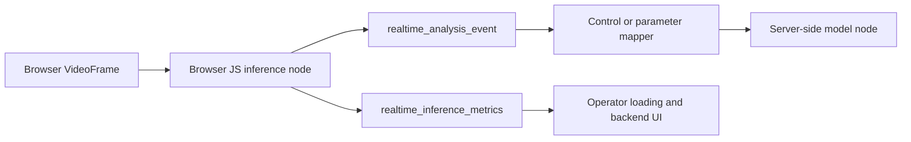

# Browser JS Realtime Inference

Browser-local realtime inference lets lightweight TF.js, MediaPipe-compatible, and Transformers.js-style models analyze frames in the operator browser or Electron renderer without moving core session ownership into the UI.

## Placement Matrix

Use the protocol placement matrix in `@nodetool/protocol` as the source of truth:

- `operator_browser`: remote browser runtime with camera/WebRTC access, browser model cache, WebGPU/WebGL/WASM/CPU backends.
- `electron_renderer`: desktop renderer runtime with browser APIs and Electron packaging constraints.
- `node_backend`: TypeScript backend process for non-browser custom realtime logic.
- `server_worker`: server-side model worker such as the Python worker or a future dedicated GPU worker.

Browser-local nodes must declare `realtime_profile.browser_capable`. Nodes that require camera frames should declare `requires_browser_frame`; nodes that cannot fall back from WebGPU should declare `requires_webgpu`.

## Event Flow

Browser analysis outputs stay off the media plane. Only raw pixel/audio buffers use `VideoFrame`, `AudioFrame`, or `RealtimeFrame`.

`realtime_analysis_event` carries structured outputs such as hand landmarks, pose landmarks, classifications, captions, or embeddings. The event includes the emitting node, optional frame reference, and JSON payload. It is routed by `session_id` like other realtime session messages.

`realtime_inference_metrics` carries loading progress, selected backend, fallback backend, cache hit/miss, warm-state readiness, model source, and throughput. It is separate from transport `realtime_metrics` so WebRTC/media health and model inference health can be displayed independently.

## Turning Browser Outputs Into Graph Inputs

Browser-local analysis should become graph input through an explicit control or parameter mapping step:

- Analysis nodes emit `realtime_analysis_event` with a stable `event` name and payload.
- A mapper selects values from the payload and produces parameter updates for server-side realtime nodes.
- Server-side model nodes receive parameter updates through the existing realtime parameter path.
- Media adapters continue to receive only raw video/audio frames.

This keeps browser inference opt-in, inspectable, and reversible. If a browser model cannot load, the session can continue with media transport and server-side nodes while the operator sees the model loading error and fallback backend state.

## Package Boundary

Browser-specific inference code belongs in `packages/realtime-browser/`. Keep browser model dependencies and loader code out of `packages/realtime-nodes/`, which remains the server/runtime media and control node package.
