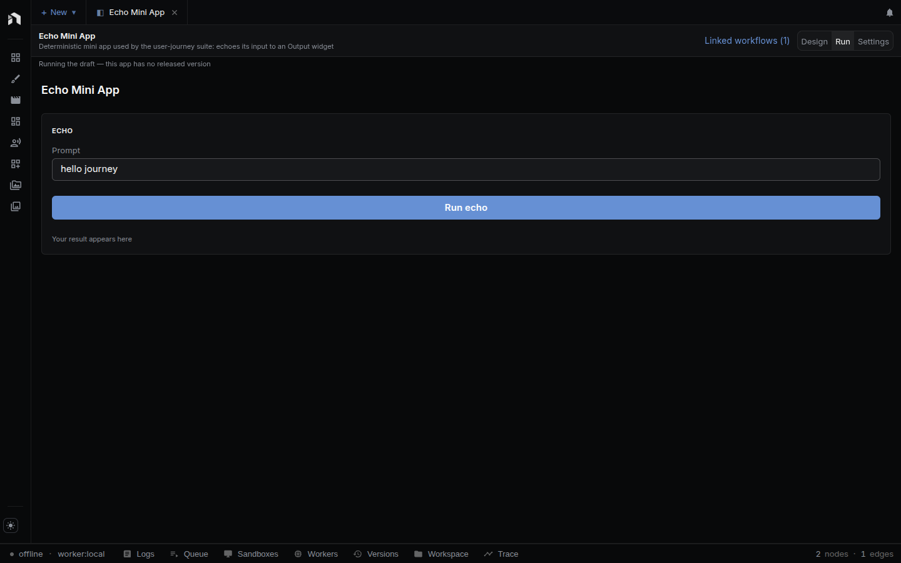
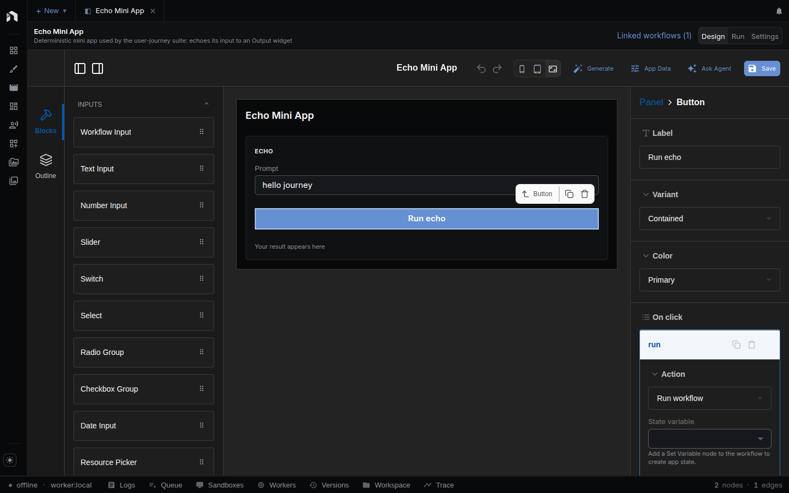
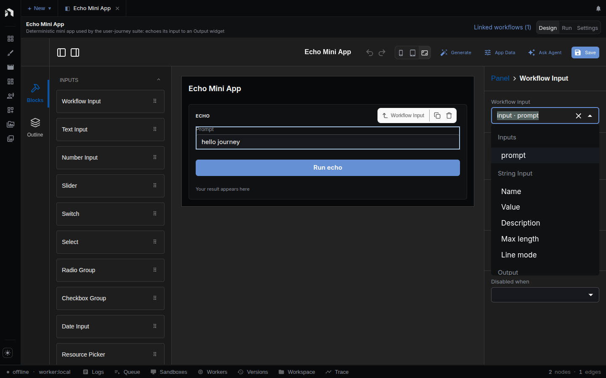

App Builder is the **Design** view of an app tab. You drag widgets onto a canvas,
wire them to the inputs and outputs of the workflows the app runs, and save.

This page covers the editor itself. For what Mini Apps are and how they run, see
[Mini Apps](mini-apps.md); for step-by-step recipes, see
[Building Mini Apps](mini-apps-guide.md); for every widget and setting, see the
[Reference](mini-apps-reference.md).

## What it does

- Lays out the app screen: boxes, fields, buttons, and result displays.
- Wires widgets to the Input and Output nodes of the workflows the app runs.
- Runs a workflow from a button, or when a field changes.
- Shows results as they stream in.
- Publishes a version that locks in the current state of every workflow it runs.

## Where it fits

A Mini App is how your work reaches people who shouldn't have to read a node
graph. App Builder wraps one or more workflows in a screen: fields feed the
workflow's inputs, buttons start runs, and result widgets show what comes back.

See [Key Concepts → How everything fits together](key-concepts.md#how-everything-fits-together).

## Open it

1. Open the **Apps** panel in the left sidebar.
2. Click an app, or create one with **New app** or **New app from workflow**.
3. On the app tab, switch to **Design**.

**Run** shows the app the way its users see it. **Settings** holds the name,
description, versions, and spending limit.

## Build an app

1. Check that each workflow has the Input and Output nodes the app needs. Open
   one from the **Linked workflows** menu; it opens as its own workflow tab.
2. Add fields — Text Input, Number Input, Slider, Switch, Select.
3. Wire each field to the matching Input node.
4. Add a Button with the **Run workflow** action, pointing at the workflow to
   run.

   

5. Add result widgets — Text, Markdown, Image, JSON, Progress.
6. Wire each result widget to the matching Output node.
7. Click **Save**.

## Letting the agent do it

The assistant sits on the right of Design, Run, and Settings. It can read the
app's workflows, add widgets, wire them up, declare operations and variables,
and even edit a graph when the app needs new Input, Output, or Variable nodes.

Good prompts describe the result you want:

> Build a compact app with all inputs on the left, a run button below them, and
> outputs on the right.

## Wiring

The picker lists what each workflow actually offers. Wiring points at node ids,
so renaming a node doesn't break the app.

| Widget kind | Wires to |
| --- | --- |
| Fields the user edits | A workflow input (`op:<opId>/in:<nodeId>`) or a node setting |
| Result displays | A workflow output (`op:<opId>/out:<nodeId>`) or a variable |
| Toggles and selects | A variable (`var:<variableId>`) |

Wiring that points at nothing is reported as an error, both in the editor and in
`nodetool app debug`. The full list is in the
[Reference](mini-apps-reference.md#bindings).

## Several workflows in one app

Each workflow the app runs is an **operation**, edited under **Operations**. Give
each one its own input and output wiring, its own rule for overlapping runs, and
an optional time limit. Buttons point at an operation by name, so a two-step app
is two operations and two buttons — not two apps.

## Publish and share

**Publish** in Settings takes a snapshot: it saves the screen and locks in the
current state of every workflow the app runs, so the published app keeps working
while you keep editing the drafts. **Export bundle** writes the app and its
workflows to one JSON file, which imports elsewhere as a working app.

## Related topics

- [Mini Apps](mini-apps.md) — concepts and runtime
- [Building Mini Apps](mini-apps-guide.md) — recipes per use case
- [Mini App Reference](mini-apps-reference.md) — widgets, bindings, schema
- [Workflow Editor](workflow-editor.md)
- [Chat & Agents](global-chat-agents.md)
