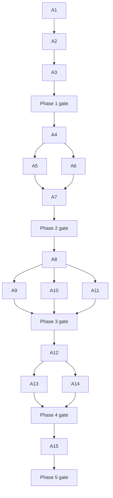

# App Runs Instances and Run Observability Implementation Plan

**Status:** Implementation reference. Phases 1–4 are integrated. Phase 5 remains planned.
**Design:** [App runs design](app-runs-design.md).

Implement the five design phases through the assignments below. Each assignment
names its dependencies, file ownership, handoff, and observable acceptance
criteria. The coordinator dispatches only assignments whose dependencies have
landed and verifies each phase before starting the next.

The checked-in design includes D15 and D16 and the expanded content policy.
The remaining assignments follow those decisions. Additional choices below
are proposals for detailed design.

## Execution rules for the coordinator

The coordinator owns integration, shared contract changes, phase gates, and
updates to [the harness registry](../packages/cli/src/harness/registry.ts).
Dispatch one bounded assignment per fresh sub-agent context. Split a task
further when its implementation no longer fits one reviewable change, retaining
its acceptance criteria and dependency edges.

| Code | Rule |
|---|---|
| A0.1 | Give every agent this plan, its assignment code, dependencies, and the relevant area instructions. Read [Development Standards](DEVELOPMENT_STANDARDS.md) first. |
| A0.2 | Use separate worktrees and branches for concurrent agents. Agents edit only their assigned files. In a shared worktree, serialize mutations. |
| A0.3 | The coordinator owns shared barrels, migrations, capability registration, router registration, harness registration, and package manifests. An agent supplies its required edits for integration instead of racing another agent on them. |
| A0.4 | Freeze protocol contracts after A1. An agent proposing a contract change supplies the reason, affected consumers, and a migration plan. The coordinator updates the contract before dependent work continues. |
| A0.5 | Return changed paths, the public interface, acceptance evidence with command exit statuses, remaining limitations, and follow-up dependencies. Do not mark a task done because its code compiles. |
| A0.6 | Use scripted providers and existing app/debug execution fixtures. Phase checks must require neither paid generation calls nor provider credentials. |
| A0.7 | Follow [mandatory verification](../AGENTS.md#mandatory-post-change-verification) on every integrated code change. Do not replace it with the full aggregate test suite. |
| A0.8 | Update guidance when behavior changes. Instructions belong in `AGENTS.md`, with the required sibling `CLAUDE.md`. Run `npm run check:agents-docs` after instruction changes. |

Backend agents read [package rules](../packages/AGENTS.md), with
[model rules](../packages/models/AGENTS.md) for persistence and
[agent rules](../packages/agents/AGENTS.md) for capabilities and sandbox work.
Frontend agents read [web rules](../web/src/AGENTS.md), the relevant linked
overlays, [Design System](DESIGN.md), and
[Primitives Strategy](../web/src/components/ui_primitives/STRATEGY.md).
Privacy-copy work also reads [marketing rules](../marketing/AGENTS.md) and
[Brand Guidelines](BRAND.md).

## Current implementation seams

These inspected files establish the starting points. Re-read them before
editing because other branches may change them.

| Area | Starting point | Consequence for implementation |
|---|---|---|
| App state | [variablePersistence.ts](../web/src/components/appbuilder/runtime/variablePersistence.ts), [useAppRuntime.ts](../web/src/components/appbuilder/runtime/useAppRuntime.ts) | Preserve invocation isolation and message folding while moving authority to the server. |
| App billing | [application-budget.ts](../packages/models/src/application-budget.ts), [invocation schema](../packages/models/src/schema/application-budgets.ts) | Reservations count unfinished work at its estimate. Run history must preserve this behavior. |
| App execution | [server app runner](../packages/execution/src/service/app-run-server.ts), [script app runner](../packages/agents/src/js-script-app-runner.ts), [job execution](../packages/websocket/src/session/job-execution.ts) | The debug kernel runner currently persists nothing. Script execution creates its own context. Both need explicit run inheritance. |
| Context | [ProcessingContext](../packages/runtime/src/context.ts) | `copy()` shallow-copies the variable bag. A run handle stored in it can be shared, but later assignments to a copied bag do not update the parent. `getSecret()` already tracks resolved values. |
| Generation attachment | [generation lifecycle](../packages/execution/src/generation-lifecycle.ts), [durable generation models](../packages/models/src/durable-generation.ts), [attachment schema](../packages/models/src/schema/generation-attachments.ts) | An attachment requires `output_id`. Persist the run association when accepting work, then attach outputs as they become available, including recovery. |
| Tracing | [telemetry.ts](../packages/runtime/src/telemetry.ts), [trace-exporters.ts](../packages/runtime/src/trace-exporters.ts), [tracing helpers](../packages/runtime/src/tracing-helpers.ts) | The tracer currently stays null without an external sink. `TraceRecord` describes finished spans, so live starts need a separate envelope. |
| HTTP ancestry | [http-tracing.ts](../packages/websocket/src/lib/http-tracing.ts), [server.ts](../packages/websocket/src/server.ts) | HTTP tracing is registered before authentication. Ownership cannot be checked at that existing hook without changing lifecycle ordering. |
| Agent calls | [base-provider.ts](../packages/runtime/src/providers/base-provider.ts), [capability invocation](../packages/agents/src/capabilities/invoke.ts), [activity reporter](../packages/agents/src/capabilities/agent-activity.ts) | Instrument the shared dispatch paths and preserve async-generator, cancellation, permission, and activity-message behavior. |
| Read surfaces | [execution services](../packages/execution/src/service/index.ts), [capability registry](../packages/agents/src/capabilities/registry.ts), [jobs capability](../packages/agents/src/capabilities/jobs.ts) | Business rules belong in execution. Transport and tool wrappers must call the same implementation. |
| UI trace | [TraceStore](../web/src/stores/TraceStore.ts), [TracePanel](../web/src/components/panels/TracePanel.tsx), [AgentActivityWidget](../web/src/components/appbuilder/puck/AgentActivityWidget.tsx) | Migrate trace input without removing processing messages needed by runtime widgets. |
| Privacy | [personal-data registry](../packages/models/src/personal-data-registry.ts), [personal-data handlers](../packages/models/src/personal-data.ts), [storage maintenance](../packages/models/src/storage-maintenance.ts), [hosted policy](../marketing/src/app/privacy/page.tsx) | Schema entries alone do not implement export, erasure, parent deletion, or scheduled pruning. |

## Contracts to freeze in A1

### Run identity and persistence

Proposed implementation: expand `application_invocations` into the app-run
record, preserving the existing reservation and settlement interface. Add app
instances and run spans. A small owner-scoped run directory registers app runs,
workflow jobs, and chat turns for common queries and trace ownership. Its
physical name is settled in A1. It holds references and content-free metadata,
while existing job and chat records retain their execution responsibilities.
Every new table receives its own personal-data registry entry and handlers.

The common run envelope uses a discriminated kind: `app`, `workflow`, or `chat`.
It includes a full resource `id`, owner, origin, parent references, status,
timing, trace id, execution root span id, cost summary, and content availability.
App-specific data includes instance, app version or immutable draft snapshot,
operation, resolved inputs, variable output changes, and document references.

An app run and a child workflow job retain separate record ids. They share the
app trace, with the child's execution root identifying its subtree. A standalone
job or chat turn starts its own trace. This reconciles child records with the
design's requirement that work beneath an app stays in one tree. Deleting a
child source removes its attributable content throughout the enclosing trace,
including copies on ancestor tool and LLM spans.

Keep generated resource ids in their full 32-character form internally. Accept
only full ids, preserved named/legacy ids, or exact 12-character resource
prefixes resolved uniquely inside the caller's scope. Preserve trace and span
ids verbatim. A legacy job id is a source reference, not a new OTel or resource
id.

### Run lifecycle and instance state

The execution module exposes owner-scoped instance operations, run reservation,
operation execution, cancellation, and terminal settlement. Names are finalized
in A1. Required behavior:

| Code | Invariant |
|---|---|
| A0.9 | Persist a run and register its trace before parameter resolution or execution can fail. No provider work starts if durable reservation fails. |
| A0.10 | Use an idempotency key scoped to owner, instance, and operation. Retrying transport does not create another run or reserve spend twice. |
| A0.11 | Keep the public state machine `running → completed`, `failed`, or `cancelled`. Terminal settlement is idempotent. Preparation failure is a failed run. |
| A0.12 | Use revision checks for instance writes. Preserve the current concurrent-operation policy. A stale browser or delayed run cannot overwrite newer instance state silently. |
| A0.13 | A terminal app operation need not imply that a background generation has finished. Preserve the generation's lifecycle, retain its run association, and reconcile later cost without reopening the operation. Do not release an unresolved billing estimate prematurely. |
| A0.14 | Persist a frozen app definition and its referenced execution targets. An instance must not claim a pinned version while resolving a live, changed script or workflow. |
| A0.15 | A disconnected browser does not cancel server work automatically. Restart reconciliation closes abandoned runs using the existing execution outcome where available and records interrupted work explicitly. |

The run context contains immutable identity and a shared run-local handle for
secret values, caps, trace registration, and child associations. Capture that
handle when background work is accepted. Explicitly inherit it through context
copies and hosts that create new contexts. Do not share unrelated mutable
variable bags or place secret values in serialized context.

### Stored spans and live delivery

Move the `TraceRecord` type and validation schema to a browser-safe protocol
module, preserving a runtime re-export. Models and web must not import the
Node exporter or OTel SDK to obtain its shape.

Stored spans have owner and run attribution, unique `(trace_id, span_id)`
identity, content-free metadata, nullable `content`, and content expiry and
truncation indicators. Run snapshots and variable outputs use the same content
classification and retention rules. A1 determines the exact content layout.

Use a discriminated live envelope for `span_started`, `span_updated`,
`span_ended`, `span_event`, and run settlement. A start is not a finished
`TraceRecord`. Delivery has a durable cursor and stable event identity, with
replay or resnapshot on reconnect. Persist accepted updates before publishing
them. Finalization merges with existing events instead of inserting duplicates.

An OTel span processor has start and end hooks, but no general event callback.
Use the shared tracing helper to append OTel events and publish their sanitized
live counterparts. End processing captures events recorded directly by other
OTel instrumentation. Keep one event identity rule so these paths converge.

### Content handling

One browser-safe `TRACE_CONTENT_KEYS` definition classifies attribute keys and
event kinds, including the existing `llm.response.content`, snapshots, outputs,
console text, tool payloads, resolved values, and exception payloads. Apply this
classification before database insertion, live publication, and external
export. Unknown fields cannot become an unclassified content channel.

Run-store sanitization applies credential masking using the run's resolved
secrets, string and payload caps, media-byte rejection, public-run content
removal, and third-party-content exclusions. Prompts and responses remain
readable when permitted. Content-free error summaries use the full error-trace
cleaning and cap rules. Inspect status messages, event attributes, resources,
exception stacks, and document labels as well as span attributes.

External file, stdout, console-exporter, and OTLP copies pass through the same
filter. `NODETOOL_TRACE_INCLUDE_CONTENT=1` is a local debugging opt-in. It never
bypasses credential redaction or public-run exclusions. Recording a logger
message as an event must not also leak its raw content to the server log.

Do not infer a trustworthy result summary from an arbitrary substring of an
email or page body. Source restrictions must survive nested tools, activity
events, and LLM messages that contain those tool results. If provenance cannot
be separated, omit content for the affected call rather than copying it through
another span.

## Assignment map and dependencies

| Code | Phase | Assignment | Blocked by |
|---|---|---|---|
| A1 | 1 | Freeze contracts and persist instances and run reservations | None |
| A2 | 1 | Execute durable app operations with inherited context and generation links | A1 |
| A3 | 1 | Make server instance state authoritative in the app runtime | A2 |
| A4 | 2 | Store registered OTel spans and publish sanitized live records | Phase 1 gate |
| A5 | 2 | Complete privacy lifecycle, retention, disclosure, and hosted cleanup | A4 |
| A6 | 2 | Register workflow jobs and chat turns, and secure incoming ancestry | A4 |
| A7 | 2 | Instrument scripts, capabilities, agent loops, LLMs, and logs | A5, A6 |
| A8 | 3 | Implement common run readers and tRPC | Phase 2 gate |
| A9 | 3 | Expose runs through capabilities and MCP CodeAct | A8 |
| A10 | 3 | Expose runs through the CLI | A8 |
| A11 | 3 | Persist debug app invocations and migrate job-log reads | A8 |
| A12 | 4 | Ingest browser spans and instrument browser execution | Phase 3 gate |
| A13 | 4 | Render Trace and Logs from stored and live records | A12 |
| A14 | 4 | Restore AgentActivity and wire trace and chat links | A12 |
| A15 | 5 | Add instance management, run history, and comparison tabs | Phase 4 gate |

Parallel work is bounded to A5 with A6, A9 with A10 and A11, and A13 with A14.
A4's privacy primitives land before writers expand. A7 starts after both A5
and A6, so new content instrumentation cannot precede its retention and access
controls. Agents may research dependent tasks early, but code against frozen
contracts only.



## Phase 1 Run records and instance state

### A1 Freeze contracts and persist instances and run reservations

**Owner:** Persistence and protocol agent, with coordinator review.
**Files:** `packages/models/src/schema/`, `schema-pg/`, new instance/run models,
`application-budget.ts`, protocol run schemas, and a new execution run module.
Shared migration and barrel changes go through the coordinator.

Build an owner-scoped instance that pins a frozen app definition and can reserve
a durable run. Expand the invocation record without changing unsettled spend
accounting. Preserve legacy invocation ids and nullable historical fields.
Backfill only facts available in existing rows. Do not invent historical input
snapshots, spans, or instances for spend records.

Reconcile the supplied design with `app-runs-design.md`, settle the proposed
run-directory layout, and answer Q1 through Q4 below in the contract handoff.
Implement instance CRUD and duplication, revision checks, registration,
idempotent reservation/settlement, and parent cleanup interfaces. Duplicate
variables and the pinned definition into a new instance, without duplicating
history or media records.

Use both database dialects and the versioned migration chain. Keep the frozen
SQLite baseline unchanged. Add direct owner registry entries and working export
and erasure handlers when tables are introduced. Phase 1 snapshots already
contain personal data, so apply redaction, public exclusion, and run-record
retention here. Update hosted disclosure before enabling these new snapshots.
The full trace disclosure and content sweep are completed in A5.

**Acceptance:** A model/execution test creates and duplicates instances, checks
owner isolation and revisions, reserves the same idempotency key twice, settles
once, and reads the result. An unsettled reservation still counts at its estimate.
Migration upgrade tests preserve old billing totals and legacy rows. Schema
parity and personal-data audits pass. New resource ids round-trip through full
and 12-character forms, with ambiguous and cross-owner prefixes rejected.

**Handoff:** Frozen schemas, execution interfaces, physical table mapping,
default caps and reader limits, migration evidence, and fixture constructors.

### A2 Execute durable app operations with inherited context and generation links

**Owner:** Execution agent.
**Files:** New execution app-run orchestration, `service/app-run-server.ts`,
`session.ts`, `generation-lifecycle.ts`, `generation-tracker.ts`, recovery paths,
`agents/src/js-script-app-runner.ts`, and websocket app/job/script adapters.

Make server execution the common operation path for workflow and script targets.
Open the record first, resolve inputs against the pinned definition, execute
with the run handle, persist variable output changes and document references,
and close with status, error, timing, and cost. The host injects script execution
because execution cannot import agents. Keep kernel-only simulations available
for the app build harness.

Preserve browser-only operations through authenticated reserve/update/complete
interfaces over the same records. They need durable history in phase 1 even
though their browser spans arrive in phase 4. Validate their output writes and
keep server-calculated billing separate from browser-reported state.

Derive origin and owner from trusted host/session context. Visitor sessions
always produce `public` runs with no content. Preserve the deployed-app command
allowlist, pinned graphs, and finite spend budgets. Public execution cannot name
another instance or inherit an owner's private variables.

Persist generation-to-run association at acceptance. Once output rows exist,
create idempotent `target_type: "app_run"` attachments. Recovery and callbacks
use the persisted association, not a live `ProcessingContext`. Deleting the run
before output arrival prevents attachment resurrection. Assets and generation
records remain in the library.

Use existing cost accounting as the authority. Do not sum an LLM ledger charge,
a generation charge, and parent span rollups for the same spend. Carry
`AbortSignal`, deadline, permission gate, storage adapters, and shared secret
masking through child contexts. Reconcile interrupted reservations after restart.

**Acceptance:** A scripted workflow and a script operation each create one run
before execution, with correct inputs, outputs, origin, cost, and terminal status.
Copied and newly constructed child contexts retain identity. A key resolved in
a child is masked in sibling and parent output. Preparation failure, timeout,
cancel, retry, and interrupted execution leave readable records. A deterministic
generation fixture attaches after output creation and after recovery. Deleting
the instance/run removes attachments while preserving generation and asset rows.

**Handoff:** Operation entry point, cancellation and completion interfaces,
transport mapping, generation-recovery fixture, and phase 1 selfcheck changes.

### A3 Make server instance state authoritative in the app runtime

**Owner:** App runtime agent.
**Files:** `web/src/components/appbuilder/runtime/`, `AppRuntimeView.tsx`,
application server-state hooks, and the required instance/run transport adapters.

Load an instance before running its operations. Write input edits and output
changes through revisioned server state. Scope client stores, pending writes,
and cache keys by account and instance. Retain localStorage only as a cache.
Import an existing local state once into an empty default instance after the
server accepts it. Never let a second browser overwrite an existing server
instance with its unrelated legacy local state.

Preserve run ownership, transport aliases, output folding, and concurrent
operation behavior. Flush input edits before starting a run. Stale revisions
produce a recoverable conflict instead of silent last-writer replacement.
Use an automatic default instance until A15 adds management controls. Keep
visitor state isolated according to the A1 contract.

**Acceptance:** Two authenticated browser sessions load the same instance state
after reload. Two instances remain isolated. Switching during a live invocation
cannot fold old messages into the new instance. Legacy cache import is
idempotent, and a stale second browser cannot overwrite server state. Test two
concurrent same-workflow invocations through the real runtime reducer.

**Handoff:** Instance-aware runtime interface and evidence for the phase 1 gate.

## Phase 2 Server trace store and content policy

### A4 Store registered OTel spans and publish sanitized live records

**Owner:** Telemetry agent.
**Files:** `packages/runtime/src/telemetry.ts`, `tracing-helpers.ts`,
`trace-exporters.ts`, protocol trace contracts, models span persistence, and
execution run-store wiring. Server/bootstrap and websocket registration are
coordinator edits.

Register the run-store processor whenever a database-backed execution host
starts, including desktop, CLI, server debug, and in-product agent hosts.
External-only diagnostic hosts may still export without a database. Avoid
initializing telemetry in a disabled state before the run processor is attached.
Registered runs are sampled for storage even without external sinks.

Store only traces registered to an owner and run. Use durable registration
across workers, with bounded caching and deletion invalidation. Preserve
concurrent trace isolation. Implement upserts, event identity, cursor replay,
batching, flush, shutdown, and bounded backpressure. A slow observer must not
block execution or allocate an unbounded queue.

Build `TRACE_CONTENT_KEYS`, secret masking, caps, safe summaries, public
exclusion, media rejection, and external-copy filtering before accepting any
content. Default new content producers to disabled until the phase 2 gate.
Cap exhaustion may stop new spans/events but must still allow final root
status, timestamps, and truncation flags to persist.

Prevent recursion when span-store writes, logger hooks, or processor failures
are themselves instrumented. Surface recording failures as a bounded,
content-free diagnostic and run trace-incomplete flag. Do not report a complete
trace after dropping a batch. Run reservation failures still prevent execution.

**Acceptance:** With all external sink variables absent, a reserved app run
stores a root and children. An unrelated API request is absent. Concurrent
traces do not mix. Replay and repeated finalization produce no duplicate spans
or events. Caps preserve final status. Flush persists completed records and
store failure reports incompleteness. JSONL, stdout, legacy console export,
and an in-memory OTLP-export test contain no classified content by default.

**Handoff:** Processor bootstrap, sanitized write interface, event/replay
contract, cap behavior, and keyless phase 2 fixture.

### A5 Complete privacy lifecycle retention disclosure and hosted cleanup

**Owner:** Data lifecycle agent.
**Files:** Models personal-data registry/handlers, storage maintenance, protocol
settings, config setting catalog, parent deletion paths, hosted privacy policy,
deployment environment configuration, and related documentation.

Implement `runTraceRetentionDays` with the design's 30-day default. Prune
content from spans, events, input/output snapshots, and copied transcript data.
Mark expiry explicitly. Retain only cleaned, capped, content-free summaries
until `terminalJobRetentionDays` removes finished run records. Test different
retention settings so deletion does not conceal a broken content-only prune.
Active instance variables remain working state, subject to instance/account
deletion rather than historical trace pruning.

Wire deletion from messages, threads, workflows, jobs, apps, instances, runs,
and account erasure. Include parent-attributed copies on ancestor spans.
Invalidate registrations before late writers can restore deleted content.
Account export includes permitted trace content and expiry/truncation state.
Keep billing evidence, generations, and assets according to their existing
registry dispositions.

Give span and directory tables their own `user_id`. Enable RLS and test owner
reads for all new exposed tables. Keep browser writes behind authenticated
server routes. Inspect grants as well as policies because
[Supabase distinguishes table privileges from row policies](https://supabase.com/docs/guides/database/postgres/row-level-security).
Tests must use non-bypass roles, not only the server's privileged connection.

Update hosted policy sections 5, 6, and 11 in the phase 2 change that enables
trace content. Describe captured content, account-linked run actions, and both
retention settings. Verify `NODETOOL_STORAGE_AUTO_CLEANUP=1` in the hosted
deployment path and prove the scheduled sweep executes without an API request.
Document operator queries selecting metadata only, and owner-requested support
as the condition for reading content.

Update [observability standards](DEVELOPMENT_STANDARDS.md#17-observability) to
permit the bounded owner-only run store while retaining credential masking and
content exclusion from external sinks. Preserve the error trace no-content rule.

**Acceptance:** Export and erasure cover every new table. A synthetic clock
prunes content before records, and summaries remain content-free. Each parent
deletion removes its content, including late-write and ancestor-copy cases.
Public runs remain content-free with local content opt-in enabled. Postgres
tests show owner access, foreign-owner denial, and no visitor write/read path.
Schema/registry audits pass and a hosted-config test exercises automatic cleanup.

**Handoff:** Privacy acceptance matrix, retention behavior, migration policy
tests, disclosure diff, and deployed cleanup configuration evidence.

### A6 Register workflow jobs and chat turns and secure incoming ancestry

**Owner:** Run lifecycle and transport agent.
**Files:** Execution session/run registration, websocket job execution,
`session/chat-turn.ts`, chat lifecycle persistence, `lib/http-tracing.ts`, and
run-aware transport schemas.

Register standalone workflow jobs and chat turns before execution and open
`workflow.run` and `chat.turn`. Child jobs retain the app trace and identify
their subtree in the directory. Associate chat turns with the relevant message
and thread ids so deletion can remove their copies. Preserve existing spans on
agent execution and planning.

Move incoming `traceparent` extraction to a point where authentication is
resolved. Validate W3C ids and continue only a trace registered to the caller
and the intended run. Foreign, unregistered, malformed, and visitor-supplied
ancestry starts a fresh trace. Apply equivalent checks to websocket execution
metadata. Never accept client `user_id`, origin, or run identity as authority.

Define the ancestry bootstrap for phase 4 now: reserve an owner run through an
unparented request, return server-registered trace/span identifiers, then let the
browser use `ui.action` as the parent of the execution request. `app.run` remains
the execution root. Exclude the reservation request from that run's trace and
avoid an intervening HTTP span between `ui.action` and `app.run`.

**Acceptance:** Standalone jobs and chat turns survive process restart as
registered run records. Child jobs share the app trace with correct ancestry.
Two users sending the same trace id cannot join the same run. The rejected
request executes or fails under its own trace and adds zero records to the
other owner's trace. Visitor sessions cannot read, subscribe, or inject spans
despite authenticating as the app owner. Startup ordering is covered by a real
server-hook test.

**Handoff:** Registered source kinds, root/subtree rules, owner-check helper,
and browser reservation contract.

### A7 Instrument scripts capabilities agent loops LLMs and logs

**Owner:** Agent and provider observability agent.
**Files:** Runtime provider and tracing helpers, agents capability invocation,
script execution and activity reporter, existing agent span sites, generation
and render entry points, and the config logger hook.

Add `script.run`, `capability.call`, `generation`, render spans, `agent.loop`,
one `agent.round` per round, and `tool.call` at the shared call paths. Keep
permission denial, validation failure, returned tool errors, thrown failures,
and cancellation visible. Provider overrides must use the same instrumentation
contract. Do not create a second loop to obtain spans.

Capture permitted request messages, tool names, and responses on chat and
stream spans. Streaming content is bounded while accumulated. Exclude media
bytes and third-party bodies across tool, reporter, request, and response paths.
Use the shared resolved-secret handle for provider keys, OAuth values, and
sandbox `getSecret` results. Preserve async-generator context across yields,
tool callbacks, abort, and early iterator closure.

Write script console output, node logs, warnings, and AgentActivity text/tool
results as sanitized events. Keep existing processing messages for widgets.
Config cannot import runtime: add an injected logger observer/filter that
runtime wires to the active span. Guard logger recursion and prevent raw
run-content duplication in file/stderr output.

**Acceptance:** A keyless scripted operation stores `app.run → script.run →
capability.call → agent.loop → agent.round → llm.*` and correctly parented
tool calls. Console and activity events survive reload. Non-streaming and
streaming requests/responses obey caps. Tool failures and early iterator close
end their spans. Dynamic secrets are absent from database, live frames, and
external copies. Email/google/browser fixtures cannot reappear in LLM or
activity content. Existing permission and cancellation tests still pass.

**Handoff:** Span/event naming catalog, permitted content fixtures, and phase
2 acceptance evidence. Enable normal content recording only after the phase 2
gate and disclosure ship together.

## Phase 3 Common run readers for agents and CLI

### A8 Implement common run readers and tRPC

**Owner:** Run query agent.
**Files:** New execution runs module and service exports, models bounded
queries, protocol reader schemas, and a websocket tRPC runs router.

Implement the five reader operations from design section 4.9. Derive owner
from authenticated context. Include every specified filter on `list_runs`,
bounded pagination, summary-first `get_run`, focused/depth/name/error trace
queries, ascending filtered logs, and bounded cancellable `await_run`.

The summary reports the first failed span and its ancestor path, cost by
provider, slowest spans, counts by name, attached generations/documents, and
expiry/truncation/incompleteness. Define deterministic tie-breaking for failures
and timings. Cap summary output independently of the run's span cap. Build the
tree and aggregate with indexed queries and linear traversal, without one
query per span. Handle missing parents, incomplete trees, and malformed browser
ancestry without cycles or recursion overflow.

Return content only for explicit authorized drill-down under fixed limits.
Readers must distinguish absent content, expiry, public exclusion, truncation,
and incomplete recording. Never recover pruned content from older job logs.

**Acceptance:** Direct module and tRPC queries return equivalent data for the
same app run, standalone job, and chat turn. A deliberately failed fixture names
the expected span and path. Large traces stay bounded. Full and compact resource
ids work across adapters, while OTel ids stay unchanged. Foreign-owner, unknown,
and ambiguous queries fail consistently. Waiting handles terminal, timeout,
abort, and deletion without leaking listeners.

**Handoff:** Reader interfaces, JSON examples, limits and cursors, shared
failure fixture, and tRPC contracts.

### A9 Expose runs through capabilities and MCP CodeAct

**Owner:** Capability agent.
**Files:** New `packages/agents/src/capabilities/runs.ts` and `runs.specs.ts`,
CodeAct module declarations, MCP wrapper integration, and shipped
`nodetool-troubleshooter/SKILL.md`. Coordinator applies registry/coverage edits.

Expose `list_runs`, `get_run`, `get_run_trace`, `get_run_logs`, and `await_run`
as `nodetool.runs.*` inside `execute_code`. Keep wrappers limited to validation,
owner extraction, service dispatch, and resource-id compaction. Supply coverage
entries as required by the capability registry. Update the troubleshooter to
start from `get_run` and drill down by named span ids for app, workflow, and chat
failures.

**Acceptance:** Execute real capability calls through the CodeAct/MCP adapter
with the 12-character ids returned upstream. Results match A8, and trace/span
ids are never shortened. A failed run is returned as readable run data rather
than accidentally becoming a tool transport failure. Unauthorized calls fail.

**Handoff:** Capability specs, coverage edits, tool examples, and skill update.

### A10 Expose runs through the CLI

**Owner:** CLI agent.
**Files:** New `packages/cli/src/commands/runs.ts`, command registration edits,
CLI tests, and `docs/cli.md`/`docs/harnesses.md` updates.

Implement `runs list`, `show`, `trace`, `logs`, and `tail`, with JSON output,
documented filters, trace focus/depth, log filters, and cancellation. `tail`
uses the same durable live stream and cursor as the UI, resuming after reconnect
and ending with terminal status. Handle stored terminal runs immediately.
Define machine-readable streaming output separately from one-result JSON.

**Acceptance:** `nodetool runs show <id> --json` parses as the A8 contract and
names the fixture's failed span. List/trace/log filters match module results.
Tail shows new spans/events in order without duplicates after reconnect and
exits on completion or Ctrl-C. Compact ids resolve inside the configured owner.

**Handoff:** CLI commands, exit/streaming semantics, and the phase 3 selfcheck.

### A11 Persist debug app invocations and migrate job-log reads

**Owner:** Debug integration agent.
**Files:** Execution app-debug simulator/types/service, websocket debug adapter,
agents debug runner wiring, CLI app-debug wiring, and `capabilities/jobs.ts`.

Route executing `debug_app` operations through A2 with origin `debug`. One
operation invocation produces one app run, so multi-operation reports return
the related run ids rather than inventing one run for an entire test script.
Keep static `run: false` validation free of execution records. Resolve unsaved
documents and bundles using the immutable snapshot behavior agreed in Q1.
Do not require importing a bundle or publishing a draft merely to debug it.

For jobs with registered traces, `get_job_logs` reads A8. Use `job.logs` only
when no trace exists for the older job. An expired or empty stored trace does
not authorize fallback to an old content copy.

**Acceptance:** An executing debug request returns readable run ids with origin
`debug`, including failed operations. The person can list them through tRPC.
Inline-draft and saved-app targets execute the snapshot checked by the harness.
Static checks remain unchanged. Legacy jobs use the old logs, traced jobs use
the store, and pruning cannot restore content via fallback.

**Handoff:** Debug result contract, legacy compatibility tests, and phase 3
fixture integration.

## Phase 4 Browser spans and run inspection

The [phase 4 harnesses](harnesses.md#run-inspection-phase-4) cover owner-scoped
browser ingestion, cold-start ancestry, stored trace and log inspection,
activity replay, and run/span chat references. Browser content waits until
execution finishes so the host can redact it with resolved credentials.
Metadata can stream earlier. Browser runs claim a durable server root through
`POST /api/runs/:id/browser-start`, then upload finished records through
`POST /api/runs/:id/spans`. Both routes reject visitor sessions.

### A12 Ingest browser spans and instrument browser execution

**Owner:** Browser instrumentation agent.
**Files:** New recorder under `web/src/lib/`, app runtime parameter/fold paths,
in-browser workflow instrumentation, websocket span-ingest route, protocol
validation, web error reporting, and required Electron error-context wiring.

Use A6 reservation before creating `ui.action`. Dispatch execution with its
`traceparent`, then batch completed browser `TraceRecord` spans. Instrument
`ui.resolve_params`, `ui.fold`, `ui.widget_error`, in-browser `workflow.run`,
and `node.process`. Keep recorder state per invocation rather than a global
mutable current span. Attach widget errors only when their output can be
attributed to a run.

Validate owner, session class, matching trace/run, ids, timestamps, payload
size, and the bounded recent-close window. Cap and sanitize browser records
through A4. Deduplicate retried batches and prevent a browser span id from
overwriting a server span. Mark browser provenance as server-validated metadata.
Reject cycles/self-parenting, record missing parents safely, and validate focus
ids within their run. Refuse visitor sessions on REST and websocket paths.

Add `trace_id` and `app_run_id` to the error context allowlist, preserving the
error-trace no-content rule. Use bounded batching, cleanup on instance change,
and an explicit lost-batch indicator. Do not add the OTel web SDK or a direct
`WebSocket` instance.

**Acceptance:** A real browser-triggered operation stores `ui.action` as the
direct parent of `app.run`. An in-browser workflow writes its node spans to
the same registered trace. Retry causes no duplicate records. A second account,
visitor session, old run, wrong trace, oversized payload, cyclic ancestry, and
server-span overwrite are rejected. A widget failure links its error trace to
the run without copying prompt content. Build inspection confirms no OTel SDK
enters the browser bundle.

**Handoff:** Recorder and ingestion contracts, browser fixture, and replay
evidence for the phase 4 gate. Freeze the run/span focus interface for A13 and
A14 before dispatching those agents in parallel.

### A13 Render Trace and Logs from stored and live records

**Owner:** Run inspection UI agent.
**Files:** `TraceStore.ts`, `TracePanel.tsx`, new Logs/run-picker components,
run server-state queries, trace client subscriptions, and bottom-panel wiring.

Keep durable records and live projections in TanStack Query. TraceStore holds
the selected run, span and view. Remove its
processing-message trace fold after migrating trace consumers. Keep runtime
`node_update`, `chunk`, and `output_update` processing. One recent-run picker
lists app, workflow, and chat records after reload and drives both views.

Render the tree, timeline, duration, cost, status, browser lane, focused failed
span, and flat logs with level/source/span filters. Merge stored and live data
by identity and cursor. Recover gaps by replay or resnapshot. Virtualize long
lists and distinguish partial, truncated, expired, and public-without-content
states. Use primitives and tokens, including required migrations in touched UI.

**Acceptance:** The same tree/events render live, after reconnect, and after
reload. Switching runs while either is active cannot mix records. Logs and Trace
refer to the same span/event identities. Every picker/filter/focus control has
a keyboard path. A large capped trace remains usable without rendering every
row. Existing operation widgets continue receiving processing messages.

**Handoff:** Run picker and focus interface, store migration evidence, and
component/E2E checks. Implement the focus contract frozen in A12. A14 consumes
that contract without editing these files.

### A14 Restore AgentActivity and wire trace and chat links

**Owner:** Activity UI agent.
**Files:** `AgentActivityWidget.tsx`, app error/result actions, chat context
entry wiring, and activity server-state helpers. Shared runtime edits go through
the coordinator to avoid collisions with A13.

Render stored A7 activity events for completed or reloaded operations. Preserve
live processing activity while the current invocation runs and deduplicate the
transition to stored events. Key activity by run and loop/tool-call identity.
Show content expiry and truncation without fetching old transcripts elsewhere.

Wire “View trace” and error links to the run/span focus interface. “Ask the
agent” opens chat with typed run and optional span references, allowing the
agent to call `get_run` without copying the transcript into the chat prompt.

**Acceptance:** A completed capability loop retains text/tool activity after
reload. Two concurrent loops and two instances remain isolated. Trace links
select the correct run/span. Ask the agent delivers identifiers and the agent's
read call resolves them. Expired content shows expiry rather than empty success.

**Handoff:** Activity replay tests and run/span chat-context examples.

## Phase 5 History and instances UX

### P0 Completion contracts

Extend the integrated paths. Application IDs and instance IDs remain separate
fields. A historical selection is inspection state and never writes into the
working instance. Advancement is explicit, owner-authorized, revision-checked,
and affects future execution without rewriting historical runs. Draft preview
uses a distinct frozen working copy created when preview is requested.

History metadata comes from the common runs service. Fetch bounded content only
for a selected run. Keep typed document and media references and use existing
media resolution. Closing a tab does not delete an instance or cancel server
work. Visitor sessions cannot manage owner instances.

The coordinator owns shared protocol, exports, routers, migrations, harness
registration, and host integration. Agents work in separate worktrees and
handoff changed paths, contracts, exact commands and exit statuses, acceptance
evidence, and remaining limitations.

### R1 Repair operation recovery

**Owner:** Run-reader integration agent. **Dependencies:** P0.

Enrich app list records with the same content-free instance, operation,
application, and pinned-version metadata as detail records. Use a join or a
bounded batch, never per-row detail queries. Add an optional `operation_id`
filter and recover activity with instance plus operation and `limit: 1`.
Preserve cursor ordering, owner scope, prefix resolution, and absent legacy
metadata. A live invocation still wins in the working app.

**Acceptance:** A real execution restores its trace link automatically after
reload. List and detail agree. More than 500 unrelated runs do not require a
client scan. Removing enrichment fails the reload regression.

### R2 Separate draft preview and version advancement

**Owner:** App execution/version agent. **Dependencies:** P0.

Resolve chosen published releases and dependencies on the server. Reuse frozen
snapshots and revision-checked model updates. Validate variables, bindings, and
reserved input/output maps. Preserve compatible values, initialize new defaults,
and reject incompatible or stale changes without partial writes. An older
concurrent invocation keeps its snapshot and cannot overwrite advanced state.
Preview identity includes the frozen draft and execution targets. Display the
loaded instance version and offer explicit advancement when a release is newer.

**Acceptance:** A version-1 instance stays pinned after version 2 is published.
Draft preview leaves it unchanged. Advancement changes future runs only.

### A15 Complete instance management and history

| Assignment | Owner | Dependencies | Deliverable |
|---|---|---|---|
| A15.1 | Instance API/client state | R2 | Metadata-only paginated instance lists and revision-aware management hooks through existing services. Flush pending writes before duplication or switching and retain visible conflicts. |
| A15.2 | Workspace navigation | A15.1 | Central instance-aware run-tab identity, separate editor identity, explicit prop chain, and migration/validation of persisted legacy tabs. |
| A15.3 | Instance-management UI | A15.2 | Name/version header, New, Rename, Duplicate, Delete, and advancement using existing primitives. Switching opens the instance tab. |
| A15.4 | Run-history data | R1 | Common history metadata, authoritative cost availability, bounded thumbnails, typed documents, and explicit content queries with distinct cache keys. |
| A15.5 | History/inspection UI | A15.2, A15.4 | Read-only results and explicit selected-run activity. Existing Trace/Logs and Ask the agent actions reference that run. |
| A15.6 | Integration/harness | A15.3, A15.5 | Real deterministic execution/persistence journey, independent acceptance checks, and updated design documentation. |

New instances use app defaults. Duplication copies the frozen definition and
working values, creates no history, and reuses media references. Deletion removes
history and associations while retaining library media. Deleted or inaccessible
instances show a recoverable state rather than substituting another instance.

History inspection mounts no executable historical app. It makes no instance
writes and never substitutes the latest run for an explicitly selected run.
Document links open the current document unless a historical revision exists.
Expiry, suppression, missing data, truncation, and unsettled cost remain distinct.
Never reconstruct expired content from another store or cache.

**Acceptance:** Create two named instances, run different inputs, inspect an old
result without mutation, reload both tabs and activity, open the exact trace,
advance one instance, and delete the other history while retaining media. Also
verify same-workflow concurrency and cancellation isolation, duplication without
history, draft preview isolation, stale/incompatible advancement, late completion
after deletion, visitor restrictions, owner/account cache isolation, and large
paginated histories. Removing instance identity must fail the two-instance test.

Diff views, sharing, run bundles, and unrelated navigation tracing remain out of
scope.

## Phase gates and verification

The coordinator extends one deterministic app-run fixture through all phases.
Use a real app/script execution path, database, and processing context, with
scripted provider and generation transport adapters. Persist the deliberate
failure case as a fixture. Do not mock the run module, store processor, auth
check, or message reducer being verified.

| Code | Gate | Required evidence |
|---|---|---|
| A16.1 | Phase 1 | Read back a scripted app run and its generation attachment. Verify server state on reload, context inheritance, spend reservation, owner isolation, and deletion preserving media. |
| A16.2 | Phase 2 | With no external sink, read one stored trace containing app/script/capability/LLM spans. With a JSONL sink, prove classified content is absent externally. Foreign ancestry adds zero spans. Public runs contain no content. Retention, erasure, direct-role RLS, and scheduled hosted cleanup pass before content activation. |
| A16.3 | Phase 3 | Run `nodetool runs show <id> --json` on the deliberate failure and assert the named failed span/path. Compare execution, tRPC, CodeAct/MCP, and CLI contracts. Debug-created run ids and legacy-log fallback work. |
| A16.4 | Phase 4 | Drive a browser action and read the stored `ui.action → app.run` relation. Trace/Logs and AgentActivity survive reload. Unauthorized ingestion and subscriptions fail. |
| A16.5 | Phase 5 | Drive two instances with separate variables/history through comparison tabs, reload, and deletion. Assets remain available. |

Add or extend selfchecks and surface paths in the harness registry as each
phase lands, following [Adding a surface](HARNESS_FIRST.md#adding-a-surface-or-a-harness).
Prove each new check detects a deliberately invalid fixture before restoring
valid input. File audits must assert that they inspected records. Register
backend and browser checks separately where their prerequisites differ.

After building packages, every integrated code change runs:

```bash
npm run build:packages
npm run test:affected
npm run typecheck
npm run lint
npm run dev:nodetool -- harness gate --base origin/main
```

Run additional affected suites only for dependencies selection misses. Database
changes also run schema/migration parity and personal-data audits. RLS changes
need a real Postgres test under owner/foreign/anonymous roles. Browser acceptance
uses the existing Playwright/E2E runner and keyless server fixture. See
[Harness Reference](harnesses.md#nodetool-harness-registry-coverage-audit-and-the-gate)
and [Web Testing](../web/TESTING.md). Record unavailable environment-dependent
checks as gaps, not passes.

Keep trace content capture disabled until phase 2's complete privacy change can ship.
After that gate, run-store recording is always on. External copies stay opt-in.
Use expand, migrate callers, then remove compatibility code. Do not maintain
parallel trace shapes or independent app-log panels after migration. Preserve
only the documented legacy `job.logs` fallback and invocation billing interface.

## Questions to settle in the A1 handoff

These do not block writing the plan. They block only the affected implementation
until the detailed contract records an answer.

| Code | Question | Proposed default |
|---|---|---|
| Q1 | How do unsaved drafts, shipped examples, and inline debug bundles acquire a pinned app identity, and how does an instance advance versions? | Keep an immutable owner-scoped snapshot of the document and execution targets without publishing. Explicitly opt into latest on a new run, with revision validation and variable compatibility checks. Preserve prior run snapshots. |
| Q2 | What state can a deployed visitor persist when public runs must contain no visitor content? | Keep visitor runtime variables session-local and isolated from owner instances. Record a metadata-only public instance/run association when needed. Never persist visitor input/output copies in instance variables or debug snapshots. |
| Q3 | What fixed limits and retention precedence apply to attributes, events, spans, browser batches, summaries, drill-down, and recent-close ingestion? | Centralize named constants with bounded reader defaults. Apply the same writer caps across server/browser and report truncation/expiry. If record retention is shorter than content retention, record deletion wins. |
| Q4 | How are copied third-party tool results attributed for pruning and exclusion? | Track source references through tool/activity/LLM content. Omit content when provenance cannot be separated. Deleting a child parent also removes attributed copies on enclosing spans. |

## Scope boundaries

This plan includes durable app instances and operation runs, generation links,
server/browser/agent traces, common readers, retention and deletion, run
inspection, and history/comparison tabs. It does not add instance sharing,
a dedicated diff view, run bundle export, or tracing for unrelated UI activity.
Do not turn the legacy server-log size problem into a separate log-management
project. Deliver scoped, bounded run events through this store.
