Every user-facing view in NodeTool across the web app, desktop (Electron), and mobile. Each entry links to the detailed docs page and shows the current screenshot. Missing or pending screenshots are marked with a placeholder.

> **Contributors:** See [SCREENSHOTS.md]({{ '/SCREENSHOTS' | relative_url }}) for the capture plan and guidelines.

---

## Top-Level Views (Web App)

Routes live under `/` in the web app. They're also the main destinations inside the desktop app.

### Dashboard / Portal — `/dashboard`

The home screen. Search, recent workflows, templates, and quick chat.

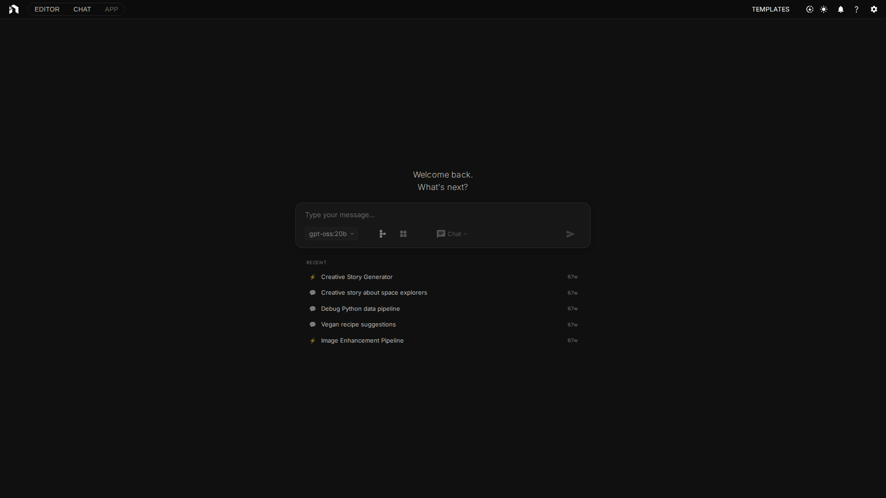

Docs: [User Interface → Dashboard]({{ '/user-interface#dashboard' | relative_url }}) · [Getting Started]({{ '/getting-started' | relative_url }})

### Login — `/login`

Authentication screen for cloud (Supabase) deployments. Skipped automatically in local-only mode.

Docs: [Authentication]({{ '/authentication' | relative_url }})

### Workflow Editor — `/editor/:workflow`

The main visual editor. Build workflows by connecting nodes on an infinite canvas, with panels on every edge.

Docs: [Workflow Editor]({{ '/workflow-editor' | relative_url }}) · [Editor Panels]({{ '/editor-panels' | relative_url }})

### Chain Editor — `/chain/:workflowId?`

A linear, card-based alternative to the node graph. Better for simple pipelines and guided authoring.

Docs: [Chain Editor]({{ '/chain-editor' | relative_url }})

### Workflow Graph View — `/graph/:workflowId`

Read-only visualization of a saved workflow. Useful for sharing, embedding, and review.

Docs: [Workflow Graph View]({{ '/workflow-graph-view' | relative_url }})

### Global Chat — `/chat/:thread_id?`

Conversational AI with multi-thread history, agent mode, tools, and workflow integration.

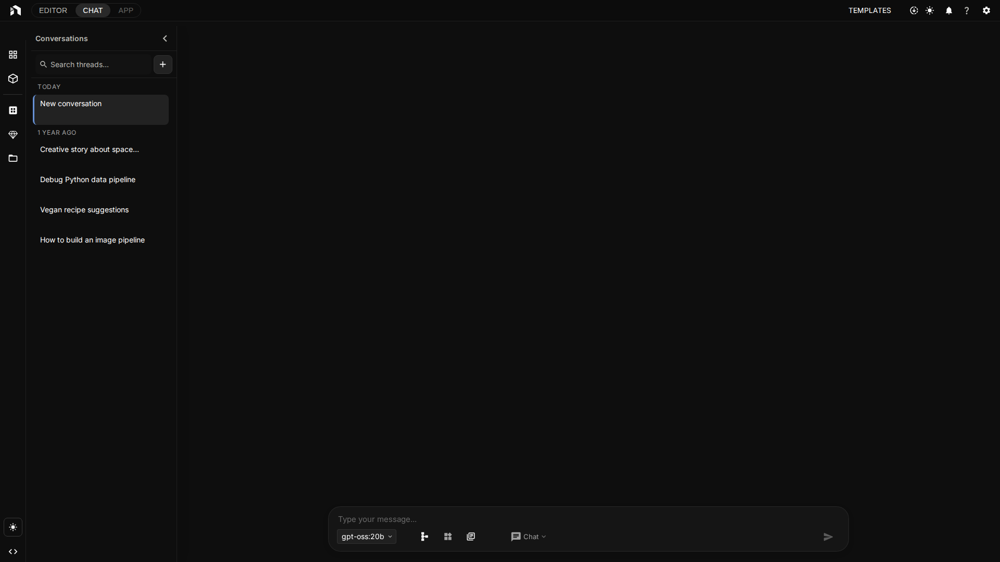

Docs: [Global Chat]({{ '/global-chat' | relative_url }})

### Standalone Chat — `/standalone-chat/:thread_id?`

A slim, focused chat window — same engine as Global Chat but without the full app shell.

Docs: [User Interface → Standalone Chat]({{ '/user-interface#standalone-chat-window' | relative_url }})

### Mini-Apps Page — `/apps/:workflowId?`

Run saved workflows through simplified form UIs inside the main app.

Docs: [User Interface → Mini-Apps]({{ '/user-interface#mini-apps' | relative_url }})

### Standalone Mini-App — `/miniapp/:workflowId`

A dedicated full-window Mini-App runner. Launched from the tray on desktop or by a direct link.

Docs: [User Interface → Mini-Apps]({{ '/user-interface#mini-apps' | relative_url }})

### Asset Explorer — `/assets`

Browse, search, organize, and tag every file used in your workflows.

Docs: [Asset Management]({{ '/asset-management' | relative_url }})

### Asset Editor — `/assets/edit/:assetId`

Full-featured image editor for assets. Crop, paint, and transform without leaving NodeTool.

Docs: [Image Editor]({{ '/image-editor' | relative_url }})

### Collections — `/collections`

Group related documents into indexable collections for RAG workflows.

Docs: [Collections]({{ '/collections' | relative_url }}) · [Indexing]({{ '/indexing' | relative_url }})

### Templates Gallery — `/templates`

Ready-to-use example workflows organized by tag and use case.

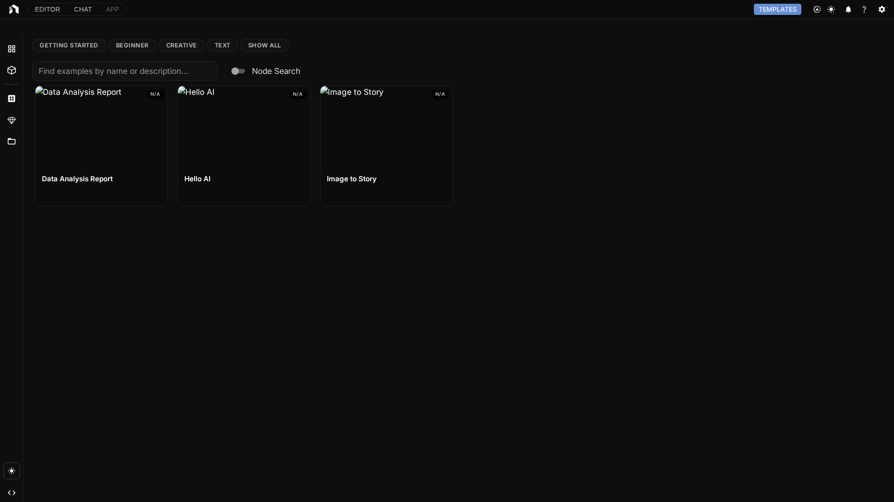

Docs: [Templates Gallery]({{ '/templates-gallery' | relative_url }})

### Models Manager — `/models`

Find, install, filter, and manage local and cloud AI models.

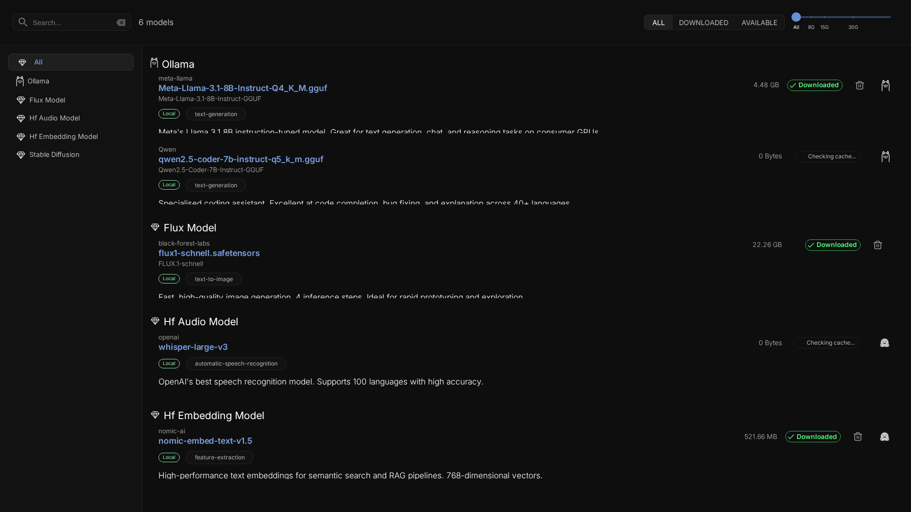

Docs: [Models Manager]({{ '/models-manager' | relative_url }})

---

## Editor Panels and Surfaces

Visible inside the Workflow Editor at `/editor/:workflow`.

### App Header

Top navigation with logo, workspace switcher, Models button, Assets button, Chat, Settings, and the download indicator.

Docs: [User Interface → App Header]({{ '/user-interface#the-app-header' | relative_url }})

### Left Panel (Workflows, Chat, Assets, Collections, Packs, VibeCoding)

Collapsible drawer with tabs for navigating workspace content without leaving the canvas.

Docs: [Editor Panels → Left Panel]({{ '/editor-panels#left-panel' | relative_url }})

### Node Menu (Space / double-click)

Search, browse categories, and insert nodes onto the canvas.

Docs: [Workflow Editor → Finding Nodes]({{ '/workflow-editor#finding-nodes' | relative_url }})

### Right Panel (Inspector)

Tabs for node properties, workflow assistant, logs, jobs, trace, agent, version history, and workspace tree.

Docs: [Editor Panels → Right Panel]({{ '/editor-panels#right-panel-inspector' | relative_url }})

### Bottom Panel (Terminal, Trace, Jobs, Logs)

Runtime diagnostics dock — quick access to the terminal, execution trace, job queue, and raw logs.

Docs: [Editor Panels → Bottom Panel]({{ '/editor-panels#bottom-panel' | relative_url }})

### Floating Toolbar

Context-sensitive actions that appear over the canvas (run, pause, resume, stop, layout).

Docs: [Editor Panels → Floating Toolbar]({{ '/editor-panels#floating-toolbar' | relative_url }})

### Node Canvas

The infinite work surface where nodes are placed and connected.

Docs: [Workflow Editor → Canvas Basics]({{ '/workflow-editor#canvas-basics' | relative_url }})

### Tabs Bar

Switch between open workflows without losing state.

Docs: [Workflow Editor → Multiple Workflows]({{ '/workflow-editor#multiple-workflows' | relative_url }})

### Context Menus (Node, Edge, Canvas, Selection)

Right-click menus for every object on the canvas.

Docs: [Workflow Editor → Context Menus]({{ '/workflow-editor#context-menus' | relative_url }})

### Find in Workflow

Dialog for searching within the current workflow.

Docs: [Workflow Editor → Finding Nodes]({{ '/workflow-editor#finding-nodes' | relative_url }})

### Command Menu (`⌘K` / `Alt+K`)

Global command palette — go anywhere, run anything.

Docs: [User Interface → Command Menu]({{ '/user-interface#command-menu' | relative_url }})

### Workflow Assistant Chat

Side-panel chat that can read and modify the open workflow.

Docs: [Global Chat → Workflow Integration]({{ '/global-chat#workflow-integration' | relative_url }})

### VibeCoding Modal

AI-assisted custom UI generator for workflows.

Docs: [VibeCoding]({{ '/vibecoding' | relative_url }})

---

## Dialogs and Modals

All dialogs live inside the main app. Most are reachable from the App Header, right-click menus, or `⌘K`.

### Settings Dialog (General / Providers / Folders / Secrets / Remote / About)

Central configuration surface with a persistent sidebar.

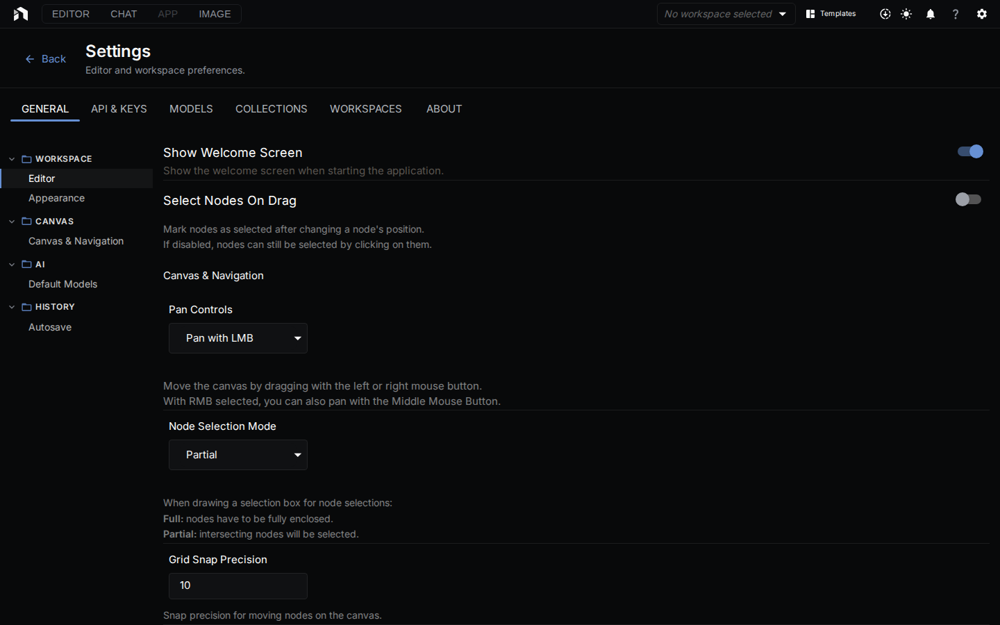

Docs: [Configuration]({{ '/configuration' | relative_url }})

### Provider API Keys

Paste API keys for OpenAI, Anthropic, Google, Mistral, Groq, Replicate, and more.

Docs: [Configuration → API Keys]({{ '/configuration#api-keys' | relative_url }}) · [Models & Providers]({{ '/models-and-providers' | relative_url }})

### Recommended Models Dialog

Opens from the "Missing Model" indicator on nodes.

Docs: [Models Manager → Recommended Models]({{ '/models-manager#recommended-models' | relative_url }})

### Model Selection Dialogs (LLM, Image, Video, TTS, ASR, Embedding, HuggingFace)

Type-aware model pickers for each property role.

Docs: [Models & Providers]({{ '/models-and-providers' | relative_url }})

### Download Manager

Track, retry, and pause model and asset downloads.

Docs: [Models Manager → Downloading Models]({{ '/models-manager#downloading-models' | relative_url }})

### Model README

In-app HuggingFace README viewer.

Docs: [HuggingFace Integration]({{ '/huggingface' | relative_url }})

### Delete Model Confirmation

Safety prompt before removing a model from the local cache.

Docs: [Models Manager → Managing Models]({{ '/models-manager#managing-models' | relative_url }})

### Open / Create Workflow Dialog

Start a new workflow or open an existing one.

Docs: [Getting Started]({{ '/getting-started' | relative_url }})

### Workflow Form

Edit workflow metadata — name, description, thumbnail, tags.

Docs: [Workflow Editor]({{ '/workflow-editor' | relative_url }})

### Workflow Delete Confirmation

Safe delete with an undo window.

Docs: [Workflow Editor]({{ '/workflow-editor' | relative_url }})

### Quick Add Node

Add a node without opening the full Node Menu — useful when chaining off a connection.

Docs: [Workflow Editor → Adding Nodes]({{ '/workflow-editor#add-nodes' | relative_url }})

### Node Picker (Chain Editor)

Pick the next card in a linear chain.

Docs: [Chain Editor → Adding Steps]({{ '/chain-editor#adding-steps' | relative_url }})

### File Browser Dialog

OS-style browser for picking folders and files inside the app.

Docs: [Configuration]({{ '/configuration' | relative_url }})

### Confirm Dialog

Generic yes/no prompt used across the app.

Docs: N/A — reusable primitive.

### Image Compare Dialog

Side-by-side comparison for before/after image workflows.

Docs: [Image Editor]({{ '/image-editor' | relative_url }})

### Color Picker Modal

Rich color picker with harmony, swatches, gradients, and contrast check.

Docs: [Workflow Editor → Color Picker]({{ '/workflow-editor#color-picker' | relative_url }})

### Text / Code Editor Modal

Expanded editor for long string properties with syntax highlight.

Docs: [Workflow Editor]({{ '/workflow-editor' | relative_url }})

### DataFrame Editor Modal

Inline spreadsheet-style editor for tabular properties.

Docs: [Workflow Editor]({{ '/workflow-editor' | relative_url }})

### Image Editor Modal (Node-level)

In-context image editor invoked from image properties and outputs.

Docs: [Image Editor]({{ '/image-editor' | relative_url }})

### Node README / Help

Documentation viewer for individual nodes and the "What's this?" tooltips.

Docs: [Node Reference]({{ '/nodes/' | relative_url }})

---

## Mobile App Screens (iOS / Android / Web)

All mobile screens are documented in [Mobile App]({{ '/mobile-app' | relative_url }}).

### Mobile Dashboard

Entry point showing connection status and quick actions.

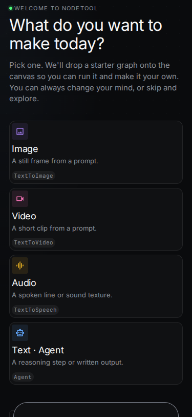

### Mobile Mini-Apps List

Browse mini-apps published by your server.

### Mobile Mini-App Runner

Run an individual mini-app with touch-first controls.

### Mobile Chat

Conversational AI with streaming, model picker, and threads.

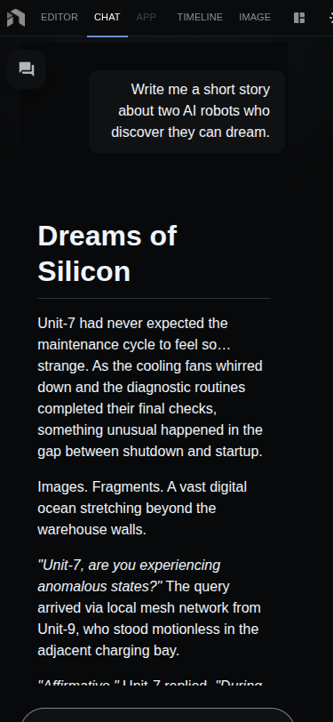

### Mobile Graph Editor

Touch-friendly read/write workflow editor.

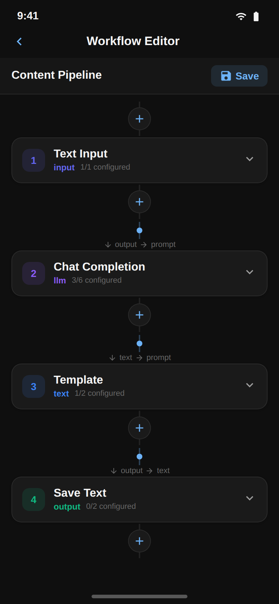

### Mobile Graph Editor — Empty State

Empty canvas prompting the first node.

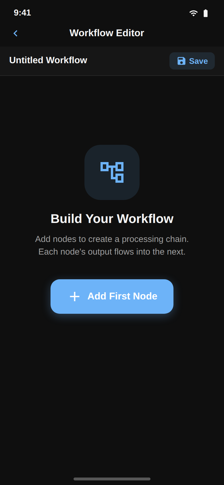

### Mobile Graph Editor — Node Picker

Node picker optimized for touch.

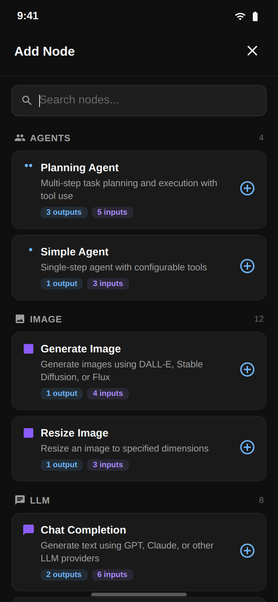

### Mobile Graph Editor — Chain

Linear chain layout for small screens.

### Mobile Settings

Configure the server URL, storage, and appearance.

### Mobile Language Model Selection

Choose the default LLM for chat.

### Mobile Dashboard (Tablet)

Expanded layout on tablet form factors.

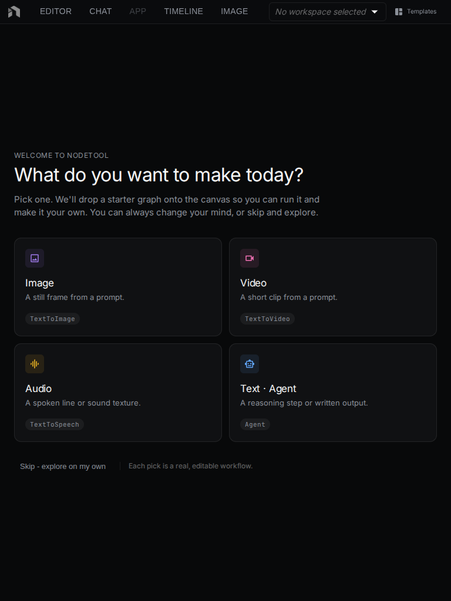

---

## Electron Windows and Menus

These are specific to the desktop app shipped via Electron.

### Boot Message / Splash

Shown while the embedded Python and backend services start.

Docs: [Electron Views]({{ '/electron-views' | relative_url }})

### Install Wizard

First-run wizard for installing Python, Conda, and core AI runtimes.

Docs: [Electron Views → Install Wizard]({{ '/electron-views#install-wizard' | relative_url }})

### Package Manager Window

Manage installed node packs and optional runtimes.

Docs: [Node Packs]({{ '/node-packs' | relative_url }}) · [Electron Views → Package Manager]({{ '/electron-views#package-manager' | relative_url }})

### Log Viewer Window

Tail of the backend log from inside the desktop app.

Docs: [Electron Views → Log Viewer]({{ '/electron-views#log-viewer' | relative_url }})

### Update Notification

In-app toast when a new desktop update is available.

Docs: [Electron Views → Updates]({{ '/electron-views#updates' | relative_url }})

### Workflow Execution Window (frameless)

A floating, chromeless window for pinned workflow runs on macOS/Windows.

Docs: [Electron Views → Pinned Windows]({{ '/electron-views#pinned-windows' | relative_url }})

### Mini App Window

Frameless runner for mini-apps launched from the tray.

Docs: [Electron Views → Mini App Window]({{ '/electron-views#mini-app-window' | relative_url }})

### Chat Window (standalone)

Focused chat opened from the tray.

Docs: [User Interface → Standalone Chat]({{ '/user-interface#standalone-chat-window' | relative_url }})

### System Tray Menu

Quick actions: open dashboard, open chat, launch a mini-app, quit.

Docs: [Electron Views → Tray]({{ '/electron-views#system-tray' | relative_url }})

### Application Menu Bar

File / Edit / View menus for the desktop app.

Docs: [Electron Views → Menu Bar]({{ '/electron-views#menu-bar' | relative_url }})

---

## Auxiliary Views

### Component Preview (`/preview/:component?`)

Isolated render of an individual UI component — used only in local development to capture clean screenshots.

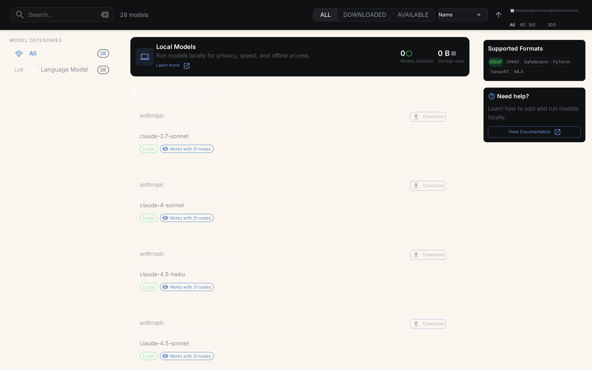

Docs: [Developer Guide]({{ '/developer/' | relative_url }})

### Node Test Page (`/node-test`)

Run every node's contract test from the browser.

Docs: [Developer Guide]({{ '/developer/' | relative_url }})

---

## How to Add a Screenshot

If you're capturing a screenshot from this list:

1. Launch NodeTool locally (`make dev` for web + backend; Electron dev via `make electron-dev`).
2. Navigate to the view and set up a clean example (no personal data, default theme).
3. Capture at **1920×1080** minimum — use 2× resolution for retina displays.
4. Save as PNG with a descriptive hyphenated name under `docs/assets/screenshots/`.
5. Replace the placeholder reference on the view's docs page and in `app-views.md`.
6. Tick the entry off in [`SCREENSHOTS.md`]({{ '/SCREENSHOTS' | relative_url }}).

See the full guidelines in [`SCREENSHOTS.md`]({{ '/SCREENSHOTS' | relative_url }}).
