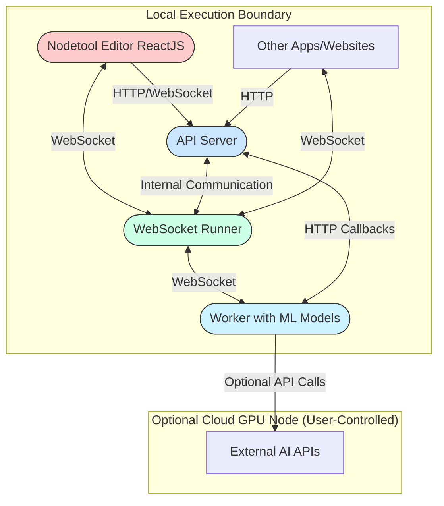

# Architecture Overview

This page explains how the pieces of NodeTool fit together. The codebase in this repository contains the client-facing pieces that interact with the backend service over a simple client‑server design. The backend (FastAPI server + WebSocket runner) is distributed separately and is **not** included in this repo.

## High Level Diagram

## Repository Structure

- **`web/`** – React application containing the main workflow editor.
- **`apps/`** – Mini‑app builder that packages workflows as standalone apps.
- **`electron/`** – Electron wrapper providing the desktop experience and system tray integration.
- **`workflow_runner/`** – Lightweight WebSocket client used to show workflow progress.
- **`examples/`** – Node.js scripts demonstrating how to call the API.
- **`scripts/`** – Helper scripts for building and releasing NodeTool.

> **Note:** The FastAPI server and WebSocket runner that power workflow execution live outside this repository. This repo ships the UI surfaces and static assets that talk to that backend.

## Data Flow

1. The **Web UI** communicates with the external API server over HTTP for management tasks (saving workflows, listing assets, etc.).
2. During execution, the UI and other clients connect to the **WebSocket Runner** (hosted alongside the backend) to receive live updates.
3. **Workers** run the individual nodes in a workflow. They can call external AI APIs such as OpenAI or Hugging Face when configured.
4. Results are streamed back through the runner to the frontends in real time.

This modular approach keeps the core editor lightweight while enabling heavy computation on dedicated workers or in the cloud.
