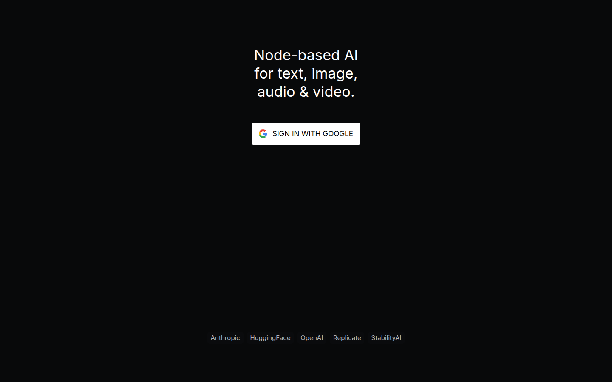

See [API Reference](api-reference.md) for a matrix of endpoints, auth requirements, and streaming behavior.
For environment variable defaults and precedence, see the [Configuration Guide](configuration.md#environment-variables-index).

## Quick Start

The server picks its mode from the environment. When **both** `SUPABASE_URL` and `SUPABASE_KEY` are set, it runs in **Supabase mode** and enforces authentication on every non-public request. Otherwise it runs in **Local mode**: loopback connections are trusted and run as user `"1"`, and non-loopback requests are rejected with `401` unless they come from a network listed in `NODETOOL_TRUST_LOCAL_NETWORKS` or carry a valid access token.

```bash
# Local mode: loopback trusted
nodetool serve

# Supabase mode: auth enforced on every request
export SUPABASE_URL=https://your-project.supabase.co
export SUPABASE_KEY=your-service-role-key
nodetool serve
```

---

## Authentication Modes

The server does not read an `AUTH_PROVIDER` variable. The mode comes only from the presence of both Supabase variables (`packages/websocket/src/server.ts`).

- **Supabase mode.** The server validates a Supabase JWT on every non-public request, over HTTP and WebSocket.
- **Local mode.** `LocalAuthProvider` maps requests to user `"1"`. Loopback connections bypass auth (gated by `NODETOOL_TRUST_LOCALHOST`). Other sources are rejected with `401` unless a trust rule or a valid access token applies.

> `AUTH_PROVIDER` is only written into deployed-container environments by the `@nodetool-ai/deploy` tooling. The server itself never branches on it.

In Supabase mode the web UI shows a sign-in screen before anything else loads:



Supabase token verification results are cached in-process. The cache defaults to a 60-second TTL and at most 2000 entries. These are constructor options on `SupabaseAuthProvider` and are not configurable through environment variables.

---

## Sending Credentials

Clients send the credential as `Authorization: Bearer <token>`. For WebSocket connections the server also accepts a `?api_key=<token>` query parameter when the header is absent.

```bash
curl -H "Authorization: Bearer $TOKEN" http://localhost:7777/v1/models
```

```bash
curl -H "Authorization: Bearer $TOKEN" \
  -H "Content-Type: application/json" \
  -X POST http://localhost:7777/v1/chat/completions \
  -d '{
    "model": "llama3.2:latest",
    "messages": [{"role": "user", "content": "Hello"}]
  }'
```

```bash
curl -H "Authorization: Bearer $TOKEN" http://localhost:7777/api/workflows/
```

### Token Types

The server recognizes these credentials. Prefixed tokens are checked before the mode's own rules.

| Token | Prefix | Works on | Notes |
|---|---|---|---|
| Supabase JWT | none | Everything | Supabase mode only. |
| Access token | `ntk_` | Everything, in every mode | Minted by a signed-in person for an agent or MCP client. Revocable. A failed check falls through to the mode's rules. |
| MCP OAuth access token | `nta_` | `/mcp` only | Issued by the MCP OAuth flow. Presented anywhere else, or after the server was rehosted, it is refused with `invalid_token`. See [MCP production](mcp-production.md). |
| App session token | `nda_` | `/ws` only | Issued to a visitor of a deployed mini app. Confined to that one app. A failed check is refused, never retried against other providers. |
| Delegated token | none | Everything, as the linked user | Used by messaging bridges. Enabled only when `NODETOOL_INTEGRATION_TOKEN` is set to 16 or more characters. |

Delegated and app session tokens are signed with keys derived from the master key, so rotating `SECRETS_MASTER_KEY` revokes every outstanding one.

---

## Public Endpoints

These paths skip session auth. They are still covered by the per-IP rate limiter.

- `GET /health`, `GET /ready`, `GET /api/health`
- `GET /api/config`
- `GET /api/nodes/metadata`
- `GET /api/assets/packages` and `/api/assets/packages/*`
- `GET /api/workflows/public`, `/api/workflows/public/:id`, `/api/workflows/examples`, and `/api/workflows/examples/*`
- `GET /api/oauth/hf/callback` and `GET /api/oauth/github/callback`
- `/api/webhooks/*`, `/api/kie/webhook*`, `POST /api/providers/fal/webhook/:token`, and `POST /api/providers/atlascloud/webhook`. These verify their own secret or signature.
- `/api/integrations/*`. Each handler requires `NODETOOL_INTEGRATION_TOKEN`.
- `GET /api/apps/:token` and `POST /api/apps/:token/session`, the deployed mini app routes (production only).
- The MCP OAuth surface: `/.well-known/oauth-protected-resource*`, `/.well-known/oauth-authorization-server*`, `/oauth/authorize`, `/oauth/token`, `/oauth/register`, and `/oauth/revoke`.
- Static web app files, when the server serves the bundled UI. Paths under `/api`, `/ws`, `/v1`, `/trpc`, and `/mcp` still require auth.

Source: `packages/websocket/src/lib/public-routes.ts`.

---

## Error Responses

A rejected HTTP request receives `401` with an `error` field.

**Missing token (Supabase mode):**

```json
{ "error": "Unauthorized" }
```

**Token rejected by Supabase:**

```json
{ "error": "<reason from the auth provider>" }
```

**Non-loopback request in Local mode:**

```json
{ "error": "Remote access requires authentication" }
```

A rejected WebSocket upgrade gets a bare `401 Unauthorized` response with no body. `/mcp` responses also carry a `WWW-Authenticate` challenge when the MCP OAuth flow can complete.

---

## Rate Limiting

Requests are limited per client IP before any token verification runs. Loopback is exempt. Excess requests receive `429`.

| Variable | Default | Effect |
|---|---|---|
| `NODETOOL_RATE_LIMIT_DISABLED` | unset | Set truthy to turn the HTTP limiter off. |
| `NODETOOL_RATE_LIMIT_MAX` | `1000` | Requests per window per IP. |
| `NODETOOL_RATE_LIMIT_WINDOW_MS` | `60000` | Window length in milliseconds. |
| `NODETOOL_RATE_LIMIT_TRUST_PROXY` | unset | Key by `X-Forwarded-For` instead of the socket address. |

WebSocket messages have their own cap (`NODETOOL_WS_RATE_LIMIT_DISABLED`, `NODETOOL_WS_RATE_LIMIT_MAX`, default 200 messages per window). Source: `packages/websocket/src/lib/http-rate-limit.ts`, `packages/websocket/src/lib/ws-rate-limit.ts`.

---

## Deploy Token Helpers

The `@nodetool-ai/auth` package defines the abstract `AuthProvider` base class (header and WebSocket token extraction, `verifyToken`), plus the `AuthResult` and `TokenType` types.

The `@nodetool-ai/deploy` package ships a separate static-token helper set in `packages/deploy/src/auth.ts`:

```ts
function getServerAuthToken(): string;   // SERVER_AUTH_TOKEN env, then deployment.yaml, then generate and save
function getTokenSource(): "environment" | "config" | "generated";
function generateSecureToken(): string;  // crypto.randomBytes(32).toString("base64url")
function verifyServerToken(auth: string): Promise<"authenticated">;  // timing-safe compare
function loadAuthConfig(): Record<string, unknown>;
function saveAuthConfig(config: Record<string, unknown>): void;  // file mode 0600
```

The token is stored as `server_auth_token` in `~/.config/nodetool/deployment.yaml` (the path is built from the home directory on every platform, including Windows).

**The running server does not call these helpers.** Setting `SERVER_AUTH_TOKEN` or creating `deployment.yaml` does not protect the API. The only gates are Supabase mode, the trust settings below, and `ntk_` access tokens. To protect a self-hosted server, use Supabase mode.

---

## Localhost Trust and Reverse Proxies

By default the server bypasses authentication for connections from loopback
(`127.0.0.1`/`::1`) and runs them as user `1`. This is convenient for the
desktop app and local development, but **dangerous behind a reverse proxy,
container network, or SSH tunnel**, where the proxy itself connects from
loopback — a blanket bypass would silently disable auth in exactly the
deployment that needs it.

To make this safe:

- The loopback bypass is gated by `NODETOOL_TRUST_LOCALHOST`. It defaults
  **off** whenever auth is enforced (Supabase mode) and **on** otherwise. Set
  it explicitly (`true`/`false`) to override.
- `X-Forwarded-For` is trusted only for proxies listed in
  `NODETOOL_TRUSTED_PROXIES` (comma-separated IPs/CIDRs). When unset, the
  header is ignored and the unspoofable socket peer address is used to identify
  the client, so a remote client cannot forge a loopback origin.

```bash
# Behind an nginx reverse proxy on the same host, enforcing Supabase auth:
export SUPABASE_URL=... SUPABASE_KEY=...
export NODETOOL_TRUSTED_PROXIES=127.0.0.1   # trust the local proxy's XFF
# NODETOOL_TRUST_LOCALHOST stays off — clients must present a valid token.
```

### Local mode in Docker

Docker NATs a published-port connection to the bridge gateway (e.g.
`172.17.0.1`), so in Local mode the request never arrives from loopback and the
`NODETOOL_TRUST_LOCALHOST` bypass can't fire — the UI loads (static assets and
`/api/config` are public) but every API/WebSocket call returns
`401 "Remote access requires authentication"`.

`NODETOOL_TRUST_LOCAL_NETWORKS` (comma-separated source CIDRs) restores the
single-local-user model by trusting those sources as user `"1"` without a token.
It is honored **only in Local mode** — in Supabase mode it is ignored so every
request must present a valid token.

> ### ⚠️ This bypasses authentication
>
> Every source IP in `NODETOOL_TRUST_LOCAL_NETWORKS` is trusted as **admin user
> `"1"` with no password** — full access to your workflows, files, stored
> secrets, and API keys. **Anyone who can reach the published port from a listed
> range gets that access.**
>
> - **`172.16.0.0/12`** — the Docker bridge range on Linux. Host and LAN clients
>   reach the app through the port mapping, but nothing off the bridge is trusted.
> - **`192.168.65.0/24`** — Docker Desktop's VM gateway subnet. Published-port
>   traffic on macOS/Windows arrives from `192.168.65.1`, not the bridge gateway,
>   so the Linux range alone leaves every call 401 there. The bundled Compose
>   file defaults to both.
> - **`0.0.0.0/0`** — trusts *every* source, the whole internet if the port is
>   reachable. **Never use this on a public IP.** Only on a network you fully
>   control (private LAN / VPN), ideally with the port firewalled.
> - Exposing NodeTool to the internet or untrusted users? **Do not widen this
>   list — enable Supabase auth** so every request needs a real login.

```bash
# Docker self-host, single user, no login (safe on a private LAN):
NODETOOL_TRUST_LOCAL_NETWORKS=172.16.0.0/12,192.168.65.0/24   # bridge + Desktop VM gateway
```

## Security Hardening

- Production: enable Supabase mode by setting `SUPABASE_URL` and `SUPABASE_KEY`, terminate TLS in front of all non-public endpoints, and rotate Supabase service-role keys via your secrets manager.
- Localhost trust: keep `NODETOOL_TRUST_LOCALHOST` off in any reverse-proxied or containerized deployment, and list only your real proxies in `NODETOOL_TRUSTED_PROXIES`.
- Staging: keep asset buckets private or signed, and run workflows in subprocess or Docker isolation.
- Development: restrict Local mode to isolated machines and avoid storing real secrets in `.env.development`.

See [Security Hardening](security-hardening.md) for detailed checklists across dev, staging, and production.
