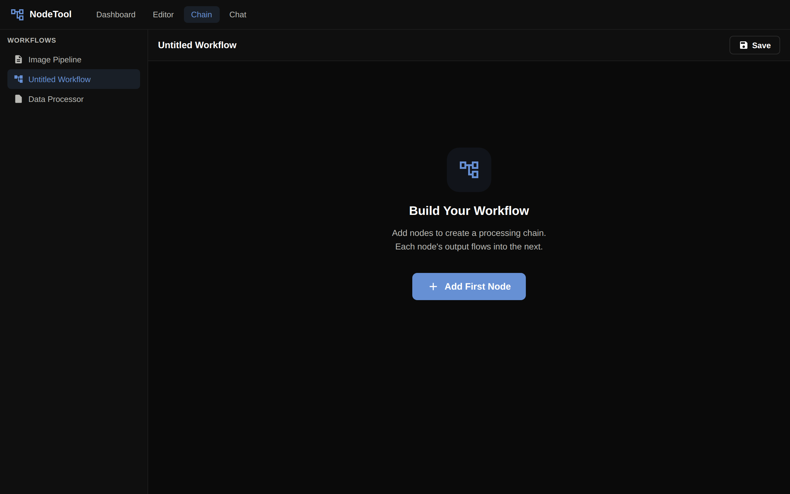
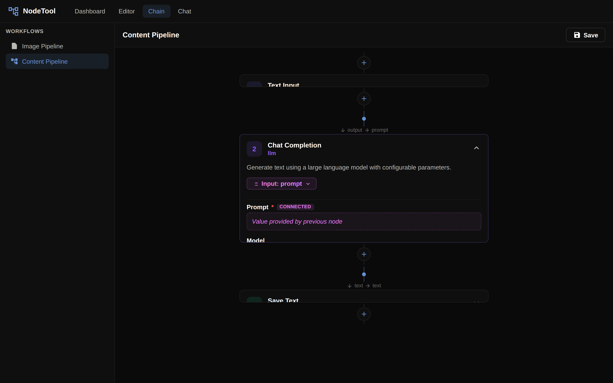
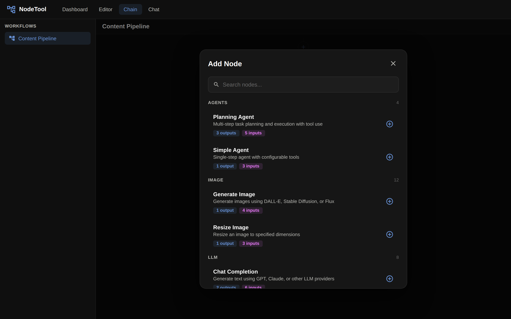
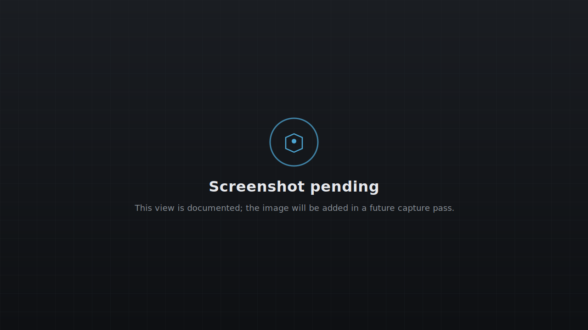
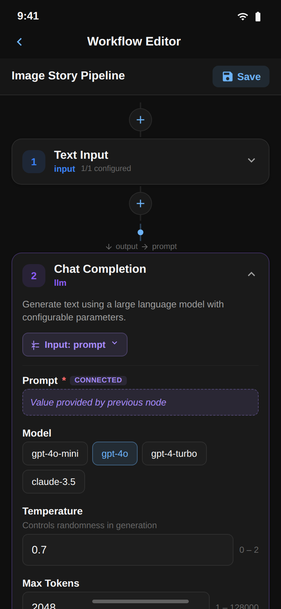

The **Chain Editor** is a streamlined alternative to the node graph. Instead of placing nodes on an infinite canvas, you compose an ordered chain of cards — perfect for linear pipelines like "transcribe → summarize → email" or "fetch → parse → index".

> **Prefer the node graph?** The full [Workflow Editor]({{ '/workflow-editor' | relative_url }}) is always one click away. Both editors read and write the same workflow format.

---

## When to Use the Chain Editor

| Use the Chain Editor when… | Use the Workflow Editor when… |
|---------------------------|--------------------------------|
| Pipeline is mostly linear | Pipeline branches or has loops |
| You're guiding a non-technical user | You need fine-grained connection control |
| You want one output per step | You need multi-output nodes |
| You're sketching a workflow quickly | You're building a production agent |

---

## Opening the Chain Editor

Navigate to `/chain/:workflowId` in the app, or click the **Chain** layout toggle from a workflow's context menu. If no workflow is provided, a fresh chain starts.

---

## Anatomy of a Chain

A chain has three elements:

1. **Cards** — each card represents a node (the step's computation).
2. **Input mapping** — a selector that chooses which output of the previous card becomes this card's input.
3. **Output selector** — a selector that decides which output is surfaced to the next card.

---

## Adding Steps

Click the **Add Node** button at the end of the chain. The **Node Picker Dialog** opens — it's filtered to show only nodes compatible with the current output type.

Pick a node and it's inserted at the end. The editor automatically wires a single input from the previous step.

---

## Editing Card Properties

Click any card to expand its properties. You get the same inspector fields as the graph editor — string inputs, model pickers, sliders, asset selectors, and so on.

Changes are saved the moment you commit a value (blur or press Enter).

---

## Reordering and Removing Cards

- **Drag** a card's handle to reorder. Connections are re-mapped automatically.
- **Delete** with the trash icon on a card, or press `Delete` when a card is focused.

Incompatible connections are highlighted in red and the editor suggests a compatible replacement.

---

## Input / Output Mapping

Each card has:

- **Input Mapping Selector** — pick which output of the previous card becomes this card's input. This is useful when a previous step returns multiple values (e.g., `text`, `metadata`).
- **Output Selector** — if this card has multiple outputs, pick the one that should flow into the next step.

Both selectors show the data type, so you can spot mismatches quickly.

---

## Running a Chain

Press **Run** at the top of the chain editor. Cards execute in order:

- A card running turns blue.
- A completed card gets a green checkmark and its output snippet appears.
- A failed card turns red and the chain halts.

Streaming output appears inline on the card in real time.

---

## Switching Between Editors

Chains are just a presentation of the underlying workflow graph — you can freely switch:

1. **From Chain → Graph**: click the graph icon in the toolbar. Any non-linear parts (branches, multiple outputs) are preserved.
2. **From Graph → Chain**: the chain view only renders the longest linear path; branches become inline cards.

No data is lost when switching views.

---

## Mobile Chain Editor

The chain layout is the default on the mobile app. See the screenshot and docs under [Mobile App → Mobile Graph Editor]({{ '/mobile-app#mobile-graph-editor' | relative_url }}).

---

## Next Steps

- [Workflow Editor]({{ '/workflow-editor' | relative_url }}) — the full graph editor
- [Cookbook]({{ '/cookbook' | relative_url }}) — linear patterns that work great in the chain editor
- [Mobile App]({{ '/mobile-app' | relative_url }}) — running chains on iOS and Android
