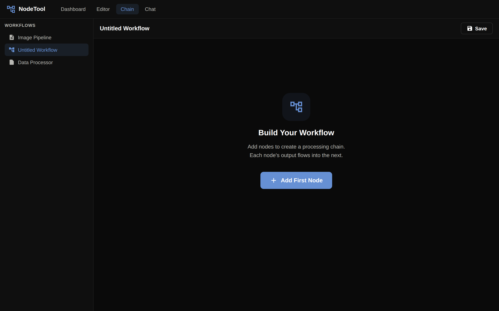
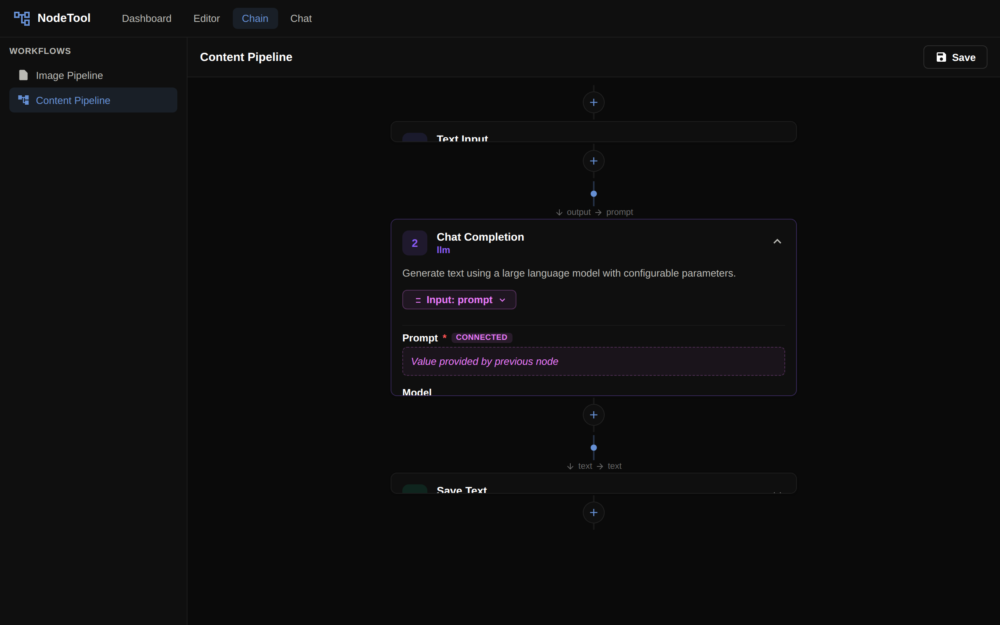
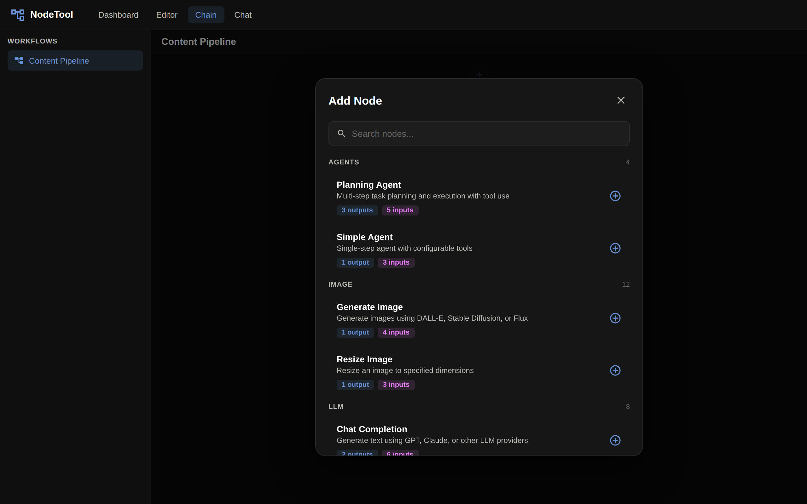

The **Chain Editor** is a linear alternative to the node graph. Instead of placing nodes on an infinite canvas, you compose an ordered chain of cards — "transcribe → summarize → email", "fetch → parse → index".

> **Prefer the node graph?** The full [Workflow Editor]({{ '/workflow-editor' | relative_url }}) is always one click away. Both editors read and write the same workflow format.

---

## When to Use the Chain Editor

| Use the Chain Editor when… | Use the Workflow Editor when… |
|---------------------------|--------------------------------|
| Pipeline is mostly linear | Pipeline branches or has loops |
| You're guiding a non-technical user | You need fine-grained connection control |
| You want one output per step | You need multi-output nodes |
| You're sketching a workflow quickly | You're building a production agent |

---

## Opening the Chain Editor

There are two entry points:

- **In a workflow tab.** Open the **⋮** (Workflow actions) menu on the composer bar and choose **Chain View**. The same menu item reads **Graph View** while the chain is showing. The choice is the `editorViewMode` setting, so it applies to every workflow tab and is remembered. The graph editor stays mounted underneath, so switching back keeps your canvas position.
- **As a page.** Go to `/chain/:workflowId` to edit a stored workflow, or `/chain` to start an empty chain called "Untitled Workflow".

---

## Anatomy of a Chain

A chain is a vertical list of numbered cards, each one a node.

1. **Cards.** The number on the left is the step number. Click the card header to expand or collapse it.
2. **Input mapping.** Every field on an expanded card can take its value from the output of an earlier step.
3. **Output selector.** A card whose node has more than one output shows a **Select output** menu. The chosen output is the one the next step is wired to by default.

A collapsed card still shows its result preview after a run. Input nodes always sit at the top of the chain and output nodes at the bottom.

---

## Adding Steps

Click the **+** between cards, or **Add First Node** on an empty chain. The **Add Node** dialog opens with a search box and a grid of quick actions. Search uses the same engine as the graph editor's node menu and is not filtered by the previous step's output type.

The node is inserted at the chosen position and the editor wires one of its inputs to the nearest earlier step that produces a matching type. It prefers that step's selected output, and prefers an input whose type matches exactly over one typed `any`. Insert into the middle of a chain and the step below follows: an input it took from the step now above the new card moves to the new card's output when the types allow.

---

## Editing Card Properties

Expand a card to see its properties. The fields are the same property editors the graph editor uses: strings, model pickers, sliders, asset selectors, and so on.

Each card also shows the node description and, in its footer, **Move up**, **Move down**, **Duplicate**, and **Remove** buttons.

In a workflow tab, every edit is mirrored into the tab's workflow immediately, so the graph view, running, and saving all see it. On the standalone `/chain` page, nothing is stored until you click **Save workflow** next to the name field.

---

## Reordering and Removing Cards

- **Move up** and **Move down** change a card's position. When a move puts a source after the step that reads it, that input mapping is dropped.
- **Remove** deletes the card and any mapping that pointed at it.
- **Duplicate** inserts a collapsed copy directly below.

There is no drag handle and no keyboard delete in the chain view.

---

## Input / Output Mapping

- **Input mapping.** Each field has a link button, **Use output from a previous step**, that opens a menu of every earlier step's outputs, not just the previous card's. Compatible outputs are listed first. Incompatible ones appear greyed out with the type they produce. A wired field shows `step · node title` and the output name instead of an editor. **Disconnect** gives the editor back. A warning icon marks a wired source whose type does not match the field.
- **Output selector.** If a card has multiple outputs, pick the one that flows into the next step.

Type compatibility uses the graph editor's connection rule, plus `int` widening to `float`.

---

## Running a Chain

Chain cards have no run button of their own. In a workflow tab, use the composer bar's **Run entire workflow** button or `Ctrl/⌘ + Enter`, which run the whole graph. Cards show live state:

- A running card pulses and shows a progress bar.
- A completed card gets a green border and check icon, and its output renders on the card.
- A failed card gets a red border and error icon.

---

## Switching Between Editors

A chain is a different view of the workflow graph.

1. **Chain → Graph.** Choose **Graph View** in the **⋮** menu. Edits made in the chain are already in the graph, and positions of nodes that existed before are kept.
2. **Graph → Chain.** The chain lists every node that has registered metadata in depth-first order from the nodes with no incoming connection, with inputs first and outputs last. Branches become extra cards, and a field wired to an earlier step shows that step as its source.

Nodes the chain cannot show, such as comments and groups, are left untouched in the graph. Saving from the standalone `/chain` page writes only the chain's nodes and lays them out in a single column.

---

## Next Steps

- [Workflow Editor]({{ '/workflow-editor' | relative_url }}) — the full graph editor
- [Cookbook]({{ '/cookbook' | relative_url }}) — linear patterns that work great in the chain editor
- [Mobile App]({{ '/mobile-app' | relative_url }}) — running Mini Apps built from your workflows on iOS and Android
