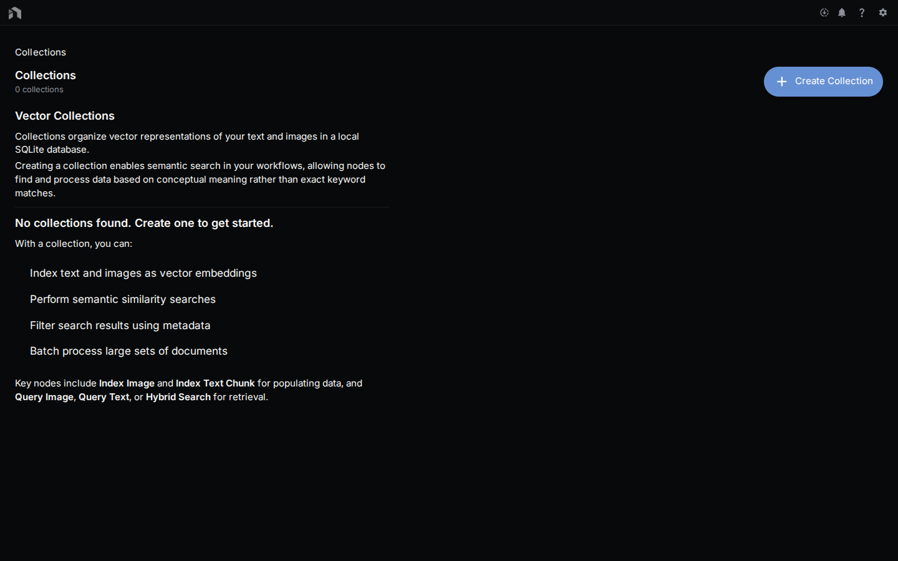

**Collections** bundle related documents into a single searchable unit. Connect a collection to an index node and any file in it — PDFs, Markdown notes, HTML, transcripts — becomes queryable from your workflows.

---

## Opening Collections

Open **Collections** from the app menu, or go directly to `/collections`. The explorer shows every collection you've created with its document count, embedding model, and ingestion workflow.

---

## Creating a Collection

1. Click **Create Collection**.
2. Give it a name.
3. Choose an embedding model. Both fields are required.
4. Drag files from your computer onto the collection tile to index them.

Collections accept any file type, but only text-extractable formats are indexed:

| Format | Extracted |
|--------|-----------|
| PDF | Text + layout (per page) |
| DOCX / DOC | Body text |
| Markdown / TXT | Raw text |
| HTML | Stripped body text |
| CSV / TSV | Rows as records |
| EPUB | Chapter text |

Unsupported formats are stored but not indexed — still handy for reference inside a collection.

---

## Managing Documents

Each collection is a tile in the explorer. From the tile you can:

- **Index** documents by dropping files onto it. Progress and any per-file errors are reported inline.
- **Change the ingestion workflow** that processes dropped files.
- **Delete** the collection and everything indexed in it.

---

## Using Collections in Workflows

Collections shine in RAG pipelines:

1. Add an index node (`vector.IndexString`, `vector.IndexTextChunk`, `vector.IndexAggregatedText`, `vector.IndexImage`, `vector.IndexEmbedding`) or a query node (`vector.QueryText`, `vector.QueryImage`, `vector.HybridSearch`) to your workflow.
2. Connect the collection to its `collection` input — the node menu will suggest the selector.
3. Run the workflow. Index nodes write into the collection; query nodes read from it.

See the [Chat with Docs example]({{ '/workflows/chat-with-docs' | relative_url }}) for the full query → format → answer wiring.

---

## Indexing Options

A collection's embedding model is chosen when you create it and is recorded on the collection. Its ingestion workflow — the workflow that runs over each dropped file — can be changed from the collection tile.

Chunking is the ingestion workflow's business, not a collection setting. The default splitter chunks at 2000 characters with 1000 characters of overlap.

See [Indexing]({{ '/indexing' | relative_url }}) for deeper tuning notes.

---

## Storage

Index data is stored alongside your workflow database in SQLite (via `sqlite-vec`). Nothing leaves your machine unless you've opted into a cloud provider for the embedding model.

For multi-user deployments, Supabase-backed collections are an option — see [Supabase Deployment]({{ '/supabase-deployment' | relative_url }}).

---

## Related Docs

- [Indexing]({{ '/indexing' | relative_url }}) — advanced chunking, hybrid search, maintenance
- [Asset Management]({{ '/asset-management' | relative_url }}) — add documents to the underlying asset library
- [Chat with Docs example]({{ '/workflows/chat-with-docs' | relative_url }}) — end-to-end RAG workflow
