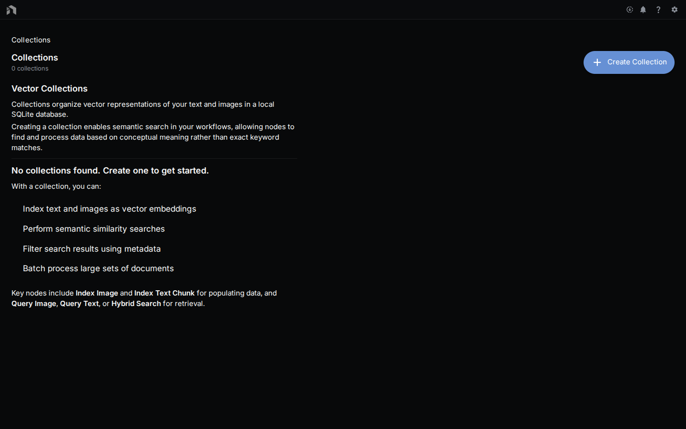
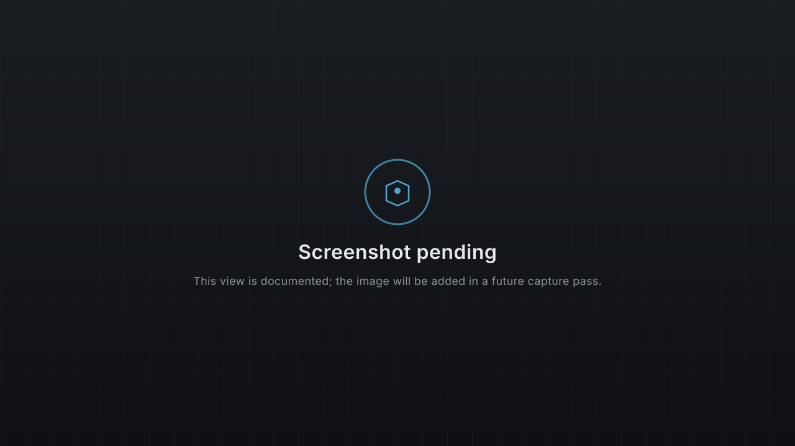

**Collections** bundle related documents into a single searchable unit. Index text into a collection, then query it from your workflows and agents.

---

## Opening Collections

Open **Collections** from the app menu, or go directly to `/collections`. The explorer shows the collections you own, and any collection that has no owner recorded, with each one's document count, embedding model, and linked workflow. Another user's collection does not appear, and asking for it by name answers "not found".

---

## Creating a Collection

1. Enter a name in **Collection Name**.
2. Choose an **Embedding Model**. The **Create** button stays disabled until both are set.
3. Click **Create**.
4. Drag files from your computer onto the collection tile to index them.

A name is unique across the store. It can be at most 128 characters and cannot start or end with whitespace, contain `/` or `\`, or contain control characters.

Dropping a file sends it to `POST /api/collections/:name/index`. The server reads the file as UTF-8 text, splits it into chunks of 2000 characters with 1000 of overlap, and stores each chunk as `<file name>#<n>`. Use text formats such as TXT, Markdown, HTML source, CSV, or transcripts. The route does not extract text from PDF, DOCX, EPUB, or images, so extract their text in a workflow first (for example with `lib.pdf.ExtractText`) and index it with an index node. A file over `NODETOOL_MAX_UPLOAD_BYTES` (1 GiB by default) is rejected.

The route does not embed the chunks with the collection's embedding model. Use the `vector.Index*` nodes when you need embeddings. See [Indexing]({{ '/indexing' | relative_url }}).

---

## Managing Documents

Each collection is a tile in the explorer. From the tile you can:

- **Index** documents by dropping files onto it. Progress and any per-file errors are reported inline.
- **Link a workflow** by clicking the workflow name. The tile shows the workflow's name, or "No workflow". The link is stored in the collection's `workflow` metadata. Dropping files does not run it.
- **Delete** the collection and everything indexed in it.

---

## Using Collections in Workflows

Use collections in RAG pipelines:

1. Add an index node (`vector.IndexString`, `vector.IndexTextChunk`, `vector.IndexAggregatedText`, `vector.IndexImage`, `vector.IndexEmbedding`) or a query node (`vector.QueryText`, `vector.QueryImage`, `vector.HybridSearch`) to your workflow.
2. Set its `collection` input to a collection. The `vector.Collection` node gets or creates one by name.
3. Run the workflow. Index nodes write into the collection; query nodes read from it.

See the [Chat with Docs example]({{ '/workflows/chat-with-docs' | relative_url }}) for the full query → format → answer wiring.

---

## Indexing Options

A collection's embedding model is chosen when you create it and is recorded in the collection's `embedding_model` and `embedding_provider` metadata. The linked workflow can be changed from the collection tile.

Chunking is not a collection setting. `splitDocument()` defaults to 2000 characters with 1000 characters of overlap, and the upload route uses those defaults.

See [Indexing]({{ '/indexing' | relative_url }}) for deeper tuning notes.

---

## Storage

By default index data lives in a `vectorstore.db` SQLite file (via `sqlite-vec`) in the NodeTool data directory, separate from the workflow database. Set `VECTORSTORE_DB_PATH` to move it. Nothing leaves your machine unless you use a cloud provider for the embedding model.

For multi-user deployments, set `NODETOOL_VECTOR_PROVIDER=supabase`. See [Vector Storage]({{ '/vector-storage' | relative_url }}) and [Supabase Deployment]({{ '/supabase-deployment' | relative_url }}).

---

## Related Docs

- [Indexing]({{ '/indexing' | relative_url }}) — the upload route, index nodes, and vector store settings
- [Vector Storage]({{ '/vector-storage' | relative_url }}) — backends and filters
- [Chat with Docs example]({{ '/workflows/chat-with-docs' | relative_url }}) — end-to-end RAG workflow
