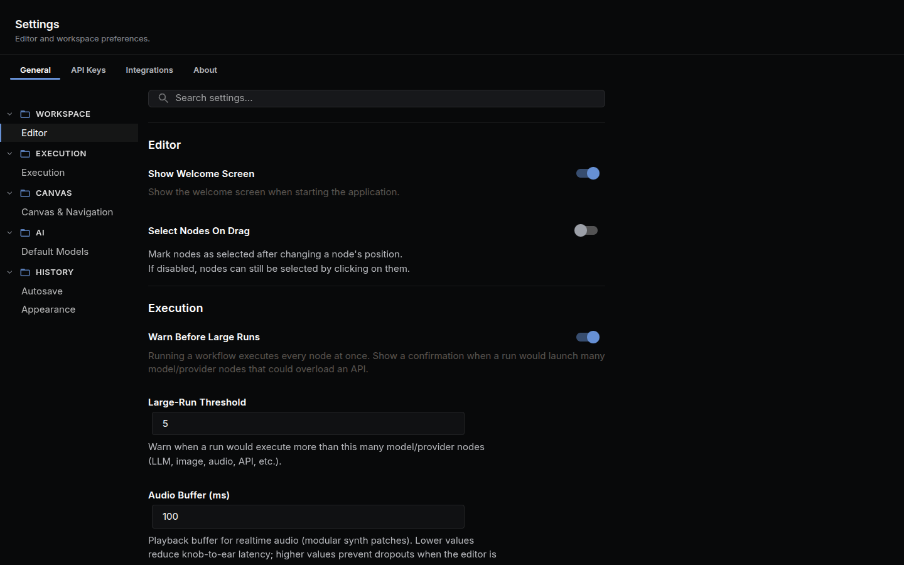
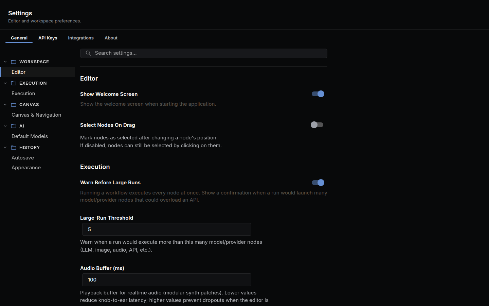

NodeTool uses a layered configuration system so local development, automated deployments, and production environments can share sensible defaults with minimal duplication. Settings come from environment variables and `.env` files, while secrets are stored encrypted at rest in a local SQLite database (managed via the CLI).

The configuration helpers live in the `@nodetool-ai/config` package (`environment.ts`). They are plain functions — `loadEnvironment()`, `getEnv()`, and `requireEnv()` — there is no `Environment` class and no `settings.yaml`/`secrets.yaml` loading.



## Configuration Layers

`loadEnvironment()` loads `.env` files in this order, with later files overriding earlier ones; **system environment variables always win** over file values:

1. `.env`
2. `.env.<NODE_ENV>`
3. `.env.<NODE_ENV>.local`

`NODE_ENV` defaults to `development` when unset. Use `getEnv("KEY")` to read a value (returns `undefined` when unset) and `requireEnv("KEY")` to read a value that must be present (throws a descriptive error otherwise).

This hierarchy allows committed defaults, per-environment overrides, and developer-specific overrides to co-exist without file conflicts.

## Managing Settings & Secrets

The in-app Settings dialog is the easiest way to manage everything. It has a sidebar with subsections:

| Section | What it covers |
|---------|---------------|
| **General** | Theme, startup behavior, language |
| **Providers** | API keys for OpenAI, Anthropic, Google, etc. |
| **Default Models** | Pick the default LLM, image model, and embedding model |
| **Folders** | Workspace, cache, and asset directories |
| **Secrets** | Encrypted provider tokens and credentials |
| **Remote** | Point the app at a remote NodeTool server |
| **About** | Version and build info |



From the command line:

- `nodetool settings show [--json]` – print the resolved environment configuration.
- `nodetool secrets list` – list stored secret keys (values are never shown).
- `nodetool secrets store <key>` – store or update a secret (prompts for the value).
- `nodetool secrets get <key>` – print a stored secret value.

Secrets are encrypted and persisted in a local SQLite database, not in YAML files. There is no `nodetool settings edit` command and no `--secrets` option.

## Secret Storage and Master Key

Secrets saved through the CLI are encrypted with AES-256-GCM, using a per-user key derived from the master key via PBKDF2-SHA256 (100,000 iterations). `initMasterKey()` in `@nodetool-ai/security` resolves the master key in this order:

1. `SECRETS_MASTER_KEY` environment variable.
2. Local system keyring (macOS Keychain, Windows Credential Manager, or Secret Service via keytar).
3. Generates a new key and persists it to the keyring.

For shared deployments you **must** pre-provision the master key (via the `SECRETS_MASTER_KEY` environment variable) so every server can decrypt secrets generated locally. On a headless host with no keychain and no provisioned key, master-key initialization (and therefore startup) fails because there is no place to persist a generated key.

### Migrating Secrets to a Server

1. Export the master key once and set it on every server instance using the value from your deployment pipeline or secrets manager:

   ```bash
   export SECRETS_MASTER_KEY="<your-base64-master-key>"
   ```

2. The `nodetool deploy apply` command automatically synchronizes all secrets from your local database to the target server right after a successful deploy. If you ever need to do it manually, POST the encrypted payload to the admin endpoint using the worker bearer token:

   ```bash
   curl -H "Authorization: Bearer $NODETOOL_WORKER_TOKEN" \
        -H "Content-Type: application/json" \
        -X POST https://your-server.example.com/admin/secrets/import \
        --data-binary @secrets-export.json
   ```

   The server stores the ciphertext verbatim, so both sides must share the same master key.

## Storage Backend Selection

The storage backend is selected explicitly by `NODETOOL_STORAGE_BACKEND` (one of `file`, `s3`, or `supabase`; defaults to `file`). It is **not** auto-detected from the presence of S3 or Supabase credentials.

- `file` (default) — assets are written to the local assets directory.
- `s3` — requires `ASSET_BUCKET` (and, for the temp store, `TEMP_BUCKET`); reads `S3_REGION` and `S3_ENDPOINT` as needed.
- `supabase` — requires `SUPABASE_URL`, `SUPABASE_KEY`, and the relevant bucket var.

The asset store uses `ASSET_BUCKET`; the temp store uses `TEMP_BUCKET`. See `storage-config.ts` in `@nodetool-ai/config`.

## Using Environment Variables in Code

When adding a feature that reads configuration:

1. Read the variable with `getEnv("YOUR_ENV_VAR")` from `@nodetool-ai/config` so `.env` load order is respected.
2. If the value is required, use `requireEnv("YOUR_ENV_VAR")` so a missing key raises a descriptive error.
3. Document the new entry in `.env.example`.

## Recommended Workflow

```bash
cp .env.example .env.development.local
vim .env.development.local           # add OpenAI/Anthropic/HF tokens, S3 credentials, etc.

nodetool secrets store OPENAI_API_KEY  # encrypt a provider key into the secrets DB (optional)
nodetool settings show               # verify resolved configuration
```

Use `.env.<env>.local` for machine-specific overrides and keep secrets out of version control. When deploying, provide environment variables via your orchestrator or the `deployment.yaml` `env` section—NodeTool will merge them automatically at runtime.

## Supabase Settings

NodeTool integrates with Supabase for both user authentication and asset storage.

Set the following to enable Supabase:

- `NODETOOL_STORAGE_BACKEND=supabase` – select the Supabase storage backend
- `SUPABASE_URL` – your project URL, e.g. `https://<ref>.supabase.co`
- `SUPABASE_KEY` – a service role key (server-side only)
- `ASSET_BUCKET` – Supabase Storage bucket used for assets (e.g. `assets`)
- `TEMP_BUCKET` – bucket for temporary assets (e.g. `assets-temp`)
- Use a separate Supabase for user-provided nodes:
  - `NODE_SUPABASE_URL` – user/node project URL (kept distinct from core `SUPABASE_URL`)
  - `NODE_SUPABASE_KEY` – service role key for user/node data (kept distinct from core `SUPABASE_KEY`)
  - `NODE_SUPABASE_SCHEMA` – optional schema for node tables (defaults to `public`)
  - `NODE_SUPABASE_TABLE_PREFIX` – optional prefix applied to node tables to avoid collisions with core tables

Behavior:

- Storage is used for Supabase buckets only when `NODETOOL_STORAGE_BACKEND=supabase`; the backend is chosen explicitly, not auto-detected from the presence of credentials.
- Authentication enters Supabase mode (enforced auth) when **both** `SUPABASE_URL` and `SUPABASE_KEY` are set — storage and auth are configured independently. See [Authentication](authentication.md#authentication-modes).

Security notes:

- Use the service role key only in server environments. Do not expose it to clients.
- Public buckets make generated URLs directly accessible. For private buckets, add a signing step.

## Serving the Web UI and TLS

The API server can also serve the built web app. `STATIC_FOLDER` points at the
directory holding `index.html`; unset, or naming a directory that is not there,
no static handler is registered and anything outside the API routes answers
`404`.

```bash
STATIC_FOLDER=/app/web/dist nodetool serve
```

With it set the server serves that directory at `/`, sends `index.html` for `/`
and `/apps/index.html`, and falls back to `index.html` for any other
extension-less `GET` that is not under `/api`, `/ws`, `/trpc`, `/mcp`,
`/health`, `/v1`, `/.well-known/`, or `/oauth` (except `/oauth/consent`, which
is the SPA's MCP consent page) — so client-side routing survives a reload. The
Docker image and the desktop app set it to their own bundled copy.

TLS is on when both a certificate and a key resolve:

```bash
TLS_CERT=/etc/ssl/nodetool/cert.pem \
TLS_KEY=/etc/ssl/nodetool/key.pem \
REDIRECT_PORT=8080 \
nodetool serve --host 0.0.0.0 --port 8443
```

- A variable naming a path that does not exist is ignored. The server then
  looks for `cert.pem` and `key.pem` by walking up to five directories from its
  working directory, so a stray pair beside the process turns TLS on with
  neither variable set.
- With TLS active every URL the server logs uses `https` / `wss`, and a plain
  HTTP listener on `REDIRECT_PORT` (default `80`) answers `301` to
  `https://<request Host>:<server port><path>`.
- Ports below 1024 need elevated privileges. When that bind fails with `EACCES`
  the server logs that the redirect listener was skipped and keeps serving
  HTTPS.

## Python Nodes

Python nodes run in a separate worker process that NodeTool spawns and talks to
over stdio. The server picks the interpreter in this order:

1. `NODETOOL_PYTHON`, if set — an absolute path to the executable. Nothing else
   is tried, so a wrong path is a hard failure rather than a silent fallback.
2. An active `CONDA_PREFIX`, when the environment name looks like a NodeTool one.
3. NodeTool's own managed environment.

With none of them available the server logs `Python not found — Python nodes
will not be available` at startup and runs everything else normally.

```bash
NODETOOL_PYTHON=/opt/conda/envs/nodetool/bin/python nodetool serve
```

The bridge is a local-only feature: when `NODETOOL_ENV=production` it refuses to
connect, and a workflow reaching a Python node fails with "Python bridge is
disabled in production". Set `NODETOOL_ALLOW_PYTHON_BRIDGE_IN_PRODUCTION=1` to
override that on a host where you do want the worker. The flag alone is not
enough on the published Docker image: it ships no Python worker, so derive an
image that installs `nodetool-core` and point `NODETOOL_PYTHON` at that
interpreter. See
[Self-hosted deployment](self-hosted-deployment.md#mcp-over-http-and-python-nodes).

The three `NODETOOL_PYTHON_*_TIMEOUT_MS` variables bound how long the server
waits on the worker. Raise `NODETOOL_PYTHON_EXECUTE_TIMEOUT_MS` past its
12-minute default for nodes that legitimately run longer.

`NODETOOL_WORKER_NAMESPACES` narrows which Python node namespaces the worker
loads. Its value is passed through unchanged as `--namespaces <value>` when the
worker is spawned, and the worker parses it; unset, the flag is not passed and
the worker loads everything installed.

```bash
NODETOOL_WORKER_NAMESPACES=nodetool.image nodetool serve
```

## Protocol Validation

Two settings schema-check messages in flight. Both accept `1`/`true` to force
validation on and `0`/`false` to force it off; unset, both default to **on**
under `NODE_ENV=test` or Vitest and **off** everywhere else — a malformed frame
should fail the test that produced it rather than throw mid-stream on a
production connection.

- `NODETOOL_VALIDATE_OUTBOUND_WS` — every server→client WebSocket frame whose
  `type` matches a known message schema is parsed against it before it goes on
  the wire. Frames with an unrecognized or absent `type` are left alone. A
  failure throws where the frame was sent.
- `NODETOOL_VALIDATE_BRIDGE_FRAMES` — the same check on frames arriving from the
  Python worker. A frame that fails is rejected with a structured, non-fatal
  error instead of being dispatched as malformed data.

Turn one on outside tests when you are chasing a protocol bug and want it to
surface at its source:

```bash
NODETOOL_VALIDATE_OUTBOUND_WS=1 nodetool serve
```

## JavaScript Sandbox Threading

The QuickJS sandbox behind Code nodes, CodeAct, and JS scripts runs on a worker
thread whenever it can. A CPU-bound guest blocks whichever thread runs it, and
on the server's main thread that freeze takes the event loop with it — including
the WebSocket `stop` frame that would have cancelled the run. On a worker,
cancelling is `terminate()`, immediate for a spinning guest and a parked one
alike.

Two settings change that choice:

- `NODETOOL_SANDBOX_INPROC=1` runs every guest on the calling thread. It is
  treated as a chosen fallback, so it warns about nothing.
- `NODETOOL_SANDBOX_WORKER=require` refuses to fall back at all. A run that
  cannot reach a worker fails with `the sandbox worker path is required
  (NODETOOL_SANDBOX_WORKER=require) but unavailable: <reason>` instead of
  running in-process.

Some runs stay in-process with no setting involved. A run that streams its
inputs does, because the synchronous `stream.open` probe is served from a
worker-local mirror that must be seeded with the handle names; those runs park
on takes and yield constantly, so the freeze the worker exists for cannot build
up. Globals that cannot be structured-cloned keep a run on this thread too. The
by-design cases are quiet; an environmental one warns once per process:

```
sandbox: running in-process (<reason>); a CPU-bound guest will block this thread until its timeout
```

```bash
NODETOOL_SANDBOX_INPROC=1 nodetool serve
```

## Video Input on Vision Models

Most chat APIs are OpenAI-compatible and have no `video` content part. A clip
sent to one used to be refused outright, even when the model behind the
endpoint reads images perfectly well. The runtime now samples the clip into
stills with `ffmpeg` and sends those instead, labelled with their timestamps,
under a header naming the frame count and the sample rate — so a model that
needs the audio or the motion between frames can say it is missing rather than
invent it. A provider that reads video natively (Gemini) still gets the whole
clip and never goes through this path.

`ffmpeg` and `ffprobe` must be on `PATH`; without them the call fails naming
the binary. The sample is bounded by four settings:

- `NODETOOL_VIDEO_FRAME_FALLBACK=0` turns the whole thing off and restores the
  refusal, for a caller that would rather fail than pay for a lossy read.
- `NODETOOL_VIDEO_FRAME_MAX_FRAMES` — frames per clip. Default `16`.
- `NODETOOL_VIDEO_FRAME_MAX_FPS` — ceiling on the sample rate. Default `1`.
  A clip long enough that the frame budget cannot reach this rate is sampled
  more sparsely so the frames still span the whole thing.
- `NODETOOL_VIDEO_FRAME_MAX_DIMENSION` — longest edge of each frame, in pixels.
  Default `768`. Frames are never upscaled.

```bash
NODETOOL_VIDEO_FRAME_MAX_FRAMES=8 NODETOOL_VIDEO_FRAME_MAX_FPS=0.5 nodetool serve
```

## Development-Only Settings

Two settings exist for local development and are off unless set:

- `NODETOOL_ENABLE_TEST_TOPUP=1` allows the credits top-up mutation to mint
  credits with no payment behind it. Without it the mutation is refused. Minted
  credits unlock spend on platform-owned keys, so leave this unset on anything
  reachable by someone else.
- `NODETOOL_SEED_DEMO_COSTS=1` seeds ~90 days of plausible spend, plus the demo
  workflows whose names it references, so the Costs dashboard has something to
  show. The seed is idempotent — a marker row stops it re-running.

```bash
NODETOOL_SEED_DEMO_COSTS=1 nodetool serve
```

## Test Harness Settings

These configure the harnesses, not the server. `nodetool debug --browser` sets
the two `NODETOOL_DEBUG_*` variables below from its own flags; you set them by
hand only when driving the Playwright spec directly.

- `NODETOOL_DEBUG_STAGES` — `1` or `true` captures a canvas screenshot at every
  stage of the run into `stages/` under the output directory, up to 16
  intermediate frames plus the final one. This is what `nodetool debug
  --stages` turns on, and it is off otherwise because each frame costs a
  screenshot.
- `NODETOOL_DEBUG_TIMEOUT` — per-run timeout in milliseconds for the in-page
  run, which is how `nodetool debug --timeout` reaches the browser surface.
  Read as a positive integer; anything else is ignored. The spec waits 30s
  longer than the value, and never less than its 5-minute floor, so polling
  outlives the run it is watching.
- `NODETOOL_E2E_EXAMPLES_DIR` — the examples directory the e2e test server
  serves at `/api/examples`. A path that does not exist is ignored rather than
  fatal; the server then looks for
  `packages/base-nodes/nodetool/examples/nodetool-base` and `examples/workflows`
  under the repo root. The resolved path is printed in the server's readiness
  line.

- `NODETOOL_TEST_CHROME` — the Chrome binary the `packages/browser`
  integration suite drives. Branded Google Chrome silently ignores
  `--load-extension`, so the suite needs Chrome for Testing; `test:integration`
  installs one under `<repo>/chrome` and the harness finds it there. Point this
  at a binary you already have to skip that download. `CHROME_PATH` is read as a
  fallback, and a path that does not exist is ignored rather than fatal.

```bash
NODETOOL_TEST_CHROME=/opt/chrome-for-testing/chrome \
  npm run test:integration --workspace=packages/browser
```

The graph, output directory, and run params come from `NODETOOL_DEBUG_GRAPH`,
`NODETOOL_DEBUG_OUT`, and `NODETOOL_DEBUG_PARAMS`:

```bash
cd web
NODETOOL_DEBUG_GRAPH=/tmp/graph.json \
NODETOOL_DEBUG_OUT=/tmp/debug-out \
NODETOOL_DEBUG_STAGES=1 \
NODETOOL_DEBUG_TIMEOUT=120000 \
npm run test:debug-harness
```

The run writes `record.json`, `screenshot.png`, and — with stages on —
`stages/` and `stages.json` into the output directory. It also starts its own
hermetic backend on `127.0.0.1:7777`, so stop any server already on that port
first; the harness refuses to run against one rather than exercise a real
database with real providers.

### Hermetic providers

The user-journey suite (`web/tests/journeys`) sends chat messages and runs whole
workflows with no API keys and no network. `NODETOOL_FAKE_PROVIDERS=1` puts the
suite's backend (`screenshot-server.ts`) in hermetic mode: every registered LLM
provider is re-registered as a deterministic fake, and external or
media-generating nodes — fal, Replicate, search, HTTP, image/video/audio
generation — resolve to an executor that returns type-correct placeholder
outputs derived from the node's output metadata. Structural nodes
(input/output/control) and pure-compute nodes (text, data, math) still run for
real, so the assertions mean something. Every faked LLM call returns the string
`deterministic e2e response`.

`npm run test:journeys` sets the variable itself — `tests/journeys/globalSetup.ts`
does `process.env.NODETOOL_FAKE_PROVIDERS ??= "1"`. Set it by hand only when
starting that backend yourself. The screenshot and visual suites leave it off,
because they only render pages and never run a node.

- `NODETOOL_FAKE_DEBUG=1` logs each node's REAL/FAKE resolution to stderr, which
  is how you find out why a node you expected to be faked ran for real.
- `NODETOOL_ENABLE_FAKE_PROVIDER=1` registers the separate `fake` provider id as
  a builtin, so a workflow can select it the way it selects any other provider.
  Ignored when `NODETOOL_ENV=production`.

```bash
NODETOOL_FAKE_PROVIDERS=1 NODETOOL_FAKE_DEBUG=1 npm run test:journeys
```

## Chat Turn Replay

A chat or agent turn outlives the WebSocket connection that started it. Every
frame the turn emits is stamped with an increasing `chat_seq` and appended to a
bounded buffer; a client that reconnects sends
`{command: "resume_chat", data: {thread_id, last_seq}}` and gets the missed tail
replayed. Three variables size that machinery:

- `NODETOOL_CHAT_DETACH_GRACE_MS` — a running turn nobody is attached to is
  aborted after this long (default 10 minutes).
- `NODETOOL_CHAT_REPLAY_RETENTION_MS` — a finished turn is kept this long so a
  client reconnecting just after it ended still gets the tail (default 5
  minutes).
- `NODETOOL_CHAT_REPLAY_BUFFER_EVENTS` — frames buffered per turn (default
  2000).

Each is read as a positive integer; a value that is not one is ignored and the
default used. Assistant and tool messages are persisted independently of the
buffer, so an expired or truncated replay costs only unpersisted stream chunks —
the client refetches thread history over REST.

## Job Run Replay

A workflow run outlives the WebSocket connection that started it, the same way
a chat turn does. Every frame the run emits is stamped with an increasing
`job_seq` and appended to a bounded buffer; a client that reconnects sends
`{command: "reconnect_job", data: {job_id, last_seq}}` and gets the missed tail
replayed, followed by live frames if the run is still going. Three variables
size that machinery:

- `NODETOOL_JOB_DETACH_GRACE_MS` — a running job nobody is attached to is
  cancelled after this long (default 10 minutes), so an abandoned client cannot
  leave a workflow burning provider spend forever.
- `NODETOOL_JOB_REPLAY_RETENTION_MS` — a finished session is kept this long so a
  client reconnecting just after the run ended still gets the tail (default 5
  minutes).
- `NODETOOL_JOB_REPLAY_BUFFER_EVENTS` — frames buffered per run (default 2000).

```bash
NODETOOL_JOB_DETACH_GRACE_MS=1800000 nodetool serve
```

Each is read as a positive integer; a value that is not one is ignored and the
default used. Terminal state is persisted to the `jobs` table independently of
the buffer, so an expired or truncated replay degrades to `reconnect_job`'s
persisted-row fallback — the run's real status, just without its events.

These size one process's buffer. Getting a reconnect to the process that *holds*
the run is a separate concern; see
[Multi-instance deployments](websocket-api.md#multi-instance-deployments).

## Backend Bundle Targeting

These configure the build, not the server. The packaged Electron backend is one
bundled `server.mjs` plus a flat `_modules/` directory staged by
[`scripts/bundle-backend.mjs`](https://github.com/nodetool-ai/nodetool/blob/main/scripts/bundle-backend.mjs). Some staged
dependencies ship prebuilt binaries for every OS and architecture in a single
package; staging all of them wastes disk in a single-target artifact, so the
staging step prunes them to one target.

- `NODETOOL_BUNDLE_PLATFORM` — the platform to keep prebuilds for. Defaults to
  `process.platform` (`darwin`, `linux`, `win32`).
- `NODETOOL_BUNDLE_ARCH` — the architecture to keep prebuilds for. Defaults to
  `process.arch` (`x64`, `arm64`).

Set both only when cross-building — staging on one machine for another target.
A build for the host needs neither.

```bash
NODETOOL_BUNDLE_PLATFORM=win32 NODETOOL_BUNDLE_ARCH=x64 node scripts/bundle-backend.mjs
```

[`scripts/verify-backend-bundle.mjs`](https://github.com/nodetool-ai/nodetool/blob/main/scripts/verify-backend-bundle.mjs)
reads the same two variables and resolves the `@seydx/node-av-<platform>-<arch>`
binary it expects to find staged (`node-av-win32-<arch>-msvc` on Windows), so a
verification run must be given the target the staging run used. When no prebuild
matches the target, staging warns and leaves every prebuild in place rather than
pruning the artifact down to nothing — a mis-set variable costs size, never a
missing binary.

## Environment Variables Index


| Variable | Purpose | Secret | Notes |
|----------|---------|--------|-------|
| `NODE_ENV` | Environment name (`development`, `test`, `production`) | no | Defaults to `development`; controls `.env` file load order |
| `STATIC_FOLDER` | Directory the server serves the built web app from | no | Unset, or naming a directory that is not there, no static handler is registered and anything outside the API routes answers `404`. Set, the directory is served at `/`, `/` and `/apps/index.html` send `index.html`, and other extension-less `GET`s fall back to it so client-side routing survives a reload. See [Serving the Web UI and TLS](#serving-the-web-ui-and-tls) |
| `TLS_CERT` / `TLS_KEY` | PEM certificate and private key that put the server on HTTPS/WSS | no | Both are paths, and both must resolve or TLS stays off. A path that does not exist is ignored — the server then walks up to five directories from its working directory looking for `cert.pem` and `key.pem`, so a stray pair beside the process turns TLS on with neither variable set |
| `REDIRECT_PORT` | Port of the plain-HTTP listener that redirects to the HTTPS one | no | Default `80`, and only bound when TLS is active. Answers `301` to `https://<request Host>:<server port><path>`. A port below 1024 needs elevated privileges; on `EACCES` the server logs that the redirect listener was skipped and keeps serving HTTPS |
| `SUPABASE_URL` / `SUPABASE_KEY` | Enable Supabase auth mode (both required) | `SUPABASE_KEY` | When both are set, the server enforces auth and validates Supabase JWTs. See [Authentication](authentication.md#authentication-modes) |
| `SUPABASE_ANON_KEY` | The project's public anon key, handed to the web app by `GET /api/config` | no | Designed to reach a browser — set it to the **anon** key, never `SUPABASE_KEY` (the service-role key), which this endpoint never returns. Required whenever auth is enforced: with `SUPABASE_URL` and `SUPABASE_KEY` set but this unset, `/api/config` still answers `200` with `supabaseAnonKey: null`, the web app falls back to a placeholder, and every login `401`s. The server names that case at boot (`describeMissingAnonKey` in `packages/websocket/src/routes/config.ts`) |
| `AUTH_REDIRECT_URL` | URL Supabase sends the user back to after email or OAuth sign-in | no | Returned by `GET /api/config` as `authRedirectUrl`, and it wins over the client's own resolution. Unset, the web app falls back to the build-time `VITE_AUTH_REDIRECT_URL`, then to `window.location.origin + "/"`. Set it when the public URL is not the origin the browser sees — behind a proxy, on a custom domain, or in the Electron shell — and add the same value to the Supabase project's redirect allow list. See [Self-hosted deployment](self-hosted-deployment.md) |
| `SERVER_AUTH_TOKEN` | Deploy-tooling bearer token (`@nodetool-ai/deploy`) | yes | Generated automatically if unset; not used by the websocket server's auth mode selection |
| `USERS_FILE` | Path to the JSON registry of API users and hashed bearer tokens | no | Default `~/.config/nodetool/users.json`, or `%APPDATA%\nodetool\users.json` on Windows. It selects no auth mode — the server picks that from the Supabase credentials ([Authentication](authentication.md#authentication-modes)) — it is the file the admin user routes and `nodetool deploy users-add \| users-list \| users-reset-token \| users-remove` read and write. A file that is missing or unparseable reads as no users. See [CLI › API users on the deployment](cli.md#nodetool-deploy) |
| `ADMIN_USER_IDS` | User ids allowed to call the admin user-management routes | no | Comma-separated, whitespace trimmed. User `1` — the loopback user in local auth mode — is always admin, so a single-user install never needs this. On a Supabase-mode server, list the ids that may create, list, remove, and reset API users; every other caller gets `FORBIDDEN` |
| `NODETOOL_TRUST_LOCALHOST` | Allow loopback connections to bypass auth as user `1` | no | Defaults **off** when auth is enforced (Supabase), **on** otherwise. Leave off behind a reverse proxy/SSH tunnel where the proxy connects from loopback. |
| `NODETOOL_TRUST_LOCAL_NETWORKS` | ⚠️ Source CIDRs trusted as user `1` **without a password** (Local mode only) | no | Comma-separated IPs/CIDRs; ignored in Supabase mode. Needed so Docker's NAT'd bridge traffic isn't rejected — scope to the bridge (`172.16.0.0/12`), **never `0.0.0.0/0`** on a public IP. See [Authentication → Local mode in Docker](authentication.md#local-mode-in-docker). |
| `NODETOOL_TRUSTED_PROXIES` | Reverse proxies whose `X-Forwarded-For` is trusted | no | Comma-separated IPs/CIDRs. When unset, `X-Forwarded-For` is ignored and the socket peer address is used. |
| `NODETOOL_ALLOWED_ORIGINS` | Extra browser origins allowed to make cross-origin requests | no | Comma-separated exact origins, **added to** the built-in list rather than replacing it: `localhost`, `127.0.0.1`, and `[::1]` on any port and either scheme, the Electron renderer's `file://`, and `https://nodetool.ai` and its subdomains. A single `*` entry restores allow-all, for a deployment fronted by its own gateway. A request with no `Origin` is allowed either way — there is no browser enforcing CORS in that case. The list is parsed once and cached, so a change needs a restart. It backs both the global CORS plugin and the hand-written headers on the storage and `/mcp` endpoints (`packages/websocket/src/cors.ts`) |
| `NODETOOL_LOCAL_FILE_ROOTS` | Directories the file browser and local-file previews may read | no | Platform-delimited (`:` on POSIX, `;` on Windows), `~` expands. Defaults to the user's home directory. Both surfaces are disabled entirely when `NODETOOL_ENV=production`. See [Security hardening](security-hardening.md#local-file-access). |
| `NODETOOL_WORKSPACES_DIR` | Root for the workspace folders NodeTool manages itself | no | Defaults to `<data dir>/workspaces`. Every user gets a default workspace under here on first use, so a chat turn or a workflow that names no workspace still reads and writes somewhere bounded. In production it is the **only** readable workspace — a row pointing at another host folder is refused by `listFiles` and the download route. Point it at a mounted volume on a server deployment. |
| `NODETOOL_WORKSPACE_STORAGE` | Whether workspaces are folders on disk or objects in the asset bucket | no | `local` or `cloud`. Defaults to `cloud` when `NODETOOL_ENV=production`, `local` otherwise. A cloud workspace is a key prefix (`workspaces/<user>/`) in the same storage assets use, so it survives the machine being replaced; every node and agent tool reads and writes it through the same `Workspace` interface either way. Set `local` on a self-hosted server with a mounted volume, or `cloud` on a local install pointed at S3. |
| `OPENAI_API_KEY` / `ANTHROPIC_API_KEY` / `GEMINI_API_KEY` | Provider access | yes | Set only the providers you use |
| `HF_TOKEN` / `FAL_API_KEY` / `REPLICATE_API_TOKEN` | HuggingFace-family providers | yes | Optional per workflow |
| `HF_API_TOKEN` / `HUGGING_FACE_HUB_TOKEN` | Alternate spellings of `HF_TOKEN` for Hub requests | yes | The Hub client takes the first non-empty of `HF_TOKEN`, `HF_API_TOKEN`, `HUGGING_FACE_HUB_TOKEN`, trimmed. They exist so an environment already configured for `huggingface_hub` or the older `huggingface-cli` works unchanged — set `HF_TOKEN` on a fresh install. The resolved token is cached in-process after the first read, so changing it needs a restart |
| `HF_TOKEN_PATH` | Token file read when none of the three variables is set | yes | A leading `~` expands. Default `<HF_HOME>/token`, and with `HF_HOME` unset that is `$XDG_CACHE_HOME/huggingface/token`, falling back to `~/.cache/huggingface/token` — the file `huggingface-cli login` writes. A path that is missing or unreadable reads as no token rather than an error, so an anonymous Hub request is what a typo produces |
| `HUGGINGFACE_API_KEY` | Key the `huggingface` **inference** nodes send | yes | Resolution order is stored secret `HF_TOKEN`, stored secret `HUGGINGFACE_API_KEY`, then the same two names from the environment. The token needs the *Inference Providers* permission, which a Hub read token does not carry; without any of the four the node throws `HF_TOKEN is not configured`. Separate from the Hub client above, which never reads this name |
| `HF_HUB_CACHE` | Directory holding the `models--*` folders of the HuggingFace cache | no | Used verbatim — it names the hub directory itself, not its parent. A leading `~` expands. Unset, the cache is `$HF_HOME/hub`, falling back to `~/.cache/huggingface/hub`. This is what `nodetool models hf-cache` and `download-hf` read and write. `HUGGINGFACE_HUB_CACHE` is accepted as a legacy alias, but the two readers disagree about it — the REST models API uses it verbatim while the tRPC router appends `/hub` — so set `HF_HUB_CACHE` and leave the alias unset |
| `OLLAMA_API_URL` | Local Ollama base URL | no | Default `http://127.0.0.1:11434` |
| `LMSTUDIO_API_URL` | Base URL of the local server LM Studio's desktop app exposes | no | Default `http://127.0.0.1:1234`; trailing slashes are stripped. A value stored under the same name in **Settings → API Keys** wins over the environment variable. See [Providers › LM Studio](providers.md) |
| `VLLM_BASE_URL` | Base URL of a self-hosted, OpenAI-compatible vLLM server | no | **Required** to use the provider — there is no default, and constructing it without one throws `VLLM_BASE_URL is required (options.baseURL, secret, or env)`. Same secret-over-environment precedence; trailing slashes are stripped. Models appear from the server's `/v1/models` endpoint. See [Providers › vLLM](providers.md) |
| `DASHSCOPE_BASE_URL` | Region endpoint for Alibaba Cloud Model Studio (the Qwen models) | no | Default `https://dashscope-intl.aliyuncs.com/compatible-mode/v1` — the international (Singapore) region. Model Studio keys are region-scoped, so set this to your region's `/compatible-mode/v1` endpoint when the key was created elsewhere. A stored setting of the same name wins over the environment variable, and key verification probes whichever endpoint this resolves to. See [Providers › Alibaba Cloud](providers.md) |
| `DATA_FOR_SEO_LOGIN` / `DATA_FOR_SEO_PASSWORD` | DataForSEO credentials behind the `web_search` capability | `DATA_FOR_SEO_PASSWORD` | Both required — one alone leaves the backend unconfigured. Read from the stored secret first, then the environment. `web_search` runs the first *configured* backend of `serpapi`, `dataforseo`, `openai`, `gemini` unless the call pins one with `provider`, so these take effect when `SERPAPI_API_KEY` is unset. DataForSEO serves all three search types (web, news, images) against `https://api.dataforseo.com`, defaulting to location code `2840` (United States) and language `en`. Once a backend runs, its failure is the call's failure — nothing falls through to the next one |
| `GOOGLE_MAIL_USER` / `GOOGLE_APP_PASSWORD` | Gmail account the `email` capability reads over IMAP | `GOOGLE_APP_PASSWORD` | Both required; read from the stored secret first, then the environment. The password is a Google [app password](https://support.google.com/accounts/answer/185833), not the account password — 2-step verification has to be on to mint one. The capability connects to `imap.gmail.com:993` over TLS and backs `search_email`, `archive_email`, and `add_label_to_email`. Unrelated to `GOOGLE_CLIENT_ID`/`GOOGLE_CLIENT_SECRET`, which serve the Google Workspace integration |
| `KIE_WEBHOOK_URL` | Public base URL kie.ai calls back when a task finishes | no | Unset, kie tasks are polled. Set, a submission carries `callBackUrl: <value>/api/kie/webhook` and the run waits for that request instead of polling — so it has to be an address kie.ai can reach from the internet, e.g. `https://nodetool.example.com`. Trailing slashes are stripped |
| `GITHUB_CLIENT_ID` / `GITHUB_CLIENT_SECRET` | OAuth App credentials for the GitHub sign-in flow at `/api/oauth/github/*` | `GITHUB_CLIENT_SECRET` | Without the id, `/api/oauth/github/start` answers `500` naming it. The flow builds its redirect URI from the request's own `Host` — `http://<host>/api/oauth/github/callback` for a `localhost` host, `https://…` otherwise — so register exactly that on the OAuth App. Read from the process environment, not the encrypted secret store: a value entered only in **Settings** never reaches this code path |
| `GOOGLE_CLIENT_ID` / `GOOGLE_CLIENT_SECRET` | OAuth client the server refreshes an expired Google access token with | `GOOGLE_CLIENT_SECRET` | The same pair configured for the Google provider in the Supabase dashboard. Supabase does not refresh provider tokens, so without them a Google credential stops working an hour after sign-in and the server logs `Google token expired but GOOGLE_CLIENT_ID/GOOGLE_CLIENT_SECRET are unset`. Set them wherever the Google Workspace capability is on — see `NODETOOL_GOOGLE_WORKSPACE` below |
| `NODE_LLAMA_CPP_MODELS_DIR` | Directory the `node_llama_cpp` provider loads GGUF models from | no | Unset, node-llama-cpp uses its own default. A secret stored under the same name wins over the environment variable |
| `NODE_LLAMA_CPP_GPU_BACKEND` | GPU backend node-llama-cpp runs against | no | `auto`, `metal`, `cuda`, `vulkan`, or `cpu`, matched case-insensitively. Any other value is ignored and the library chooses for itself. Same secret-over-environment precedence |
| `LLAMA_CPP_CACHE_DIR` | Cache root checked for GGUF files a separate `llama.cpp` already downloaded | no | Default `~/Library/Caches/llama.cpp/hf` on every platform, so set it explicitly off macOS. Consulted only when the file is not already in the HuggingFace cache; a repo is looked for at `<dir>/<repo cache dir>/snapshots` |
| `TRANSFORMERS_JS_CACHE_DIR` | Cache directory for the Transformers.js runtime | no | Default `<data dir>/transformers-js-cache`. Deliberately outside `~/.cache/huggingface`: Transformers.js uses a flat `{cacheDir}/{repo_id}/{file_path}` layout the Python `huggingface_hub` cache cannot share |
| `NODETOOL_INTEGRATION_TOKEN` | Service token for messaging-bridge integrations (Telegram bot) | yes | ≥16 chars. Enables `/api/integrations/:provider/*` (account linking + delegated tokens); unset, those routes do not exist. Set the same value on the bridge process. See [telegram-bot-design.md](telegram-bot-design.md) §5 |
| `NODETOOL_PUBLIC_URL` | Base URL the integration link page is reachable at | no | Trailing slashes are stripped. Only read when building the `url` that `/api/integrations/:provider/link/start` returns. Unset, that URL is built from the request's own `Host` header — set it when the bridge reaches the server at an address the user's browser cannot, such as `http://nodetool:7777` inside a compose network. See [telegram-bot-design.md](telegram-bot-design.md) §5 |
| `TELEGRAM_BOT_USERNAME` | Bot username for the Telegram link deep link | no | Without the `@`. When set, Settings → Integrations renders `t.me/<username>?start=<code>` links; unset, the UI shows the bare code for manual `/start` entry |
| `NODETOOL_API_URL` | Server the CLI and the Telegram bridge talk to | no | Default for the `--api-url` flag on the read commands (`workflows`, `jobs`, `assets`, `models list/ollama/huggingface`), which otherwise read the local database; an explicit `--api-url` wins. The Telegram bridge reads it directly and defaults to `http://127.0.0.1:7777`. See [CLI](cli.md) |
| `TELEGRAM_BOT_TOKEN` | Bot token from @BotFather, read by the `nodetool telegram` bridge process | yes | Required. Read on the **bridge**, not the server. With it unset, `nodetool telegram serve` refuses to start and names the field. See [CLI › `nodetool telegram`](cli.md#nodetool-telegram) |
| `TELEGRAM_WEBHOOK_URL` | Absolute `https://` URL Telegram should deliver updates to | no | Unset = `getUpdates` long polling, which is the only mode implemented. Setting it makes `nodetool telegram serve` **refuse to start** rather than silently poll |
| `TELEGRAM_WEBHOOK_SECRET` | Value verified against the `X-Telegram-Bot-Api-Secret-Token` header | yes | Required whenever `TELEGRAM_WEBHOOK_URL` is set — config validation rejects the pair otherwise |
| `NODETOOL_GOOGLE_WORKSPACE` | Force the Google Workspace integration (Drive, Gmail, Docs, Sheets, Calendar) on or off | no | `1`/`true` on, `0`/`false` off. Unset follows Supabase auth mode — the `google` capability signs in with the token a Google login returns, so a local install with no login hides it instead of offering an integration that can only error. Set `1` on a local server pointed at a hosted Supabase project |
| `NODETOOL_SYSTEM_STATS` | Force the `system_stats` WebSocket broadcast (the editor's CPU/RAM readout) on or off | no | `1`/`true` on, `0`/`false` off. Unset follows Supabase auth mode: a shared server sends nothing, because the figures describe a container the user does not own; a local install sends them. Set `1` on a local server pointed at a hosted Supabase project. `NODE_ENV` is not consulted — the desktop app and the Docker image both set it to `production` while serving one user |
| `DB_PATH` / `DATABASE_URL` | Database connection | no | Set only one. `DB_PATH` configures SQLite; `DATABASE_URL` supports PostgreSQL (`postgres://`, `postgresql://`) and SQLite (`file:`, `sqlite:`) |
| `DIRECT_URL` | PostgreSQL URL the `nodetool db` migration commands connect with | no | Resolution order is `--direct-url`, `--database-url`, `DIRECT_URL`, then `DATABASE_URL`; with none of them the command fails naming all four. On Supabase this is the project's **direct** connection URL, which is why it is separate from the `DATABASE_URL` the server itself runs on. Read only by the CLI (`packages/cli/src/commands/db.ts`) — the server never consults it. See [CLI › Database Migrations](cli.md#database-migrations) |
| `NODETOOL_STORAGE_BACKEND` | Storage backend (`file`, `s3`, `supabase`) | no | Default `file`. Selected explicitly — not auto-detected from credentials |
| `ASSET_FOLDER` / `STORAGE_PATH` | Directory NodeTool keeps assets in on the local filesystem | no | `ASSET_FOLDER` wins; `STORAGE_PATH` is the fallback, and with neither set the path is `<data dir>/assets` — `~/.local/share/nodetool/assets`, or `%APPDATA%\nodetool\assets` on Windows. Both are used verbatim, so a relative path resolves against the process's working directory. This is the `file` backend's root, and also what the CLI harnesses (`nodetool run`, `debug`, `node run`, `eval`) read and write directly, whatever `NODETOOL_STORAGE_BACKEND` is set to. Point it at the mounted volume when running in Docker, or job containers cannot reach the assets. See [Storage](storage.md) |
| `S3_*` | S3-compatible storage settings | yes | Includes access keys and region |
| `ASSET_BUCKET` / `TEMP_BUCKET` | Asset and temp buckets (s3 / supabase backends) | no | Use signed URLs for private buckets |
| `NODETOOL_VECTOR_PROVIDER` / `VECTORSTORE_DB_PATH` | Vector store config | no | Default backend is local SQLite-vec; switch to `pinecone` or `supabase` for remote. See [Indexing](indexing.md). |
| `NODETOOL_VECTOR_SCHEMA` | PostgreSQL schema the `supabase` vector provider reads and writes | no | Default `public`. Read only when `NODETOOL_VECTOR_PROVIDER=supabase`; the SQLite-vec and Pinecone backends ignore it. Set it when the migration in `packages/vectorstore/sql/supabase-migration.sql` was installed into a schema of its own rather than `public`. See [Vector storage](vector-storage.md) |
| `NODE_SUPABASE_URL` / `NODE_SUPABASE_KEY` / `NODE_SUPABASE_SCHEMA` / `NODE_SUPABASE_TABLE_PREFIX` | User/node Supabase config | `NODE_SUPABASE_KEY` | Kept separate from core Supabase credentials and tables |
| `NODETOOL_RATE_LIMIT_DISABLED` | Disable per-IP HTTP rate limiting | no | Limiter is **on** by default; localhost is always exempt |
| `NODETOOL_RATE_LIMIT_MAX` | Max HTTP requests per window per IP | no | Default `1000` |
| `NODETOOL_RATE_LIMIT_WINDOW_MS` | Rate-limit window length (ms) | no | Default `60000` (1 minute) |
| `NODETOOL_RATE_LIMIT_TRUST_PROXY` | Key the limiter by `X-Forwarded-For` (`req.ip`) instead of the socket address | no | Enable **only** behind a trusted proxy that sets the header |
| `NODETOOL_WS_RATE_LIMIT_DISABLED` | Disable the per-connection WebSocket inbound message cap | no | Cap is **on** by default |
| `NODETOOL_WS_RATE_LIMIT_MAX` | Max inbound WS messages per window per connection | no | Default `200`; over-cap clients are closed with code `1008` |
| `NODETOOL_WS_RATE_LIMIT_WINDOW_MS` | WebSocket rate-limit window length (ms) | no | Default `1000` (1 second) |
| `NODETOOL_WS_HEALTH_DISABLED` | Disable the per-connection ping / idle-timeout watchdog | no | Watchdog is **on** by default; it terminates half-open peers that never sent a close frame |
| `NODETOOL_WS_PING_INTERVAL_MS` | How often each WebSocket peer is pinged | no | Default `20000` |
| `NODETOOL_WS_IDLE_TIMEOUT_MS` | Peer silence before the connection is terminated | no | Default `70000`; keep above the client's own 45s liveness threshold |
| `NODETOOL_WS_MAX_BUFFERED_BYTES` | Outbound buffer per connection before sends wait for drain | no | Default `8388608` (8 MiB) |
| `NODETOOL_WS_DRAIN_TIMEOUT_MS` | How long a send waits for a slow reader before it is dropped | no | Default `30000`; the drop uses code `1001` so clients reconnect |
| `NODETOOL_WS_MAX_QUEUED_FRAMES` | Undelivered inbound frames per connection before it is closed | no | Default `2000`; closes with code `1008` |
| `NODETOOL_WS_MAX_MESSAGE_BYTES` | Largest inbound WebSocket frame accepted before it is deserialized | no | Default `268435456` (256 MiB). MsgPack can expand a small frame into a huge structure, so the raw byte length is checked first. A non-numeric or non-positive value falls back to the default rather than turning the cap off |
| `NODETOOL_MAX_UPLOAD_BYTES` | Largest payload a single storage upload may write | no | Default `1073741824` (1 GiB). Applies to every backend (file, S3, Supabase); an over-size write throws instead of reaching the backend. Same strict parsing as the frame cap |
| `NODETOOL_PACKAGE_REGISTRY_URL` | Index the node-pack browser reads available packs from | no | Default `https://raw.githubusercontent.com/nodetool-ai/nodetool-registry/main/index.json`. Point it at your own index to offer an internal pack list. See [Node Packs](node-packs.md) |
| `NODETOOL_DISABLE_TRIGGERS` | Skip trigger ingestion on this process (no dispatcher, scheduler, file watcher, or webhook route) | no | Ingestion is **on** by default. Set to `1` when a second server shares one database, or for an embedded server that must not start background work |
| `NODETOOL_DISABLE_SDK_LIFECYCLE_V1` | Turn off the SDK lifecycle routes: `/api/sdk/v1/capabilities`, `/preflight`, and `/assets/temporary` | no | `1` only; on by default. Disabled, each answers `503` with `{"code": "SDK_LIFECYCLE_DISABLED"}` rather than 404, so a client can tell "switched off here" from "wrong URL". `/api/sdk/v1/models` and the model-download routes are **not** covered — they stay available. See [API Reference › What This Server Supports](api-reference.md#what-this-server-supports) |
| `NODETOOL_DISABLE_SDK_WORKFLOW_INTERFACE_V1` | Turn off the SDK discovery routes: `GET /api/sdk/v1/workflows/:id/interface`, `POST /api/sdk/v1/workflow-interfaces`, `GET /api/sdk/v1/workflows`, and `GET /api/sdk/v1/node-types` | no | `1` only; on by default. Disabled, they answer `503` with `{"code": "SDK_WORKFLOW_INTERFACE_DISABLED"}` — except `node-types`, which reports `SDK_NODE_TYPE_INVENTORY_DISABLED`. Clients then have no way to read a workflow's pins without fetching its graph |
| `NODETOOL_REQUIRE_SDK_AUTH_V1` | Require a token on the SDK **discovery** routes even when the server does not enforce auth | no | `1` only. Those routes (`capabilities`, `models`, `node-types`, `workflows`, `workflow-interfaces`, `workflows/:id/interface`) are otherwise auth-exempt in local trust mode, since they only describe the server. Set it when a local-mode server is reachable beyond loopback. A server that already enforces auth requires the token regardless |
| `NODETOOL_EXTENSION_DIST` | Directory holding the built Chrome extension served by `/api/extension/download` | no | Set by the desktop app to its bundled copy. When unset (or pointing at a directory with no `manifest.json`), the server walks up from its own directory and the working directory looking for `chrome-extension/dist`. See [Chrome Extension](chrome-extension.md#downloading-a-prebuilt-copy) |
| `NODETOOL_ENABLE_EXTENSION_BRIDGE` | Keep the `/ws/extension` CDP bridge open when `NODETOOL_ENV=production` | no | Off in production unless set to exactly `1`; on everywhere else. The bridge is unauthenticated and single-connection — whoever connects becomes *the* extension socket and can proxy CDP through the server — so enable it only on a deployment that actually drives the browser extension. When disabled the server logs that at startup and the route is not registered |
| `NODETOOL_BROWSER_TRANSPORT` | Which browser the `browser_*` capabilities drive | no | `extension` drives the user's own signed-in Chrome through the `/ws/extension` side channel; anything else, or unset, launches a headless Chrome in the process (`local`). Setting `NODETOOL_EXTENSION_WS_URL` selects `extension` on its own, so this is only needed to pick the extension while leaving that URL at its default. A `browser_restart` call pins the transport for the rest of the process and wins over both. See [Chrome Extension](chrome-extension.md) |
| `NODETOOL_EXTENSION_WS_URL` | `ws://` address of the `/ws/extension` CDP side channel | no | Default `ws://localhost:7777/ws/extension`. Read only when the extension transport is in force — and setting it turns that transport on, so leave it unset for the headless browser. Set it when the extension talks to a server that is not the local default, such as a bridge process outside the container serving `/ws/extension`. The bridge itself is gated separately by `NODETOOL_ENABLE_EXTENSION_BRIDGE` above |
| `NODETOOL_ENABLE_MCP` | Keep the `/mcp` streamable-HTTP mount registered when `NODETOOL_ENV=production` | no | Off in production unless set to exactly `1`; on everywhere else. The mount inherits the server's auth mode — it is not a second door — and binds the user the auth hook resolved, so a request it cannot authenticate gets `401` at initialize instead of an anonymous session. A session id belongs to the user who opened it: another user presenting it gets `404`. When disabled the server logs that at startup and the route is not registered. An agent authenticates with a token minted in **Settings → MCP → Connect an agent remotely**; see [MCP on a production server](mcp-production.md) |
| `NODETOOL_DISABLE_MCP_OAUTH` | Turn off the MCP OAuth 2.1 authorization-server surface | no | `1` only. Disabled: `/mcp` never sends a `WWW-Authenticate` challenge, and `/.well-known/oauth-*`, `/oauth/authorize`, `/oauth/token`, `/oauth/register`, and `/oauth/revoke` all 404. Pasting an `ntk_` token (**Settings → MCP → Connect an agent remotely**) stays the only way to connect. Setting the flag also refuses outstanding `nta_` access tokens immediately. The flow needs no enable flag of its own — it activates wherever `/mcp` is mounted (in production that requires `NODETOOL_ENABLE_MCP`; in dev the mount is on by default) once `NODETOOL_PUBLIC_URL` is set to an HTTPS or loopback URL. See [MCP OAuth design](mcp-oauth-design.md) |
| `NODETOOL_MCP_URL` | `/mcp` endpoint the `.mcpb` bundle's stdio bridge connects to | no | Read by the bridge process the MCP bundle launches ([`scripts/mcpb/bridge.mjs`](https://github.com/nodetool-ai/nodetool/blob/main/scripts/mcpb/bridge.mjs)), not by the server. Default `http://127.0.0.1:7777/mcp`. Claude Desktop writes it from the bundle's **NodeTool server URL** config field; set it by hand only when launching the bridge yourself. Point it at a deployed server's `/mcp` and pair it with a token — see [MCP on a production server](mcp-production.md) |
| `NODETOOL_MCP_TOKEN` | Bearer token the `.mcpb` bridge sends with every forwarded request | yes | Same process, same source — the bundle's **Auth token (optional)** config field. Optional: unset, the bridge connects with no `Authorization` header, which is what a loopback server in local auth mode expects. A remote server needs an `ntk_` token minted in **Settings → MCP → Connect an agent remotely** |
| `NODETOOL_MCP_RETRY_MS` | How often the `.mcpb` bridge retries while the server is unreachable | no | Default `5000`. Unlike the two above there is no config field for it, so it only takes effect when you set it in the client's own environment. The bridge starts even with nothing to connect to, serving a single `nodetool_status` tool, and attaches with `list_changed` notifications once the server appears |
| `NODETOOL_APP_BUILD_PROVIDER` / `NODETOOL_APP_BUILD_MODEL` | Provider and model `POST /api/applications/build` falls back to | no | Read only when the request body omits `provider` / `model`; the body wins. With neither the body nor both variables set, the build is refused with `invalid_input` naming them. The judge model is chosen separately — see `NODETOOL_APP_JUDGE_MODEL` under [CLI › `nodetool app`](cli.md#nodetool-app). Set them on a server that builds apps for callers who should not have to pick a model |
| `NODETOOL_HOST_BINARY_CONCURRENCY` | Host binaries (`ffmpeg`, `yt-dlp`) the media capabilities may run at once | no | Default `2`; the rest queue, so one run cannot take every core from the request handlers. Read per spawn, as a whole number ≥ 1 — anything unparseable or non-positive keeps the default. Raise it on a machine with cores to spare and lower it on a shared one |
| `NODETOOL_APIFY_MODE` | Which Apify actors the `apify` capabilities may search and run | no | One of `disabled`, `allowlist`, `discovery`, `unrestricted`; default `discovery`, and an unrecognized value falls back to it rather than failing. `discovery` searches the whole store freely, runs an allowlisted actor directly, and sends anything else through the permission gate first. `allowlist` refuses store search and runs only allowlisted actors; `unrestricted` runs any actor, for a trusted environment. See [Apify integration](apify-integration.md) |
| `NODETOOL_APIFY_ALLOWED_ACTORS` | Actor ids added to the allowlist | no | Comma-separated, canonicalized, blanks dropped. **Added to** the shipped catalog, never replacing it — a replacing list would silently turn off the wrapper capabilities. Takes effect in `allowlist` mode, and in `discovery` mode decides which actors run without asking the user. The per-session ceilings are the separate `NODETOOL_APIFY_MAX_RUNS` / `MAX_ITEMS` / `MAX_RUN_SECONDS` / `MAX_MEMORY_MB` / `MAX_COST_USD` |
| `NODETOOL_SUPERVISOR_PROVIDER` / `NODETOOL_SUPERVISOR_MODEL` | Provider and model that supervise a run when nothing nearer names one | no | Only consulted for a run that asked to be supervised; neither turns supervision on. On the server the order is the request, then the connection's configured defaults, then these — they exist for hosts that have no per-connection defaults at all, such as the trigger dispatcher's headless runs. A supervised run that resolves neither logs that and runs unsupervised rather than failing. The CLI reads `NODETOOL_SUPERVISOR_MODEL` alone, as a single `provider/model` string behind `--supervisor-model`, defaulting to `anthropic/claude-sonnet-4-6`. See [CLI › Supervised runs](cli.md#supervised-runs) |
| `NODETOOL_CHAT_COMPACTION_TOKENS` | Estimated prompt size at which a chat turn summarizes the earlier part of its thread | no | Default `120000`. The estimate tokenizes the messages and their tool calls alone — it misses the tool definitions the same turn sends, and reads a resolved image as the length of its base64 — so leave room under the model's context window rather than setting it close. A provider that holds the conversation itself (a resumed session, the Claude Agent SDK) is not measured this way and compacts only when it reports that the transcript no longer fits |
| `NODETOOL_CHAT_COMPACTION_KEEP_TURNS` | User turns a compaction leaves verbatim | no | Default `4`. Everything before them becomes the summary, and the cut lands on a user message so a tool call is never separated from its result |
| `NODETOOL_COMPACTION_MODEL` | Model that writes the compaction summary | no | `provider/model`, or a bare model id on the turn's own provider. Unset, the turn summarizes with the model it is already running. A summarizer that fails leaves the thread uncompacted and the turn runs against the full history |
| `NODETOOL_INSTANCE_ID` | Which server instance this process is, for multi-instance routing | no | Overrides `FLY_MACHINE_ID`, which Fly sets and whose value the proxy's `fly-replay: instance=<id>` header also addresses — so one string both stamps a job row and routes a handshake back to the instance that owns the run. Letters, digits, `_` and `-` only: the value is written into a response header verbatim, so anything else is refused with a one-time warning. Unset or refused means single-machine, and every feature keyed off it is inert. Set it on a non-Fly multi-instance deployment |
| `NODETOOL_JOB_CANCEL_POLL_MS` | How often an instance re-reads its own running jobs to notice a remote cancel | no | Default `15000`; `0` disables the poll. Anything unparseable or negative keeps the default. It only matters alongside `NODETOOL_INSTANCE_ID` / `FLY_MACHINE_ID` — a cancel arriving at the instance that holds the run is immediate and never waits for this |
| `NODETOOL_VIDEO_FRAME_FALLBACK` | `0` refuses a video sent to a provider with no video content part instead of sampling frames from it | no | Any other value (or unset) keeps the fallback on. See [Video Input on Vision Models](#video-input-on-vision-models) |
| `NODETOOL_VIDEO_FRAME_MAX_FRAMES` | Frames sampled from one clip | no | Default `16`. Anything unparseable or non-positive keeps the default |
| `NODETOOL_VIDEO_FRAME_MAX_FPS` | Ceiling on the frame sample rate | no | Default `1`. A clip too long for the frame budget to reach this rate is sampled more sparsely, so the frames still span it |
| `NODETOOL_VIDEO_FRAME_MAX_DIMENSION` | Longest edge of a sampled frame, in pixels | no | Default `768`. Frames are never upscaled |
| `NODETOOL_SHIPPED_PACKS_DIR` | Roots the sandbox packs that ship with NodeTool are read from | no | Comma-, semicolon-, or `PATH`-separator-delimited, same as `NODETOOL_PACK_SEARCH_PATHS`. Candidates that do not exist are dropped, so a bad path yields no packs rather than an error. Unset, the loader looks for `_sandbox/` beside the bundled `server.mjs` (packaged desktop app, Docker image), then walks up to `packages/sandbox-packs` (a checkout). Set it only for a host that stages the packs somewhere else. See [Sandbox package design](sandbox-package-design.md) |
| `NODETOOL_SYSTEM_SKILLS_DIR` | Root the system skills that ship with NodeTool are read from | no | One path, not a list. Unset, the loader looks for `_skills/` beside the bundled `server.mjs` (packaged desktop app, Docker image), then walks up to `packages/system-skills` (a checkout). A path that does not exist means no system skills rather than an error, and so does an unset variable in a build that ships none. Each skill is a `SKILL.md` under a directory that names it — a frontmatter `name` disagreeing with the directory is skipped, as is a file that cannot be parsed. Read once per process. Set it only for a host that stages the skills somewhere else. See [Agent Architecture › Skills](https://github.com/nodetool-ai/nodetool/blob/main/docs/AGENTS.md#skills) |
| `NODETOOL_SANDBOX_INPROC` | Run every QuickJS guest on the calling thread instead of a worker | no | `1` only. A chosen fallback, so it warns about nothing. A CPU-bound guest then blocks the thread — on the server's main thread that freezes the event loop, including the frame that would have cancelled the run. See [JavaScript sandbox threading](#javascript-sandbox-threading) |
| `NODETOOL_SANDBOX_WORKER` | Require the sandbox worker path | no | `require` only. A run that cannot reach a worker fails with `the sandbox worker path is required (NODETOOL_SANDBOX_WORKER=require) but unavailable: <reason>` rather than falling back in-process. Runs that stream their inputs never reach a worker, so this fails them |
| `NODETOOL_GPU_VALIDATE` | Escape hatch for the WGSL linearity validator | no | `off` disables it. The validator rejects a shader module whose WGSL contradicts its declared premultiplied-alpha contract, at module load. Use it to ship a hotfix while the shader is corrected, not as a standing setting; read once per process |
| `NODETOOL_GPU_DEBUG` | Comma-separated GPU debug passes to enable | no | `premul` scans every premultiplied output texture after dispatch and logs texels that break the invariant (`rgb ≤ a`, `rgb ≥ 0`, no NaN): `NODETOOL_GPU_DEBUG=premul`. Off by default and zero cost when off — the pass is never encoded. Read once per process |
| `NODETOOL_CACHE_DIR` | Per-user cache root for derived artifacts NodeTool can always rebuild | no | Everything under it is safe to delete — it is deliberately separate from the data directory. Unset, it is `%LOCALAPPDATA%\nodetool\cache` on Windows and `$XDG_CACHE_HOME/nodetool` (falling back to `~/.cache/nodetool`) elsewhere. The compiled sandbox guest modules live in `sandbox-modules/` under it, cached by content digest; see [Sandbox package design](sandbox-package-design.md) |
| `NODETOOL_PACKAGE_ASSETS_DIR` | Directory `package://<pkg>/<file>` refs are resolved from on disk | no | Set by the server at startup to the first package-assets root it finds, so in-process workflow execution reads the bytes directly instead of an HTTP round-trip to its own `/api/assets/packages/…` route. Set it yourself only when embedding the runtime with no server in the process. Refs are confined to the root — a path escaping it is refused |
| `NODETOOL_BASE_EXAMPLES_DIR` | Directory the shipped example workflows are read from | no | Overrides detection when it exists on disk; a path that does not exist is ignored rather than fatal. Unset, the server looks beside its own entry point (the packaged layout), then at `packages/base-nodes/nodetool/examples/nodetool-base` (the monorepo layout). With none found it logs `Examples directory not found` and template workflows are unavailable. The resolved path is logged at startup |
| `NODETOOL_EXAMPLE_COMPOSITIONS_DIR` | Directory the shipped timeline compositions are read from | no | Unlike `NODETOOL_BASE_EXAMPLES_DIR` above, a path that does not exist is **not** ignored: it yields no shipped compositions at all rather than falling back to detection, so `list_compositions` returns only the user's own. Unset, the loader looks for `examples/compositions` beside the bundled `server.mjs` (packaged desktop app, Docker image), then walks up to `packages/base-nodes/nodetool/examples/compositions` (a checkout). Set it only for a host that stages them somewhere else |
| `NODETOOL_PYTHON` | Python interpreter the Python bridge spawns | no | An absolute path to the executable. When unset, an active `CONDA_PREFIX` that looks like a NodeTool env is tried, then NodeTool's own managed env. See [Python Nodes](#python-nodes) |
| `NODETOOL_ALLOW_PRIVATE_MEDIA_FETCH` | Let a media ref be fetched from a private address or over plain http | no | Off unless set to exactly `1`. Media refs are otherwise fetched under NodeTool's default egress policy — https, to a public host, every redirect hop re-checked. Turn it on for a self-hosted install that serves media off its own LAN. It applies to media-ref fetches only; every other screened surface is unaffected. See [URL egress inventory](url-egress-inventory.md) |
| `NODETOOL_ALLOW_PYTHON_BRIDGE_IN_PRODUCTION` | Let the Python bridge connect when `NODETOOL_ENV=production` | no | Off unless set to exactly `1`. Otherwise a production server refuses to spawn the worker: Python nodes are a local-only feature |
| `NODETOOL_PYTHON_EXECUTE_TIMEOUT_MS` | How long one Python node invocation may run | no | Default `720000` (12 minutes) |
| `NODETOOL_PYTHON_STATUS_TIMEOUT_MS` | How long a worker status request waits | no | Default `30000` |
| `NODETOOL_PYTHON_DOWNLOAD_IDLE_TIMEOUT_MS` | Silence from a worker-side model download before it is abandoned | no | Default `300000` (5 minutes). Idle time, not total — a slow download that keeps reporting progress is not cut off |
| `NODETOOL_WORKER_NAMESPACES` | Narrow which Python node namespaces the worker loads | no | Passed through unchanged as `--namespaces <value>`. Unset, the flag is not passed and the worker loads everything installed. See [Python Nodes](#python-nodes) |
| `NODETOOL_VALIDATE_OUTBOUND_WS` | Schema-check every server→client WebSocket frame before sending | no | `1`/`true` on, `0`/`false` off. Unset, on under `NODE_ENV=test`/Vitest and off elsewhere. See [Protocol validation](#protocol-validation) |
| `NODETOOL_VALIDATE_BRIDGE_FRAMES` | Schema-check every frame arriving from the Python worker | no | Same values and default as `NODETOOL_VALIDATE_OUTBOUND_WS`. A failing frame is rejected, not dispatched |
| `NODETOOL_ENABLE_TEST_TOPUP` | Allow the credits top-up that mints credits with no payment | no | `1`/`true` only; off otherwise and the mutation is refused. Development servers only. See [Development-only settings](#development-only-settings) |
| `NODETOOL_SEED_DEMO_COSTS` | Seed demo spend for the Costs dashboard at startup | no | `1` only. Idempotent — a marker row stops it re-running |
| `NODETOOL_DEBUG_STAGES` | Capture a canvas screenshot at every stage of a browser debug run | no | `1` or `true`. Set by `nodetool debug --stages`; off otherwise. Up to 16 intermediate frames land in `stages/` under the output directory. See [Test harness settings](#test-harness-settings) |
| `NODETOOL_DEBUG_TIMEOUT` | Per-run timeout (ms) for the in-page run of the browser debug harness | no | How `nodetool debug --timeout` reaches the browser surface. Read as a positive integer; anything else is ignored and the harness's 5-minute floor applies |
| `NODETOOL_E2E_EXAMPLES_DIR` | Examples directory the e2e test server serves at `/api/examples` | no | A path that does not exist is ignored; the server then tries `packages/base-nodes/nodetool/examples/nodetool-base` and `examples/workflows` under the repo root |
| `NODETOOL_FAKE_PROVIDERS` | Run the user-journey backend hermetically — every LLM provider and every external/media node is a deterministic fake | no | `1` only. `npm run test:journeys` sets it itself; the screenshot and visual suites leave it off. Structural and pure-compute nodes still run for real. See [Hermetic providers](#hermetic-providers) |
| `NODETOOL_FAKE_DEBUG` | Log each node's REAL/FAKE resolution in hermetic mode | no | `1` only, written to stderr. Use it when a node you expected to be faked ran for real |
| `NODETOOL_ENABLE_FAKE_PROVIDER` | Register the `fake` provider id as a builtin, so a workflow can select it | no | `1` only, and ignored when `NODETOOL_ENV=production`. Separate from `NODETOOL_FAKE_PROVIDERS`, which fakes the providers that are already registered |
| `NODETOOL_PACK_SEARCH_PATHS` | Extra `node_modules` directories to load node packs from | no | Comma-, semicolon-, or `PATH`-separator-delimited (`:` is not a separator on Windows, so drive letters survive). Paths that do not exist are dropped. Searched before the walk up from the working directory. See [Node Packs](node-packs.md) |
| `NODETOOL_OPTIONAL_NODE_MODULES` | A single extra `node_modules` directory for pack loading | no | The one-path form of `NODETOOL_PACK_SEARCH_PATHS`; both are read, and the desktop app uses this to point the loader at its bundled install root |
| `NODETOOL_PACKS_REQUIRE_ALLOWLIST` | Default `allowUnlisted` to false without production mode | no | `1` only. Same trust default `NODETOOL_ENV=production` gives, without disabling the local-only features production mode turns off. The packaged desktop app sets it — its optional-node directory holds user-installed code, but it needs the Python bridge, file browser, and the rest of the local surface. An explicit `allowUnlisted` in `packs.json` still wins |
| `NODETOOL_PACKS_ALLOWLIST` | Node packs trusted to load, as a comma-separated list of pack names | no | Whitespace around each name is trimmed and empty entries dropped. It is the environment layer of the same allowlist `packs.json` holds under `allow`, and it wins over the file — so it is the ephemeral override (`NODETOOL_PACKS_ALLOWLIST=nodetool-base,my-pack nodetool serve`), never a persisted setting: a partial trust update written back to disk deliberately ignores it. Unset, the file's `allow` applies, then an empty list. It only decides which *listed* packs are trusted; whether unlisted packs load at all is `NODETOOL_PACKS_REQUIRE_ALLOWLIST` and `NODETOOL_ENV`. See [Node Packs](node-packs.md) |
| `NODETOOL_PACKS_CONFIG` | Path to the node-pack trust file | no | Default `~/.config/nodetool/packs.json` on every platform (the loader anchors it at the OS home directory, not at `NODETOOL_CACHE_DIR`). The file is JSON with four optional keys — `allow` (array of pack names), `allowUnlisted` (boolean), `enabledBuiltins` and `disabledBuiltins` (arrays) — and a file that is missing or unparseable reads as no configuration rather than an error. Point it elsewhere to run a server against a trust set that is not the calling user's |
| `NODETOOL_CHAT_DETACH_GRACE_MS` | How long a running chat turn survives with no client attached | no | Default `600000` (10 minutes), then the turn is aborted so an abandoned client cannot leave an agent working forever. See [Chat turn replay](#chat-turn-replay) |
| `NODETOOL_CHAT_REPLAY_RETENTION_MS` | How long a finished turn is kept for a late reconnect | no | Default `300000` (5 minutes) |
| `NODETOOL_CHAT_REPLAY_BUFFER_EVENTS` | Frames buffered per turn for replay | no | Default `2000`. A client whose `last_seq` predates the buffer is told the replay is incomplete and refetches thread history over REST |
| `NODETOOL_JOB_DETACH_GRACE_MS` | How long a running workflow job survives with no client attached | no | Default `600000` (10 minutes), then the run is cancelled so an abandoned client cannot leave a workflow spending forever. See [Job run replay](#job-run-replay) |
| `NODETOOL_JOB_REPLAY_RETENTION_MS` | How long a finished run is kept for a late reconnect | no | Default `300000` (5 minutes) |
| `NODETOOL_JOB_REPLAY_BUFFER_EVENTS` | Frames buffered per run for replay | no | Default `2000`. Beyond the buffer, `reconnect_job` falls back to the persisted `jobs` row — the run's status without its events |
| `LOG_LEVEL` / `NODETOOL_LOG_LEVEL` | Logging level | no | Defaults to `info` (`NODETOOL_LOG_LEVEL` takes precedence) |
| `NODETOOL_LOG_FILE` | File logs are appended to instead of stderr | no | Opened once, in append mode; a path that cannot be opened falls back to stderr silently, so a bad value loses the logs rather than the process. It exists because a TUI owns the terminal: `nodetool-chat` sets it to `~/.nodetool/chat.log` (and the level to `error`) when you have not, so Ink's rendering is not interleaved with log lines. Set it yourself to keep a server's logs off stderr, or to send a chat session's logs somewhere else |
| `NODETOOL_TRACE_FILE` | Append every workflow/agent/LLM span as JSONL to this path | no | One JSON span per line, in the same `TraceRecord` shape the stdout sink emits, so a downstream analyzer ingests either. Parent directories are created. Equivalent to the `--trace-file` flag in [CLI › Global Options](cli.md#global-options), which wins when both are set. It is a sink, not a switch: with no sink configured at all, telemetry is skipped and no SDK is loaded |
| `NODETOOL_TRACE_STDOUT` | Write the same spans to stdout | no | `pretty` for the reader-friendly tree, `json` for JSONL; `1` and `true` both mean `pretty`, and any other value turns it off. `--trace-stdout` sets it per run and `--no-trace-stdout` overrides it. Distinct from `OTEL_TRACES_EXPORTER=console`, which is the OTel SDK's own coarser exporter |
| `OTEL_EXPORTER_OTLP_ENDPOINT` | OTLP backend the workflow/agent/LLM spans are exported to | no | A base URL — `/v1/traces` is appended, so Jaeger or a local collector is `http://localhost:4318`. Sets up an OTLP-proto exporter. The spans carry `gen_ai.usage.input_tokens`, `output_tokens`, and `cost_usd`, so a backend can chart spend per model. The per-run file and stdout sinks are the `--trace-file` / `--trace-stdout` flags in [CLI › Global Options](cli.md#global-options) |
| `TRACELOOP_API_KEY` | Export the same spans to Traceloop cloud | yes | Sent as `Authorization: Bearer <key>` to `https://api.traceloop.com/v1/traces`. `OTEL_EXPORTER_OTLP_ENDPOINT` wins over the Traceloop URL when both are set, and the key is still sent as the header |
| `OTEL_SERVICE_NAME` | `service.name` tag on every exported span | no | Default `nodetool`. Set it when several NodeTool installs report to one backend |
| `OTEL_TRACES_EXPORTER` | Print spans through the OTel SDK's console exporter | no | `console` exactly; any other value is ignored. Independent of the sinks above, and coarser than `NODETOOL_TRACE_STDOUT=pretty`, which is NodeTool's own reader-friendly stdout sink |
| `TRACELOOP_DISABLE_BATCH` | Flush each span as it ends instead of batching | no | `true` exactly. Applies to the OTLP exporter only. Spans are otherwise batched, so a short-lived CLI run can exit before they are sent — set it when a local run shows nothing in the backend |
| `SECRETS_MASTER_KEY` | Master key for secret encryption | yes | See [Secret Storage and Master Key](#secret-storage-and-master-key) |
| `AWS_SECRETS_MASTER_KEY_NAME` | ⚠️ Removed — setting it makes secret resolution throw at startup | no | AWS Secrets Manager sourcing of the master key is gone. The variable is still checked so an upgrade fails loudly instead of falling through to a freshly generated key, which would orphan every secret encrypted under the old one. Read the key value out of AWS Secrets Manager, set it as `SECRETS_MASTER_KEY`, and unset this |
| `RUNPOD_API_KEY` | RunPod deployments | yes | Used by CLI and providers |
| `NODETOOL_CONTAINER_RUNTIME` | Container runtime the self-hosted deploy tooling drives | no | `docker` or `podman`; any other value is ignored. Unset, a local target probes for `docker` then `podman` and falls back to `docker`, and a remote target resolves the same way in the shell it runs. Set `NODETOOL_CONTAINER_RUNTIME=podman` on a host with both installed. See [Deployment](deployment.md) |
| `NODETOOL_WORKER_URL` | WebSocket URL of a running Python worker to attach to | no | Selects the Python bridge transport. Set to a `ws://` or `wss://` address (e.g. `ws://127.0.0.1:7777`) and workflows with Python nodes attach to that worker, which is the only transport allowed in production. Unset or blank, NodeTool spawns `python -m nodetool.worker` locally, and that path is gated to non-production. `nodetool worker create --attach` prints the `export` line for you. See [Worker deployment](worker-deployment.md) |
| `NODETOOL_WORKER_TOKEN` | Worker bearer token for admin endpoints | yes | Rotate regularly. Also the shared secret the WebSocket bridge sends as `Authorization: Bearer <token>` on connect and every reconnect; unset or empty, no header is sent. Read only when `NODETOOL_WORKER_URL` selects the remote transport. Print one with `nodetool worker token <instance-id>` |
| `NODETOOL_ADMIN_TOKEN` | Admin bearer token the `nodetool deploy` user and database subcommands send to a remote deployment | yes | Equivalent to their `--token` flag, which wins when both are set. Without either, an interactive shell prompts for it and a non-interactive one exits `1`. See [Deployment](deployment.md) |
| `NODETOOL_TSC_HEAP_MB` | V8 heap (MiB) given to the `tsc --build` child processes `npm run build:packages` spawns | no | Build-time only, not read by the server. Default `8192`, passed as `--max-old-space-size`. Digits only — any other value falls back to the default. Ignored entirely when `NODE_OPTIONS` already carries a `--max-old-space-size`, so your own tuning is never overwritten. Raise it when a build dies with `JavaScript heap out of memory` |
| `NODETOOL_BUNDLE_PLATFORM` / `NODETOOL_BUNDLE_ARCH` | Target the backend-bundle staging and verification scripts prune prebuilt binaries to | no | Build-time only, not read by the server. Default to `process.platform` / `process.arch`; set both only when cross-building. See [Backend bundle targeting](#backend-bundle-targeting) |
| `NODETOOL_FETCH_ALL_NODE_RUNTIMES` | Download the Node binaries for every packaging target, not just the host's | no | Build-time only, not read by the server. `1` exactly — any other value is ignored. Turns `electron/scripts/fetch-node-runtime.mjs` from the host target into all four (`darwin-arm64`, `darwin-x64`, `win32-x64`, `linux-x64`). A target named on the command line wins over both. The fetch is idempotent, so a cached binary is skipped |
| `NODETOOL_PROBE_OPENAI_MODEL` / `NODETOOL_PROBE_GEMINI_MODEL` | Model the live provider contract probe sends | no | Read only by `npm run probe:providers`. Default `gpt-5.4-mini` and `gemini-3-flash`. The per-provider budget is charged at the manifest's declared estimate, not what the override actually costs. See [Provider contract probes](provider-contract-probes.md#probing-a-different-model) |
| `NODETOOL_TEST_CHROME` | Chrome binary the `packages/browser` integration suite drives | no | Test-only. Must be Chromium or Chrome for Testing — branded Google Chrome ignores `--load-extension`. `CHROME_PATH` is the fallback; a path that does not exist is ignored, and the harness then looks under `<repo>/chrome`. See [Test harness settings](#test-harness-settings) |

Use `nodetool settings show` to view resolved values and verify the merge order.

## Related Documentation

- [Storage Guide](storage.md) – how asset storage backends are selected.  
- [Deployment Guide](deployment.md) – passing environment variables in `deployment.yaml`.  
- [CLI Reference](cli.md) – settings-related commands.
