# NodeTool Workflow Cookbook

*A comprehensive guide for building AI workflows with NodeTool*

**Version:** 1.0 **Target Audience:** AI Agents, Developers, and Workflow Designers **Purpose:** Learn workflow
patterns, understand streaming architecture, and build production-ready AI workflows

______________________________________________________________________

## Table of Contents

1. [Core Concepts](#core-concepts)
1. [Streaming Architecture](#streaming-architecture)
1. [Workflow Patterns](#workflow-patterns)
1. [Examples by Category](#examples-by-category)
1. [Best Practices](#best-practices)
1. [Node Reference](#node-reference)

______________________________________________________________________

## Core Concepts

### What is a NodeTool Workflow?

A NodeTool workflow is a **Directed Acyclic Graph (DAG)** where:

- **Nodes** represent operations (processing, generation, transformation)
- **Edges** represent data flow between nodes
- **Execution** follows dependency order automatically

```
Input → Process → Transform → Output
```

### Key Principles

1. **Data Flows Through Edges**: Nodes connect via typed edges (image → image, text → text, etc.)
1. **Asynchronous Execution**: Nodes execute when dependencies are satisfied
1. **Streaming by Default**: Many nodes support real-time streaming output
1. **Type Safety**: Connections enforce type compatibility

### Node Types

| Type                 | Purpose           | Examples                                  |
| -------------------- | ----------------- | ----------------------------------------- |
| **Input Nodes**      | Accept parameters | `StringInput`, `ImageInput`, `AudioInput` |
| **Processing Nodes** | Transform data    | `Resize`, `Filter`, `ExtractText`         |
| **Agent Nodes**      | LLM-powered logic | `Agent`, `Summarizer`, `ListGenerator`    |
| **Output Nodes**     | Return results    | `ImageOutput`, `StringOutput`, `Preview`  |
| **Control Nodes**    | Flow control      | `Collect`, `FormatText`                   |
| **Storage Nodes**    | Persistence       | `CreateTable`, `Insert`, `Query`          |

______________________________________________________________________

## Streaming Architecture

### Why Streaming?

NodeTool workflows support **streaming execution** for:

- **Real-time feedback**: See results as they're generated
- **Lower latency**: Start processing before all data arrives
- **Better UX**: Progress indicators and incremental results
- **Efficient memory**: Process large data in chunks

### Streaming Nodes

Nodes that support streaming output:

- **`Agent`**: Streams LLM responses token by token
- **`ListGenerator`**: Streams list items as they're generated
- **`RealtimeAgent`**: Streams audio + text responses
- **`RealtimeWhisper`**: Streams transcription as audio arrives
- **`RealtimeAudioInput`**: Streams audio from an input source

### Data Flow Patterns

#### Pattern 1: Sequential Pipeline

```
Input → Process → Transform → Output
```

Each node waits for previous node to complete.

#### Pattern 2: Parallel Branches

```
        → ProcessA → OutputA
Input →
        → ProcessB → OutputB
```

Multiple branches execute in parallel.

#### Pattern 3: Streaming Pipeline

```
Input → StreamingAgent → Collect → Output
         (yields chunks)
```

Data flows in chunks, enabling real-time updates.

#### Pattern 4: Fan-In Pattern

```
SourceA →
         → Combine → Process → Output
SourceB →
```

Multiple inputs combine before processing.

______________________________________________________________________

## Workflow Patterns

To build any example:
– press Space to add nodes
– drag connections
– press Ctrl/⌘+Enter to run
– add Preview nodes to inspect intermediate results

### Pattern 1: Simple Pipeline

**Use Case**: Transform input → process → output

**Example**: Image Enhancement

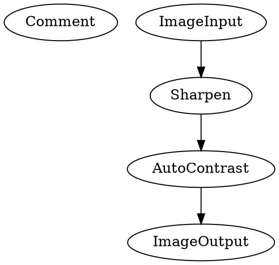

**When to Use**:

- Simple data transformations
- Single input, single output
- No conditional logic needed

______________________________________________________________________

### Pattern 2: Agent-Driven Generation

**Use Case**: LLM generates content based on input

**Example**: Image to Story

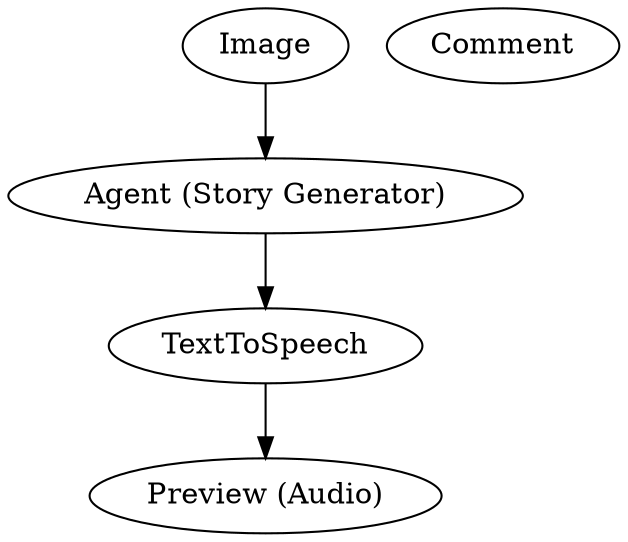

**When to Use**:

- Creative generation tasks
- Multimodal transformations (image→text→audio)
- Need semantic understanding

**Key Nodes**:

- `Agent`: General-purpose LLM agent with streaming
- `Summarizer`: Specialized for text summarization
- `ListGenerator`: Streams list of items

______________________________________________________________________

### Pattern 3: Streaming with Multiple Previews

**Use Case**: Show intermediate results during generation

**Example**: Movie Poster Generator

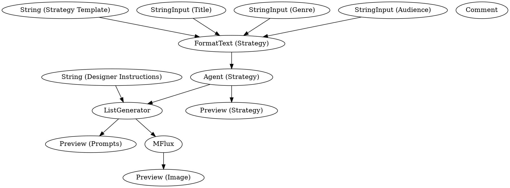

**When to Use**:

- Complex multi-stage generation
- User needs to see progress
- Agent planning + execution workflow

**Key Concepts**:

- **Strategy Phase**: Agent plans approach
- **Preview Nodes**: Show intermediate results
- **ListGenerator**: Streams generated prompts
- **Image Generation**: Final output

______________________________________________________________________

### Pattern 4: RAG (Retrieval-Augmented Generation)

**Use Case**: Answer questions using documents as context

**Example**: Chat with Docs

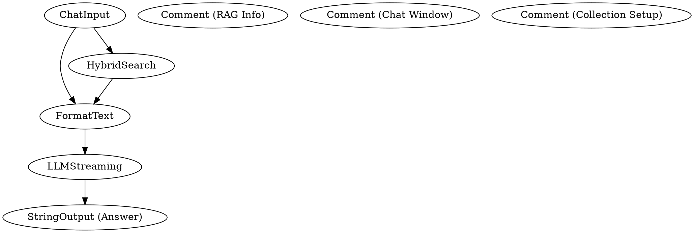

**When to Use**:

- Question-answering over documents
- Need factual accuracy from specific sources
- Reduce LLM hallucinations

**Key Components**:

1. **Search**: Query vector database for relevant documents
1. **Format**: Inject retrieved context into prompt
1. **Generate**: Stream LLM response with context

**Related Workflow**: Index PDFs

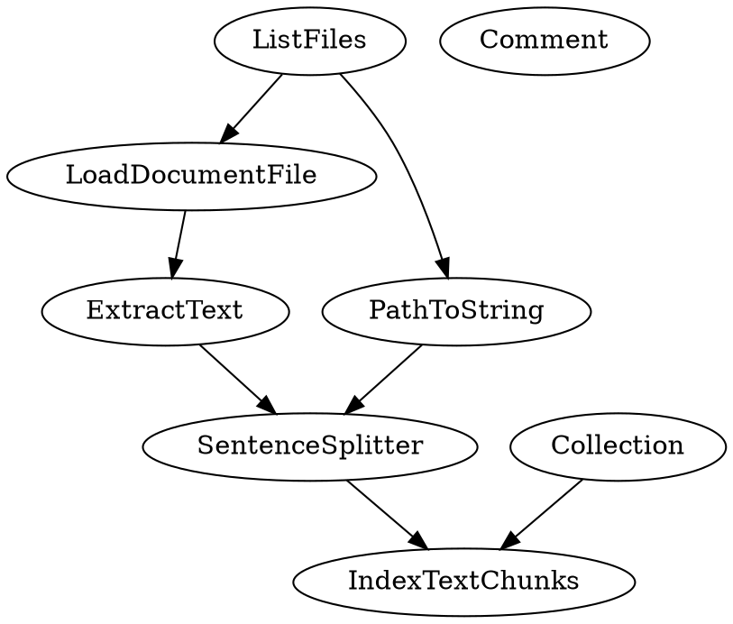

______________________________________________________________________

### Pattern 5: Database Persistence

**Use Case**: Store generated data for later retrieval

**Example**: AI Flashcard Generator with SQLite

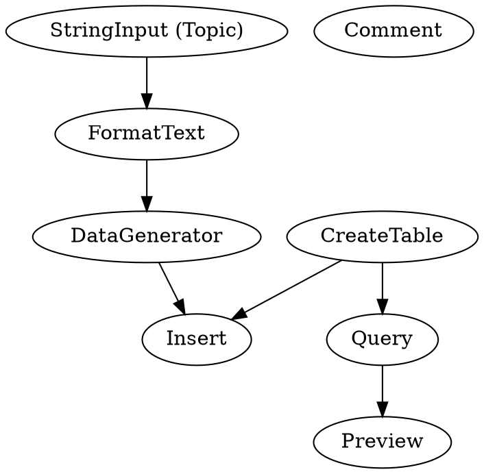

**When to Use**:

- Need persistent storage
- Building apps with memory
- Agent workflows that need to recall past interactions

**Key Nodes**:

- `CreateTable`: Initialize database schema
- `Insert`: Add records
- `Query`: Retrieve records
- `Update`: Modify records
- `Delete`: Remove records

**Database Flow**:

1. Create table structure
1. Generate data with agent
1. Insert into database
1. Query and display results

______________________________________________________________________

### Pattern 6: Email & Web Integration

**Use Case**: Process emails or web content

**Example**: Summarize Newsletters

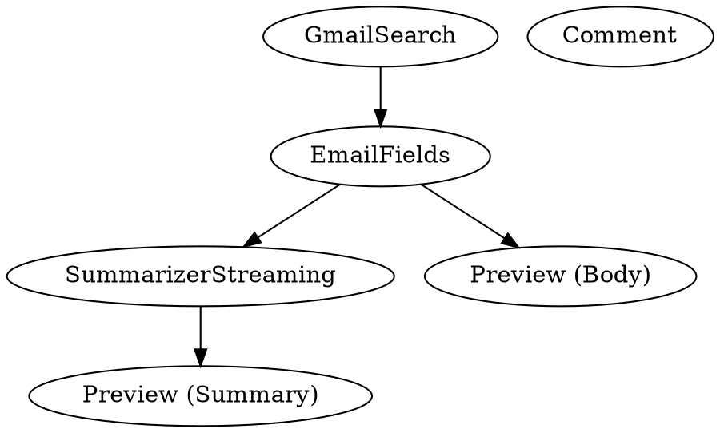

**When to Use**:

- Automate email processing
- Monitor RSS feeds
- Extract web content

**Key Nodes**:

- `GmailSearch`: Search Gmail with queries
- `EmailFields`: Extract email metadata
- `FetchRSSFeed`: Get RSS feed entries
- `GetRequest`: Fetch web content

______________________________________________________________________

### Pattern 7: Realtime Processing

**Use Case**: Process streaming audio/video in real-time

**Example**: Realtime Agent

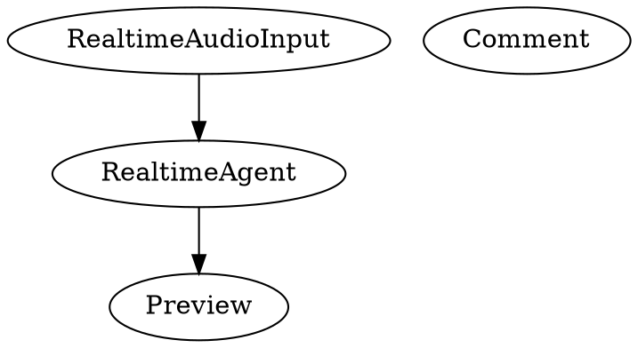

**When to Use**:

- Voice interfaces
- Live transcription
- Interactive audio applications

**Key Nodes**:

- `RealtimeAudioInput`: Streaming audio input
- `RealtimeAgent`: OpenAI Realtime API with streaming
- `RealtimeWhisper`: Live transcription
- `RealtimeTranscription`: OpenAI transcription streaming

______________________________________________________________________

### Pattern 8: Multi-Modal Workflows

**Use Case**: Convert between different media types

**Example**: Audio to Image

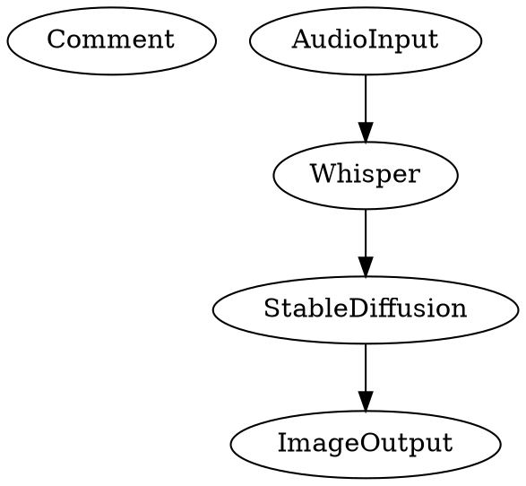

**When to Use**:

- Converting between media types
- Creating rich multimedia experiences
- Accessibility applications

**Common Chains**:

- Audio → Text → Image
- Image → Text → Audio
- Video → Audio → Text → Summary

______________________________________________________________________

### Pattern 9: Advanced Image Processing

**Use Case**: AI-powered image transformations

**Example**: Style Transfer

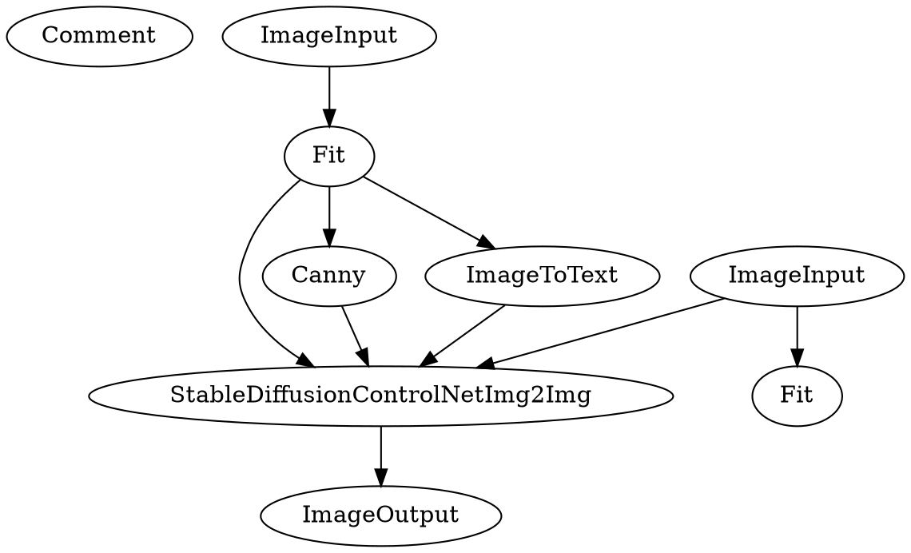

**When to Use**:

- Style transfer between images
- Controlled image generation
- Preserving structure while changing style

**Key Techniques**:

- **ControlNet**: Preserve structure with edge detection
- **Image-to-Text**: Generate descriptions
- **Img2Img**: Transform while maintaining composition

______________________________________________________________________

### Pattern 10: Data Processing Pipeline

**Use Case**: Fetch, transform, and visualize data

**Example**: Data Visualization Pipeline

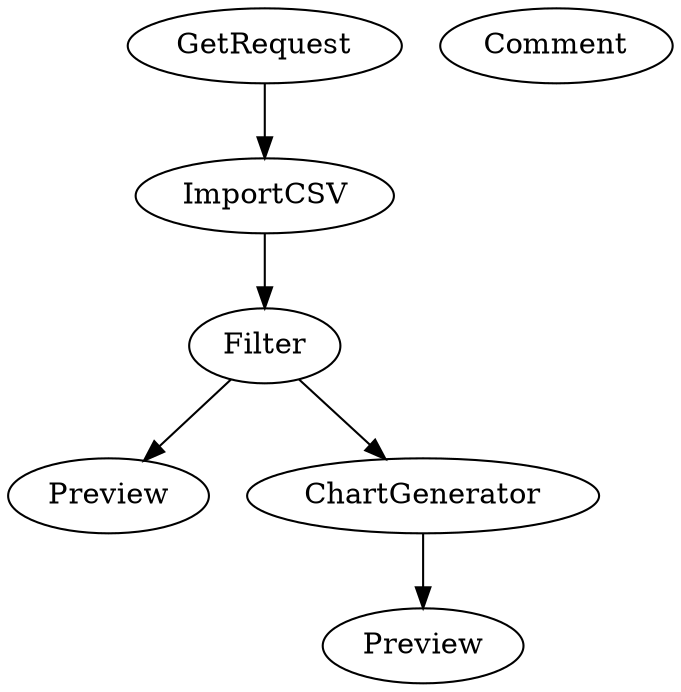

**When to Use**:

- Fetch external data sources
- Transform and filter datasets
- Auto-generate visualizations

**Key Nodes**:

- `GetRequest`: Fetch web resources
- `ImportCSV`: Parse CSV data
- `Filter`: Transform data
- `ChartGenerator`: AI-generated charts with Plotly

______________________________________________________________________

## Examples by Category

### Audio Processing

#### 1. Transcribe Audio

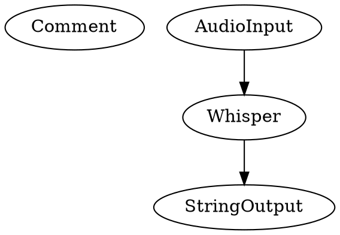

**Use**: Convert speech to text with timestamps

#### 2. Summarize Audio

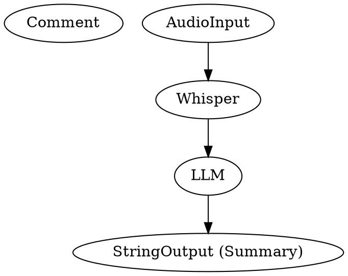

**Use**: Transcribe + summarize in one workflow

#### 3. Remove Silence

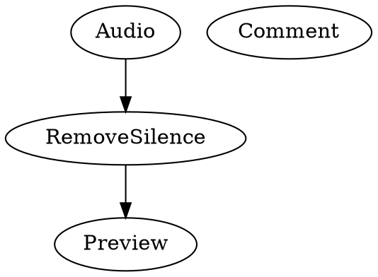

**Use**: Clean audio by removing silent segments

______________________________________________________________________

### Video Processing

#### 1. Add Subtitles to Video

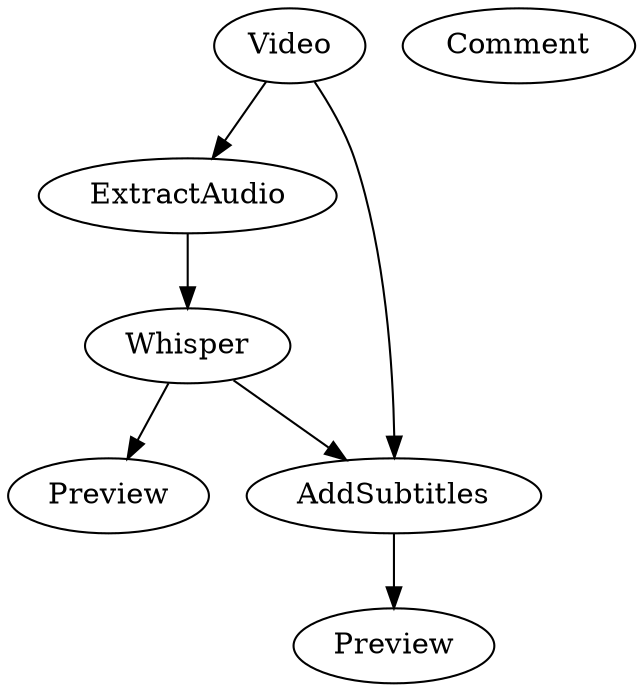

**Use**: Auto-generate and burn subtitles into video

#### 2. Audio to Spectrogram

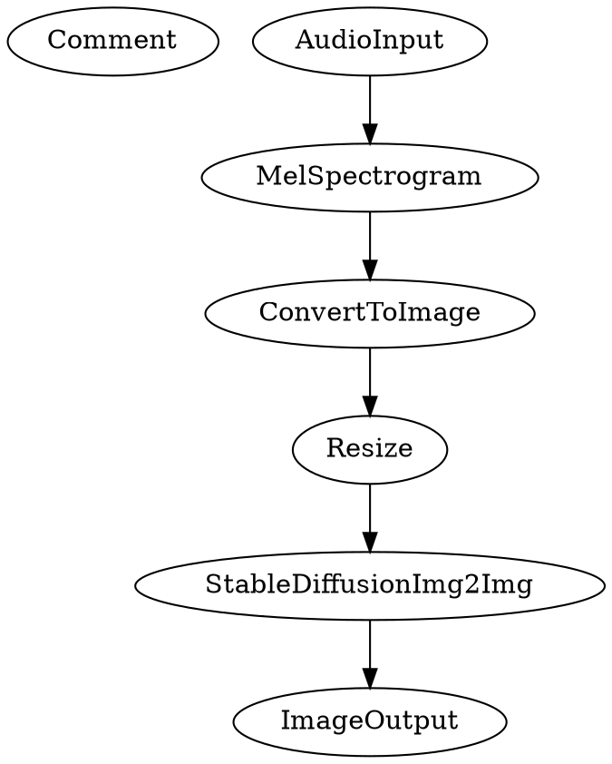

**Use**: Convert audio to visual spectrogram, then enhance with AI

______________________________________________________________________

### Image Processing

#### 1. Upscaling

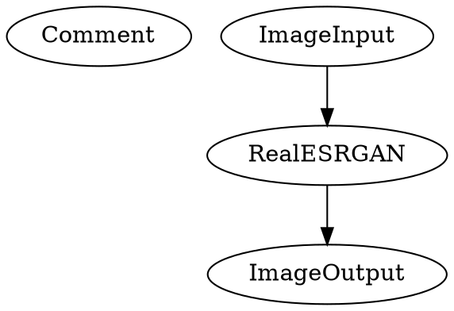

**Use**: AI-powered image upscaling

#### 2. Object Detection

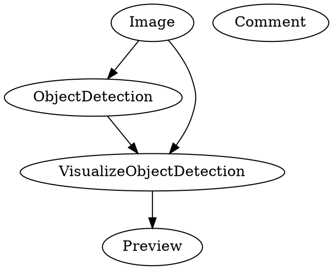

**Use**: Detect and visualize objects in images

#### 3. Depth Estimation

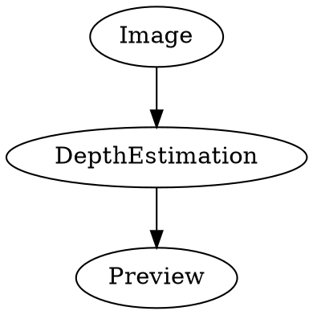

**Use**: Estimate depth map from 2D image

#### 4. Segmentation

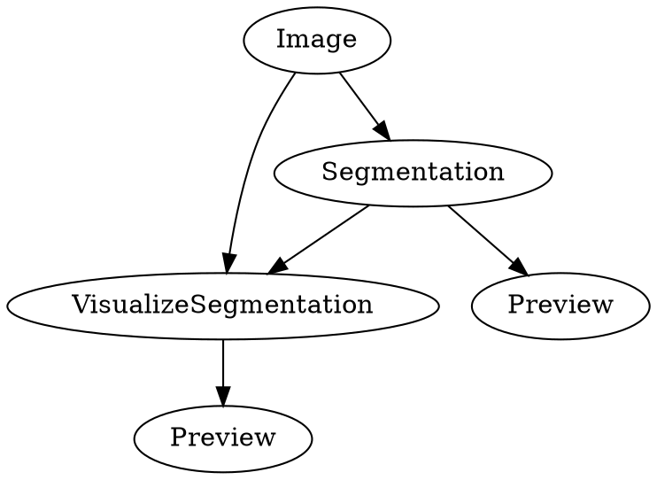

**Use**: Segment image into regions

#### 5. Controlnet

```dot
digraph workflow {
  stable_diffusion_control_net [label="StableDiffusionControlNet"];
  preview [label="Preview"];
  image [label="Image"];
  canny [label="Canny"];
  image_to_text [label="ImageToText"];
  fit [label="Fit"];
  comment [label="Comment"];
  stable_diffusion_control_net -> preview;
  canny -> stable_diffusion_control_net;
  image_to_text -> stable_diffusion_control_net;
  image -> fit;
  fit -> canny;
  fit -> image_to_text;
}
```

**Use**: Generate images with edge-based guidance

______________________________________________________________________

### Document & Email Processing

#### 1. Categorize Mails

```dot
digraph workflow {
  gmail_search [label="GmailSearch"];
  email_fields [label="EmailFields"];
  classifier [label="Classifier"];
  preview [label="Preview"];
  comment_workflow [label="Comment"];
  gmail_search -> email_fields;
  email_fields -> classifier;
  classifier -> preview;
}
```

**Use**: Automatically categorize emails with AI

#### 2. Summarize Paper

```dot
digraph workflow {
  load_document_file [label="LoadDocumentFile"];
  extract_text [label="ExtractText"];
  preview_summary [label="Preview (Summary)"];
  summarizer [label="Summarizer"];
  preview_text [label="Preview (Text)"];
  comment_workflow [label="Comment"];
  load_document_file -> extract_text;
  extract_text -> summarizer;
  extract_text -> preview_text;
  summarizer -> preview_summary;
}
```

**Use**: Extract and summarize research papers

#### 3. Fetch Papers

```dot
digraph workflow {
  get_request [label="GetRequest"];
  markdown_splitter [label="MarkdownSplitter"];
  filter [label="Filter"];
  extract_links [label="ExtractLinks"];
  download_file [label="DownloadFile"];
  preview [label="Preview"];
  comment_workflow [label="Comment"];
  get_request -> markdown_splitter;
  markdown_splitter -> extract_links;
  extract_links -> filter;
  filter -> download_file;
  filter -> preview;
}
```

**Use**: Auto-download papers from web resources

#### 4. Summarize RSS

```dot
digraph workflow {
  fetch_r_s_s_feed [label="FetchRSSFeed"];
  collect [label="Collect"];
  summarizer [label="Summarizer"];
  preview [label="Preview"];
  string_output [label="StringOutput"];
  fetch_r_s_s_feed -> collect;
  collect -> summarizer;
  summarizer -> preview;
  summarizer -> string_output;
}
```

**Use**: Monitor and summarize RSS feeds

______________________________________________________________________

### Creative Generation

#### 1. Pokemon Maker

```dot
digraph workflow {
  animals_input [label="StringInput (Animals)"];
  format_text [label="FormatText (Pokemon Prompt)"];
  list_generator [label="ListGenerator"];
  stable_diffusion [label="StableDiffusion"];
  image_output [label="ImageOutput"];
  preview_description [label="Preview (Description)"];
  preview_image [label="Preview (Image)"];
  format_text -> list_generator;
  list_generator -> stable_diffusion;
  stable_diffusion -> image_output;
  animals_input -> format_text;
  list_generator -> preview_description;
  stable_diffusion -> preview_image;
}
```

**Use**: Generate Pokemon-style creatures from descriptions

#### 2. Re-Imagine

```dot
digraph workflow {
  comment_workflow [label="Comment"];
  image_input [label="Image"];
  fit [label="Fit"];
  image_to_text [label="ImageToText"];
  img2img [label="StableDiffusionImg2Img"];
  image_preview [label="Preview"];
  image_input -> fit;
  fit -> image_to_text;
  image_to_text -> img2img;
  fit -> img2img;
  img2img -> image_preview;
}
```

**Use**: Reimagine an image with AI

#### 3. Img2Img

```dot
digraph workflow {
  comment_workflow [label="Comment"];
  image_input [label="Image"];
  img2img [label="StableDiffusionImg2Img"];
  image_preview [label="Preview"];
  image_input -> img2img;
  img2img -> image_preview;
}
```

**Use**: Simple image-to-image transformation

______________________________________________________________________

### Data Generation

#### 1. Data Generator

```dot
digraph workflow {
  preview [label="Preview"];
  data_generator [label="DataGenerator"];
  comment [label="Comment"];
  data_generator -> preview;
}
```

**Use**: Generate structured datasets from natural language

______________________________________________________________________

## Best Practices

### 1. Workflow Design

**DO:**

- ✅ Use descriptive node names
- ✅ Add Comment nodes to document workflow sections
- ✅ Use Preview nodes to inspect intermediate results
- ✅ Keep workflows focused on a single goal
- ✅ Test with small inputs first

**DON'T:**

- ❌ Create circular dependencies (must be DAG)
- ❌ Overload a single workflow with too many tasks
- ❌ Skip error handling
- ❌ Forget to set output nodes

### 2. Streaming Workflows

**DO:**

- ✅ Use streaming nodes for real-time feedback
- ✅ Add Preview nodes to show progress
- ✅ Use `LLMStreaming` for chat-like experiences
- ✅ Use `Collect` to gather streaming results

**DON'T:**

- ❌ Block on streaming data when not needed
- ❌ Ignore progress updates in long-running workflows

### 3. Agent Workflows

**DO:**

- ✅ Provide clear, specific prompts
- ✅ Use FormatText to structure prompts
- ✅ Set appropriate model parameters
- ✅ Use Preview to validate agent output

**DON'T:**

- ❌ Use overly vague instructions
- ❌ Skip output validation
- ❌ Ignore model limitations

### 4. RAG Workflows

**DO:**

- ✅ Index documents before querying
- ✅ Use HybridSearch for better retrieval
- ✅ Format context properly in prompts
- ✅ Keep chunk sizes reasonable (256-512 tokens)

**DON'T:**

- ❌ Query without proper indexing
- ❌ Overload LLM with too much context
- ❌ Skip metadata in document chunks

### 5. Database Workflows

**DO:**

- ✅ Create tables before inserting
- ✅ Use proper data types
- ✅ Query before assuming data exists
- ✅ Handle empty results gracefully

**DON'T:**

- ❌ Assume table schema
- ❌ Forget to handle query failures

### 6. Multi-Modal Workflows

**DO:**

- ✅ Validate input types match expected formats
- ✅ Use appropriate conversion nodes
- ✅ Preview intermediate transformations
- ✅ Handle format-specific errors

**DON'T:**

- ❌ Chain incompatible types
- ❌ Skip validation steps

______________________________________________________________________

## Node Reference

### Input Nodes

| Node                 | Type          | Purpose                    |
| -------------------- | ------------- | -------------------------- |
| `StringInput`        | string        | Text input parameter       |
| `IntegerInput`       | int           | Whole number input         |
| `FloatInput`         | float         | Decimal number input       |
| `BooleanInput`       | bool          | True/false toggle          |
| `ImageInput`         | ImageRef      | Image asset reference      |
| `AudioInput`         | AudioRef      | Audio asset reference      |
| `VideoInput`         | VideoRef      | Video asset reference      |
| `DocumentInput`      | DocumentRef   | Document asset reference   |
| `CollectionInput`    | Collection    | Vector database collection |
| `RealtimeAudioInput` | Stream[Audio] | Streaming audio input      |

### Output Nodes

| Node           | Type     | Purpose                   |
| -------------- | -------- | ------------------------- |
| `StringOutput` | string   | Text output               |
| `ImageOutput`  | ImageRef | Image output              |
| `AudioOutput`  | AudioRef | Audio output              |
| `VideoOutput`  | VideoRef | Video output              |
| `Preview`      | any      | Show intermediate results |

### Agent Nodes

| Node                        | Streaming | Purpose                       |
| --------------------------- | --------- | ----------------------------- |
| `Agent`                     | ✅        | General LLM agent             |
| `Summarizer`                | ✅        | Text summarization            |
| `SummarizerStreaming`       | ✅        | Streaming summarization       |
| `ListGenerator`             | ✅        | Generate lists of items       |
| `DataGenerator`             | ✅        | Generate structured data      |
| `ChartGenerator`            | ✅        | Generate Plotly charts        |
| `StructuredOutputGenerator` | ❌        | Generate JSON objects         |
| `Classifier`                | ❌        | Classify text into categories |
| `Extractor`                 | ❌        | Extract structured data       |
| `RealtimeAgent`             | ✅        | OpenAI Realtime API           |
| `ResearchAgent`             | ❌        | Web research agent            |

### Control Nodes

| Node         | Purpose                           |
| ------------ | --------------------------------- |
| `FormatText` | String formatting with templates  |
| `Collect`    | Gather streaming items into list  |
| `Filter`     | Filter data based on conditions   |
| `Comment`    | Documentation node (no operation) |

### Storage Nodes

| Node          | Purpose             |
| ------------- | ------------------- |
| `CreateTable` | Create SQLite table |
| `Insert`      | Insert record       |
| `Query`       | Query records       |
| `Update`      | Update records      |
| `Delete`      | Delete records      |

### Vector Database Nodes

| Node               | Purpose                    |
| ------------------ | -------------------------- |
| `IndexTextChunks`  | Add text to vector DB      |
| `HybridSearch`     | Semantic + keyword search  |
| `LoadDocumentFile` | Load document from path    |
| `ExtractText`      | Extract text from document |
| `SentenceSplitter` | Split text into chunks     |

### Email Nodes

| Node           | Purpose                |
| -------------- | ---------------------- |
| `GmailSearch`  | Search Gmail           |
| `EmailFields`  | Extract email metadata |
| `FetchRSSFeed` | Fetch RSS feed         |

### Web Nodes

| Node           | Purpose                 |
| -------------- | ----------------------- |
| `GetRequest`   | HTTP GET request        |
| `ImportCSV`    | Parse CSV data          |
| `DownloadFile` | Download file from URL  |
| `ExtractLinks` | Extract links from text |

### Audio Nodes

| Node              | Purpose                      |
| ----------------- | ---------------------------- |
| `Whisper`         | Speech-to-text transcription |
| `RealtimeWhisper` | Streaming transcription      |
| `TextToSpeech`    | Text-to-speech generation    |
| `RemoveSilence`   | Remove silent segments       |
| `MelSpectrogram`  | Generate mel spectrogram     |
| `ExtractAudio`    | Extract audio from video     |

### Image Nodes

| Node                        | Purpose                  |
| --------------------------- | ------------------------ |
| `StableDiffusion`           | Text-to-image generation |
| `StableDiffusionImg2Img`    | Image transformation     |
| `StableDiffusionControlNet` | Guided image generation  |
| `RealESRGAN`                | AI upscaling             |
| `ObjectDetection`           | Detect objects           |
| `Segmentation`              | Segment image            |
| `DepthEstimation`           | Estimate depth           |
| `ImageToText`               | Generate image captions  |
| `Canny`                     | Edge detection           |
| `Fit`                       | Resize/fit image         |
| `Resize`                    | Resize image             |
| `Sharpen`                   | Sharpen image            |
| `AutoContrast`              | Auto-adjust contrast     |
| `ConvertToImage`            | Convert data to image    |
| `VisualizeObjectDetection`  | Draw bounding boxes      |
| `VisualizeSegmentation`     | Visualize segments       |

### Video Nodes

| Node           | Purpose                   |
| -------------- | ------------------------- |
| `AddSubtitles` | Burn subtitles into video |
| `ExtractAudio` | Extract audio track       |

### File System Nodes

| Node           | Purpose                 |
| -------------- | ----------------------- |
| `ListFiles`    | List files in directory |
| `PathToString` | Convert path to string  |

______________________________________________________________________

## Quick Reference: Choose Your Pattern

### I want to...

**Generate creative content:** → Use Pattern 2 (Agent-Driven Generation) → Nodes: `Agent`, `ListGenerator`, image/audio
generators

**Answer questions about documents:** → Use Pattern 4 (RAG) → First: Index documents with `IndexTextChunks` → Then:
Query with `HybridSearch` + `LLMStreaming`

**Process emails automatically:** → Use Pattern 6 (Email Integration) → Nodes: `GmailSearch`, `EmailFields`,
`Classifier`/`Summarizer`

**Build a voice interface:** → Use Pattern 7 (Realtime Processing) → Nodes: `RealtimeAudioInput`, `RealtimeAgent`

**Store data persistently:** → Use Pattern 5 (Database Persistence) → Nodes: `CreateTable`, `Insert`, `Query`

**Transform images with AI:** → Use Pattern 9 (Advanced Image Processing) → Nodes: `StableDiffusionControlNet`, `Canny`,
`ImageToText`

**Process audio/video:** → Check Audio/Video examples → Nodes: `Whisper`, `AddSubtitles`, `RemoveSilence`

**Fetch and visualize data:** → Use Pattern 10 (Data Processing Pipeline) → Nodes: `GetRequest`, `ImportCSV`,
`ChartGenerator`

______________________________________________________________________

## Conclusion

This cookbook provides patterns and examples for building production-ready NodeTool workflows. Key takeaways:

1. **Start Simple**: Begin with basic pipelines, add complexity as needed
1. **Use Streaming**: Leverage streaming for better UX and performance
1. **Preview Often**: Add Preview nodes to debug and validate
1. **Combine Patterns**: Mix patterns to create sophisticated workflows
1. **Test Incrementally**: Build workflows step by step, testing each addition

### Next Steps

1. **Explore Examples**: Try running the example workflows in this cookbook
1. **Build Your Own**: Start with a simple pattern and customize it
1. **Share Workflows**: Export and share your workflows with the community
1. **Extend NodeTool**: Create custom nodes for specific use cases

### Resources

- **MCP Server**: Use `export_workflow_digraph` to visualize workflows
- **Node Search**: Use `search_nodes` to discover available nodes
- **Documentation**: Check node descriptions with `get_node_info`

______________________________________________________________________

**Version:** 1.0 **Last Updated:** 2025-10-12 **Generated with:** NodeTool MCP Server + Claude Code
