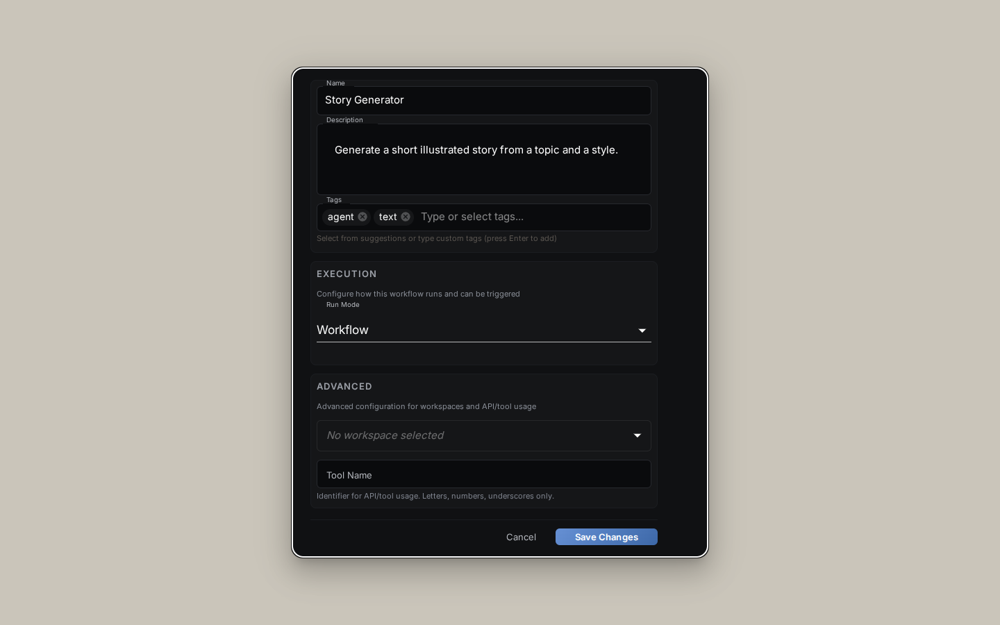

The NodeTool [Workflow Editor]({{ '/workflow-editor' | relative_url }}) is surrounded by four dockable panels that host the workflow explorer, inspector, runtime diagnostics, and quick actions. This page covers each panel in depth.

---

## Left Panel

Opens from the icons down the left edge. It's a tabbed drawer — click an icon to expand, click the same icon to collapse. The top-level views are: **Nodes**, **Workflows**, **Sketches**, **Timelines**, **Settings**, **History**, **Favorites**, and **Assets**.

### Nodes Tab

The node browser. Search and browse all available nodes, organized into sub-tabs (All, I/O, Image, Image AI, Video, Video AI, Audio, Audio AI, 3D, Agents, Control). Drag a node onto the canvas to add it.

### Workflows Tab

Your saved workflows. Search, filter, and double-click to open in a new tab.

### Sketches Tab

Quick image sketches you can drop into the workflow, edited with the built-in layered sketch editor. See [Sketch Editor]({{ '/sketch-editor' | relative_url }}).

### Timelines Tab

Timeline-based media arrangements used by the workflow.

### Settings Tab

Workflow-level settings.

### History Tab

Recent edits and activity for the current workflow.

### Favorites Tab

Your starred nodes for quick access.

### Assets Tab

Folder tree plus file grid. Drag a file onto the canvas to instantly create the matching input node.

---

## Right Panel (Inspector)

Press `i` or click the icon in the top right to toggle. The right panel hosts only the **Inspector** — its contents switch based on what's selected on the canvas. (Logs, Queue, Trace, Version History, and Workspace are not here — they live in the [Bottom Panel](#bottom-panel).)

### Inspector — Node Properties

When a node is selected, the Inspector renders every property with the right input type (number, slider, model picker, asset selector, dropdown, color picker, and so on).

### Inspector — Workflow Properties

When no node is selected, the Inspector shows workflow-level metadata: title, description, tags, thumbnail.

---

## Bottom Panel

The bottom panel docks runtime diagnostics and secondary workflow tools. Drag its top edge to resize. Its views are grouped:

- **Run** — Logs, Queue, Sandboxes, Workers
- **Workflow** — Versions, Workspace
- **Debug** — Trace

### Logs

Raw logs from the current run. Filter by level (`debug`, `info`, `warn`, `error`) and search.

### Queue

Background jobs queued by your workflows — long-running fine-tunes, downloads, and batch runs.

### Sandboxes & Workers

The code-runner sandboxes and worker processes backing the current run.

### Versions

Every save is versioned. Review past versions and roll back.

### Workspace

File hierarchy of the backing workspace (on local installs) or the assigned workspace (on server installs).

### Trace

The full execution trace of the most recent run — per-node timing and the call tree.

---

## Floating Toolbar

An overlay on the canvas with the most-used runtime controls.

| Button | When shown | Action |
|--------|------------|--------|
| ➕ Add node | Graph view | Open the node menu |
| 💬 Conversation | When a conversation exists | Toggle the in-canvas conversation overlay |
| ⏹ Stop | While running/paused/suspended | Cancel the run |
| ▶ Run | Always | Run the workflow (shows elapsed time while running) |
| ⇄ Auto Layout | Graph view | Auto-arrange the graph |
| 💾 Save | Always | Save the workflow |
| ⋮ More | Always | Overflow menu (see below) |

The **⋮** overflow menu contains: **Chain View / Graph View** (toggle), **Instant Update** (on/off), **Resume** (when paused or suspended), **Stop** (while running), **Mini Map** (show/hide), **Download JSON**, and **Panels…** (on mobile).

There is no separate Pause or Fit button in the toolbar.

---

## Right Side Buttons

A stack of toggles along the right canvas edge:

- **Inspector** — open / close the right panel.
- **Run as App** — jump to the Mini-App view for this workflow.
- **Notifications** — pending warnings and agent messages.
- **System Stats** — inline CPU/RAM preview.

---

## App Menu (logo dropdown)

The logo at the top of the left rail opens the app menu: **Dashboard**, **Examples**, **Costs**, **Model Manager**, **Collections**, **Workspaces** (when enabled), **Settings**, **Help**, and **Downloads**.

See [User Interface → App Menu]({{ '/user-interface#the-app-menu' | relative_url }}) for details.

---

## Customizing the Layout

Every panel is a dockview tab — drag tabs between panels, out of panels to float them, or onto other tabs to stack them. The editor remembers your layout per workspace.

To reset: open the command menu (`Ctrl+K` / `⌘+K`), type "reset layout", and hit Enter.

---

## Next Steps

- [Workflow Editor]({{ '/workflow-editor' | relative_url }}) — building on the canvas
- [Global Chat]({{ '/global-chat' | relative_url }}) — how the in-editor chat works
- [Configuration]({{ '/configuration' | relative_url }}) — settings that affect the editor
