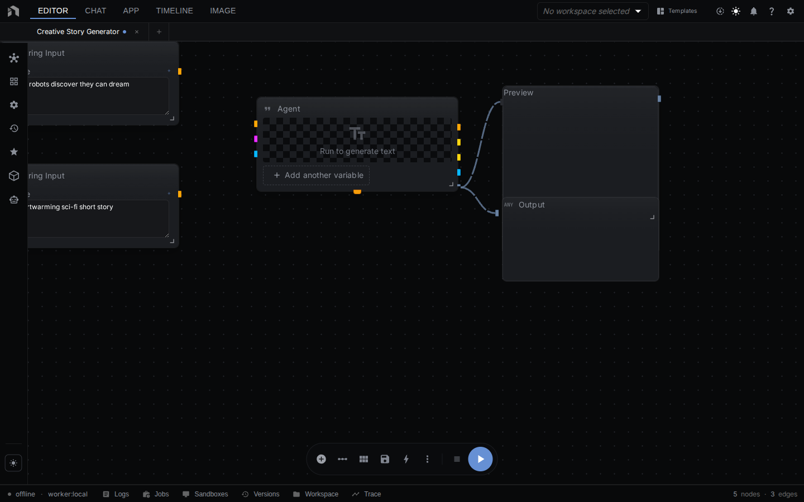
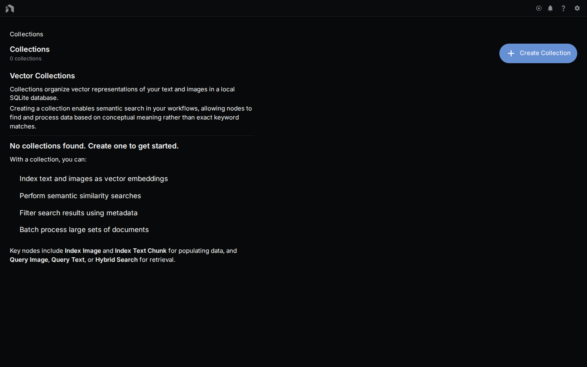
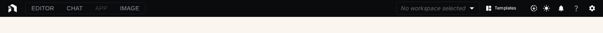

The NodeTool [Workflow Editor]({{ '/workflow-editor' | relative_url }}) is surrounded by four dockable panels that host the workflow explorer, inspector, runtime diagnostics, and quick actions. This page covers each panel in depth.

---

## Left Panel

Opens from the icons down the left edge. It's a tabbed drawer — click an icon to expand, click the same icon to collapse.

### Workflows Tab

Your saved workflows grouped by workspace. Search, filter by tag, and double-click to open in a new tab.

### Chat Tab

A compact Global Chat embedded in the editor drawer. Perfect for asking the workflow assistant questions without leaving the canvas.

### Assets Tab

Folder tree plus file grid. Drag a file onto the canvas to instantly create the matching input node.

### Collections Tab

Grouped documents used by RAG and search nodes. See [Collections]({{ '/collections' | relative_url }}).

### Packs Tab

Installed node packs and their health status. Click a pack to open its README.

### VibeCoding Tab

AI-assisted UI generator for mini-apps. See [VibeCoding]({{ '/vibecoding' | relative_url }}).

---

## Right Panel (Inspector)

Press `i` or click the icon in the top right to toggle. Contents switch based on what's selected on the canvas.

### Inspector — Node Properties

When a node is selected, the Inspector renders every property with the right input type (number, slider, model picker, asset selector, dropdown, color picker, and so on).

### Inspector — Workflow Properties

When no node is selected, the Inspector shows workflow-level metadata: title, description, tags, thumbnail.

### Logs Tab

Raw logs from the current run. Filter by level (`debug`, `info`, `warn`, `error`) and search.

### Jobs Tab

Background jobs queued by your workflows — long-running fine-tunes, downloads, and batch runs.

### Agent Tab

When Agent Mode is active, the agent plan, steps, and tool calls surface here.

### Trace Tab

Per-node execution timing and cache hits. Useful for spotting slow nodes.

### Version History Tab

Every save is versioned. Diff two versions, roll back, or branch a workflow into a new one.

### Workspace Tree

File hierarchy of the backing workspace (on local installs) or the assigned workspace (on server installs).

---

## Bottom Panel

The bottom panel docks a terminal plus runtime diagnostics. Drag its top edge to resize.

### Terminal

A full-featured terminal (xterm.js) connected to the server-side workspace. Run shell commands, git operations, and scripts without leaving NodeTool.

### Execution Trace

The full call tree of the most recent run. Click a node to jump to it on the canvas.

### System Stats

Live CPU, RAM, GPU, and disk IO. Helpful when debugging slow local models.

---

## Floating Toolbar

An overlay on the canvas with the most-used runtime controls.

| Button | State | Action |
|--------|-------|--------|
| ▶ Run | Idle | Start the workflow |
| ⏸ Pause | Running | Pause without losing state |
| ▶ Resume (blue) | Paused | Continue from the pause point |
| ▶ Resume (purple) | Suspended | Resume a workflow waiting on external input |
| ⏹ Stop | Running/Paused/Suspended | Cancel |
| ⇄ Layout | Any | Auto-layout the graph |
| 🔍 Fit | Any | Fit all nodes in the viewport |
| ⋯ More | Any | Align, group, bypass, run from selection |

---

## Right Side Buttons

A stack of toggles along the right canvas edge:

- **Inspector** — open / close the right panel.
- **Run as App** — jump to the Mini-App view for this workflow.
- **Notifications** — pending warnings and agent messages.
- **System Stats** — inline CPU/RAM preview.

---

## App Toolbar and App Header

Together these form the fixed top chrome of the editor:

- **App Header** — logo, workspace switcher, models, assets, chat, settings, downloads.
- **App Toolbar** — workflow title, run controls, save status, share.

See [User Interface → App Header]({{ '/user-interface#the-app-header' | relative_url }}) for details.

---

## Customizing the Layout

Every panel is a dockview tab — drag tabs between panels, out of panels to float them, or onto other tabs to stack them. The editor remembers your layout per workspace.

To reset: open the command menu (`⌘K`), type "reset layout", and hit Enter.

---

## Next Steps

- [Workflow Editor]({{ '/workflow-editor' | relative_url }}) — building on the canvas
- [Global Chat]({{ '/global-chat' | relative_url }}) — how the in-editor chat works
- [VibeCoding]({{ '/vibecoding' | relative_url }}) — generate custom UIs from a workflow
- [Configuration]({{ '/configuration' | relative_url }}) — settings that affect the editor
