The NodeTool [Workflow Editor]({{ '/workflow-editor' | relative_url }}) is surrounded by four panels that host the workflow explorer, inspector, runtime diagnostics, and quick actions. This page covers each panel in depth.

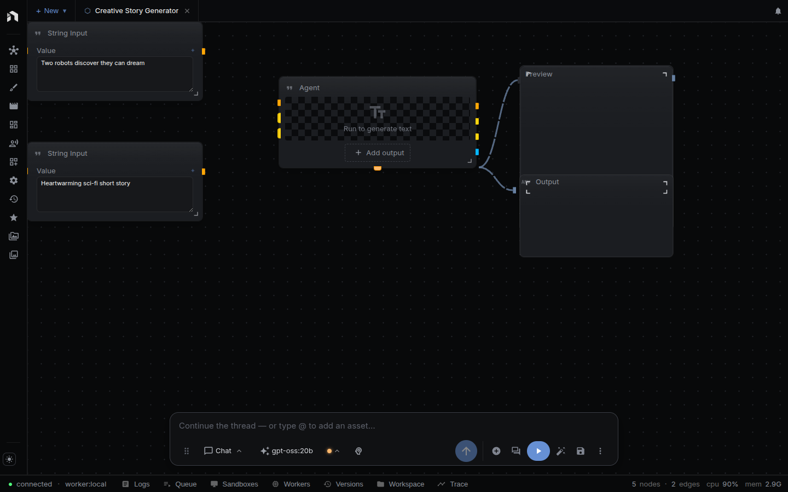

---

## Left Panel

Opens from the icons down the left edge. It's a tabbed drawer — click an icon to expand, click the same icon to collapse. The top-level views are: **Nodes**, **Workflows**, **Chats**, **Sketches**, **Timelines**, **Storyboards**, **Scripts**, **Apps**, **Settings**, **History**, **Favorites**, **Workspace**, **Assets**, and **Library**.

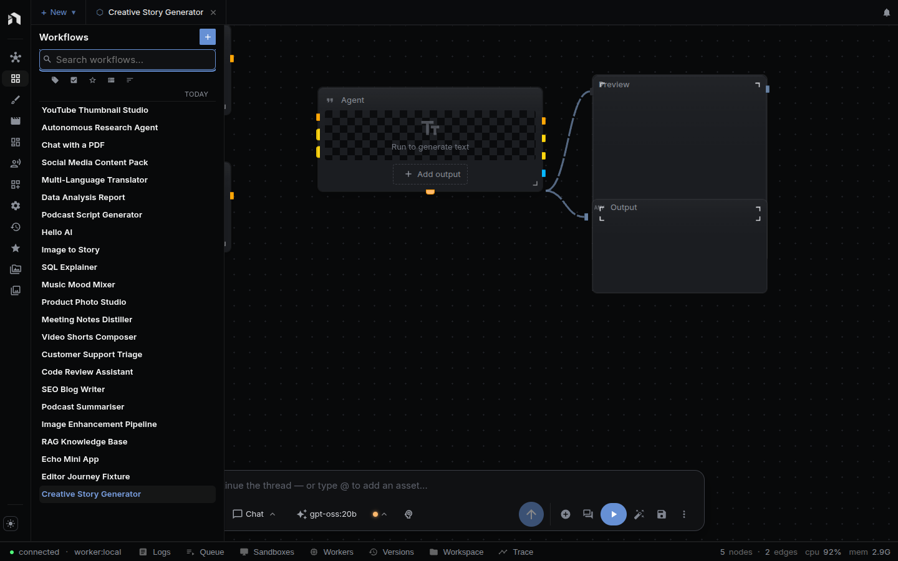

### Nodes Tab

The node browser. Search and browse all available nodes, organized into sub-tabs (All, I/O, Image, Image AI, Video, Video AI, Audio, Audio AI, 3D, Agents, Control). Drag a node onto the canvas to add it.

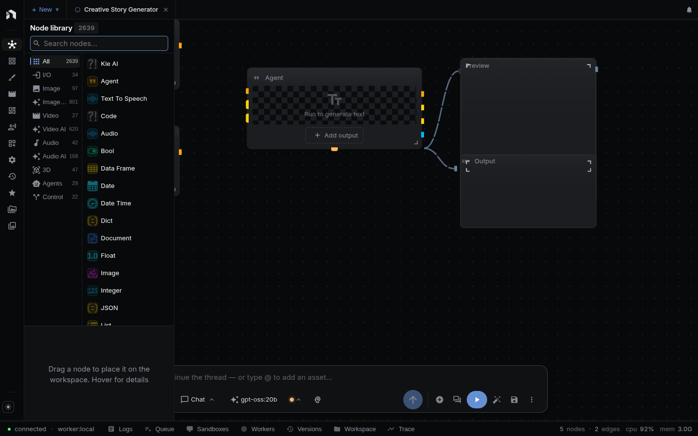

### Workflows Tab

Your saved workflows. Search, filter, and double-click to open in a new tab.

### Sketches Tab

Quick image sketches you can drop into the workflow, edited with the built-in layered sketch editor. See [Sketch Editor]({{ '/sketch-editor' | relative_url }}).

### Timelines Tab

Timeline-based media arrangements used by the workflow.

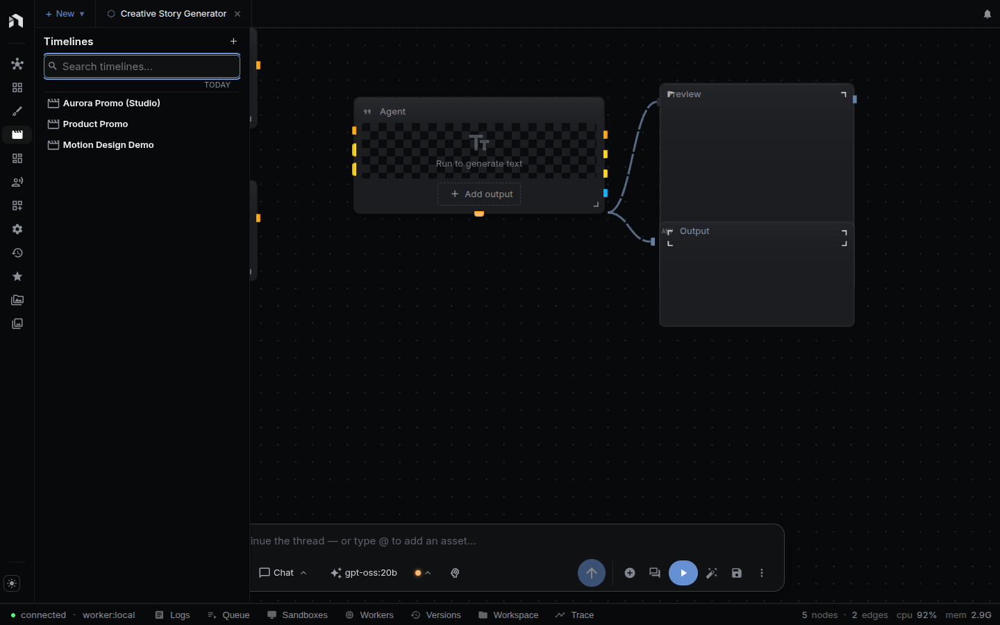

### Settings Tab

Workflow-level settings.

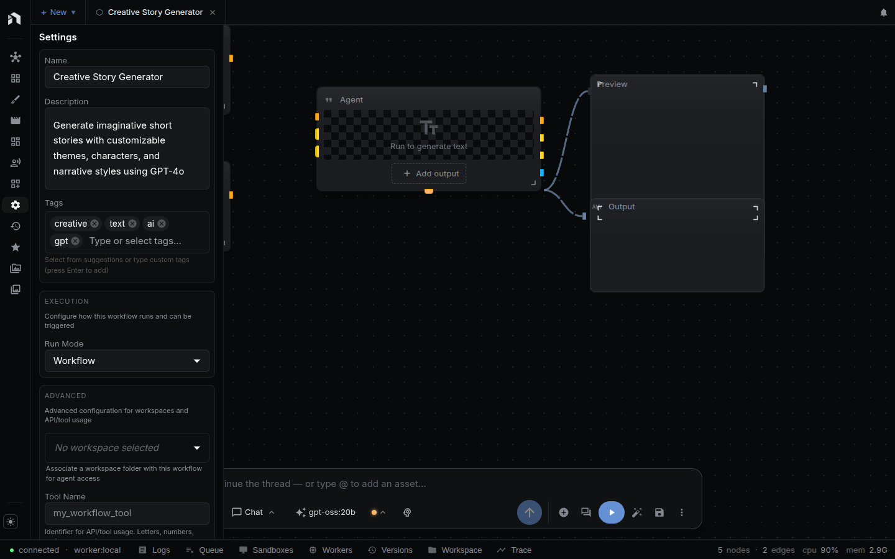

### History Tab

Recent edits and activity for the current workflow.

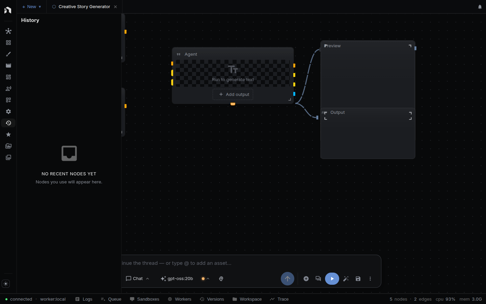

### Favorites Tab

Your starred nodes for quick access.

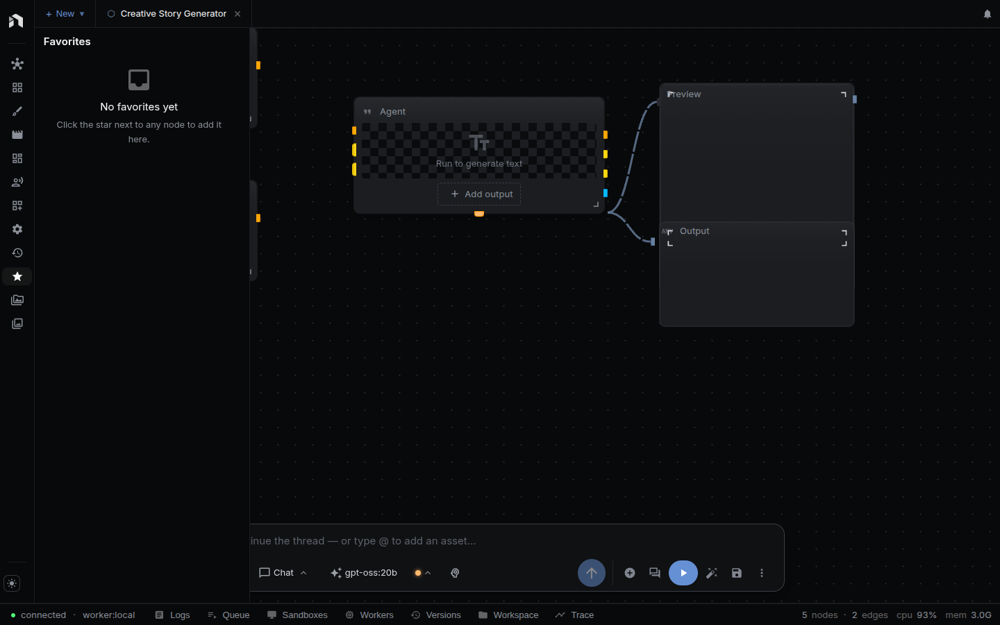

### Workspace Tab

File hierarchy of the backing workspace (on local installs) or the assigned
workspace (on server installs). Pick the workspace from the dropdown;
double-click a file to open it as a workspace tab.

### Assets Tab

Folder tree plus file grid. Drag a file onto the canvas to instantly create the matching input node.

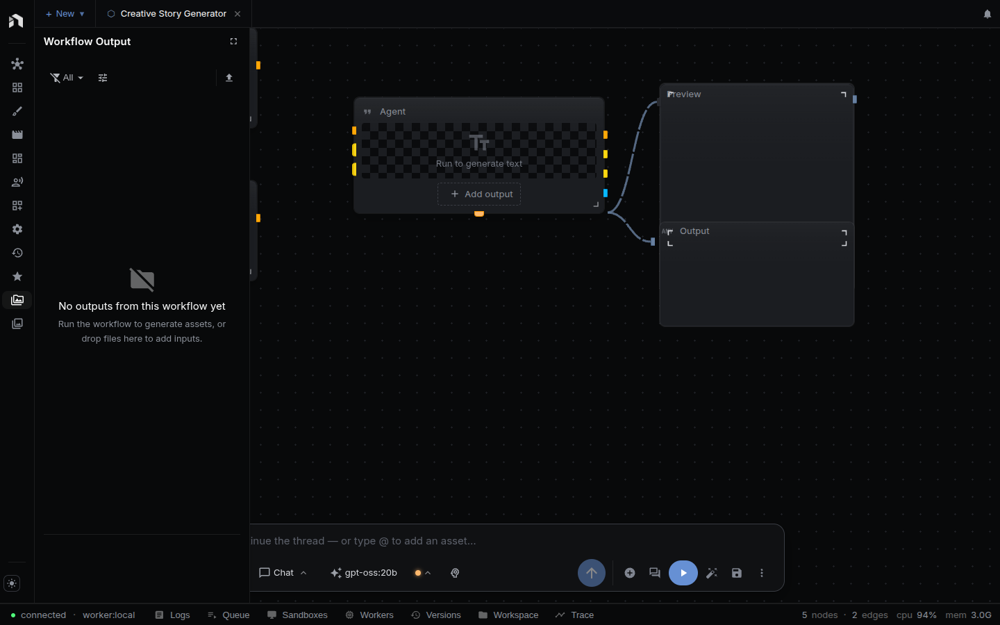

### Apps Tab

Your Mini Apps. Click one to open it as a workspace tab; the two header icons create an app from a workflow or start an empty one. See [Mini Apps]({{ '/mini-apps' | relative_url }}).

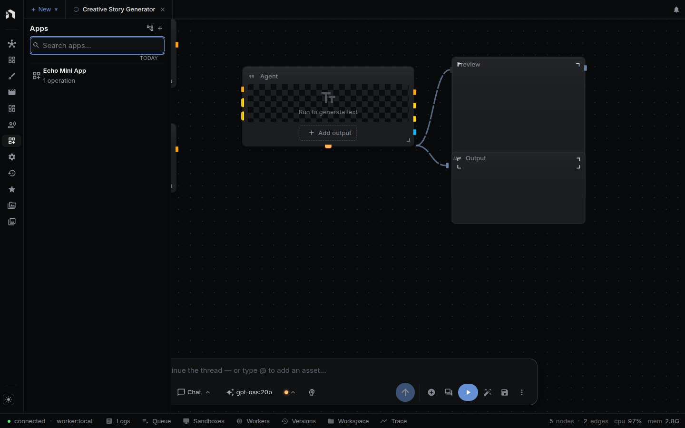

---

## Right Panel (Inspector)

Press `i` or click the icon in the top right to toggle. The right panel hosts only the **Inspector** — its contents switch based on what's selected on the canvas. (Logs, Queue, Trace, and Version History are not here — they live in the [Bottom Panel](#bottom-panel).)

### Inspector — Node Properties

When a node is selected, the Inspector renders every property with the right input type (number, slider, model picker, asset selector, dropdown, color picker, and so on).

### Inspector — Workflow Properties

When no node is selected, the Inspector shows workflow-level metadata: title, description, tags, thumbnail.

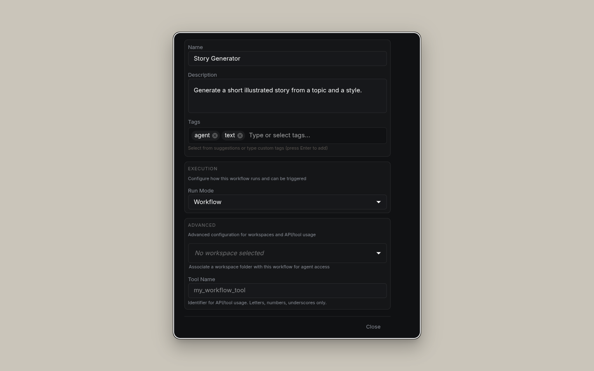

---

## Bottom Panel

The bottom panel docks runtime diagnostics and secondary workflow tools. Drag its top edge to resize. Its views are grouped:

- **Run** — Logs, Queue, Sandboxes, Workers
- **Workflow** — Versions
- **Debug** — Trace

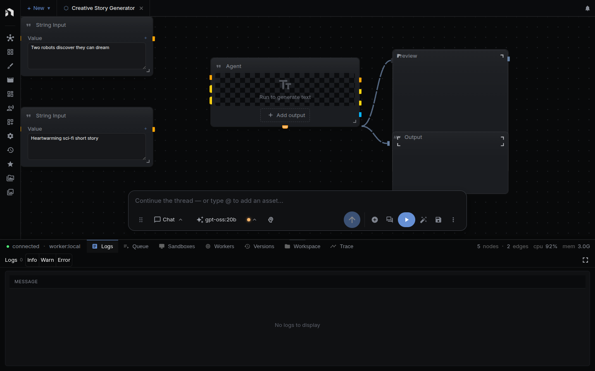

Its header also carries a live readout of the **server's** CPU and memory use,
next to the node and edge counts. The figures come from the `system_stats`
frame the server pushes every 5s (see
[WebSocket API](websocket-api.md#system_stats)); that is your own machine. A
hosted server (auth enforced) sends no such frame — the readout describes a
shared container nobody using it owns — so the header shows the counts alone.

### Logs

Raw logs from the current run. Filter by level (`debug`, `info`, `warn`, `error`) and search.

### Queue

Background jobs queued by your workflows — long-running fine-tunes, downloads, and batch runs.

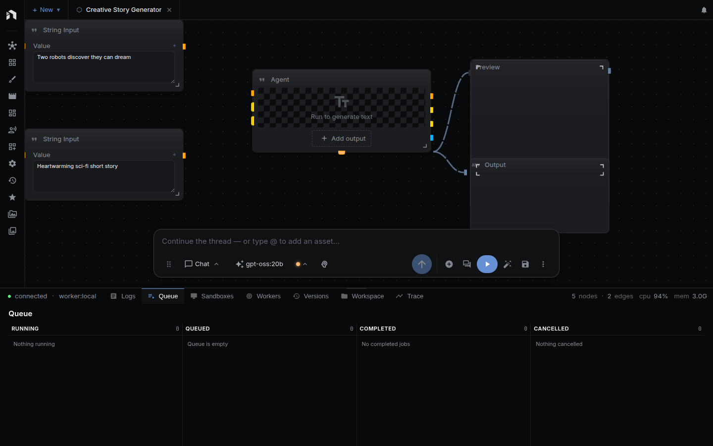

### Sandboxes & Workers

The code-runner sandboxes and worker processes backing the current run.

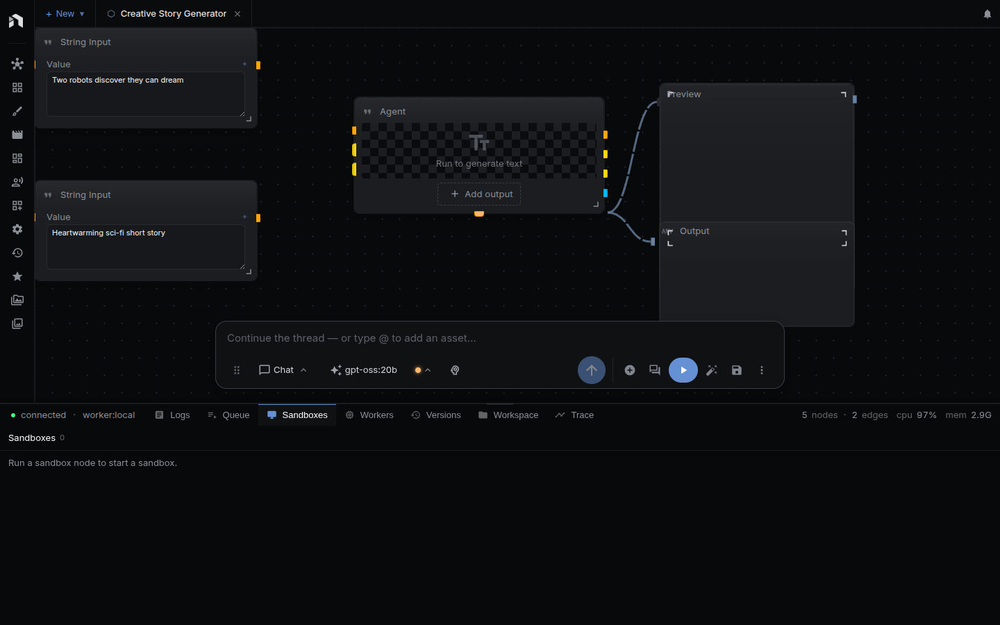

### Versions

Every save is versioned. Review past versions and roll back.

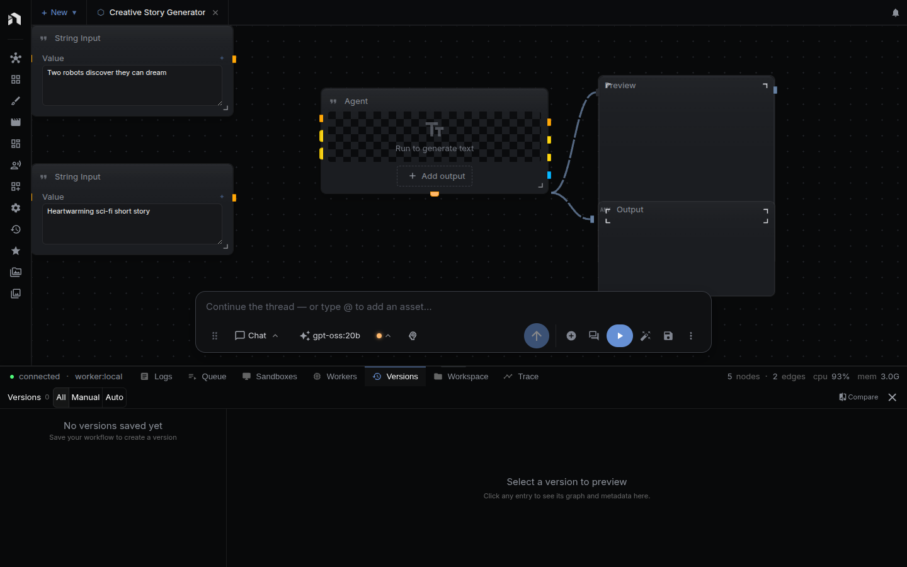

### Trace

The full execution trace of the most recent run — per-node timing and the call tree.

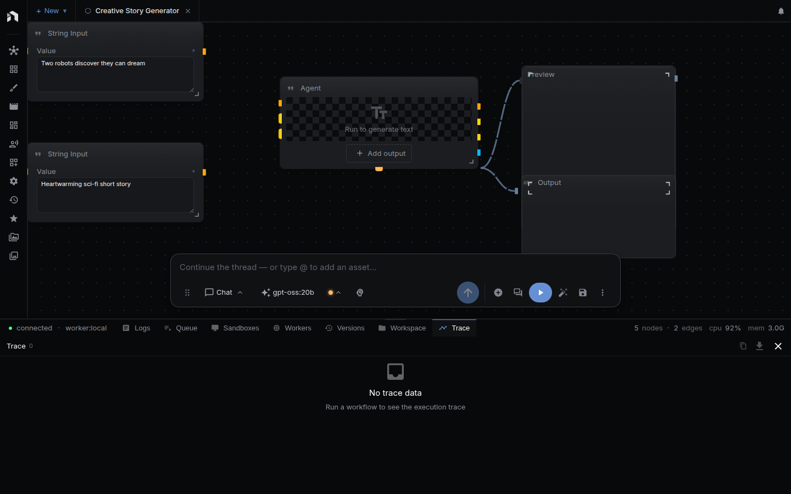

---

## Floating Toolbar

An overlay on the canvas with the most-used runtime controls.

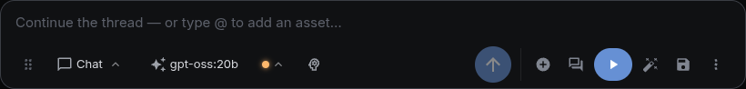

| Button | When shown | Action |
|--------|------------|--------|
| ➕ Add node | Graph view | Open the node menu |
| 💬 Conversation | When a conversation exists | Toggle the in-canvas conversation overlay |
| ⏹ Stop | While the run state is `running` | Cancel the run |
| ▶ Run | Always | Run the workflow (shows elapsed time while running) |
| ⇄ Auto Layout | Graph view | Auto-arrange the graph |
| 💾 Save | Always | Save the workflow |
| ⋮ More | Always | Overflow menu (see below) |

The **⋮** overflow menu contains: **Chain View / Graph View** (toggle), **Instant Update** (on/off), **Stop** (while running), **Auto Layout** and **Save** (on mobile), **Mini Map** (show/hide), **Download JSON**, and **Panels…** (on mobile).

There is no Pause, Resume, or Fit button in the toolbar — a run cannot be paused or resumed.

---

## Right Side Buttons

A stack of toggles along the right canvas edge:

- **Inspector** — open / close the right panel.
- **Run as App** — jump to the Mini-App view for this workflow.
- **Notifications** — pending warnings and agent messages.

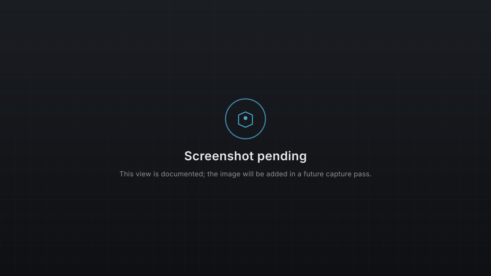

---

## App Menu (logo dropdown)

The logo at the top of the left rail opens the app menu: **Tutorials**, **Examples**, **Costs**, **Model Manager**, **Assets**, **Collections**, **Workspaces**, **Settings**, **Help**, and **Downloads**. Everything but Help and Downloads opens as a workspace tab.

---

## Customizing the Layout

Each panel stays on its own edge. Click a rail icon to open or collapse it, and drag its inner edge to resize. Open/collapsed state and size are remembered between sessions.

Three combinations you'll land on most often:

Left panel only, canvas taking the rest:

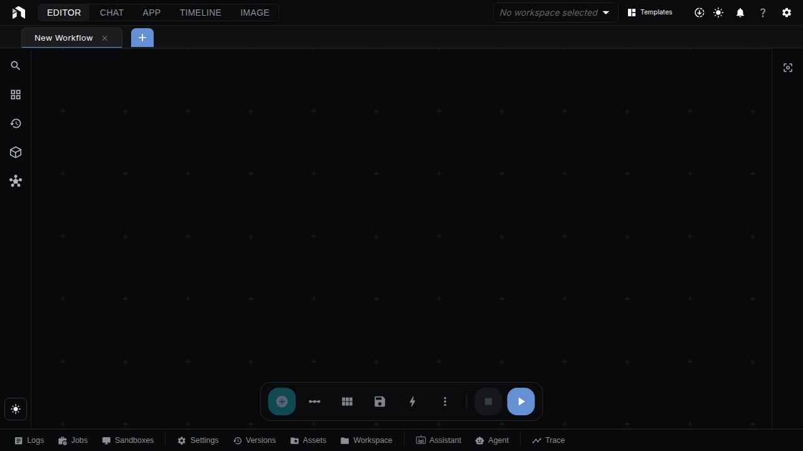

Left panel plus the Inspector, for editing node properties while browsing:

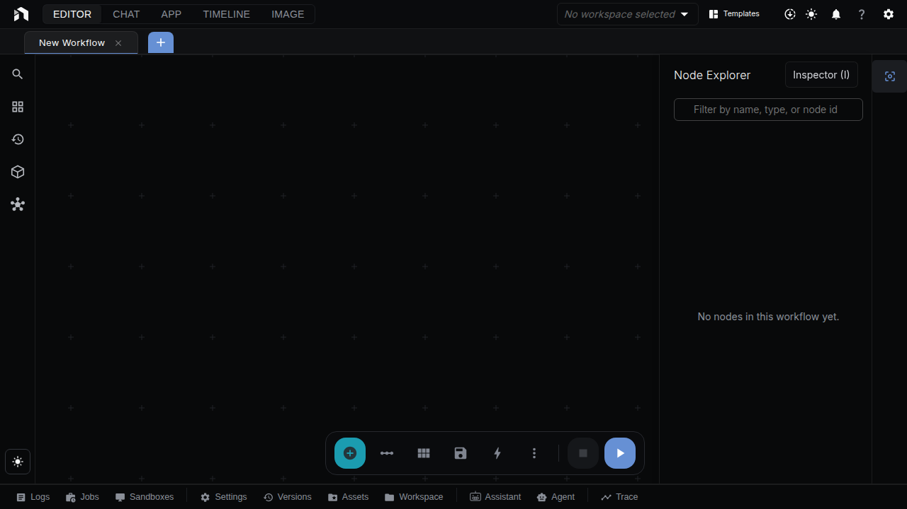

Everything open, with the logs docked at the bottom for a run:

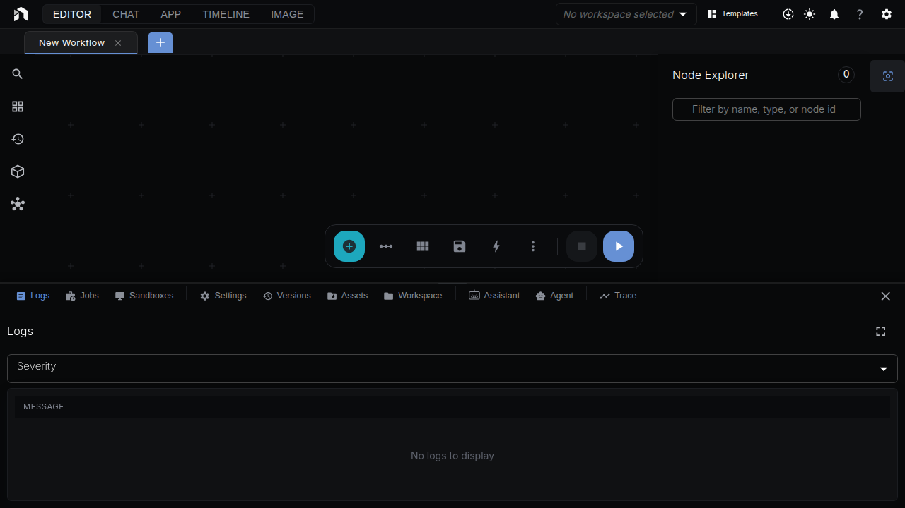

---

## Next Steps

- [Workflow Editor]({{ '/workflow-editor' | relative_url }}) — building on the canvas
- [Chat]({{ '/global-chat' | relative_url }}) — how the in-editor chat works
- [Configuration]({{ '/configuration' | relative_url }}) — settings that affect the editor
