The NodeTool [Workflow Editor]({{ '/workflow-editor' | relative_url }}) is surrounded by a left panel, an Inspector, a bottom panel, and a composer bar over the canvas. This page covers each panel in depth.

---

## Left Panel

Opens from the icons down the left edge. It's a tabbed drawer: click an icon to expand, click the same icon to collapse. The rail has five views: **Documents**, **Chats**, **Library**, **Nodes**, and **More**. The logo above them opens the app menu (see [App Menu](#app-menu-logo-dropdown)).

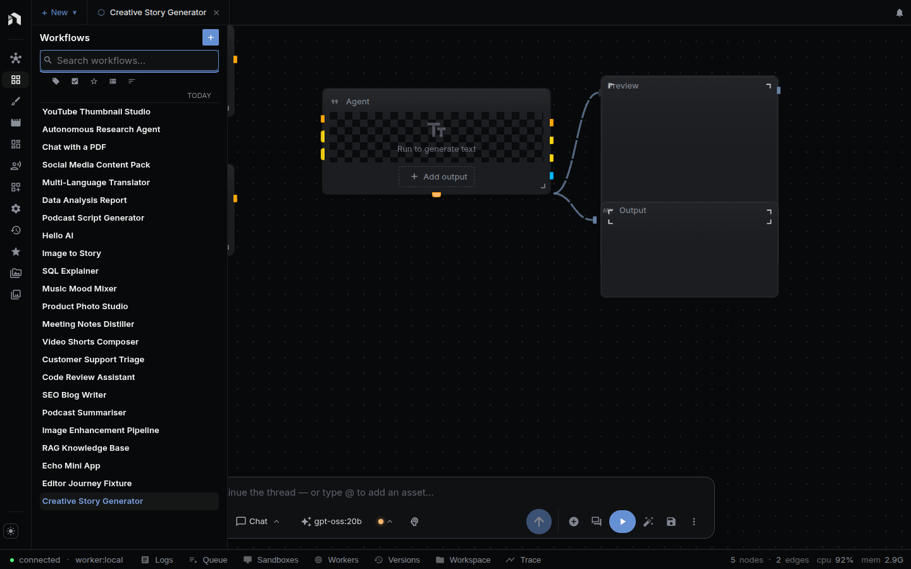

### Documents

A searchable tree of every document in the active project, grouped as **Workflows**, **Apps**, **Creative documents** (sketches, scripts, storyboards, timelines, and entities), and **Agents & code** (JS scripts). Click a row to open the document as a workspace tab. Workflows, sketches, and the other kinds also have their own list views with richer actions, such as creating a sketch or timeline.

For Apps, the list view has two header buttons: one scaffolds an app from a workflow and one starts an empty app. See [Mini Apps]({{ '/mini-apps' | relative_url }}). For sketches, see [Sketch Editor]({{ '/sketch-editor' | relative_url }}).

### Chats

Saved agent conversations for the active project. Click one to open it as a tab, or start a new one. See [Chat]({{ '/global-chat' | relative_url }}).

### Library

Your assets as a grid. Drag a file onto the canvas to create the matching input node. **Open in full page** opens the Assets explorer.

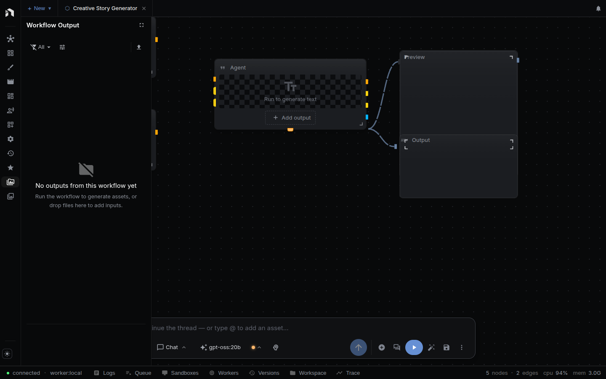

### Nodes

The node browser. Search and browse all available nodes, organized into sub-tabs: **All**, **I/O**, **Image**, **Image AI**, **Video**, **Video AI**, **Audio**, **Audio AI**, **3D**, **Agents**, and **Control**. Drag a node onto the canvas to add it.

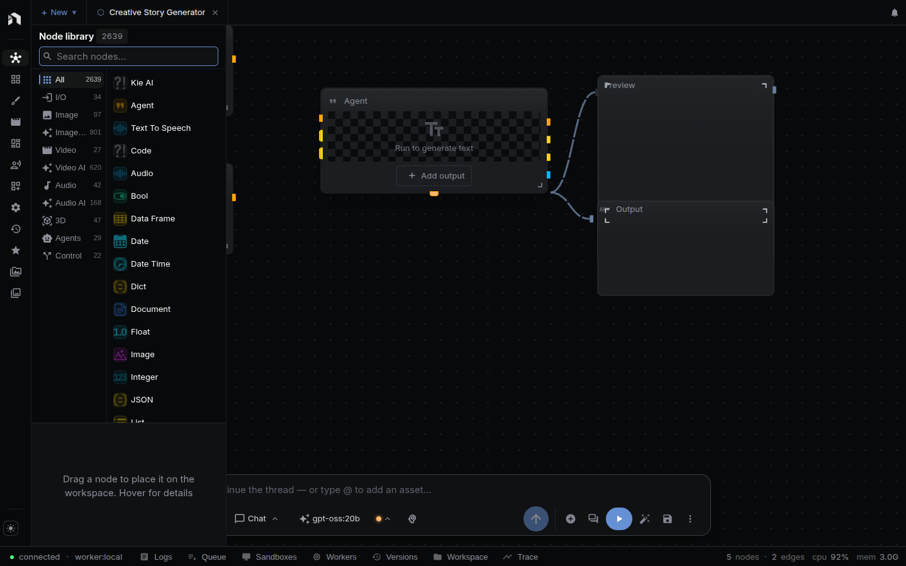

### More

A searchable list of additional panels, followed by the app pages.

| Group | Entries |
|-------|---------|
| **Workflow tools** | **Favorite Nodes** (your starred nodes), **Recent Nodes** (nodes you added lately), **Workflow Settings** |
| **Agent tools** | **Skills** |
| **Workspace** | **Workspace** file browser |
| **App pages** | Tutorials, Examples, Costs, Model Manager, Package Manager (development builds only), Assets, Collections, Workspaces, Memory |

**Workflow Settings** edits the open workflow: name, description, tags, **Run Mode** (Workflow, Chat, App, or Tool), the associated workspace folder, and the **Tool Name** used when the workflow is exposed as a tool. It only appears while a workflow tab is active.

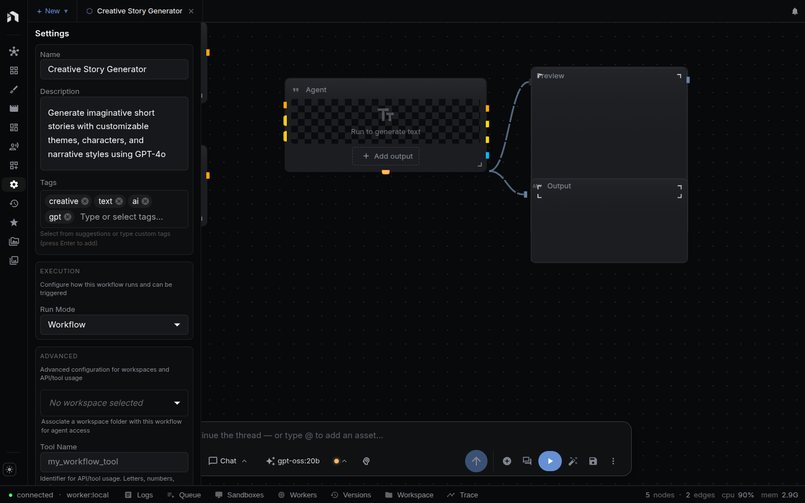

**Workspace** shows the file tree of the selected workspace. Pick the workspace from the dropdown. Double-click a file to open it as a workspace tab. **Open in Folder** and **Open Externally** act on the selected file, and **Open Externally** is available in the desktop app only.

---

## Right Panel (Inspector)

The right panel hosts the **Inspector** with a **Cost estimate** section under it. The panel opens by itself when you select a node, and `i` toggles it. Closing it yourself stops selection from reopening it until you open it again. (Logs, Queue, Trace, and Version History are not here. They live in the [Bottom Panel](#bottom-panel).)

### Inspector — Node Properties

The Inspector has three tabs:

- **Params** renders every property with the right input (number, slider, model picker, asset selector, dropdown, color picker, and so on), marks required ones, and shows validation errors for that node.
- **I/O** lists the node's inputs and outputs.
- **Help** shows the node's documentation, type, and namespace.

With several nodes selected, the Inspector edits the properties they share and says how many nodes it changes. Mixed values are flagged.

When no node is selected the Inspector has nothing to show, but the Cost estimate section below it stays. Edit the workflow's own name, description, and tags in **More → Workflow Settings**.

### Cost estimate

Under the Inspector, a collapsed **Cost estimate** section prices the open workflow for one run. Its header shows the total, or `incomplete` when some nodes have no known price. Expand it for a table with a row per node that uses an AI model: the node, its provider and model, the units, and the cost. A `~` means the figure rests on an assumed default, `≥` means it leaves out a known cost, and a question mark marks a node with no known price, which is left out of the total. The section is present whenever a workflow tab is open, and it takes at most 45% of the panel's height. For how prices are found, what the markers mean, and the other places NodeTool shows costs, see [Costs and credits](costs-and-credits.md).

---

## Bottom Panel

The bottom panel docks runtime diagnostics and secondary workflow tools. Drag its top edge to resize. Its views are grouped:

- **Run**: Logs, Queue, Workers
- **Workflow**: Versions
- **Debug**: Trace

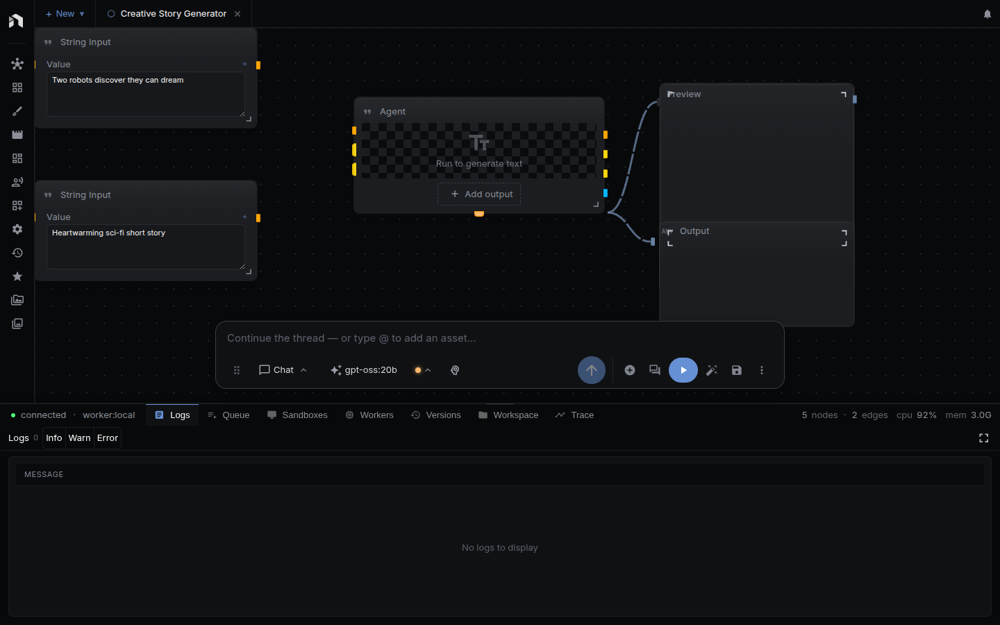

Its header also carries the node and edge counts of the open workflow and a live readout of the **server's** CPU and memory use. The figures come from the `system_stats` frame the server pushes every 5s (see [WebSocket API](websocket-api.md#system_stats)), so on a local install they describe your own machine. A server that enforces auth (a hosted deployment) sends no such frame by default, because the numbers would describe a shared container, so the header shows the counts alone. Set `NODETOOL_SYSTEM_STATS=1` to force the broadcast on, or `0` to turn it off.

### Logs

Log lines from your runs, newest first, for the open workflow. Toggle **Info**, **Warn**, and **Error** to filter by severity. A node's **View logs** button on its error panel opens this view filtered to that node and run, shown as a chip you can clear. A fullscreen button expands the table. `l` toggles the panel.

### Queue

Jobs for your workflows in four columns: **Running**, **Queued**, **Completed**, and **Cancelled**.

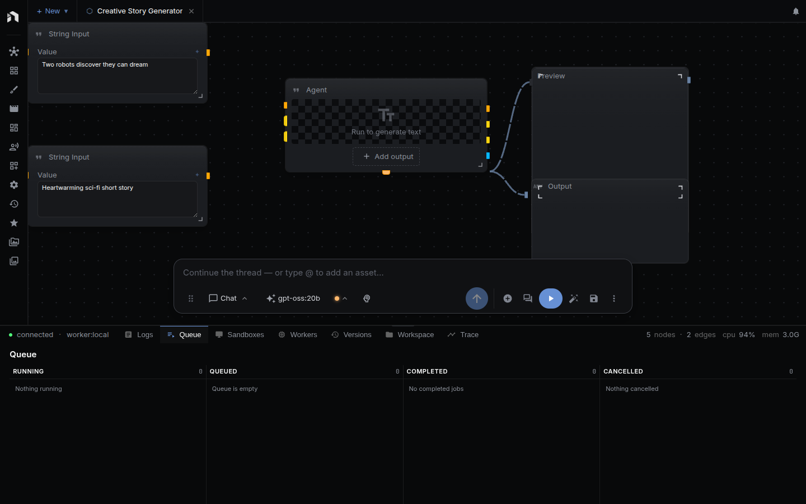

### Workers

The GPU workers panel. It lists provisioned worker instances with status, uptime, and estimated cost, provisions a new worker from a profile, and stops one or all of them. GPU pods bill continuously, so stop workers you no longer need.

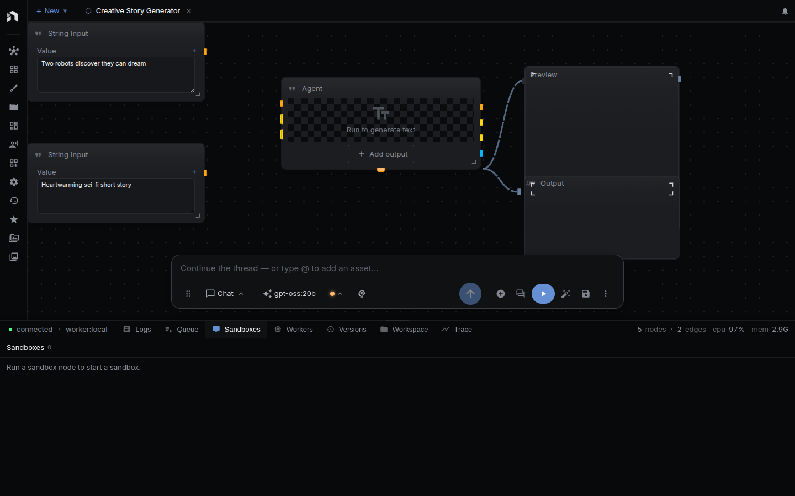

### Versions

A saved workflow keeps a history of versions, marked manual, autosave, or checkpoint. Review past versions, compare two, restore one, or delete one. **Save Before Running** in Settings → General → Autosave adds a checkpoint before each run.

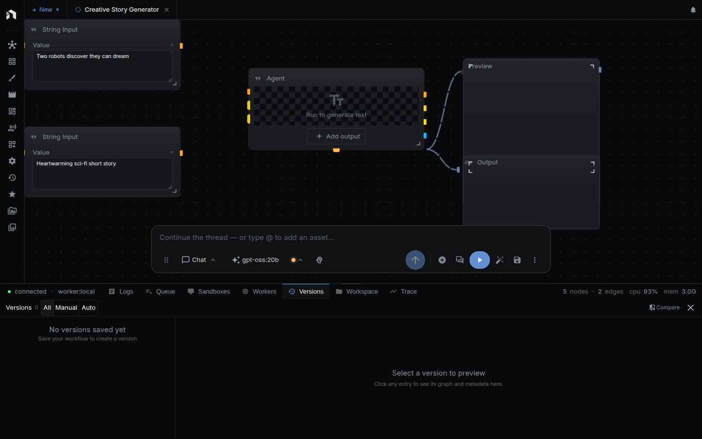

### Trace

The execution trace of a run, with per-node timing. A run selector in the header switches between recent runs. The toolbar copies the trace to the clipboard, exports it as JSON, or clears it. `Ctrl/⌘ + Shift + T` toggles the panel.

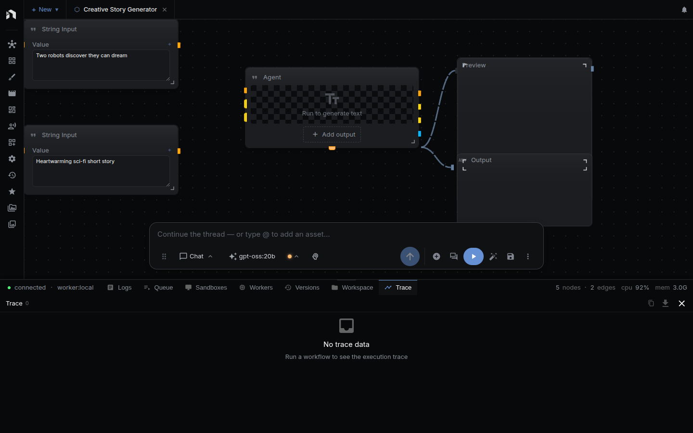

---

## Composer Bar

A dock floating over the canvas. Its top part is the chat and media prompt (generated media is added to the canvas as nodes). Under it sits the row of workflow controls. Drag the handle at the left of the row to move the dock, and double-click it to reset the position. On narrow screens the dock is fixed to the bottom.

| Control | When shown | Action |
|---------|------------|--------|
| Add node | Graph view | Open the node menu |
| Conversation | Always | Show or hide the conversation above the dock, with a count badge |
| Auto Layout | Graph view, not on mobile | Auto-arrange the graph |
| Save | Not on mobile | Save the workflow |
| Trigger toggle | Workflow has trigger nodes | Arm or disarm the workflow's triggers, with per-trigger schedule and last-fired details. See [Triggers](triggers.md) |
| Stop | While a run is starting, queued, or running | Cancel the run |
| Run | Always | Run the entire workflow. The label reads **Run entire workflow**, **Starting**, **Queued #n**, **Running**, **Stopping**, or **Error · Retry**, and a badge counts additional queued runs. Elapsed time shows while running. |
| ⋮ Workflow actions | Always | Overflow menu (see below) |

The **⋮** overflow menu contains: **Chain View / Graph View** (toggle), **Instant Update** (on/off, re-runs the downstream part of the graph when you change an input value), **Stop** (while running), **Auto Layout** and **Save** (on mobile), **Mini Map** (show/hide), **Download JSON**, and **Panels…** (on mobile). **Download JSON** saves the workflow as `<name>.json` with an empty `id`.

There is no Pause, Resume, or Fit button in the dock. A run cannot be paused or resumed.

---

## Tab Bar Controls

The workspace tab bar holds a **Project** selector, a **+ New** menu for creating or opening documents, and your open tabs. At the right edge, an activity indicator and the **Notifications** button show pending warnings and agent messages.

---

## App Menu (logo dropdown)

The logo at the top of the left rail opens the app menu: **Settings**, **Help**, and **Downloads**. Settings opens as a workspace tab. The other app pages are in [More](#more).

---

## Customizing the Layout

Each panel stays on its own edge. Click a rail icon to open or collapse it, and drag its inner edge to resize. Open or collapsed state and size are remembered between sessions.

Three combinations you'll land on most often:

Left panel only, canvas taking the rest:

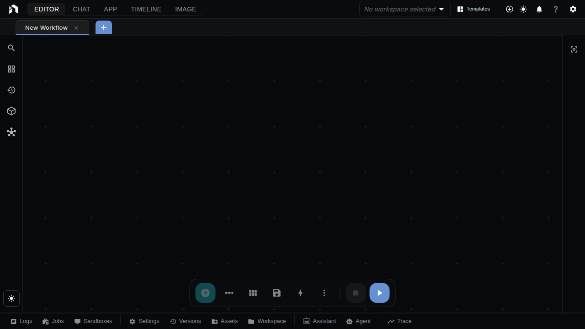

Left panel plus the Inspector, for editing node properties while browsing:

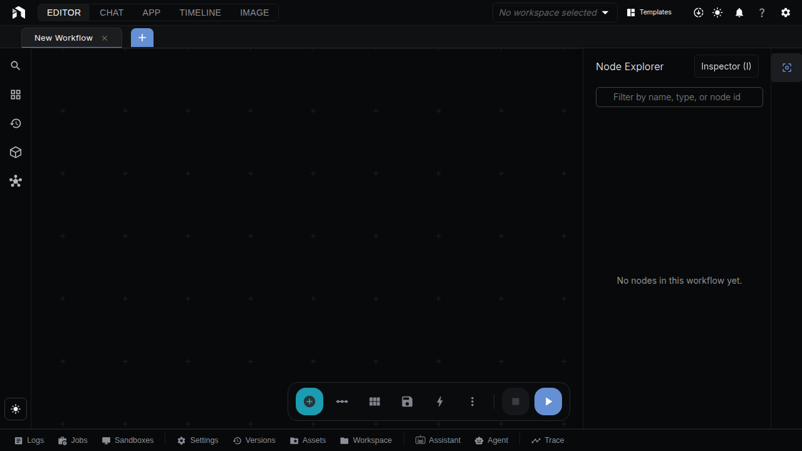

Everything open, with the logs docked at the bottom for a run:

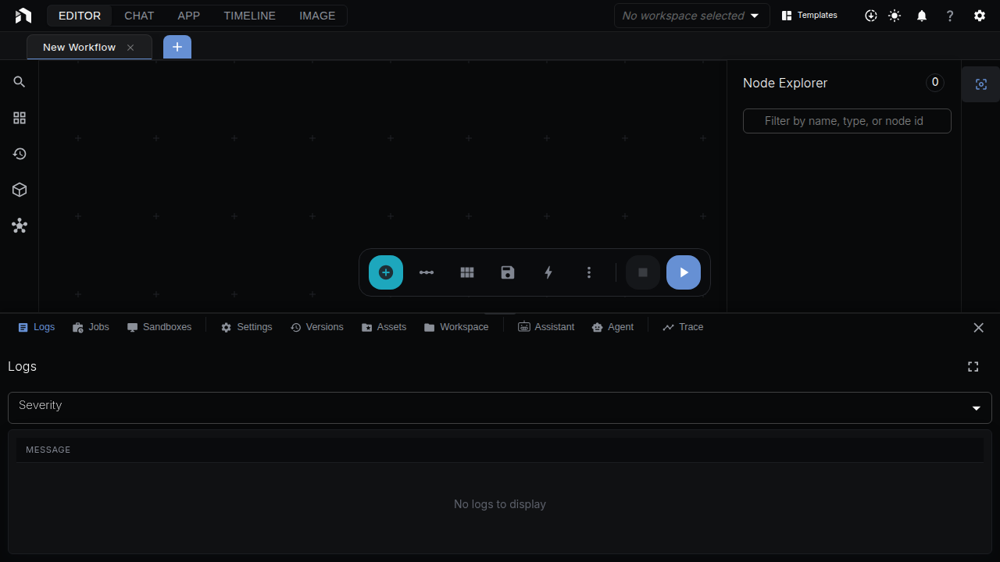

---

## Next Steps

- [Workflow Editor]({{ '/workflow-editor' | relative_url }}) — building on the canvas
- [Chat]({{ '/global-chat' | relative_url }}) — how the in-editor chat works
- [Configuration]({{ '/configuration' | relative_url }}) — settings that affect the editor
