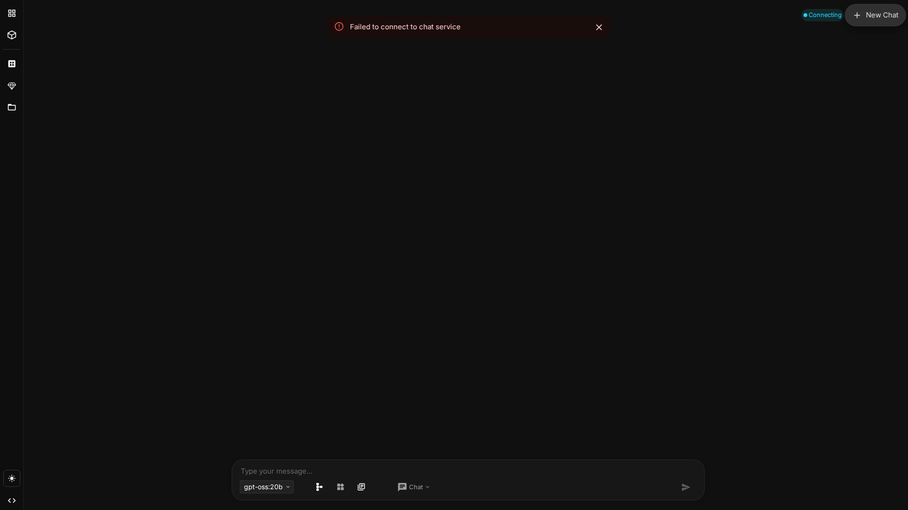

The NodeTool desktop app is built on Electron. It reuses the web app for all workflow editing but adds a handful of native surfaces: a boot splash, install wizard, package manager, log viewer, tray menu, pinned windows, and a native menu bar.

This page catalogs every desktop-only view with screenshots. Everything inside the main window is covered by [User Interface]({{ '/user-interface' | relative_url }}) and [Workflow Editor]({{ '/workflow-editor' | relative_url }}).

---

## Boot Message (Splash)

A minimal splash appears while the embedded Python runtime, backend server, and web app all come online.

The splash streams progress messages — "Starting Python…", "Warming models…", "Connecting to server…". It closes the moment the backend reports ready.

---

## Install Wizard

On first launch (or after a major upgrade), the Install Wizard sets up the optional components NodeTool needs to run local models:

- **Conda** environment with the required Python version
- **Node packs** selected by the user
- **AI runtimes** (torch, MLX, llama.cpp) appropriate for the detected hardware

You can re-run the wizard at any time from the **Package Manager** window — useful when you add a new node pack or upgrade your GPU.

---

## Package Manager

Opens from the app menu or `⌘K → Open Package Manager`. A native window sized 1200×900 that manages:

- Installed **node packs** and their upgrade availability.
- Optional **AI runtimes** (torch CUDA, torch MPS, llama.cpp).
- Conda environment health (Python version, cached wheels).
- Integrity checks — re-download a broken runtime in one click.

See [Node Packs]({{ '/node-packs' | relative_url }}) for where packs come from and how to publish your own.

---

## Log Viewer

A persistent window that tails the backend log. Helpful for debugging without dropping to a terminal.

The log viewer supports:

- **Log level filters** — `debug`, `info`, `warn`, `error`.
- **Component filters** — backend, Python worker, web bridge, IPC.
- **Search** with regex and highlight.
- **Jump to file** — click a line to open its source in your editor (if `EDITOR` is configured).

---

## Update Notification

When a new desktop release is available, a discreet toast appears with **Install now** and **Later** actions. The app restarts into the new build; there's no mandatory update interrupting a run.

---

## Pinned Windows

Electron adds a few borderless, always-on-top window types:

### Workflow Execution Window

A frameless window that runs a single workflow with the inputs collapsed and the outputs centered. Great for a pinned dashboard on a second monitor.

### Mini-App Window

A self-contained Mini-App launched from the tray. Maximum size 1200×900. Closing it doesn't quit NodeTool.

### Chat Window

Standalone chat opened from the tray. Same content as [/standalone-chat]({{ '/user-interface#standalone-chat-window' | relative_url }}) but in its own window.

---

## System Tray

The tray icon stays running while NodeTool is active and exposes quick actions:

| Action | What it does |
|--------|--------------|
| Open Dashboard | Bring up the main window |
| Open Chat | Launch the standalone chat window |
| Run Mini-App… | Submenu of mini-apps published from your workflows |
| Settings | Native settings window |
| Package Manager | Open the Package Manager window |
| Log Viewer | Tail the backend log |
| Quit NodeTool | Stop the backend and exit |

---

## Native Menu Bar

On macOS and Windows a native menu bar is attached to the main window.

### File

| Item | Shortcut | Action |
|------|----------|--------|
| New Workflow | `Ctrl/⌘ + T` | Open a blank workflow in a new tab |
| Save | `Ctrl/⌘ + S` | Save the active workflow |
| Close Tab | `Ctrl/⌘ + W` | Close the active editor tab |
| Quit | `Ctrl/⌘ + Q` | Exit the app |

### Edit

Standard Undo, Redo, Cut, Copy, Paste, Select All, Delete — all mapped to the same shortcuts used on the canvas.

### View

| Item | Action |
|------|--------|
| Settings | Open the native settings window |
| Package Manager | Open the Package Manager window |
| Log Viewer | Open the Log Viewer window |
| Reload | Reload the main window |
| Toggle DevTools | Useful for debugging custom node UIs |

### Window / Help

Platform-standard items — switch windows, open the docs, show version info.

---

## Where the Electron Code Lives

For contributors:

- `electron/src/main.ts` — entry point, window lifecycle.
- `electron/src/window.ts` — main window.
- `electron/src/workflowWindow.ts` — pinned workflow and mini-app windows.
- `electron/src/tray.ts` — tray icon and menu.
- `electron/src/menu.ts` — native menu bar.
- `electron/src/components/` — React components for the native windows.

See the [Electron developer guide]({{ '/developer/' | relative_url }}) for build and debugging tips.

---

## Related Docs

- [Installation]({{ '/installation' | relative_url }}) — download and first-run
- [Configuration]({{ '/configuration' | relative_url }}) — settings persisted per-user
- [Troubleshooting]({{ '/troubleshooting' | relative_url }}) — boot and install issues
- [Deployment]({{ '/deployment' | relative_url }}) — self-hosted / cloud alternatives
