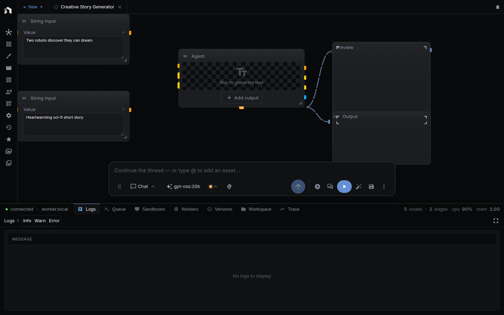

[Quick Start](getting-started.md) runs a finished template. This page builds a
workflow yourself, one node at a time. You start with an empty canvas and end
with a picture generated from one short idea.

The workflow has four nodes:

| Node | Does |
|---|---|
| **String Input** | Holds your idea as text |
| **Agent** | Rewrites the idea as a detailed image prompt |
| **Text To Image** | Generates the picture |
| **Preview** | Shows the picture on the canvas |

Data flows left to right: String Input → Agent → Text To Image → Preview.

## Before you start

You need a language model for the Agent and an image model for Text To Image.
Both come from providers you connect in **Settings → Models & Providers**, as
described in [Quick Start](getting-started.md#1-install-and-connect). Text To
Image defaults to **FLUX.1 Schnell** on FAL, so a FAL key is the fastest way to
get an image model. The [capability matrix](providers.md#capability-matrix)
lists other providers.

The image costs money at the provider's rate. The Agent call is text and costs
cents.

## 1. Create an empty workflow

Use **+ New → New workflow**. A workflow tab opens with an empty canvas. You
can also press `Ctrl/⌘ + K` and pick **New Workflow** from the Command Menu.

## 2. Add the String Input node

1. Press `Space` on the canvas, or double-click empty space. The node menu opens.
2. Type `string input` in **Search for nodes...**.
3. Click **String Input**. The node appears on the canvas.

Type your idea into the node's **Value** field, for example:

> a lighthouse on a cliff at dusk

The node's **Name** property labels this value when the workflow runs as an app
or over the API. Leave it empty for now.

## 3. Add the Agent node

Press `Space`, search for `agent`, and click **Agent**. Drag it to the right of
String Input.

Select the node. The **Inspector** opens on the right with three tabs:
**Params**, **I/O**, and **Help**.

On the **Params** tab:

1. Press **Select Model** and choose a language model.
2. Replace **System** (it starts as "You are a friendly assistant") with
   instructions for this job, for example: `Rewrite the user's idea as one
   detailed image prompt. Describe subject, light, and style. Reply with the
   prompt only.`

Leave **Prompt** alone. You fill it by connecting a node in the next step.

## 4. Connect String Input to Agent

1. Drag from the output circle on the right of **String Input**.
2. Release on the **Prompt** input circle on the left of **Agent**.

A line appears. Connections only accept matching types, so text goes to text.
Each input takes one connection. The **I/O** tab in the Inspector lists the
node's inputs and outputs.

## 5. Add the Text To Image node

Press `Space`, search for `text to image`, and click **Text To Image**. Place it
to the right of Agent.

In the Inspector's **Params** tab you can set:

| Property | Default | Use |
|---|---|---|
| **Model** | FLUX.1 Schnell (FAL) | The image model |
| **Prompt** | A cat holding a sign that says hello world | Replaced by the connection below |
| **Negative Prompt** | empty | What to avoid in the image |
| **Aspect Ratio** | 1:1 | Shape of the image |
| **Resolution** | 1K | Short edge of the image |

Connect **Agent**'s **text** output to **Text To Image**'s **Prompt** input. The
Agent's written prompt now replaces the default prompt.

## 6. Add a Preview node

You can add Preview from the node menu, but a shortcut is faster:

1. Drag from Text To Image's **output** circle and release on empty space.
2. In the connection menu that appears, pick **Preview**.

NodeTool adds a **Preview** node already connected to the image. Preview has one
input, **Value**, and shows whatever reaches it. Text To Image also shows its
own result inside its node, and Preview gives you a separate, larger place to
look at it.

You can send the Agent's **text** output to a second Preview node the same way.
Then you see the written prompt next to the picture.

## 7. Save and run

Press `Ctrl/⌘ + S` to save. Then click **Run entire workflow** in the bottom
toolbar, or press `Ctrl/⌘ + Enter`.

If a model is not selected, NodeTool stops the run and marks the unset model
field in the Inspector. Pick a model and run again.

While it runs:

- A moving colored ring marks the node that is working.
- The Agent writes its text as it arrives.
- The run control reads **Starting**, **Queued**, or **Running**.
- **Completed in** badges show how long each node took.

When the run finishes, the picture appears in **Text To Image** and in
**Preview**. Generated images are saved as assets automatically.

If a node fails, open the bottom panel. **Logs** shows the error and **Queue**
shows the jobs. See [Workflow Debugging](workflow-debugging.md) and
[Troubleshooting](troubleshooting.md).

## 8. Change something and run again

Edit the **Value** in String Input and press **Run entire workflow** again.
Only the idea changed, so the Agent writes a new prompt and the image updates.

Other changes to try:

- Pick a different **Aspect Ratio** on Text To Image.
- Fill **Negative Prompt** to exclude things from the image.
- Change the Agent's **System** text to ask for a specific art style.
- Select a node and press `B` to disable it. A disabled node and its
  connections are left out of the run.

Under the Inspector, **Cost estimate** prices the workflow for one run.

## Next

| Want to | Go to |
|---|---|
| Learn the canvas: selecting, grouping, shortcuts | [Workflow Editor](workflow-editor.md) |
| Learn each panel | [Editor Panels](editor-panels.md) |
| Find a shipped starting point | [Templates Gallery](templates-gallery.md) and [Workflow Examples](workflows/) |
| Turn this workflow into a screen others can run | [Mini Apps](mini-apps.md) |
| Understand workflows, assets, and nodes | [Key Concepts](key-concepts.md) |
| Choose or run models locally | [Models & Providers](models-and-providers.md) |
| Watch short video guides | [Tutorials](tutorials.md) |
