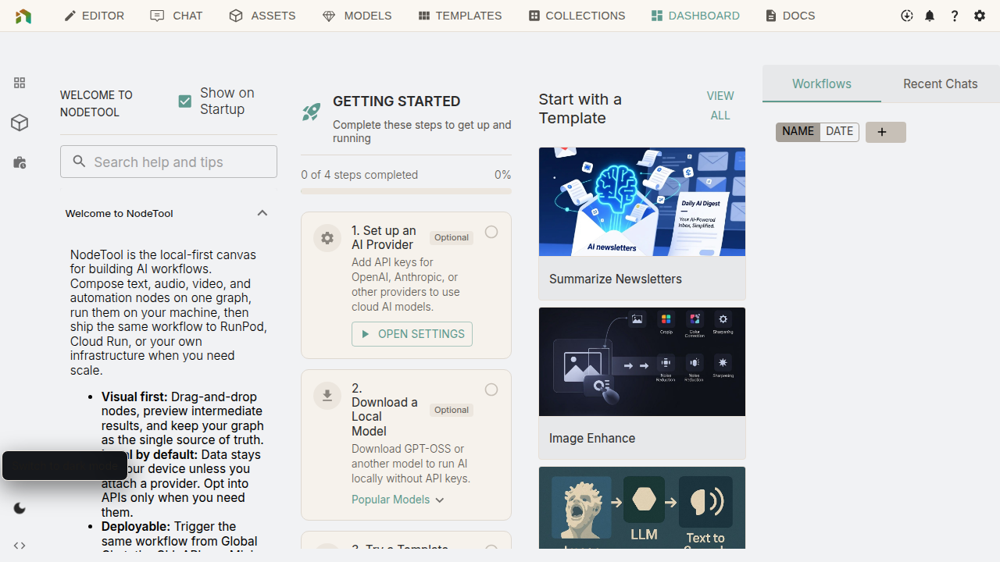
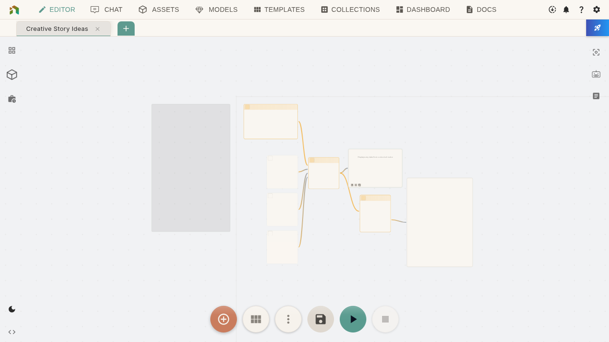

Run your first NodeTool workflow. No AI experience or coding needed.

**You'll:**
- Run a complete workflow
- See results generate live
- Try different ways to work
- Understand the visual builder

For a visual overview first, see [Start Here](index.md#start-here).

## Step 1 — Install NodeTool

1. **Download** from [nodetool.ai](https://nodetool.ai) for macOS, Windows, or Linux

2. **Run the installer** - Sets up Python and AI engines automatically

3. **Launch NodeTool** - Default install location works for most people

> Need help? See [Installation Guide](installation.md) for GPU requirements and troubleshooting.

### Install AI Models

For local workflows, install models:

1. Open **Models**
2. Install starter models:
   - **Flux** or **Qwen Image** - Image generation (needs 8-12 GB VRAM)
   - **GPT-OSS** - Text generation (optional)
3. Wait for downloads (~20 GB)

> **No GPU?** Skip local models. Use cloud services (OpenAI, Replicate) by adding API keys in Settings → Providers. See [Hardware Requirements](installation.md#hardware-requirements-by-task).

✅ **You're ready** - Dashboard loaded with templates.

---

## Step 2 — Run Your First Workflow

Pick one template to try:

### Option A: Generate Movie Posters

1. **Find it**: Dashboard → Templates → "Movie Posters"
2. **Open in Editor**: See the workflow canvas
3. **How it works**:
   - Input nodes (left) - Describe your movie
   - AI Strategy node (middle) - Plans the visual
   - Image Generator (right) - Creates the poster
   - Preview - Shows your result

4. **Try it**: Click the input nodes and type:
   - **Title**: "Ocean Depths"
   - **Genre**: "Sci-Fi Thriller"
   - **Audience**: "Adults who love mystery"

5. **Run**: Click **Run** (bottom-right) or press <kbd>Ctrl/⌘ + Enter</kbd>
6. **Watch**: Poster generates step by step

### Option B: Creative Story Ideas

1. **Find it**: Dashboard → Templates → "Creative Story Ideas"
2. **How it works**:
   - Input nodes - Your parameters
   - AI Agent - Generates ideas
   - Preview - Shows results

3. **Try it**: Click the input nodes and type:
   - **Genre**: "Cyberpunk"
   - **Character**: "Rogue AI detective"
   - **Setting**: "Neon-lit underwater city"

4. **Run**: Click **Run** or <kbd>Ctrl/⌘ + Enter</kbd>
5. **Watch**: Ideas appear one at a time

✅ **Done** - You ran your first workflow.

---

## Step 3 — Customize and Iterate

1. **Save**: Press <kbd>Ctrl/⌘ + S</kbd> and name it

2. **Change things**: Edit inputs and run again
   
3. **Explore**:
   - Click nodes to see settings
   - Hover connections to see data flow
   - Click Preview nodes for intermediate results

Workflows are reusable. Try variations. Refine. Save.

✅ **Done** - You can customize workflows.

---

## Step 4 — Share as a Mini-App

Convert a workflow into a simplified interface:

1. **Open your workflow** in the editor
2. **Click Mini-App** (top-right)
3. **See simplified view**: Only inputs and outputs, no graph

Mini-Apps hide complexity. Others can use your workflow without seeing how it works.

✅ **Done** - You know three ways to work: Visual Editor (full control), Mini-App (simple interface).

---

## What You Learned

- Installed NodeTool and models
- Ran a workflow
- Understood nodes and connections
- Customized inputs
- Shared as a Mini-App

---

## Next Steps

**Learn more:**
- [Key Concepts](key-concepts.md) - How workflows really work
- [User Interface](user-interface.md) - Every tool explained
- [Workflow Editor](workflow-editor.md) - Build from scratch
- [Tips & Tricks](tips-and-tricks.md) - Power user moves

**Try examples:**
- [Workflow Gallery](workflows/) - 19+ ready workflows
- [Workflow Patterns](cookbook.md) - Common patterns
- [Node Library](node-packs.md) - All available nodes

**Go deeper:**
- [Models & Providers](models-and-providers.md) - Set up more models
- [Asset Management](asset-management.md) - Organize files
- [Deployment](deployment.md) - Share with the world

**Get help:**
- [Workflow Debugging](workflow-debugging.md) - Fix problems
- [Troubleshooting](troubleshooting.md) - Common issues
- [Glossary](glossary.md) - Plain-English terms
- [Discord](https://discord.gg/WmQTWZRcYE) - Ask the community
- [GitHub Issues](https://github.com/nodetool-ai/nodetool/issues) - Report bugs
