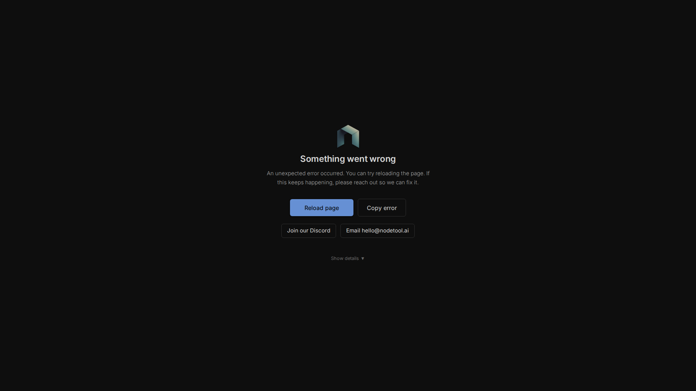

Run your first NodeTool workflow in under 10 minutes. No AI experience or coding needed.

**By the end of this guide, you'll have:**
- Installed NodeTool and set up AI models
- Run a complete workflow end-to-end
- Customized inputs and seen different results
- Shared your workflow as a Mini-App

> **Want a visual overview first?** See the [Start Here](index.md#start-here) section on the home page for a quick orientation.

## Step 1 — Install NodeTool

### Check Requirements

Before installing, make sure your machine meets the minimum requirements:

| Component | Minimum | Recommended |
|-----------|---------|-------------|
| **RAM** | 8 GB | 16 GB+ |
| **Disk** | 10 GB free | 50 GB+ (for models) |
| **GPU** | None (CPU works) | 8 GB+ VRAM for local AI |
| **OS** | macOS 13+, Windows 10+, Ubuntu 22+ | Latest version |

> **No GPU?** No problem. You can use cloud AI providers (OpenAI, Anthropic, Replicate) instead of local models. See [Hardware Requirements](installation.md#what-different-tasks-need) for details.

### Install

1. **Download** from [nodetool.ai](https://nodetool.ai) for macOS, Windows, or Linux
2. **Run the installer** — sets up Python and AI engines automatically
3. **Launch NodeTool** — the dashboard appears when ready

> Need help? See [Installation Guide](installation.md) for platform-specific instructions and troubleshooting.

### Install AI Models (Optional)

For running AI locally without cloud APIs:

1. Open **Models** from the sidebar
2. Install starter models:
   - **Flux** or **Qwen Image** — image generation (needs 8–12 GB VRAM)
   - A text model like **Llama** or **Qwen** — chat and text generation
3. Wait for downloads (~20 GB total)

> **Using cloud instead?** Go to **Settings → Providers**, paste an API key from [OpenAI](https://platform.openai.com), [Anthropic](https://www.anthropic.com), or [Google](https://ai.google.dev), and skip local model downloads.

**How to verify:** You should see the Dashboard with template workflows listed. If models are installed, they appear with a green checkmark in the Models panel.

---

## Step 2 — Run Your First Workflow

Now that NodeTool is installed, let's run a real workflow. Pick one of the templates below to try:

### Option A: Generate Movie Posters

1. **Find it**: Dashboard → Templates → "Movie Posters"
2. **Open in Editor**: See the workflow canvas
3. **How it works**:
   - Input nodes (left) - Describe your movie
   - AI Strategy node (middle) - Plans the visual
   - Image Generator (right) - Creates the poster
   - Preview - Shows your result

4. **Try it**: Click the input nodes and type:
   - **Title**: "Ocean Depths"
   - **Genre**: "Sci-Fi Thriller"
   - **Audience**: "Adults who love mystery"

5. **Run**: Click **Run** (bottom-right) or press <kbd>Ctrl/⌘ + Enter</kbd>
6. **Watch**: Poster generates step by step

### Option B: Creative Story Ideas

1. **Find it**: Dashboard → Templates → "Creative Story Ideas"
2. **How it works**:
   - Input nodes - Your parameters
   - AI Agent - Generates ideas
   - Preview - Shows results

3. **Try it**: Click the input nodes and type:
   - **Genre**: "Cyberpunk"
   - **Character**: "Rogue AI detective"
   - **Setting**: "Neon-lit underwater city"

4. **Run**: Click **Run** or <kbd>Ctrl/⌘ + Enter</kbd>
5. **Watch**: Ideas appear one at a time

✅ **Done** - You ran your first workflow.

---

## Step 3 — Customize and Iterate

Now that you've seen a workflow run, try making it your own:

1. **Save your workflow**: Press <kbd>Ctrl/⌘ + S</kbd> and give it a descriptive name
2. **Change inputs and re-run**: Edit the text inputs and press Run again to see different results
3. **Explore the graph**:
   - **Click any node** to see its settings in the right panel
   - **Hover over connections** to see what data is flowing between nodes
   - **Add Preview nodes** (press `Space`, search "Preview") to inspect intermediate results

Workflows are reusable — try different variations, refine your inputs, and save your favorites.

✅ **Done** - You can customize workflows.

---

## Step 4 — Share as a Mini-App

Turn any workflow into a simple app that anyone can use — no NodeTool knowledge required:

1. **Open your workflow** in the editor
2. **Click Mini-App** (top-right corner of the toolbar)
3. **See the simplified view**: Only inputs and outputs are visible, the node graph is hidden

Mini-Apps are perfect for sharing with teammates, clients, or anyone who just wants to use the workflow without understanding how it's built.

> **Want a custom UI?** Use [VibeCoding](vibecoding.md) to design a fully custom interface for your Mini-App with AI assistance.

✅ **Done** - You know two ways to work: the Visual Editor (full control) and Mini-Apps (simple interface).

---

## What You Learned

| Step | What You Did |
|------|-------------|
| **Install** | Downloaded NodeTool, set up models or cloud providers |
| **Run** | Executed a template workflow end-to-end |
| **Customize** | Changed inputs and saw different results |
| **Share** | Converted a workflow into a Mini-App |

---

## Next Steps

Pick what interests you most:

| Goal | Where to Go |
|------|------------|
| Understand how workflows work | [Key Concepts](key-concepts.md) |
| Learn the full interface | [User Interface](user-interface.md), [Workflow Editor](workflow-editor.md) |
| Try more workflows | [Workflow Gallery](workflows/), [Workflow Patterns](cookbook.md) |
| Set up more AI models | [Models & Providers](models-and-providers.md) |
| Build workflows from scratch | [Workflow Editor](workflow-editor.md), [Tips & Tricks](tips-and-tricks.md) |
| Deploy to production | [Deployment Guide](deployment.md) |
| Fix a problem | [Troubleshooting](troubleshooting.md), [Workflow Debugging](workflow-debugging.md) |

**Community:** [Discord](https://discord.gg/WmQTWZRcYE) · [GitHub Issues](https://github.com/nodetool-ai/nodetool/issues) · [Glossary](glossary.md)
