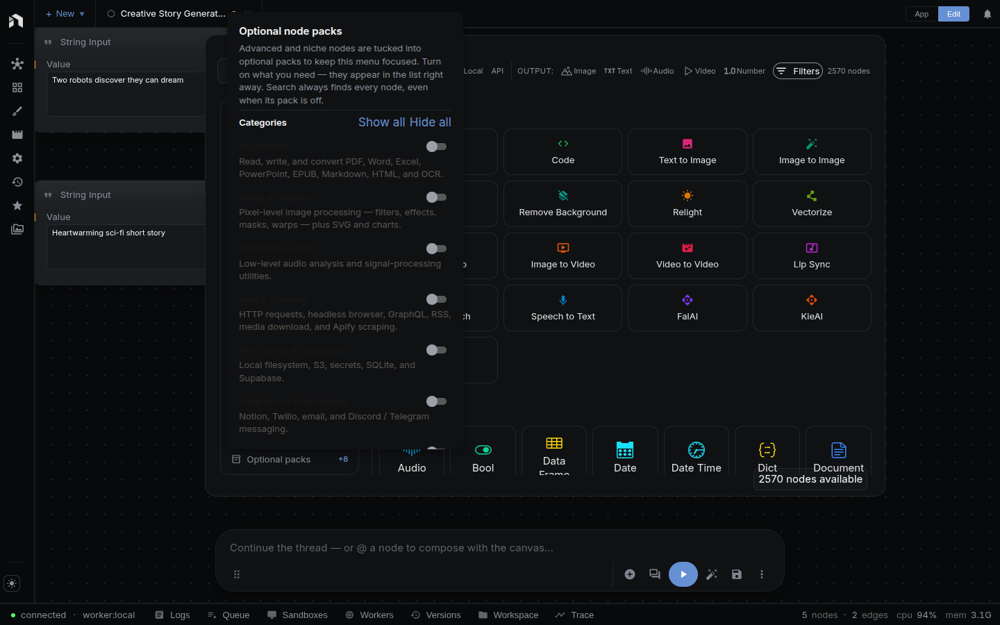

Install, open a template, run it, edit it, ship it.

Prefer to watch first? Here's a full workflow running on the canvas — see the
[Tutorials](tutorials.md) page for all of them.

<video controls preload="metadata" poster="{{ '/assets/tutorials/first-workflow.jpg' | relative_url }}">
  <source src="{{ '/assets/tutorials/first-workflow.mp4' | relative_url }}" type="video/mp4">
</video>

## Step 1 — Install

### Requirements

| Component | Minimum | Recommended |
|-----------|---------|-------------|
| **RAM** | 8 GB | 16 GB+ |
| **Disk** | 10 GB free | 50 GB+ for models |
| **GPU** | None | 8 GB+ VRAM for local inference |
| **OS** | macOS 13+, Windows 10+, Ubuntu 22+ | Latest |

No GPU? Use cloud providers with your keys. See [hardware notes](installation.md#what-different-tasks-need).

### Install

1. Download from [nodetool.ai](https://nodetool.ai).
2. Run the installer.
3. Launch. No setup wizard.

Providers: open **Settings → Providers** and paste a key from [OpenAI](https://platform.openai.com), [Anthropic](https://www.anthropic.com), or [Google](https://ai.google.dev). Skip the download.

---

## Step 2 — Run a workflow

Open a template from the Dashboard.

### Movie Posters

1. Dashboard → Templates → **Movie Posters**.
2. The graph opens: inputs left, agent middle, image generator right, preview last.
3. Fill the inputs:
   - **Title**: Ocean Depths
   - **Genre**: Sci-Fi Thriller
   - **Audience**: Adults who love mystery
4. Select a model for the Agent and List Generator. (requires provider setup)
5. Press <kbd>Ctrl/⌘ + Enter</kbd>.

### Creative Story Ideas

1. Dashboard → Templates → **Creative Story Ideas**.
2. Set inputs:
   - **Genre**: Cyberpunk
   - **Character**: Rogue AI detective
   - **Setting**: Neon-lit underwater city
3. Select a model for the Agent and List Generator (requires provider setup)
4. Run.

---

## Step 3 — Edit

1. Save with <kbd>Ctrl/⌘ + S</kbd>.
2. Change inputs, re-run.
3. Click a node to inspect it. Hover an edge to see the data flowing through. Press `Space`, search "Preview", drop one anywhere on the canvas.

### Optional node packs

NodeTool ships hundreds of nodes. To keep the node menu focused, advanced and niche namespaces — file system, databases, document conversion, web scraping, code execution, and more — are grouped into **optional packs**, and provider nodes follow your API keys.

Press `Space` to open the node menu, then click **Optional packs** at the bottom of the namespace list.

- **Categories** — turn on a group (Documents, Image & Graphics, Web & Scraping, …) to reveal its nodes in the menu. Search always finds every node, even when its pack is off — so hiding a pack only declutters browsing, it never hides a node from search.
- **Providers** — a provider's nodes appear once you add its API key. The key is the switch: set it in **Settings → API Keys** (or use **Add API key** right here) and the provider's pack enables automatically, no restart. Locally-run packs like Transformers.js need no key, so they keep a manual toggle.

Opening a workflow that uses a node from a disabled pack enables that pack for you, so shared workflows just work.

---

## Step 4 — Build an app

A Mini-App hides the graph and exposes inputs and outputs only.

1. Open the workflow.
2. Click **Mini-App** in the toolbar.

Custom UI? See [VibeCoding](vibecoding.md).

---

## Next

| Goal | Page |
|------|------|
| How workflows work | [Key Concepts](key-concepts.md) |
| Full interface | [User Interface](user-interface.md), [Workflow Editor](workflow-editor.md) |
| More examples | [Gallery](workflows/), [Cookbook](cookbook.md) |
| Models and providers | [Models & Providers](models-and-providers.md) |
| Deploy | [Deployment](deployment.md) |
| Stuck | [Troubleshooting](troubleshooting.md), [Debugging](workflow-debugging.md) |

[Discord](https://discord.gg/WmQTWZRcYE) · [GitHub](https://github.com/nodetool-ai/nodetool/issues) · [Glossary](glossary.md)
