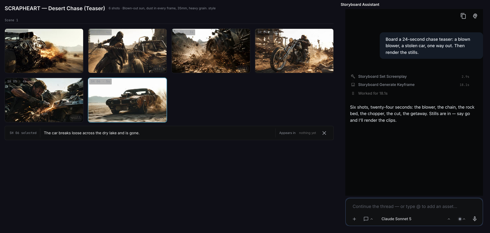
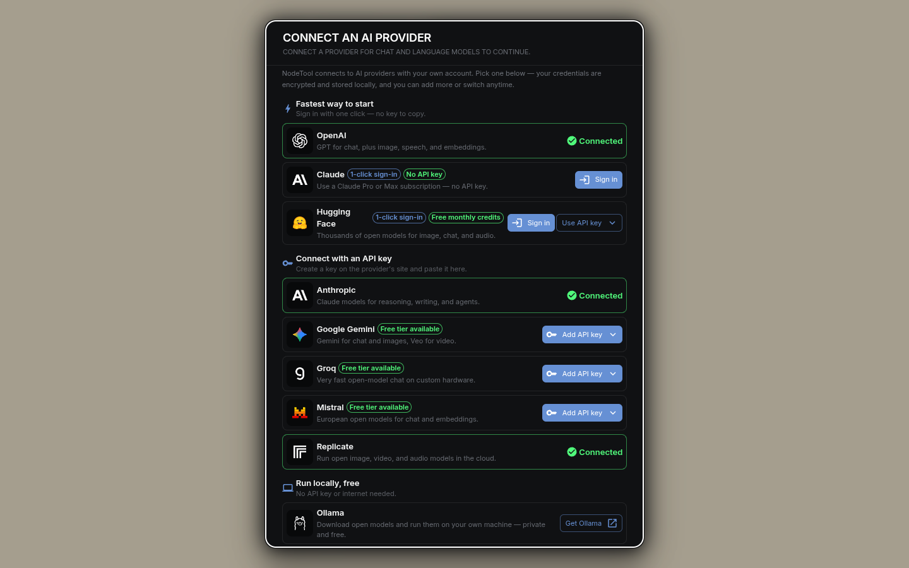
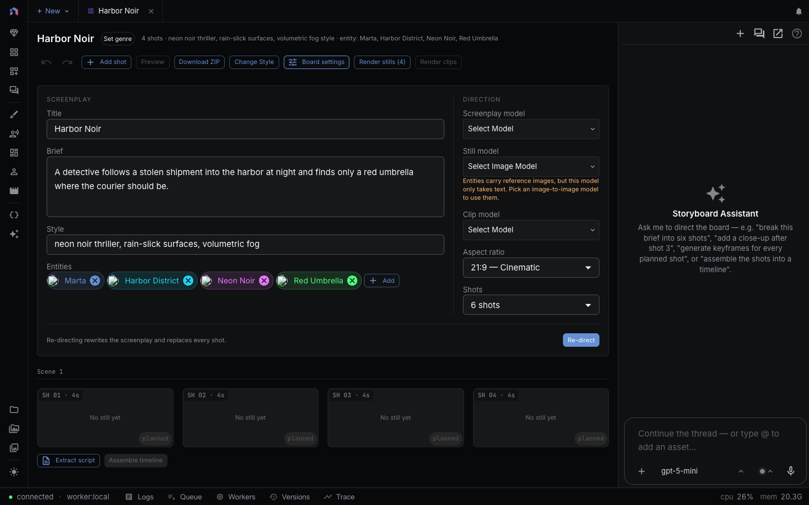
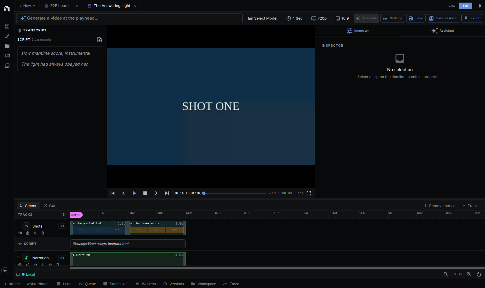
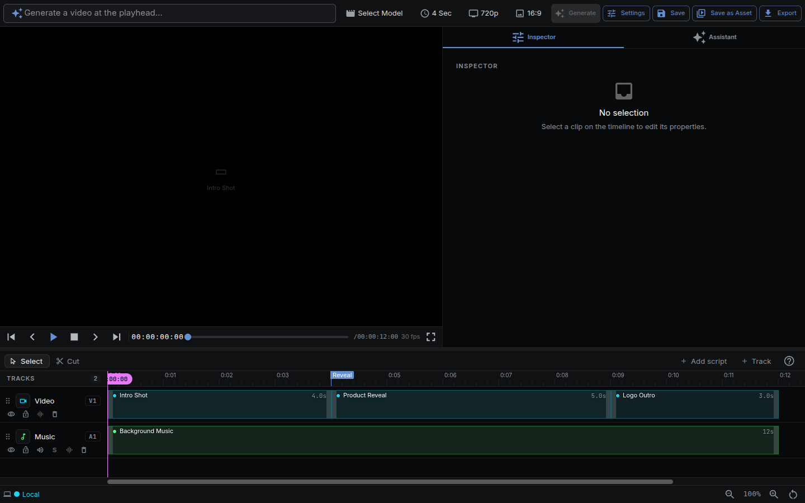

Turn one sentence into a short film: the AI agent writes the script, you choose
the images you like, and the final video is ready for you to edit and export.
It takes about 30 minutes, mostly just waiting for the video to generate.
No account is required — you just need your own API keys.

This page assumes you have never used a tool like this. Every term is explained
the first time it appears, and the [Glossary](glossary.md) covers the rest.

The five steps below show the entire process. Each step costs a bit more than the last,
which is why we do it in this order: an image costs cents, a short video costs dollars,
and you always approve the image before spending money on the video.

---

## Step 1 — Install and connect your models

### Will it run on my computer?

| | Minimum | Better |
|-----------|---------|-------------|
| **Memory (RAM)** | 8 GB | 16 GB or more |
| **Free disk space** | 10 GB | 50 GB if you download AI models |
| **Operating system** | macOS 13+, Windows 10+, Ubuntu 22+ | The latest version |

No graphics card needed. Everything in this guide runs on cloud models billed
to your own key, so the work happens on the provider's machines. A graphics card
only matters if you later run models locally — see the
[hardware notes](installation.md#what-different-tasks-need).

### Install it

1. Download NodeTool from [nodetool.ai](https://nodetool.ai).
2. Run the installer.
3. Open the app. It lands on the workspace, whose empty state asks what you
   want to make and carries a short setup checklist. Per-OS instructions are on
   the [Installation](installation.md) page.

### Connect three kinds of model

NodeTool does not have its own AI models. Instead, you connect it to AI providers using an **API key**.
An API key is like a long password you copy from an AI company's website. It allows NodeTool
to use their AI on your behalf, and the company bills you for what you use.
Some providers also let you sign in with one click instead of using a key.

A film needs three roles filled, and one provider can fill more than one:

| Role | What it does | Connect one of |
|---|---|---|
| **Language model** | Writes the screenplay and drives the assistants | OpenAI, Anthropic, Google Gemini, Groq, Mistral — or a Claude subscription |
| **Image model** | Renders each shot's still | FAL, Google Gemini, OpenAI, Replicate, Hugging Face |
| **Video model** | Animates a still into a clip | FAL, Replicate, Google Gemini |

FAL plus one language provider is the shortest path: FAL covers both the stills
and the clips.

Open **Settings → Models & Providers**, or let the app open the same dialog the
first time something needs a key it doesn't have. Sign in where the provider
supports it, otherwise paste the key.

Each card shows what the provider is good for, what it charges, and whether it
has a free tier. Model dropdowns are built from the providers you have
connected, so a key you skip is a model you won't see later.

Prefer models on your own machine, with no account and no bill? That works for
the language and image steps and needs a download of several gigabytes per
model. See [Models & Providers](models-and-providers.md).

---

## Step 2 — Ask the agent for a storyboard

A **storyboard** is a board of cards, one per shot. Each card holds the shot's
action text, its still, and its clip. It is where the film is planned before any
money is spent.

Press **+** on the workspace tab bar and pick **New storyboard… → Blank
storyboard**. The same menu lists example boards that ship with the install;
those arrive finished — action text, still, and clip on every shot — if you want
to see the end state before making your own.

The board has two halves. On the left you write the film:

- **Title** — what it's called.
- **Brief** — your film in one or two sentences.
- **Style** — palette, light, lens, texture. This is what holds the look
  together across shots.
- **Entities** — optional named characters, locations, styles, and props reused
  across shots. See [Creative Agent → Entities](creative-agent.md).

On the right you pick the machinery: **Screenplay model** (language),
**Still model** (image), **Clip model** (image-to-video), **Aspect ratio**, and
how many **Shots** you want. Six is a good first number.

Press **Direct**. The `nodetool.creative.Director` node returns a typed
screenplay — title, logline, style bible, narration, music direction — and one
card per shot carrying its action, camera (framing, lens, angle, movement),
motion, and duration. Nothing has rendered yet, so this step costs one language
model call.

### Or just ask for it

Everything the board's buttons do is also a tool the agent can call. The
**Storyboard Assistant** is docked to the right of the board — ask it in plain
language and watch the cards change:

> Break this brief into six shots, opening on a wide establishing shot and
> ending on a close-up.

> Add a reaction shot after shot 3 and make shot 5 a slow push-in.

From the **Chats** panel — with no board open — the agent can create the board
from scratch: *"Create a storyboard for a 40-second noir short about a courier
who loses the package, six shots."* It creates the board, writes the shots, and
tells you the id; open it from the **Storyboards** section of the left panel.

Two things worth knowing on the first try:

- **The permission chip decides how far it goes on its own.** *Plan* proposes
  without touching anything, *Default* asks before actions, *Auto* runs
  everything. It is set per thread, and it is what stands between a chat message
  and a render bill.
- **Re-directing replaces every shot.** The app asks first. Stills and clips
  already generated stay in your asset library, but the cards are rebuilt.

---

## Step 3 — Render stills, then clips

This is the step that spends money, so it runs in two passes.

**Stills first.** Press **Generate all stills** — the button counts the shots
still waiting — or **Generate still** on one card. Each still is saved as an
asset and becomes that shot's keyframe. Don't like one? Press **New still**; the
previous take is kept, and the **Takes** row under the card clicks back to it.
The card shows a `~$` estimate before you commit.

**Clips second, from the still you chose.** **Generate clip** animates that
shot's selected still with the video model; **Generate all clips** does every
shot that has a still and no clip yet. A card that never got a still is reported
and skipped, not rendered blind.

**Revise clip** takes a text instruction — "make it darker, add rain" — and runs
video-to-video on the clip you already have, swapping the result in place. Fixing
shot 3 never means re-rolling shots 1–5.

Cards move through **Planned → Still ready → Rendering → Rendered**, and
**Preview** plays the whole board in order — each shot's clip where one exists,
its still held on screen where it doesn't.

The assistant drives all of it:

> Render stills for every planned shot.

> Animate shots 1 through 4, then show me what's left.

---

## Step 4 — Assemble the cut on the timeline

Press **Assemble timeline**. NodeTool creates a saved timeline sequence and
opens it in a tab.

What lands there:

- Every rendered shot as a clip on a video track, in board order.
- Each clip's own sound on a linked **Shot Audio** track beside it. Mute one when
  a shot should play silent under narration.
- The screenplay's narration and music as draft text-to-audio clips on their own
  tracks — generate them from the clip inspector when you want them.
- The screenplay text in the script panel.

From here it's an ordinary edit. Drag to move, drag an edge to trim, `S` splits
at the playhead, `Delete` removes, and clips snap to the playhead and to each
other. The **Animate** section of the inspector adds entrance, exit, emphasis,
and loop motion without keyframes. Full reference:
[Video Editor](video-editor.md).

The **Editor Assistant** is docked here too: *"split the selected clip at the
playhead"*, *"fade out the last clip"*, *"generate a 5-second clip of a city at
night"*.

Every assembled clip stays linked to the shot it came from. Go back to the
storyboard, revise a shot, and the new render replaces that clip in the saved
cut. Press **Assemble timeline** again after adding shots and the same sequence
is rewritten in place, keeping tracks you added by hand.

---

## Step 5 — Export the video

Set the output first. The **Settings** button in the timeline's top bar opens
**Project settings**: canvas width and height (or a preset) and the frame rate.
The sequence renders at exactly those numbers.

Then **Export video**. NodeTool processes the timeline frame by frame,
combines the audio and video, and saves it as an MP4 file.
A progress dialog shows the current step — preparing, audio, video,
finalizing — and you can cancel at any time.

**Save as Asset** writes the same render into your asset library instead of
downloading it, which is what you want if the film is an ingredient in something
else rather than the delivery.

---

## What you just learned

The loop is: direct, render cheap, render expensive, cut, export. Cheap stages
gate the expensive ones, nothing renders twice unless you ask, and a revision
made after assembly flows forward into the cut.

Every one of those steps has a button and a tool behind it. You can click the
whole pipeline, ask for the whole pipeline in chat, or mix the two — press
**Direct** yourself and let the assistant render the shots you point at.
External agents reach the same tools over MCP (`nodetool mcp serve`), so Claude
Code can direct a board you then open and finish by hand.

---

## Beyond the film

The same models and the same asset library back the rest of NodeTool:

- **[Workflows](key-concepts.md)** — nodes and connections on a canvas, for
  pipelines that run on a schedule or over a batch. The agent builds these too:
  *"take a product photo and a brief and write three ad captions."*
- **[Mini Apps](mini-apps.md)** — a workflow with the canvas hidden, so someone
  else fills in a form and presses a button.
- **[Sketch Editor](sketch-editor.md)** — layered still images, the way
  Photoshop works. Useful for fixing a keyframe before animating it.

[Key Concepts → How everything fits together](key-concepts.md#how-everything-fits-together)
has the full picture with a diagram.

---

## Where to go next

| If you want to | Read |
|------|------|
| Go deeper on the film pipeline | [Creative Agent](creative-agent.md) |
| Learn the timeline editor | [Video Editor](video-editor.md) |
| Keep a character consistent across shots | [Creative Agent → Entities](creative-agent.md) |
| Get more out of the agent | [Chat](global-chat.md), [Chat & Agents](global-chat-agents.md) |
| Choose AI models | [Models & Providers](models-and-providers.md) |
| Build workflows by hand | [Key Concepts](key-concepts.md), [Workflow Editor](workflow-editor.md) |
| See more examples | [Gallery](workflows/), [Cookbook](cookbook.md) |
| Look up a word | [Glossary](glossary.md) |
| Fix something that broke | [Troubleshooting](troubleshooting.md), [Debugging](workflow-debugging.md) |

Questions: [Discord](https://discord.gg/WmQTWZRcYE) ·
[GitHub](https://github.com/nodetool-ai/nodetool/issues)
