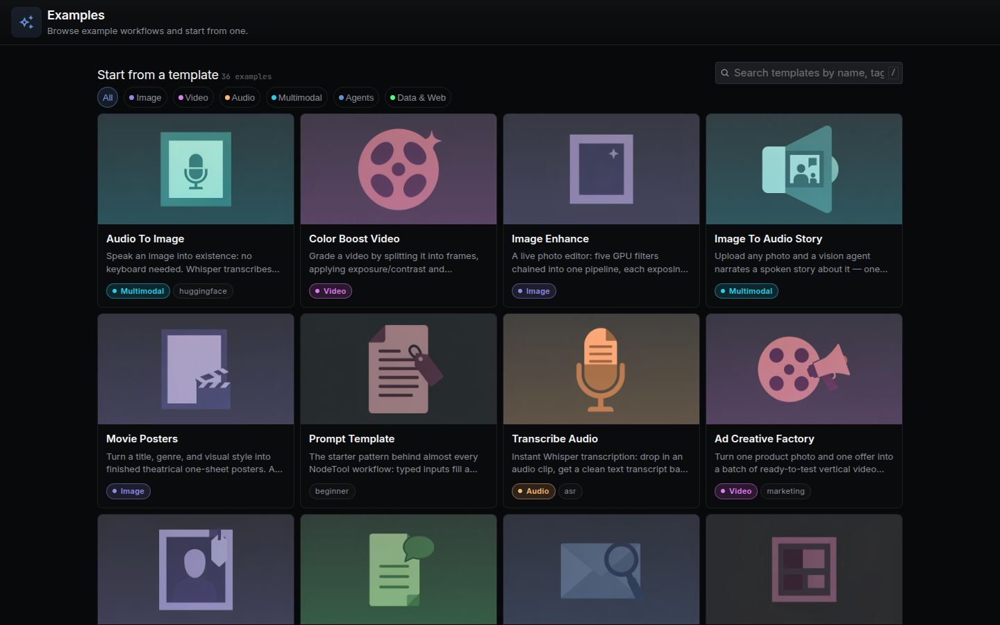
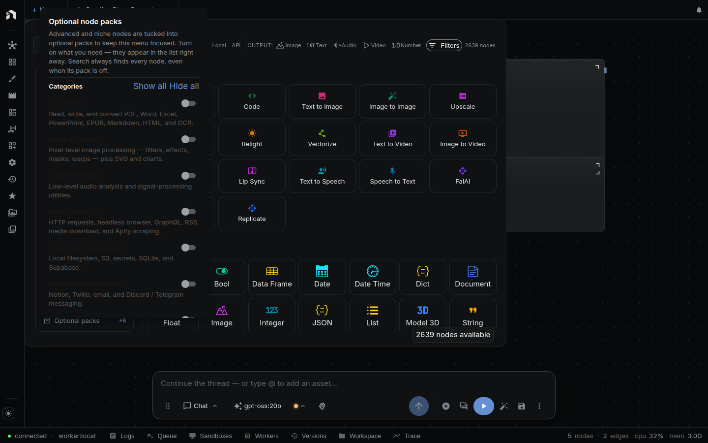

Install NodeTool, open a ready-made example, run it, change it, and turn it into
a form anyone can use. About 10 minutes. No account required.

This page assumes you have never used a tool like this. Every term is explained
the first time it appears, and the [Glossary](glossary.md) covers the rest.

Prefer to watch first? Here is a finished example running. The
[Tutorials](tutorials.md) page has more.

<video controls preload="metadata" poster="{{ '/assets/tutorials/first-workflow.jpg' | relative_url }}">
  <source src="{{ '/assets/tutorials/first-workflow.mp4' | relative_url }}" type="video/mp4">
</video>

## Step 1 — Install

### Will it run on my computer?

| | Minimum | Better |
|-----------|---------|-------------|
| **Memory (RAM)** | 8 GB | 16 GB or more |
| **Free disk space** | 10 GB | 50 GB if you download AI models |
| **Graphics card (GPU)** | Not needed | 8 GB or more of video memory |
| **Operating system** | macOS 13+, Windows 10+, Ubuntu 22+ | The latest version |

A graphics card only matters if you want AI models to run on your own machine.
Without one, NodeTool sends the work to an online AI service instead, and
everything on this page still works. See the
[hardware notes](installation.md#what-different-tasks-need).

### Install it

1. Download NodeTool from [nodetool.ai](https://nodetool.ai).
2. Run the installer.
3. Open the app. There is no setup wizard — it opens on the Dashboard, with a
   getting-started checklist you can dismiss.

Step-by-step instructions per operating system are on the
[Installation](installation.md) page.

### Connect it to an AI service

NodeTool has no AI model built in. You point it at one, and the fastest way is
an **API key**: a long password-like string you copy from an AI company's
website. It lets NodeTool send requests on your account, and that company bills
you for what you use.

Open **Settings → Providers** and paste a key from
[OpenAI](https://platform.openai.com),
[Anthropic](https://www.anthropic.com), or
[Google](https://ai.google.dev). One key is enough for the examples below.

Want the AI to run on your own machine instead, with no account and no bill?
That works too, and it needs a download of several gigabytes per model. See
[Models & Providers](models-and-providers.md).

---

## Step 2 — Run a ready-made example

Everything you build lives on a **canvas**: a large open work area where you
place boxes and draw lines between them.

- Each box is a **node**, and it does one job: write some text, make an image,
  save a file.
- A line carries the result of one node into the next one. Lines are also called
  **connections**.
- The whole picture, boxes and lines together, is a **workflow**.

You don't have to build one yet. NodeTool ships with **templates**: finished
workflows you can open and run as they are. Find them on the Dashboard, the
screen you land on until you finish the checklist, or on the Examples page.
After that the app opens straight into the workspace; **Settings → General →
Show Welcome Screen** puts the Dashboard back on startup.

### Movie Posters

1. Go to Dashboard → Templates → **Movie Posters**.
2. The workflow opens. Read it left to right: the boxes where you type go on the
   left, the AI in the middle, the image maker next, and the finished picture on
   the right.
3. Type into the boxes on the left:
   - **Title**: Ocean Depths
   - **Genre**: Sci-Fi Thriller
   - **Audience**: Adults who love mystery
4. Two nodes, Agent and List Generator, ask you to pick a model. A **model** is
   the specific AI you want to use, such as GPT-5.6 or Claude Opus 5. Pick any one from
   the dropdown. This is the step that needs the API key from above.
5. Press <kbd>Ctrl/⌘ + Enter</kbd> to run it.

Nodes light up one at a time as they work. Text and images appear inside the
Preview node on the right as they are produced, so you can watch the poster
being made instead of waiting for a finished file.

### Creative Story Ideas

1. Go to Dashboard → Templates → **Creative Story Ideas**.
2. Type into the boxes on the left:
   - **Genre**: Cyberpunk
   - **Character**: Rogue AI detective
   - **Setting**: Neon-lit underwater city
3. Pick a model for the Agent and List Generator nodes.
4. Press <kbd>Ctrl/⌘ + Enter</kbd> to run it.

---

## Step 3 — Change something

The template is now yours. Change it, run it again, and see what happens. Every
run uses whatever is on the canvas at that moment, so there is nothing to
rebuild or recompile.

1. Change one of your typed inputs, or pick a different model, then press
   <kbd>Ctrl/⌘ + Enter</kbd> again.
2. Press <kbd>Ctrl/⌘ + S</kbd> to save your version.
3. Click a node to see its settings in the panel on the right. Hover over a line
   to see the data passing through it.
4. To watch any value anywhere in the workflow, press `Space` to open the node
   list, search for "Preview", and drop one onto the canvas. Connect a line into
   it and it will show whatever arrives.

### Finding more nodes

NodeTool comes with hundreds of nodes. Showing all of them at once would make
the list unusable, so the more specialised ones are grouped into **packs** that
start switched off. Turning a pack on adds its nodes to the list.

Press `Space` to open the node list, then click **Optional packs** at the bottom
of the category list.

- **Categories** — switch on a group (Documents, Image & Graphics, Web &
  Scraping, and others) to show its nodes while browsing. Search always finds
  every node, even in a pack that is switched off, so nothing is ever truly
  hidden.
- **Providers** — nodes for an AI company appear as soon as you add that
  company's API key, in **Settings → API Keys** or with the **Add API key**
  button right here. No restart needed. Packs that run on your own machine, like
  Transformers.js, need no key and have a normal on/off switch.

Opening a workflow that someone else made switches on any pack it needs, so
shared workflows run without setup.

---

## Step 4 — Turn it into an app

A **Mini-App** is the same workflow with the boxes and lines hidden. What's left
is a plain form: fill in the fields, press a button, get the result. Hand it to
someone who should never have to look at a canvas.

1. Open the workflow.
2. Click **Mini-App** in the toolbar.
3. Fill in the fields and run it. Same workflow underneath, no canvas.

To design the form yourself, see [Mini Apps](mini-apps.md) for what they are,
[Building Mini Apps](mini-apps-guide.md) for worked examples, and
[App Builder](app-builder.md) for the editor.

---

## What you just learned

The four steps above are the loop NodeTool is built around: gather your files,
build a workflow, produce something, and share it as a Mini-App.

Two other work areas plug into the same loop. The
[Sketch Editor](sketch-editor.md) is for still images built from layers, the way
Photoshop works. The [Video Editor](video-editor.md) is for arranging video and
audio clips over time. Anything any of them produces is a file NodeTool calls an
**asset**, and all four areas read and write the same set of assets, using the
same AI services.

[Key Concepts → How everything fits together](key-concepts.md#how-everything-fits-together)
has the full picture with a diagram.

---

## Where to go next

| If you want to | Read |
|------|------|
| Understand how workflows work | [Key Concepts](key-concepts.md) |
| Learn the interface | [User Interface](user-interface.md), [Workflow Editor](workflow-editor.md) |
| See more examples | [Gallery](workflows/), [Cookbook](cookbook.md) |
| Choose AI models | [Models & Providers](models-and-providers.md) |
| Look up a word | [Glossary](glossary.md) |
| Put a workflow on a server | [Deployment](deployment.md) |
| Fix something that broke | [Troubleshooting](troubleshooting.md), [Debugging](workflow-debugging.md) |

Questions: [Discord](https://discord.gg/WmQTWZRcYE) ·
[GitHub](https://github.com/nodetool-ai/nodetool/issues)
