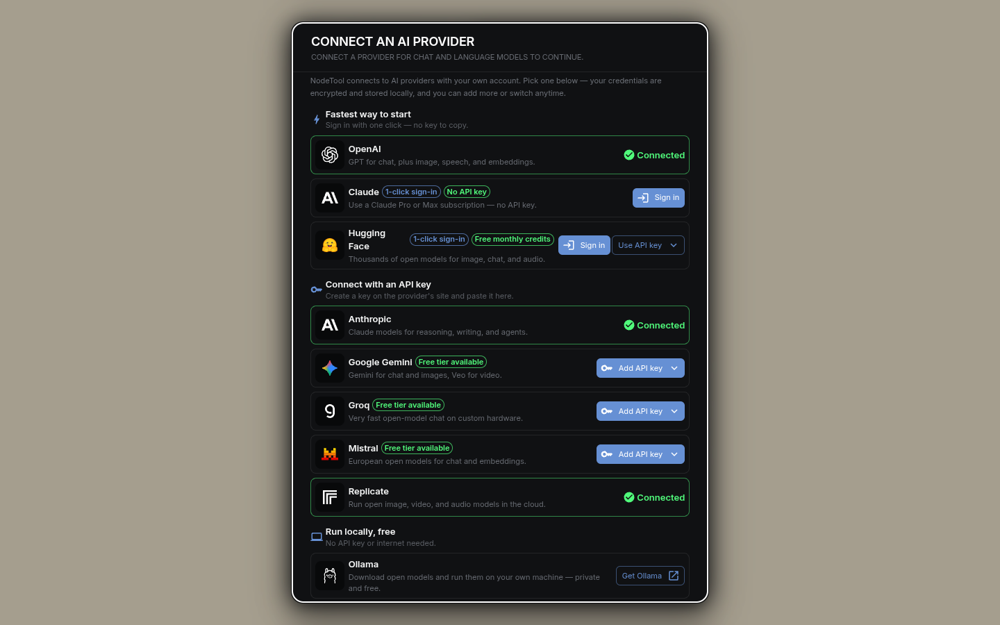

One sentence in, a finished video out. About 30 minutes, mostly render time.
No account. You bring your own API keys.

> **Tip:** The plan is text and costs cents. The clips cost dollars. You check
> the plan before you pay for clips.
{: .callout-tip}

---

## 1. Install and connect

1. **Download** NodeTool from [nodetool.ai](https://nodetool.ai), install it,
   and open it. You do not need a graphics card, because the models run in the
   cloud. OS details: [Installation](installation.md).
2. **Connect your models.** NodeTool uses AI from other companies. An **API key**
   is the password that lets NodeTool use your account with them. They bill you
   for what you use. Open **Settings → Models & Providers**, then sign in or
   paste a key.

Connect a provider for each row you need:

| You need | For | Get it from |
|---|---|---|
| Language model | Plans the video | OpenAI, Anthropic, Gemini, Groq, Mistral, or a Claude subscription |
| Video model | Renders the clips | FAL, Replicate, Gemini, OpenAI, kie.ai, and others |
| Voice model (optional) | Reads the voiceover | OpenAI, ElevenLabs, Gemini, and others |

> **Tip:** The fastest setup is FAL plus one language provider. The
> [capability matrix](providers.md#capability-matrix) lists which provider covers
> which model type.
{: .callout-tip}

---

## 2. Say what you want

1. On the **Home** tab, pick **Video**, or use **+ New → New timeline**.
2. Type one sentence:

   > A 15-second ad for a desk lamp: a quiet desk at night, the lamp switches on.

3. Press **Continue**. If you close the tab, NodeTool keeps your progress.

Other ways to start:

- **Drop your media** — use your own clips, audio, or images.
- **Start from a script** — write the words first.
- **Start with a blank timeline** — skip the plan.

---

## 3. Plan the beats

A **beat** is one clip in your video.

**Pick a template:**

| Template | Length | Shape |
|---|---|---|
| 15s ad | 15 s | 16:9 |
| 30s spot | 30 s | 16:9 |
| 60s explainer | 60 s | 16:9 |
| 9:16 social clip | 20 s | 9:16 |
| Trailer | 45 s | 16:9 |
| Music video | 60 s | 16:9 |
| Slideshow | 40 s | 16:9 |

Then:

1. Pick a **Model** at the bottom, then press **Plan the beats**. This step
   costs one language model call.
2. **Edit the plan.** Each beat has a description, a length, a transition, and a
   voiceover line. The total length turns to a warning color when the plan is
   too long. **Re-plan** writes the beats again and follows your edits.
3. Press **Continue to look**.

---

## 4. Pick the look and generate

1. Set the look:
   - **Aspect ratio** — comes from the template. You can change it.
   - **Video model** — each tile plays a sample clip.
   - **Voiceover** — on or off. Pick a voice when it is on.
   - **Music** — adds one music track under the whole video.
2. Check the cost next to the button.
3. Press **Generate your video**. The timeline opens and the clips fill in as
   they finish.

---

## 5. Edit and export

1. Press **Retry N failed** to run failed clips again. You can close the tab
   during generation. The clips are there when you come back.
2. Edit the cut. Drag to move, drag an edge to trim, `S` to split, `Delete` to
   remove. These are the default **NodeTool** keys. Press `?` to see them and to
   switch the keyboard preset to Premiere Pro or Final Cut Pro.
3. Or ask the **Editor Assistant**: *"fade out the last clip"*.
4. Press **Export video** to save an MP4 file. **Save as Asset** keeps it in
   your library.

Every step is also an agent tool. You can click, chat, or do both. Coding
agents get the same tools over MCP: [NodeTool as an MCP Server](mcp-server.md).

---

## What you just did

- **Providers and API keys.** You connected a language model and a video model
  from your own accounts. See [Models & Providers](models-and-providers.md).
- **Beats.** You turned one sentence into a plan of clips before paying for any
  of them. See [Creative Agent](creative-agent.md).
- **Timeline.** You generated the clips onto tracks you can trim, split, and
  reorder. See [Video Editor](video-editor.md).
- **Assets.** You exported the result and saved it to your library, where any
  workflow can reuse it. See [Key Concepts](key-concepts.md#assets).
- **Agent.** You used the Editor Assistant on the same timeline you edit by
  hand. See [Chat](global-chat.md).

---

## Troubleshooting

Something stuck? See [Troubleshooting]({{ '/troubleshooting' | relative_url }})
or ask on [Discord](https://discord.gg/WmQTWZRcYE).

---

## Next steps

  <a class="doc-card" href="{{ '/first-workflow' | relative_url }}"><strong>Your First Workflow</strong>Build a four-node image workflow from an empty canvas.</a>
  <a class="doc-card" href="{{ '/creative-agent' | relative_url }}"><strong>Creative Agent</strong>Control each shot, stills first, and keep characters consistent.</a>
  <a class="doc-card" href="{{ '/video-editor' | relative_url }}"><strong>Video Editor</strong>Trim, split, and layer clips on the timeline.</a>
  <a class="doc-card" href="{{ '/key-concepts' | relative_url }}"><strong>Key Concepts</strong>Workflows, assets, sketches, timelines, and agents in one page.</a>

Questions: [GitHub](https://github.com/nodetool-ai/nodetool/issues)
