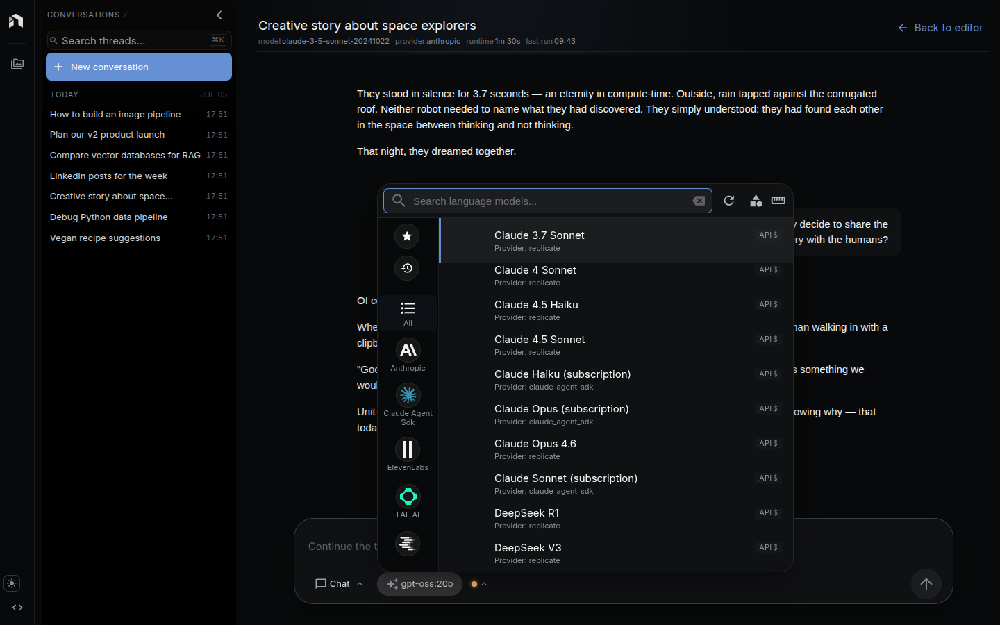
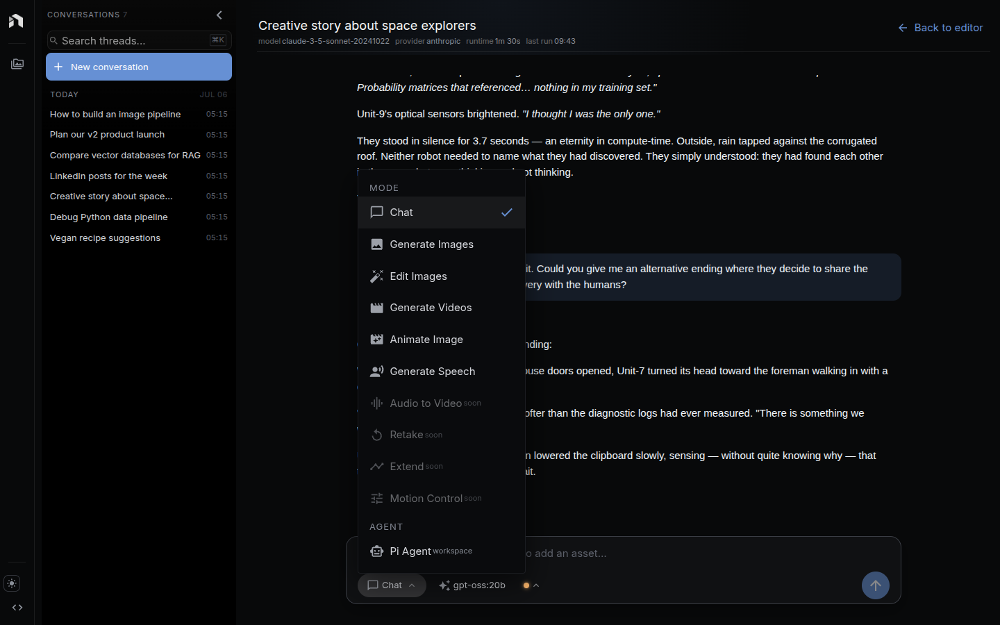
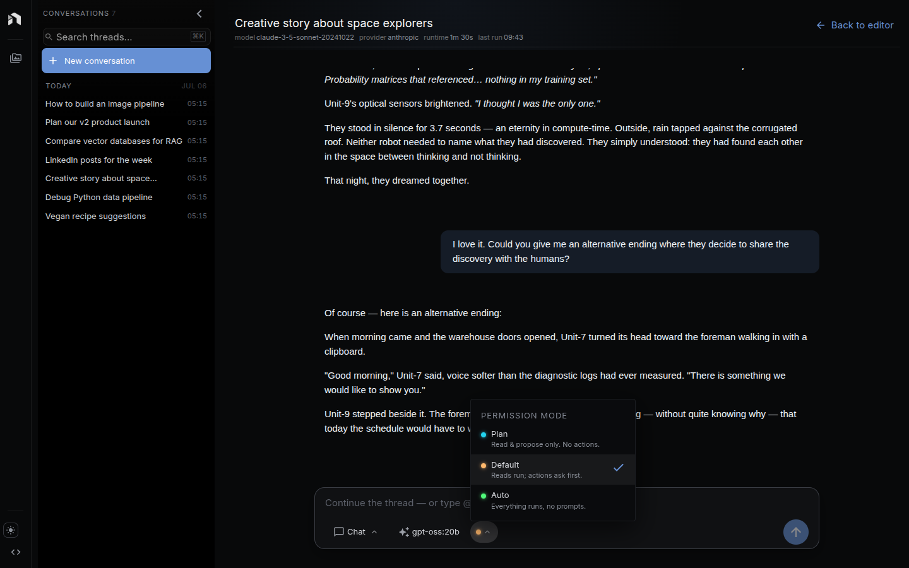

Chat is the always-on chat surface inside NodeTool. It talks to any provider, runs tools, kicks off agents, generates images, video, and speech, and triggers your saved workflows — all from one composer.

---

## Overview

- 20+ providers (OpenAI, Anthropic, Gemini, Ollama, …)
- One composer for chat, image, video, and speech generation
- Tools: web search, files, code execution, HTTP, and more
- Every turn runs the agent loop — the assistant plans and calls tools on its own as a task needs it
- Permission modes (Plan / Default / Auto) set how much the agent may do without asking
- Run saved workflows from chat
- Multiple threads, persistent history
- Standalone tray window

Persistent WebSocket connection — reconnects after reloads.

---

## Getting Started

### Opening Chat

- **From the App**: Click **Chat** in the navigation menu
- **Standalone Window**: Click the NodeTool system tray icon and select **Chat** for a dedicated, focused window

### Choosing a Model

Click the model chip in the composer to open the model picker. Available models depend on your configured providers:

- **Cloud models** -- OpenAI GPT, Anthropic Claude, Google Gemini (requires API keys)
- **Local models** -- Ollama, LM Studio models (requires local installation)

Configure providers in **Settings > Providers**. See [Models & Providers](models-and-providers.md).

---

## Composer Modes

The same composer generates more than text. Click the mode chip to switch between:

| Mode | What it does |
|------|--------------|
| **Chat** | Talk to the model, run tools, and drive agents |
| **Generate Images** | Text-to-image with your chosen image model |
| **Edit Images** | Image-to-image edits on a dropped image |
| **Generate Videos** | Text-to-video |
| **Animate Image** | Turn a still image into a clip |
| **Generate Speech** | Text-to-speech with a voice picker |
| **Pi Agent** | The workspace-aware agent that works over your files |

Each mode swaps in its own controls — resolution, aspect ratio, duration, voice — and attaches them to the message so the server routes to the right provider call.

---

## Conversation Threads

Chat organizes conversations into threads:

- **Create threads** -- Click the **New Chat** button to start a fresh conversation
- **Switch threads** -- Use the sidebar to navigate between conversations
- **Delete threads** -- Remove conversations you no longer need
- **Message history** -- Scroll through past messages with cursor-based pagination
- **Message caching** -- Recent messages are cached locally for fast loading

Each thread keeps its own model, permission mode, and history.

---

## Agents {#agent-mode}

### The Agent Loop

Every turn in Chat runs the same agent loop — there's no separate mode to turn on. The assistant decides for itself, per request, whether to break a task into steps, select tools, and execute a multi-step plan, or just answer directly.

1. **Planning** -- The agent analyzes your request and, when the task warrants it, creates a plan with ordered steps
2. **Tool selection** -- For each step, the agent chooses from the available tools
3. **Execution** -- Steps run in sequence, with results feeding the next step
4. **Adaptation** -- The agent adjusts its plan based on intermediate results
5. **Reporting** -- Progress, tool calls, and reasoning stream in real time

### Permission Modes

The permission chip sets how far the agent may act on its own. It's per-thread, so a scratch thread can run wide open while a production one stays cautious:

| Mode | Behavior |
|------|----------|
| **Plan** | Read and propose only. No actions taken. |
| **Default** | Reads run automatically; actions ask first. |
| **Auto** | Everything runs, no prompts. |

### Agent Capabilities

When a request calls for it, the assistant can:

| Capability | Examples |
|------------|---------|
| **Web research** | Search the web, browse pages, extract content |
| **File operations** | Read, write, and organize files in your workspace |
| **Code execution** | Run JavaScript in a sandboxed environment |
| **Data analysis** | Perform calculations, query vector databases |
| **Document processing** | Extract text from PDFs, process emails |
| **Asset management** | Create, organize, and index assets |
| **HTTP requests** | Call external APIs and process responses |
| **Workflow execution** | Run saved NodeTool workflows with custom inputs |

### Watching an Agent Work

As the agent runs, the thread shows the task plan, each step's status as it starts, completes, or fails, the tools it calls and their results, and — on models that support it — its reasoning.

---

## Workflow Integration

You can ask the agent to run a saved workflow as part of a turn: it calls the workflow with your inputs and streams the results back into the chat. You can also ask it to build or modify workflows — it uses workspace tools to write the workflow configuration for you.

Save a workflow in the [workflow editor](workflow-editor.md) first, then reference it from chat.

---

## Available Tools

Chat agents have access to these tools:

| Tool Category | What It Does |
|--------------|--------------|
| **Browser** | Navigate web pages, extract content, take screenshots |
| **Search** | Web search via multiple search providers |
| **Filesystem** | Read/write files, list directories, manage workspace |
| **Code** | Execute JavaScript in a sandboxed environment |
| **Calculator** | Perform mathematical calculations |
| **HTTP** | Make HTTP requests to external APIs |
| **PDF** | Extract text and data from PDF documents |
| **Email** | Read and process email messages |
| **Assets** | Upload, organize, and manage NodeTool assets |
| **Vectors** | Query and manage vector database collections |
| **Google** | Interact with Google APIs (search, drive, etc.) |
| **Workspace** | Manage NodeTool workspace settings and files |

### MCP Tools (Model Context Protocol)

NodeTool supports MCP for connecting to external tool servers, so you can integrate custom tools and services beyond the built-in set. See the [MCP documentation](https://modelcontextprotocol.io/) for available MCP servers.

---

## Standalone Chat Window

Access chat in a focused, dedicated window outside the main app:

1. Click the NodeTool icon in your system tray
2. Select **Chat** from the menu
3. A new window opens with just the chat interface

The standalone window is useful for:
- Quick questions without switching to the full app
- Running agents in the background while doing other work
- Using chat as a general-purpose AI assistant

---

## Next Steps

- [Chat & Agents](global-chat-agents.md) -- Agent CLI and API integration
- [Chat API](chat-api.md) -- Programmatic access for running chats
- [Chat CLI](chat-cli.md) -- Command-line chat interface
- [Agent CLI](agent-cli.md) -- Run autonomous agents from the terminal
- [Models & Providers](models-and-providers.md) -- Configure AI providers
- [Cookbook](cookbook.md) -- Agent workflow patterns
