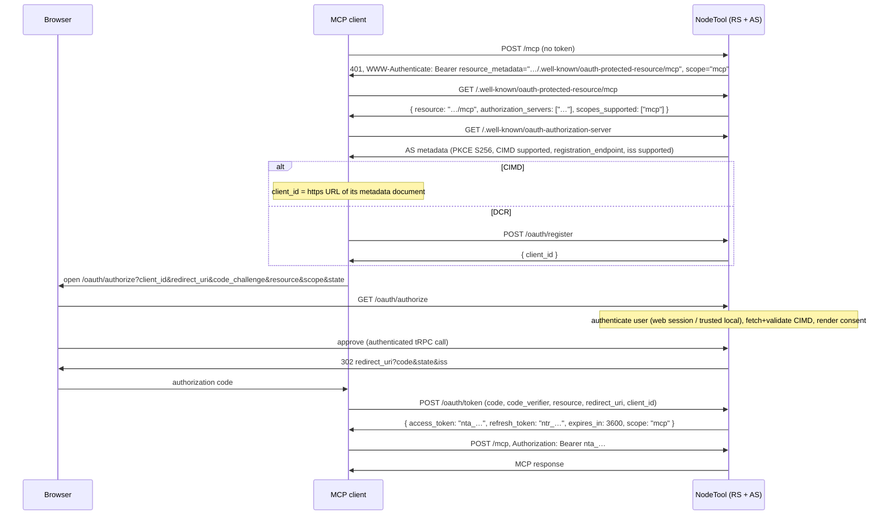

# MCP OAuth Authorization — Design

Status: proposed — 2026-08-23.
Spec: [MCP authorization (draft)](https://modelcontextprotocol.io/specification/draft/basic/authorization),
built on OAuth 2.1, RFC 9728 (protected resource metadata), RFC 8414
(authorization server metadata), RFC 8707 (resource indicators), RFC 9207
(issuer identification), and OAuth Client ID Metadata Documents.

## Problem

Connecting a remote MCP client to `/mcp` today requires a person to mint an
`ntk_` token in **Settings → MCP → Connect an agent remotely** and paste it
into the client's config ([docs/mcp-production.md](mcp-production.md)). That
works, but:

- Every spec-conforming MCP client (Claude Desktop, Claude Code, VS Code,
  ChatGPT connectors) already speaks the OAuth discovery flow: hit the server,
  get a 401, discover the authorization server, open a browser, done. NodeTool
  answers that first unauthenticated request with a bare 401 — no
  `WWW-Authenticate` header (`packages/websocket/src/lib/ws-upgrade.ts`) — so
  the automatic flow dead-ends and the user is back to pasting tokens.
- An `ntk_` token is a **full-API** bearer for its minter. A credential that
  exists only so a chat client can call MCP tools should not also authorize
  every REST route, tRPC procedure, and asset download.
- Pasted tokens have no client identity: revocation is "which of these five
  tokens named 'claude' is the one I still use?".

## Decision summary

1. **NodeTool is both the resource server and the authorization server.** The
   MCP spec lets the AS be a separate entity, but there is no external AS to
   point at in either auth mode: Local mode has no IdP at all, and Supabase
   GoTrue does not serve arbitrary third-party OAuth clients (no RFC 8414
   metadata for them, no resource indicators, no CIMD). So the websocket server
   grows a minimal OAuth 2.1 AS, issuer = `NODETOOL_PUBLIC_URL`. User
   *authentication* inside the flow reuses whatever the install already has:
   the web session (Supabase mode) or the trusted-local rules (Local mode).
2. **Authorization code + PKCE (S256) only.** Public clients, no client
   secrets, `token_endpoint_auth_methods_supported: ["none"]`. No
   client-credentials or implicit grants.
3. **Client registration: Client ID Metadata Documents first, RFC 7591 dynamic
   registration as the compatibility fallback.** CIMD needs no registration
   table for the client itself — the `client_id` *is* an HTTPS URL the AS
   fetches and validates. DCR stays because shipped clients still use it.
4. **Opaque tokens, DB-verified, audience-bound to `/mcp`.** Same
   hash-and-compare scheme as `ntk_` (`packages/models/src/access-token.ts`),
   new prefixes so the auth hook can route verification: `nta_` (access,
   short-lived) and `ntr_` (refresh, rotating). An `nta_` token authorizes
   **only** `/mcp`; every other route rejects it. `ntk_` tokens keep working
   everywhere, unchanged.
5. **One scope: `mcp`.** The MCP tool surface is already permission-gated
   per-call inside the agent-tools layer; inventing granular OAuth scopes now
   would duplicate that gate with a second, coarser one. The scope string
   exists so challenges and step-up have somewhere to grow.

## Roles and endpoints

```
MCP client            NodeTool server (one Fastify app, NODETOOL_PUBLIC_URL)
----------            -------------------------------------------------------
                      Resource server:
                        POST/GET/DELETE /mcp                (exists)
                        GET /.well-known/oauth-protected-resource/mcp   (new)
                        GET /.well-known/oauth-protected-resource       (new)
                      Authorization server:
                        GET /.well-known/oauth-authorization-server     (new)
                        GET  /oauth/authorize               (new)
                        POST /oauth/token                   (new)
                        POST /oauth/register                (new, RFC 7591)
                        POST /oauth/revoke                  (new, RFC 7009)
```

All five new prefixes are auth-exempt (`lib/public-routes.ts`) — none reads
per-caller state before authenticating on its own terms — and excluded from the
SPA fallback (`server.ts`), or `/.well-known/*` gets served `index.html`.

## The flow



### 401 challenge

`denyUnauthorized` (`packages/websocket/src/lib/ws-upgrade.ts`) grows an
optional challenge parameter. The `/mcp` path — and only it, for now — answers:

```
HTTP/1.1 401 Unauthorized
WWW-Authenticate: Bearer resource_metadata="<PUBLIC_URL>/.well-known/oauth-protected-resource/mcp", scope="mcp"
```

An expired or invalid token gets the same header plus
`error="invalid_token"`. Insufficient scope (future, once more scopes exist)
gets 403 with `error="insufficient_scope"` and the scopes the operation needs.
`scopeRefusal()` in `mcp-server.ts` keeps its JSON-RPC `-32001` body but the
HTTP layer adds the header.

The challenge is emitted only when the flow can complete: `mcpHttpEnabled` and
`configuredMcpUrl()` non-null (`lib/mcp-mount.ts` already owns both). A server
with no `NODETOOL_PUBLIC_URL` cannot name its own resource URI and answers the
plain 401 it does today.

### Protected resource metadata (RFC 9728)

Served at both well-known forms the spec's fallback order probes —
`/.well-known/oauth-protected-resource/mcp` (path-aware, matching the `/mcp`
endpoint path) and the root document:

```json
{
  "resource": "<PUBLIC_URL>/mcp",
  "authorization_servers": ["<PUBLIC_URL>"],
  "scopes_supported": ["mcp"],
  "bearer_methods_supported": ["header"],
  "resource_name": "NodeTool MCP"
}
```

`resource` is the canonical URI (lowercase scheme/host, no trailing slash),
derived from `configuredMcpUrl()` — not a fourth copy of the public-URL logic.

### Authorization server metadata (RFC 8414)

`/.well-known/oauth-authorization-server`:

```json
{
  "issuer": "<PUBLIC_URL>",
  "authorization_endpoint": "<PUBLIC_URL>/oauth/authorize",
  "token_endpoint": "<PUBLIC_URL>/oauth/token",
  "registration_endpoint": "<PUBLIC_URL>/oauth/register",
  "revocation_endpoint": "<PUBLIC_URL>/oauth/revoke",
  "response_types_supported": ["code"],
  "grant_types_supported": ["authorization_code", "refresh_token"],
  "code_challenge_methods_supported": ["S256"],
  "token_endpoint_auth_methods_supported": ["none"],
  "scopes_supported": ["mcp"],
  "client_id_metadata_document_supported": true,
  "authorization_response_iss_parameter_supported": true
}
```

`code_challenge_methods_supported` is load-bearing: spec-conforming clients
**refuse to proceed** when it is absent. `iss` is emitted on every
authorization response (success and error) per RFC 9207, so the flag is true.

## Client registration

### Client ID Metadata Documents (primary)

A URL-shaped `client_id` (https, with a path) is fetched by the AS at
authorize time and validated: the document's `client_id` must equal the URL
exactly, the structure must carry `client_id`, `client_name`, `redirect_uris`,
and the request's `redirect_uri` must exactly match one of them. The fetch goes
through `safeFetch` from `@nodetool-ai/runtime` — the SSRF guard the spec's
security considerations call for already exists and is mandatory repo policy
for any URL somebody else chose
([docs/url-egress-inventory.md](url-egress-inventory.md) gets a new row).
Responses are cached respecting HTTP cache headers, capped (size ≤ 64 KB,
timeout 5 s), and never trusted across the `client_id` mismatch.

### Dynamic registration (fallback)

`POST /oauth/register` accepts `{client_name, redirect_uris, grant_types,
token_endpoint_auth_method: "none", application_type}` and answers a generated
`client_id` (`ntc_<random>`), no secret. Rows live in a new `mcp_oauth_clients`
table. Registration is open (that is the point of DCR) but rate-limited via the
existing `fastifyRateLimit` registration, and rows are garbage-collected when
they age out with no grant ever issued (30 days).

Redirect URIs at registration and at authorize time must be `https://…` or
loopback (`http://127.0.0.1[:port]/…`, `http://localhost[:port]/…`); anything
else is rejected.

## Authorize and consent

`GET /oauth/authorize` validates the request (client, redirect_uri, S256
`code_challenge`, `resource` equal to the canonical `/mcp` URI when present,
scope ⊆ {`mcp`}), then hands off to the web UI: a redirect to
`/oauth/consent?request_id=…` inside the SPA, with the pending request parked
server-side (same in-memory TTL-swept store pattern as `oauthStateStore` in
`packages/websocket/src/oauth-api.ts`, 10-minute TTL).

The consent page runs inside the normal web app, so user authentication is
whatever the install already enforces: Supabase session in cloud mode, the
trusted-local rules in Local mode (where the auth hook resolves `userId: "1"`
on loopback). Unauthenticated users go through the existing login and return.
The page shows the client's `client_name`, the **redirect URI host** (spec
requirement — with an explicit warning when every redirect URI is
loopback-only, since CIMD cannot prevent localhost impersonation), and the
scope. Approve calls a new authenticated tRPC procedure
(`agentAccess.approveOauthRequest`) that mints the code and returns the
redirect URL; the SPA navigates there. Deny redirects with
`error=access_denied`. Both redirects carry `state` (echoed verbatim) and
`iss`.

Errors that arrive before a redirect_uri is validated (unknown client, bad
redirect_uri) render in-page and never redirect — open-redirect rule.

## Token endpoint

`POST /oauth/token`, `application/x-www-form-urlencoded`:

- **`grant_type=authorization_code`** — verify: code exists, unexpired
  (≤ 10 min), unused; `client_id` matches; `redirect_uri` exact-matches the
  authorize request; `code_verifier` S256-hashes to the stored
  `code_challenge` (constant-time compare — `PKCEHelper` in
  `packages/runtime/src/providers/oauth/pkce-helper.ts` already implements
  S256); `resource`, when sent, equals the one bound at authorize time. A
  **reused** code revokes every token already issued from it (OAuth 2.1 code
  replay rule), not just fails.
- **`grant_type=refresh_token`** — rotate: verify the `ntr_` token, issue a
  new access + refresh pair, invalidate the old refresh token. A rotated-out
  refresh token presented again is reuse-detection: revoke the whole grant.

Response: `access_token` (`nta_…`, `expires_in: 3600`), `token_type:
"Bearer"`, `refresh_token` (`ntr_…`, absolute lifetime 30 days), `scope`.

## Token model and storage

Three new tables (Drizzle, SQLite + PG mirrors, next to
`schema/access-tokens.ts`):

- **`mcp_oauth_clients`** — DCR rows: `id (ntc_…)`, `client_name`,
  `redirect_uris (json)`, `created_at`, `last_used_at`. CIMD clients are not
  rows; their identity is the URL.
- **`mcp_oauth_grants`** — one per (user, client) consent: `id`, `user_id`,
  `client_id` (URL or `ntc_…`), `client_name` (denormalized for the UI),
  `scope`, `resource`, `created_at`, `revoked_at`. The revocation unit the
  settings UI operates on.
- **`mcp_oauth_tokens`** — `id`, `grant_id`, `kind: access | refresh`,
  `secret_hash` (SHA-256, `timingSafeEqual` compare — the `AccessToken`
  scheme reused verbatim), `expires_at`, `rotated_from` (refresh lineage for
  reuse detection), `last_used_at`.

Authorization codes are in-memory only (TTL store): a code lives ≤ 10 minutes
and the loss on restart costs one browser round-trip. Nothing durable, nothing
to migrate.

**Audience enforcement** is structural, not claim-parsing: the auth hook in
`server.ts` routes on prefix. `nta_` verifies against `mcp_oauth_tokens` and
sets `req.userId` **only when `req.url` is `/mcp`**; on any other path it is
`denyUnauthorized`. The stored `resource` is additionally compared to
`configuredMcpUrl()` so a token minted when the server lived at one public URL
does not survive a rehost. This is the RFC 8707 audience-validation MUST,
implemented without JWTs. Conversely `/mcp` keeps accepting `ntk_`, delegated,
and Supabase tokens — the OAuth path is additive; token passthrough is still
impossible because `/mcp` mints nothing and forwards nothing.

## What each auth mode gets

| | Local (default) | Supabase / cloud (Fly) |
|---|---|---|
| Flow enabled | when `NODETOOL_PUBLIC_URL` is set (else unchanged: loopback trust means most local clients never see a 401) | when `NODETOOL_ENABLE_MCP=1` and `NODETOOL_PUBLIC_URL` set — same gate as the mount |
| User auth at consent | trusted-local (`userId: "1"`) | Supabase web session |
| Issuer scheme | `http://localhost` tolerated (spec permits loopback redirect URIs; a non-TLS non-loopback issuer disables the flow per request: no challenge, AS routes 404) | HTTPS required |

No new enable flag: the ability to answer the challenge is derived from
configuration that already exists. `NODETOOL_DISABLE_MCP_OAUTH=1` is the
escape hatch for an operator who wants token-paste only.

## Security checklist (spec MUSTs → where enforced)

- PKCE S256 mandatory, `plain` rejected — token endpoint.
- Exact redirect_uri match, registered values only — authorize + token.
- Single-use codes; reuse revokes issued tokens — token endpoint.
- Refresh rotation + reuse detection for public clients — token endpoint.
- `iss` on all authorization responses — authorize.
- Audience binding: `nta_` valid only for `/mcp` + stored `resource` check — auth hook.
- No token passthrough: `/mcp` never forwards inbound bearers upstream — unchanged invariant.
- CIMD fetch through `safeFetch` (SSRF), size/time caps, `client_id` equality — authorize.
- Consent shows client name + redirect host, warns on loopback-only URIs — consent page.
- AS endpoints HTTPS in production; loopback exception local — enforced per request by the shared gate (`oauth/gate.ts`).
- Secrets stored hashed; raw token appears once in the token response — token model.
- Rate limits on `/oauth/token` and `/oauth/register` — existing `fastifyRateLimit`.

## Out of scope, deliberately

- **Granular scopes / step-up.** One `mcp` scope until a real consumer needs a
  narrower one; the challenge plumbing (403 + `insufficient_scope`) is where
  it would land.
- **NodeTool as AS for anything but `/mcp`.** The REST/tRPC surface keeps its
  existing token types.
- **JWT access tokens / introspection endpoint.** One process is both AS and
  RS; a DB lookup is simpler and revocation is immediate.
- **The `.mcpb` bundle and stdio transport.** Stdio explicitly stays on
  environment credentials per spec; the bundle's bearer-token user config
  keeps working.

## Implementation phases

1. **Resource-server half** — metadata routes, `WWW-Authenticate` challenge,
   `nta_` verification in the auth hook, tables. Independently shippable:
   clients discover, fail at the missing AS, fall back to token paste.
2. **Authorization-server half** — authorize/consent/token/register/revoke,
   the tRPC procedure, the SPA consent page.
3. **Settings surface** — `agent-access.ts` router + `AgentAccessSection.tsx`:
   list connected clients (grant rows), revoke, and report
   `auth_mode: "oauth"` in `mcpConnection`. [docs/mcp-production.md](mcp-production.md)
   rewritten around "connect via browser" with token paste demoted to fallback.

Tests: route-level Vitest in `packages/websocket` (challenge shape, metadata
documents, full code+PKCE happy path, every rejection in the checklist above —
each proven able to fail per the repo's check rules), model tests beside
`access-token.test.ts`, and a probe that the SPA fallback does not swallow
`/.well-known/*`.
