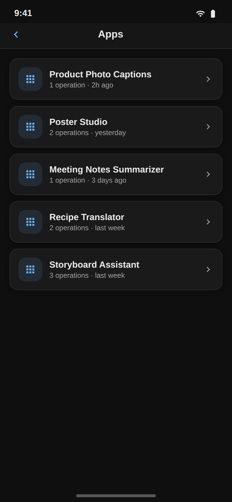
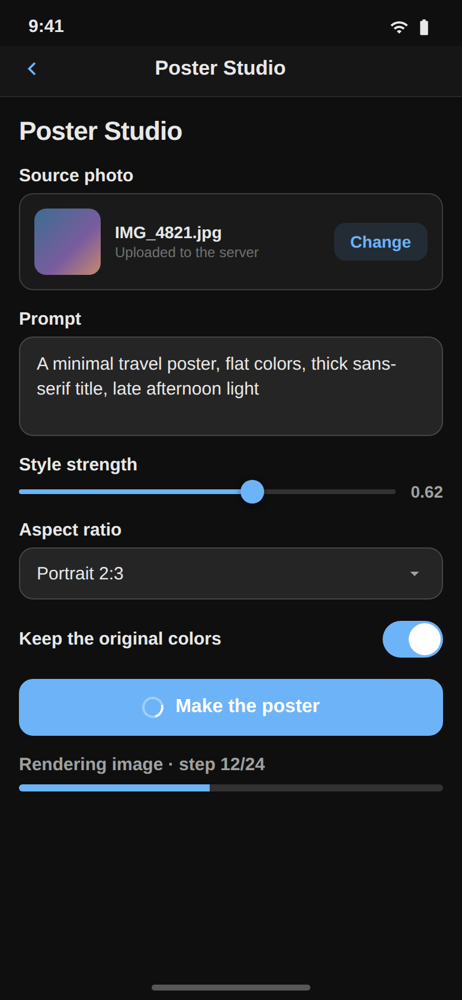
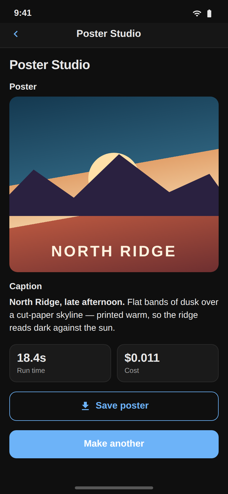
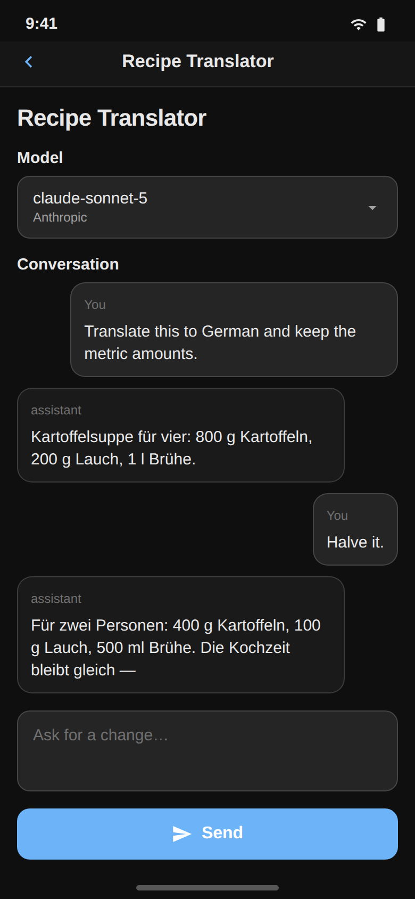

The mobile app runs the same Mini Apps you build on the desktop. It reads them
from the server, renders the document with native controls, and runs the
workflow behind them. It does not edit them — the [App Builder](app-builder.md)
stays on the desktop.

New to Mini Apps? Read [Mini Apps](mini-apps.md) first: it explains what a
widget, a binding, and an operation are.

## Finding your apps

The **Apps** browser lists every app on the server you are connected to, newest
first. Reach it from the apps icon in the Workflows header, or with the deep
link `nodetool://apps`.

Each row shows the app's name, how many operations it declares, and when it last
changed. Pull down to refresh. Tapping a row pushes the app onto its own screen;
`nodetool://app/<application-id>` opens one directly, which is what a
notification or a shared link points at.

If the list is empty, nothing has been published to that server yet — build an
app on the desktop and it shows up here on the next refresh.

## Running an app

An app screen renders the released snapshot if the app has been published, and
the draft document otherwise. The heading comes from the document, the widgets
below it are the ones you placed in the builder.

Inputs, the Run button, and the progress bar behave as they do on the web. While
a run is going the button shows a spinner, and the Progress widget shows what
the run says it is doing — the node's activity label outranks the static label
the author set, so an agent workflow reports its step instead of spinning
silently. A failed run puts its error in a banner above the app; the next run
replaces it.

Outputs fill in as the run streams them.

## Widgets

Every widget in the builder's catalog has a native renderer. The document
decides layout and behavior; only the controls differ. Four render differently
enough to be worth knowing:

| Widget | On the phone |
| --- | --- |
| **Columns** | Stacks vertically. Two columns side by side are unusable at phone width. |
| **ImageInput / AudioInput / VideoInput / DocumentInput** | Opens the system photo or file picker. The pick is uploaded to the server so the workflow gets a URL it can fetch; if the upload fails the local file is used, which still previews on the device. |
| **Sketch Pad** | An image picker. The app bundles no drawing surface, so the pad offers the camera and photo library for the same binding and says drawing needs the desktop app. |
| **ResourcePicker / ResourceGallery** | A list of rows rather than a grid of tiles. Tapping one opens that document in the screen its kind already has — a storyboard in the storyboard editor, a sketch in the sketch viewer, an asset in the asset viewer. |
| **ChatThread / ChatComposer / ModelSelect** | Native bubbles, a multiline composer, and a two-step provider-then-model picker. |

A widget the phone has no renderer for says so in place — "… is not available on
mobile" for a catalog widget, "Unknown widget" for one from a newer builder
than the installed app. Nothing silently disappears.

## What the phone does differently

- **One workflow per screen.** The screen holds the workflow the app's first
  operation binds. Other operations over that same workflow run normally, each
  dispatched by id. An operation bound to a *different* workflow refuses to run
  and says so, rather than running the wrong graph under its name.
- **Every run is a server run.** There is no browser worker on mobile, so the
  reactive-subgraph path the web runtime uses does not exist. A `run` action
  always executes the whole workflow on the server. Apps that lean on partial
  re-execution feel heavier here.
- **Runs are matched by job id.** A streaming message for any other job is
  dropped, so a run you started in the chain editor never folds into what the
  app shows.
- **Persistent variables survive the app closing.** A variable declared
  `scope: user` with `persist: true` is stored on the device, keyed by app, and
  restored before the document's defaults are applied — last session's value
  beats the declared default. Instance-scoped variables die with the screen,
  which is what their scope means.

## Requirements and limits

The mobile app talks to a NodeTool server; set its URL in Settings and see
[Mobile App](mobile-app.md) for connecting from a physical device, emulators,
and firewalls.

Known limits:

- No editing. Authoring an app document needs the desktop builder.
- Apps are listed per server. Switching servers in Settings switches the list.
- A Timeline widget shows a summary card — name, duration, track and clip
  counts — not the timeline itself. A Sketch widget renders the composited
  image.

## Related

- [Mini Apps](mini-apps.md) — what an app is, and the vocabulary
- [Building Mini Apps](mini-apps-guide.md) — nine app shapes, built step by step
- [Mini App Reference](mini-apps-reference.md) — every widget and setting
- [Mobile App](mobile-app.md) — the rest of the mobile app
