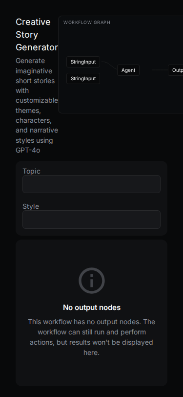
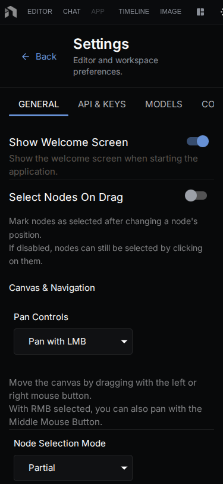
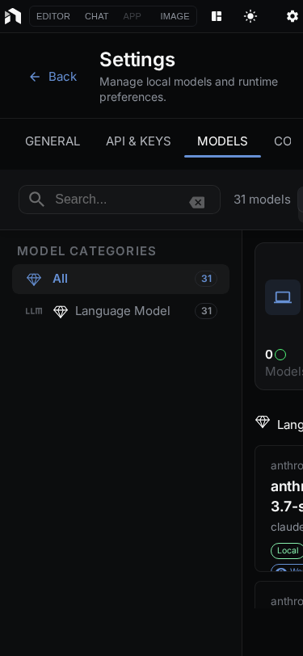

Run Mini-Apps and chat with models from your phone or tablet. Connects to any NodeTool server — your desktop, a self-hosted instance, or NodeTool Cloud.

> New here? Start on desktop with [Getting Started](getting-started.md).

---

## Overview


| Feature | Notes |
|---------|-------|
| **Chat** | Streaming responses across providers |
| **Mini-Apps** | Run your workflows with a simple UI |
| **Platforms** | iOS, Android, browser |
| **Server** | Connect to any NodeTool server |

---

## Getting the App

### From App Stores (Coming Soon)

The app will be available on:
- **iOS**: Apple App Store
- **Android**: Google Play Store

### For Developers

Build and run from source:

```bash
# Clone the NodeTool repository
git clone https://github.com/nodetool-ai/nodetool.git
cd nodetool/mobile

# Install dependencies
npm install

# Start the development server
npm start
```

Then:
- Press `i` for iOS Simulator (macOS only)
- Press `a` for Android Emulator
- Press `w` for web browser
- Scan the QR code with Expo Go on your phone

---

## Connecting to Your Server

The mobile app requires a running NodeTool server.

### Configure Server URL

1. Open the app
2. Go to **Settings** (gear icon)
3. Enter your server URL
4. Tap **Test Connection**
5. Save when successful

### Server URLs by Platform

| Platform | Server URL |
|----------|-----------|
| iOS Simulator | `http://localhost:7777` |
| Android Emulator | `http://10.0.2.2:7777` |
| Physical Device | `http://<your-computer-ip>:7777` |

> **Physical devices** must be on the same network as your NodeTool server.

---

## AI Chat

Chat with AI models from your mobile device.


### Features

- **Streaming responses** – See text appear in real-time
- **Model selection** – Choose from available AI models
- **Markdown rendering** – Code blocks, formatting, syntax highlighting
- **Stop generation** – Tap stop to cancel long responses
- **Multiple threads** – Keep separate conversation topics

### How to Chat

1. Tap the **Chat** button on the Workflows list screen
2. Select a model (tap model name)
3. Type your message
4. Tap **Send**
5. Watch the AI respond in real-time

### Tips

- Use the **+** button to start a new conversation
- Tap **Stop** to halt long responses
- Scroll up to review conversation history
- Switch models mid-conversation if needed

---

## Mini Apps

Run your NodeTool workflows with a simplified mobile interface. There is no separate "Mini Apps" screen — the home screen is the **Workflows** list (WorkflowsListScreen), and tapping a workflow opens the graph editor (GraphEditorScreen), which hosts the Mini-App runner for that workflow.

### What Are Mini Apps?

Mini Apps are workflows converted to simple interfaces. They hide the complexity of the workflow and show only:
- Input fields
- Run button
- Results

### Running a Mini App

1. Open the **Workflows** list (the home screen)
2. Tap a workflow to open it
3. Fill in the inputs (text, number, boolean toggles, image, audio, …)
4. Tap **Run**
5. View results below



### Supported Input Types

| Type | Description |
|------|-------------|
| Text | Single or multi-line text input |
| Number | Integer or float values |
| Boolean | On/off toggle switches |
| Image | Image input |
| Audio | Audio input |
| File path | File reference |

---

## Mobile Graph Editor

The mobile app includes a touch-friendly version of the workflow editor. Workflows render as a vertical chain of cards that you scroll through — there is no free-form pan-and-zoom canvas.

### Overview


### Empty State

New workflows open with a single prompt to add your first node.


### Node Picker

Tap the **+** button to open the full-screen node picker, which filters by input/output compatibility.


### Linear Chain

Workflows render as a vertical chain of cards on mobile — easier to scroll and tap.


Interactions:

| Action | Result |
|--------|--------|
| Tap a card | Open its properties |
| Up / Down buttons on a card | Reorder it within the chain |
| Duplicate / Remove buttons | Duplicate or delete the node |
| **+** button | Add a node via the full-screen picker |

---

## Mobile Settings

Configure the mobile app from the gear icon:



| Section | Purpose |
|---------|---------|
| Appearance | Light / Dark / System theme |
| Server URL + Test Connection | Which NodeTool server to talk to, with a one-tap connectivity check |
| Manage | Shortcuts to API Keys, Collections, and Jobs |
| Account | Signed-in email and **Sign Out** |
| About | App version, build info, links |

---

## Mobile Language Model Selection

Tapping the model name at the top of a chat opens a two-step picker:

1. **Select a provider** — the providers your server reports as supporting message generation.
2. **Select a model** — the models offered by that provider.

A search box appears in either step once the list is long enough, and a back arrow returns from models to providers. There is no API-key gating, disabled styling, or docs links in this picker.



---

## Screens

The app is made up of 12 screens: Login, Workflows list, Graph editor, Settings, Chat, Language Model Selection, Assets, Asset Viewer, Secrets, Collections, Jobs, and Threads.

---

## Server Requirements

Your NodeTool server must be:

1. **Running** – Start with `nodetool serve --port 7777`
2. **Accessible** – On same network as your device
3. **Configured** – With the models you want to use

### Starting the Server

```bash
# Activate environment
conda activate nodetool

# Start server
nodetool serve --port 7777
```

The server runs at `http://localhost:7777` by default.

### Firewall Settings

If connecting from a physical device, ensure:
- Port 7777 is open on your computer's firewall
- Your router allows local network connections
- Both devices are on the same WiFi network

---

## Troubleshooting

### Cannot Connect to Server

**Symptoms**: "Connection failed" or timeout errors

**Solutions**:
1. Verify the server is running
2. Check the server URL in Settings
3. For physical devices:
   - Use your computer's IP address (not localhost)
   - Ensure same WiFi network
   - Check firewall settings

### Android Emulator Connection Issues

**Problem**: Cannot reach localhost

**Solution**: Use `http://10.0.2.2:7777` instead of `localhost:7777`. This is Android's special IP for the host machine.

### App Crashes on Startup

**Solutions**:
1. Clear app data and restart
2. Check that all dependencies are installed: `npm install`
3. Reset Metro bundler: `npm start --reset-cache`

### Chat Not Streaming

**Symptoms**: Responses appear all at once

**Solutions**:
1. Check WebSocket connection
2. Verify server is running current version
3. Try a different AI model

---

## Platform Notes

### iOS

- Requires Xcode for development (macOS only)
- Use iOS Simulator for testing
- Production builds via EAS Build

### Android

- Requires Android Studio for development
- Use Android Emulator for testing
- Use `10.0.2.2` for localhost access

### Web

- Works in any modern browser
- Good for testing without mobile device
- Run with `npm run web`

---

## Building for Production

Use Expo's EAS Build for production apps:

```bash
# Install EAS CLI
npm install -g eas-cli

# Log in to Expo
eas login

# Build for Android
eas build --platform android --profile preview

# Build for iOS
eas build --platform ios --profile preview
```

For store submissions:
```bash
# Google Play Store (AAB format)
eas build --platform android --profile production

# Apple App Store
eas build --platform ios --profile production
```

> See [EAS Build Documentation](https://docs.expo.dev/build/introduction/) for details.

---

## Related Topics

- [Getting Started](getting-started.md) – Desktop setup and first workflow
- [User Interface](user-interface.md) – Full UI guide
- [Mini Apps](user-interface.md#mini-apps) – Creating Mini Apps
- [Chat & Agents](global-chat-agents.md) – Chat features in detail
- [API Reference](api-reference.md) – Server API documentation
