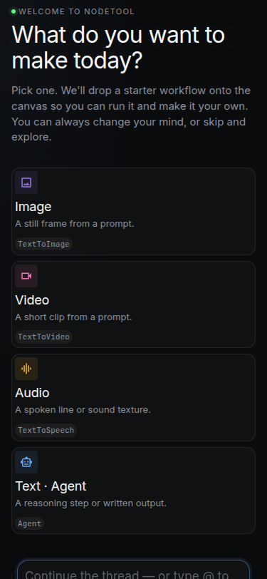
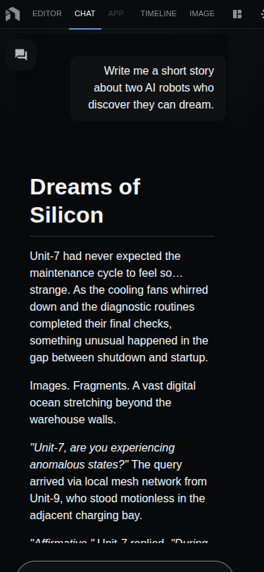
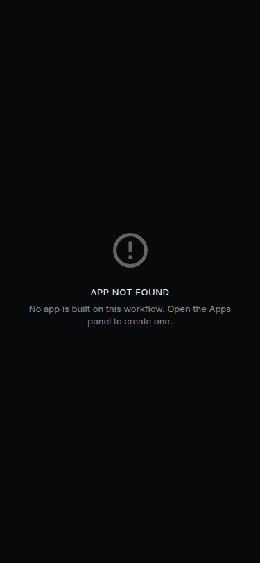
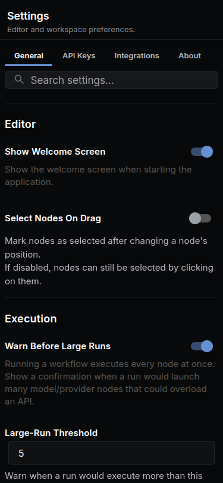

Run Mini-Apps, chat with models, and follow your jobs from your phone or tablet. The mobile app is a companion to desktop and web: you build and edit workflows there, and run and review them here. It connects to any NodeTool server, whether your desktop, a self-hosted instance, or NodeTool Cloud.

> New here? Start on desktop with [Getting Started](getting-started.md).

You must sign in. The app opens on a **Login** screen with **Continue with Google** (Supabase auth). A build without `EXPO_PUBLIC_SUPABASE_URL` and `EXPO_PUBLIC_SUPABASE_ANON_KEY` shows a banner saying login is not configured.

---

## Overview



| Feature | Notes |
|---------|-------|
| **Mini-Apps** | The home screen. Run apps published on the server |
| **Chat** | Streaming responses across providers, image and video generation modes, and inline previews of sketches and timelines |
| **Jobs** | Review job history. A finished run sends a notification while the app is in the background |
| **Assets** | Browse, upload from the camera or photo library, and view |
| **Documents** | Edit storyboards. View timelines and sketches |
| **Desktop and web only** | Workflow editing, scripts, JS scripts, managing API keys, collections, and triggers, and editing timelines or sketches |
| **Platforms** | iOS, Android, browser |
| **Server** | Connect to any NodeTool server |

---

## Getting the App

### From App Stores (Coming Soon)

The app will be available on:
- **iOS**: Apple App Store
- **Android**: Google Play Store

### For Developers

Build and run from source:

```bash
# Clone the NodeTool repository
git clone https://github.com/nodetool-ai/nodetool.git
cd nodetool/mobile

# Install dependencies (mobile/ is not a root workspace)
npm install

# Start the development server
npm start
```

Then:
- Press `i` for iOS Simulator (macOS only)
- Press `a` for Android Emulator
- Press `w` for web browser
- Scan the QR code with a development build on your phone

Expo Go does not work. The app uses native modules that Expo Go does not ship (Google Sign-In, Sentry, speech recognition), so sign-in and voice input fail there. Build a development build with `npm run build:dev`. See [mobile/README.md](https://github.com/nodetool-ai/nodetool/blob/main/mobile/README.md) for the TestFlight route.

---

## Connecting to Your Server

The mobile app requires a running NodeTool server.

### Configure Server URL

1. Open the app
2. Go to **Settings** (gear icon on the Workflows screen)
3. Enter the URL in **API Host**
4. Tap **Test & Save** to check the server and save the URL in one step, or **Save Only** to skip the check
5. The button reports the result: Server Ready & Saved, Sign In Required, Connection Timed Out, Incompatible Server, or Network Error

The default host is `http://localhost:7777`. The URL must start with `http://` or `https://`.

### Server URLs by Platform

| Platform | Server URL |
|----------|-----------|
| iOS Simulator | `http://localhost:7777` |
| Android Emulator | `http://10.0.2.2:7777` |
| Physical Device | `http://<your-computer-ip>:7777` |

> **Physical devices** must be on the same network as your NodeTool server.

---

## AI Chat

Chat with AI models from your mobile device.



### Features

- **Streaming responses** – See text appear in real-time
- **Model selection** – Choose from available AI models
- **Markdown rendering** – Code blocks and formatting
- **Stop generation** – Tap the stop button to cancel a response
- **Multiple threads** – Keep separate conversation topics and reopen them from the threads list
- **Attachments and voice** – Attach files, take or pick photos, and dictate with voice input
- **Modes** – Switch the composer between Chat, Image, and Video. Image and video modes expose aspect ratio, resolution, and variation or duration pickers
- **Options bar** – Toggle **Agent** and **Help** modes, add tools, and choose collections to search
- **Inline previews** – When a reply names a sketch or a timeline, it draws in the message with a chip that opens it. Other documents show the chip alone

### How to Chat

1. Tap the **Chat** button in the Apps header
2. Select a model (tap model name)
3. Type your message
4. Tap the send button (up arrow)
5. Watch the AI respond in real-time

### Tips

- Use the **+** button to start a new conversation
- Use the history button to open past conversations. Each thread can be deleted there
- Tap the stop button to halt a response
- Switch models mid-conversation if needed

---

## Running Mini Apps

The home screen is the **Apps** list. Mini Apps are a separate resource, authored in the desktop App Builder and stored on the server. Tapping an app runs it on its own screen. See [Mini Apps on Mobile](mini-apps-mobile.md). The Apps header opens Chat, Documents, Jobs, Assets, and Settings.

Workflows are not edited on mobile. Build and edit them in the desktop or web app, and run them here through a Mini App.

### Running a Mini App

1. Tap an app on the Apps screen
2. Fill in the inputs
3. Tap **Run**
4. View results as they stream in



### Supported Input Types

Mini App inputs map from the workflow's Input nodes to native controls:

| Kind | Input nodes |
|------|-------------|
| Text | String, Text, Message |
| Numbers | Integer, Float |
| Boolean | Boolean toggle |
| Media | Image, Video, Audio, Document, Model3D |
| Lists | Image, Video, Audio, and Text lists |
| Paths | File path, Folder path, Folder |
| Other | Color, DataFrame, Select, Image size |
| Models | Language, image, video, TTS, ASR, embedding, and Hugging Face model inputs |

---

## Documents

The **Documents** screen lists your storyboards, timelines, and sketches.

| Kind | On mobile |
|------|-----------|
| Storyboard | Edit shots and the board by touch, or ask the assistant |
| Timeline | View the tracks and clips. Edit in the desktop or web app, or ask the assistant. The viewer reloads when you come back to it |
| Sketch | View the layers |

Other documents, such as scripts, open in the desktop or web app.

---

## Mobile Settings

Configure the mobile app from the gear icon:


| Section | Purpose |
|---------|---------|
| Appearance | Light, Dark, or System theme |
| Server Connection | **API Host** with **Test & Save** and **Save Only** |
| Account | Signed-in email and **Sign Out** |
| About | App version and the GitHub repository |

---

## Mobile Language Model Selection

Tapping the model name at the top of a chat opens a two-step picker:

1. **Select a provider** — the providers your server reports as supporting message generation.
2. **Select a model** — the models offered by that provider.

A search box appears in either step when the list has more than five entries, and a back arrow returns from models to providers. There is no API-key gating, disabled styling, or docs links in this picker.



---

## Screens

The stack registers these screens: Login, Apps, App, Settings, Chat, Threads, Language Model Selection, Documents, Storyboard Editor, Timeline Viewer, Sketch Viewer, Assets, Asset Viewer, Jobs, and Job Detail.

### Deep links

The app registers the `nodetool://` scheme. Links work only while signed in. Finished runs send a local notification whose link opens the job.

| Link | Opens |
|------|-------|
| `nodetool://` or `nodetool://apps` | Apps |
| `nodetool://chat/<threadId>` | Chat |
| `nodetool://threads`, `documents`, `assets`, `jobs`, `settings` | The matching screen |
| `nodetool://app/<applicationId>` | A Mini App |
| `nodetool://job/<jobId>` | Job detail |
| `nodetool://asset/<assetId>` | Asset viewer |
| `nodetool://document/<kind>/<id>` | Storyboard editor, timeline viewer, or sketch viewer (`storyboard`, `timeline`, `sketch`) |
| `nodetool://settings/models` | Model picker |

---

## Server Requirements

Your NodeTool server must be:

1. **Running** – Start with `nodetool serve --host 0.0.0.0 --port 7777`
2. **Accessible** – On same network as your device
3. **Configured** – With the models you want to use

### Starting the Server

```bash
nodetool serve --host 0.0.0.0 --port 7777
```

`nodetool serve` binds to `127.0.0.1` on port 7777 by default. A physical device cannot reach that, so pass `--host 0.0.0.0` to listen on your network. The iOS Simulator and Android Emulator reach the default binding through the addresses in the table above.

### Firewall Settings

If connecting from a physical device, ensure:
- Port 7777 is open on your computer's firewall
- Your router allows local network connections
- Both devices are on the same WiFi network

---

## Troubleshooting

### Cannot Connect to Server

**Symptoms**: "Connection failed" or timeout errors

**Solutions**:
1. Verify the server is running
2. Check the server URL in Settings
3. For physical devices:
   - Use your computer's IP address (not localhost)
   - Ensure same WiFi network
   - Check firewall settings

### Android Emulator Connection Issues

**Problem**: Cannot reach localhost

**Solution**: Use `http://10.0.2.2:7777` instead of `localhost:7777`. This is Android's special IP for the host machine.

### App Crashes on Startup

**Solutions**:
1. Clear app data and restart
2. Check that all dependencies are installed: `npm install` inside `mobile/`
3. Reset Metro bundler: `npx expo start --clear`

### Chat Not Streaming

**Symptoms**: Responses appear all at once

**Solutions**:
1. Check WebSocket connection
2. Verify server is running current version
3. Try a different AI model

---

## Platform Notes

### iOS

- Requires Xcode for development (macOS only)
- Use iOS Simulator for testing
- Production builds via EAS Build

### Android

- Requires Android Studio for development
- Use Android Emulator for testing
- Use `10.0.2.2` for localhost access

### Web

- Works in any modern browser
- Good for testing without mobile device
- Run with `npm run web`

---

## Building for Production

Use Expo's EAS Build for production apps:

```bash
# Install EAS CLI
npm install -g eas-cli

# Log in to Expo
eas login

# Build for Android
eas build --platform android --profile preview

# Build for iOS
eas build --platform ios --profile preview
```

`mobile/package.json` wraps these as `npm run build:dev`, `build:preview`, and `build:production`, each for all platforms. The profiles in `mobile/eas.json` are `development`, `development-simulator`, `development-testflight`, `preview`, `preview-simulator`, and `production`.

For store submissions:
```bash
# Google Play Store (AAB format)
eas build --platform android --profile production

# Apple App Store
eas build --platform ios --profile production
```

> See [EAS Build Documentation](https://docs.expo.dev/build/introduction/) for details.

---

## Related Topics

- [Getting Started](getting-started.md) – Desktop setup and first workflow
- [User Interface](user-interface.md) – Full UI guide
- [Mini Apps](mini-apps.md) – What apps are and how they run
- [Mini Apps on Mobile](mini-apps-mobile.md) – Opening and running an app on the phone
- [Chat & Agents](global-chat-agents.md) – Chat features in detail
- [API Reference](api-reference.md) – Server API documentation
