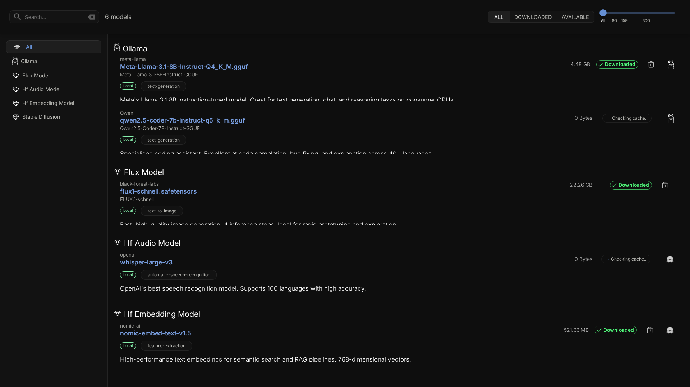
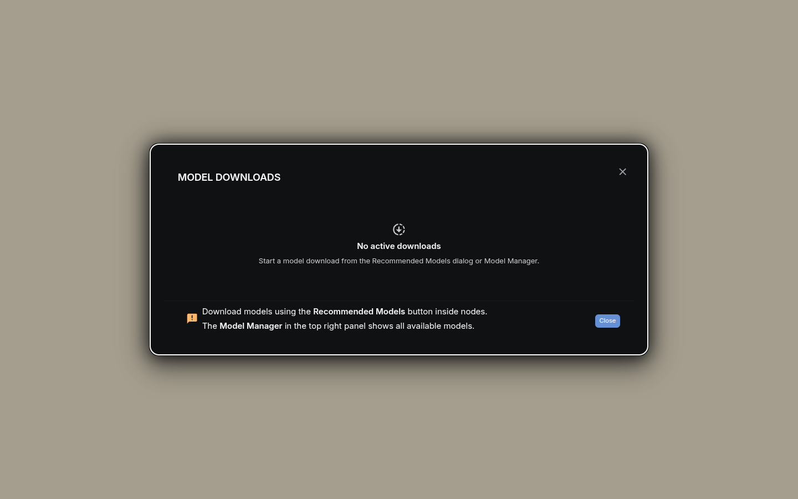
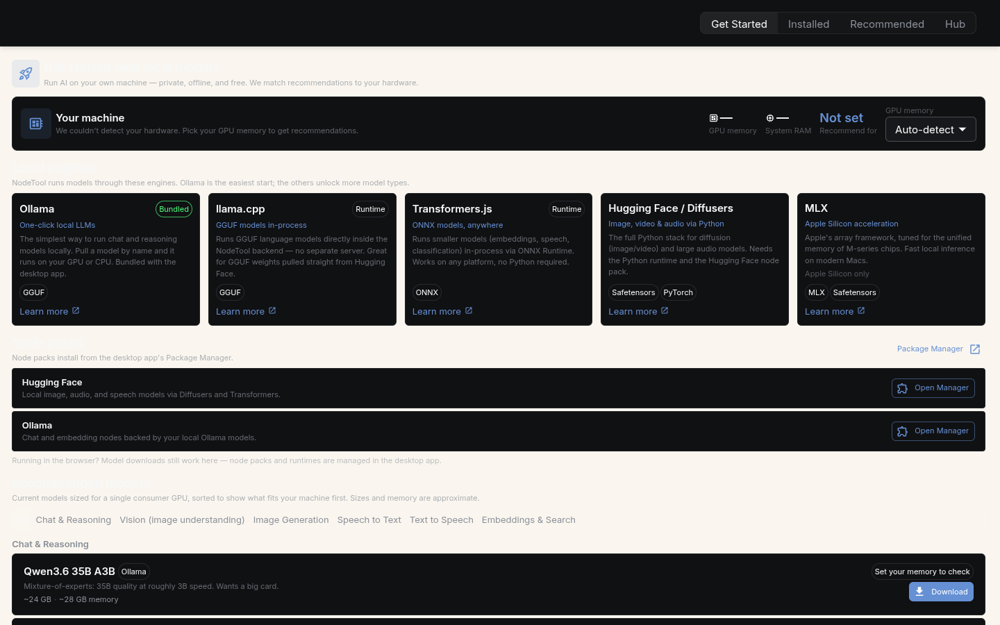
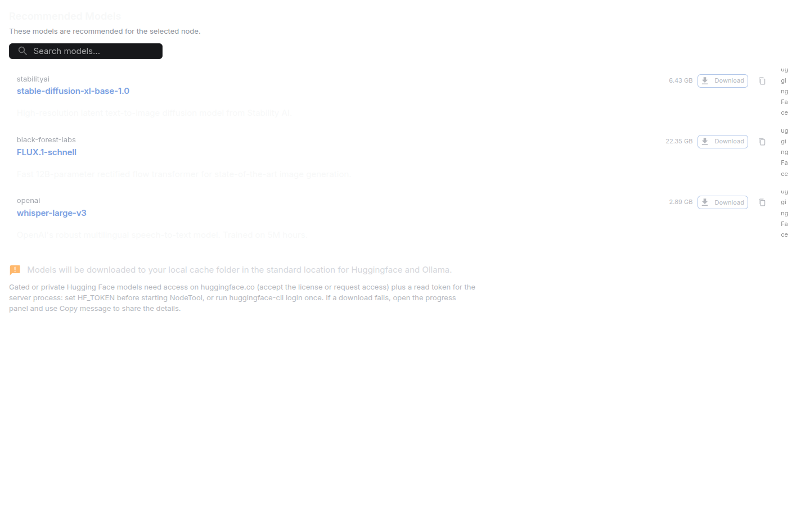

> **Local model panel.** The Model Manager downloads and manages models that run on your machine or on an attached worker. For the model catalog see [Supported Models](models.md). For provider keys see [Providers](providers.md).

The **Model Manager** lists the local models NodeTool can run, lets you search the Hugging Face Hub, and downloads what you pick. Cloud models from OpenAI, Anthropic, and other API providers do not appear here because they need a key, not a download. Add keys in **Settings → Models & Providers**.

---

## Opening the Manager

Open the logo menu and choose **Model Manager**. It opens as a page tab at the `/models` route.

The page has four sources, switched with the toggle at the top right.

| Source | What it shows |
|---|---|
| **Get Started** | Detects your hardware, explains the local engines, and lists current models sized for it |
| **Installed** | Models on disk: Hugging Face repos, Transformers.js models, and local runtimes (Ollama, llama.cpp, MLX) |
| **Recommended** | A curated catalog gathered from the nodes you have installed |
| **Hub** | A live search of the Hugging Face Hub, limited to the top 50 results by downloads |

On an empty local install the Manager opens on **Get Started** once, so you do not land on a blank list.

### Get Started

The hardware card shows what NodeTool detected and a memory budget, which you can leave on **Auto-detect** or set from 4 GB to 48 GB. The engine guide covers Ollama (bundled with the desktop app), llama.cpp, Transformers.js, Hugging Face / Diffusers, and MLX (Apple Silicon only), and shows which ones you still need to install from the Package Manager. The model list below it can be filtered by capability: chat, vision, image generation, speech to text, text to speech, and embeddings. Entries that fit your budget sort first. Sizes and memory figures are approximate.

### Local and worker scope

When a worker is attached, a second toggle switches between **Local** and the worker's name. The Worker view lists models cached on the worker. While a worker is attached, every download goes to the worker, whichever view is open, because workflows run there. The header shows `Downloads → <target>` as a reminder. If the worker image is too old for model management, the Worker option is disabled.

---

## Browsing Models

### Categories

The left sidebar, **Model Categories**, filters by model type with a count for each. Hugging Face types follow Hub pipeline tags such as `text-generation`, `text-to-image`, `image-to-image`, `text-to-video`, `automatic-speech-recognition`, `text-to-speech`, and `feature-extraction`. Each Hugging Face category has a **View on Hugging Face** link to the Hub's list for that tag. Only categories present in the current list appear. Ollama and llama.cpp models group under their own types. In the Hub source the sidebar shows the full list of pipeline tags.

### Filters

The filter bar above the list narrows the results.

| Filter | Options |
|---|---|
| **I want to** | Chat & agents, Create images, Understand images, Transcribe speech, Generate speech & audio, Create video, Search & RAG |
| **Format** | GGUF, ONNX, Safetensors, PyTorch, TensorRT, MLX |
| **Status** (Installed source only) | All, Ready, Download required, Unavailable, each with a count |
| **Max size** | A slider from 0 to 50 GB. 0 means all sizes |

Selecting an active goal or format chip again clears it. Changing the source or the Local/Worker scope resets the search and all filters.

### Search and sort

- **Search** matches model names and repository ids.
- **Sort** by Best fit, Name, Size, Downloads, or Likes. The arrow button reverses the direction. Models that need a download or are unavailable always sort after ready ones.

### Reading a model row

Each row can show these badges.

- A **status** badge with the reason on hover, for example when a runtime the model needs is not installed.
- A **fit** badge: **Fits your machine**, **Tight fit**, or **Needs ~N GB**. NodeTool estimates it from the model's size against the memory budget on the Get Started tab.
- **Works with N nodes**, which opens a dialog listing the nodes that can use the model.
- The pipeline tag, which links to trending models with that tag on Hugging Face.

---

## Downloading Models

1. Find the model in **Get Started**, **Recommended**, or **Hub**.
2. Click **Download**.
3. Follow progress in the **Downloads** dialog, opened from **Downloads** in the logo menu. The menu entry shows the combined percentage while downloads run.

### Download details

- Downloads continue in the background while you move around the app.
- The Downloads dialog shows each file's progress.
- The download connection reconnects automatically after a drop, up to 5 attempts with exponential backoff.
- Gated Hub repos need a Hugging Face token. See [HuggingFace Integration](huggingface.md#authentication-and-gated-models).

### Storage location

Hugging Face models use the standard Hugging Face hub cache, `~/.cache/huggingface/hub` by default. `HF_HOME` or `HF_HUB_CACHE` move it. Ollama keeps its models in its own directory. Transformers.js models download to `<data-dir>/transformers-js-cache`, or to `TRANSFORMERS_JS_CACHE_DIR` if set. On the desktop app, the Downloads dialog has **Open HuggingFace folder** and **Open Ollama folder** buttons.

---

## Managing Models

### Per-model actions

- **Download** fetches a model that is not on disk yet.
- **Downloaded** marks an installed model. When the Manager is used as a picker, a ready model shows **Use** instead.
- **Copy** copies the repo id, or the model name for Ollama.
- **Show in File Explorer** opens the model folder. It appears in the desktop app only.
- **Delete** asks for confirmation (**Confirm Deletion**), then removes the model. Hugging Face models are removed from the cache of the Local or Worker scope you are viewing, and Ollama models are removed through Ollama.
- **View on HuggingFace** and **View on Ollama** open the model's page on that site, where you can read its README.

### Recommended models

Many workflow nodes name recommended models. The **Recommended** source gathers them from the nodes you have installed and lists the ones you can download. If you have no nodes that run models, the list is empty.

---

## Choosing a model in a node

A model property opens a picker for its type. The title says which: **Select Language Model**, **Select Image Model**, **Select Video Model**, **Select TTS Model**, **Select ASR Model**, **Select Embedding Model**, **Select Music Model**, **Select Audio To Audio Model**, **Select HuggingFace Model**, or **Select Transformers.js Model**. The picker lists only models of that type, with a provider rail on the side.

- Provider icons show which providers have a key. A provider without one shows **API key required** and a **Connect this provider** action.
- A provider can be disabled to hide its models from the picker.
- The star marks a favorite.
- The pin sets the model as the default for new nodes of that type.

### Cloud provider models

Models from cloud providers appear in these pickers based on your configured keys. They run remotely and need no download. Configure keys in **Settings → Models & Providers**. See [Models & Providers](models-and-providers.md) for setup details.

---

## Next Steps

- [Models & Providers](models-and-providers.md) -- Configure providers and API keys
- [Installation](installation.md#what-different-tasks-need) -- Hardware requirements for local models
- [HuggingFace Integration](huggingface.md) -- Browse and use HuggingFace models
