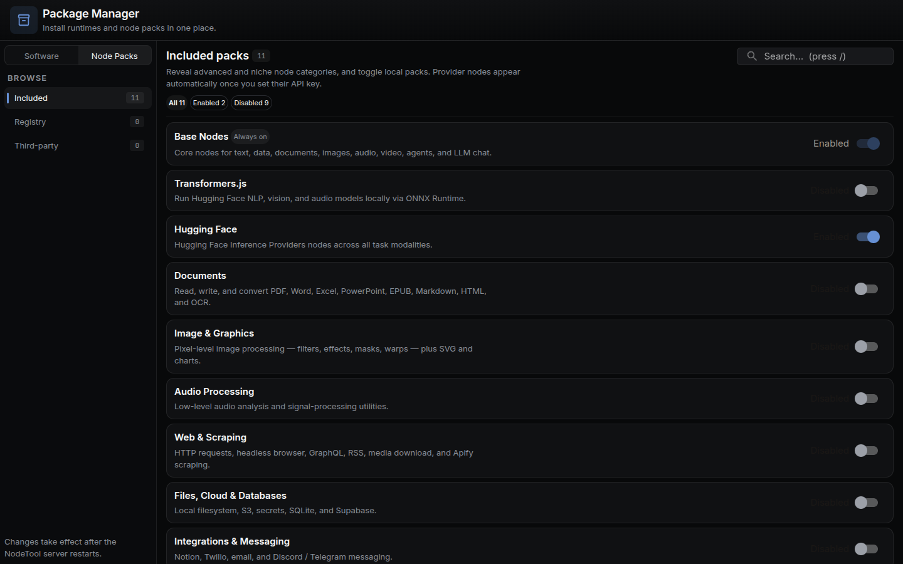

NodeTool packages bundle reusable nodes, assets, and example workflows. The package registry discovers and registers node classes so workflows can reference them at runtime.

## Manage packs in the app

The **Package Manager** (`/packages`, or **Packages** in the app menu) is where installed packs are turned on and off. Included packs ship with NodeTool; the Registry and Third-party tabs list what can be installed. Provider packs light up on their own once you set the matching API key.



Toggling a pack takes effect after the NodeTool server restarts.

## Package Anatomy

A package is a standard npm workspace package that exports node classes and a registration function:

- `package.json` -- declares the package name, dependencies, and build scripts.
- `src/nodes/` -- node implementations, one file per domain (e.g. `list.ts`, `audio.ts`).
- `src/index.ts` -- exports all node classes and a `register*Nodes()` function.
- `tsconfig.json` -- extends the workspace base config.
- `examples/` -- optional workflow examples.
- `assets/` -- optional static assets used by nodes.

### Example `package.json`

```json
{
  "name": "@nodetool-ai/base-nodes",
  "type": "module",
  "version": "0.1.0",
  "main": "dist/index.js",
  "types": "dist/index.d.ts",
  "scripts": {
    "build": "node -e \"require('node:fs').rmSync('dist', { recursive: true, force: true })\" && tsc",
    "test": "vitest run",
    "lint": "tsc --noEmit"
  },
  "dependencies": {
    "@nodetool-ai/node-sdk": "latest"
  }
}
```

Every node package depends on **`@nodetool-ai/node-sdk`**, which provides `BaseNode`, the `@prop` decorator, and the `NodeRegistry` type.

### Example `tsconfig.json`

```json
{
  "extends": "../../tsconfig.base.json",
  "compilerOptions": {
    "outDir": "dist",
    "rootDir": "src"
  },
  "include": ["src"]
}
```

## Node Registration

The packages the runtime registers directly export a constant array of node classes and a registration function. `@nodetool-ai/base-nodes` is one of them; it aggregates node groups from sibling packages:

```ts
import type { NodeClass, NodeRegistry } from "@nodetool-ai/node-sdk";
import { CONTROL_NODES } from "@nodetool-ai/core-nodes/nodes/control";
import { TEXT_EXTRA_NODES } from "@nodetool-ai/text-nodes/nodes/text-extra";

export const ALL_BASE_NODES: readonly NodeClass[] = [
  ...CONTROL_NODES,
  ...TEXT_EXTRA_NODES,
  // ... additional node groups
];

export function registerBaseNodes(registry: NodeRegistry): void {
  for (const nodeClass of ALL_BASE_NODES) {
    registry.register(nodeClass);
  }
}
```

At startup, the runtime creates a `NodeRegistry` and calls each package's registration function. Workflows referencing `nodetool.text.Concat` or `mypack.math.AddOffset` resolve through the registry without manual imports.

## Managing Packages via CLI

### List Packages

```bash
nodetool package list
nodetool package list --available    # fetch registry index
```

Displays installed packages (local metadata) or remote entries hosted at the package index URL.

### Initialize a Package

```bash
nodetool package init
```

Scaffolds a new package in the current directory.

### Generate Documentation

```bash
nodetool package docs                 # single index.md in ./docs
nodetool package docs --output-dir docs   # custom directory (default: docs)
nodetool package docs --compact       # shorter summaries for LLM prompts
```

`package docs` writes a single `index.md` overview. For per-node Markdown pages, use `node-docs`:

```bash
nodetool package node-docs            # one page per node (default: docs/nodes)
nodetool package workflow-docs        # docs for workflow examples (default: docs/workflows)
```

The full set of `package` subcommands is: `list`, `init`, `docs`, `node-docs`, and `workflow-docs`. (Note: `nodetool mcp install` / `nodetool mcp uninstall` configure the MCP server, not node packages.)

## Building Packages

Compile TypeScript and prepare the package for use:

```bash
npm run build
```

For type checking without emitting output:

```bash
npm run lint
```

For running tests:

```bash
npm run test
```

## Publishing Packages

1. Implement nodes under `src/nodes/` extending `BaseNode` with `@prop` decorators.
2. Export all node classes and a registration function from `src/index.ts`.
3. Run `npm run build` to compile.
4. Add example workflows in `examples/` and assets in `assets/` if relevant.
5. Publish to npm or provide a Git URL.

To add the package to the public index, create an entry in the [registry repository](https://github.com/nodetool-ai/nodetool-registry) so `package list --available` surfaces it.

## Workflow Integration

Installed packages automatically register nodes with the runtime:

- Node metadata is merged during startup so workflows referencing `package.namespace.Node` resolve without manual imports.
- Run `npm run codegen --workspace=packages/dsl` to regenerate typed factory functions from node metadata.

## Related Documentation

- [CLI Reference](cli.md) -- package subcommands.
- [Configuration Guide](configuration.md) -- where package metadata is cached.
- [Custom Nodes Guide](developer/custom-nodes-guide.md) -- step-by-step node implementation.
- [TypeScript DSL Guide](developer/ts-dsl-guide.md) -- type-safe workflow definitions with `@nodetool-ai/dsl`.
